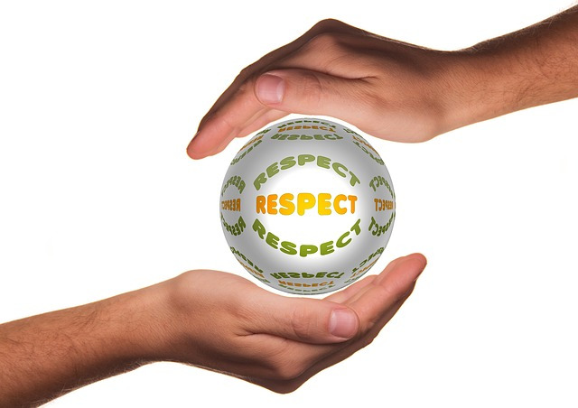

# Chapter 2: Engineers are Professionals

|  |
| :-------: |
| *Figure 2.1: You will be doing lots of writing as a professional.* |

One of the most important things to learn early in your journey as an engineer is that **engineers are professionals**. The word professional is synonymous to "white-collar" and implies that you are going to be using your brain instead of your body or hands to earn a living.

**IMPORTANT NOTE: At this point it is important to note that society relies on "blue-collar" or non-professional workers and *I do not mean to imply any negativity towards those who have chosen this type of work for their career* **. Historically "blue-collar" has negative connotations but manual laborers play a significantly important role in our society and should be respected for their contributions. The color of your shirt doesn't matter and **everyone should be treated with respect and dignity.** Manual labor jobs are great options for a lot of people. Several of you may have worked (or known someone who has worked) in a manual labor setting and will likely have inherited experience and traits that will help you succeed as an engineering professional.

When we are talking about engineering as a career, the reality is that it is a professional career path governed by unspoken cultures, expectations, and rules of conduct that you are likely unfamiliar with. Some of the content in this chapter may be surprising to you, and other parts may just seem like common sense. The goal of this chapter is to get you up to speed on what it means to be a professional and how to conduct yourself as a professional to maximize your success in your future workplace.

I acknowledge that this chapter contains a ton of "no duh" information. However, in my almost decade of experience as a higher education professional, I think taking some time to review this is necessary and will prove to be helpful.

In this chapter, you will learn several important skills that are critical to your success in a professional setting:

* Why it is important to act professionally.
* How to conduct yourself as a professional. How to talk to other professionals (including your professors).
* The power of humility and what it means to be respectful.
* Taking responsibility and pride in your work.
* How to say thank you and how to apologize.
* What is business casual and why dress is important (both as a student and as a professional).
* How to write email and why it is important. 

## Why is this important?
Why is dedicating a whole chapter to things that seem like common sense important? Because...

>*I want to make sure that you can get a job and be successful in that job.*

People say they are going to college for various reasons but the reality is *everyone comes to college to get a job*. Thinking about our workout analogy, you hire a personal trainer to build up your muscles but really you want to get fit and strong. Your professors will train your mental muscles but the end goal is employment, not the learning in itself. That is OK and doesn't mean that the learning isn't fun or important.

Universities like to say things like they "are making you global citizens" or "well rounded life long learners" but for most students, they simply see college as a path to a career where they can be successful and make money. I do not blame you! That is a great reason to attend college! Although none of you are professional engineers yet, you will be an engineer soon (with a little bit of studying, help, and perseverance). It is important to learn how to conduct yourself, what your future colleagues will expect from you, and what should expect from your future colleagues. It is important **so that you can get a job and be successful in that job**. It is also important to begin to use what you learn in this chapter right away, both towards your professors and towards your fellow classmates.

## It's Not What You Know, It's Who You Know
You may have heard this cliché before. A lot of clichés are clichés because there is some truth in them. First, it is important to note that **technical competence and ability is by far the most important factor when it comes to your professional success**. If you can't do the job, you won't get the job. This section is not insinuating that it isn't important to study and learn. The question is: how can you distinguish yourself from a crowded field of graduates? You will be graduating with and competing against thousands of other people that have the exact same qualifications as you do. How do you get a job?    

|  |
| :-------: |
| Figure 2.2: It is important to start building your network now. |

**You cultivate relationships.** It is important that you act professionally and cultivate relationships with everyone you come into contact with at a University. Everyone is italicized for emphasis because I mean everyone at the University. From the President of your University, to the administrative assistants in your department, all your professors, your classmates, the academic advisers, the janitorial staff... everyone.

I could fill a whole chapter on anecdotes that show this is true but you probably already have a gut feeling that this is true. This may be the most common sense piece of advice in this entire book that I have noticed most students not taking to heart.

Why is it important to treat everyone professionally and how does that help you get a job? Lets list out a decidedly non-comprehensive list of ways people can help you:

* Your current classmates might be your future co-workers or even bosses. If they like and respect you, they might hire you or suggest you for hire by their boss.

* Your professors likely have contacts and friends in industry but they will not stake their professional reputation on a student they don't believe in. By treating your professors with respect and working hard in their classes, they will be more likely to recommend you.

* Your academic adviser usually gets solicited by companies looking for the students for prestigious internships and experiences. In my experience, they do not pick the A students randomly, they pick the students they like and who treated them professionally.

  

  The list goes on and on but the common thread through all of it, **is acting professionally and courteously can go a long way in helping you get a job.** You need to realize that hiring is risky and scary and people are always looking for a known quantity over an unknown one. If you can get a recommendation from a professor, or other University official, it will go a long way. If you slack off in your classes, argue with your professors, and treat the University support staff disrespectfully, you will have a much harder time getting a job.
  
>Discussion 2.1: What is your story?
This post is not anonymous. The professor and participants can see the responses and the author.
I am certain that a lot of you have a personal story of how a connection that you had helped you get a job, get some paperwork through, fast tracked you through customs, etc. Take a moment to talk to someone that you know is a professional and ask them if they have a story where "it's not what you know, it is who you know" has helped them in life (also make sure they are comfortable with you sharing this info). This can be a professor, a parent, a grandparent, a friend, or anyone who is in a career. Please share with your classmates the story that you heard. If you have a personal and compelling story, you can use that instead.
Responses
Reply Ordered by Newest Responses

## How To Communicate Professionally and Courteously

This is easy because you already know how, you just sometimes choose not to communicate professionally. Here is what I mean. Imagine that you have opportunity to meet your personal hero. It can be whoever you respect the most, admire the most, whatever. How would you talk to them? How would you address them?

|  |
| :-------: |
| *Figure 2.3: Who is your knight in shining armor?* |

My guess is that you would **address them by their professional title** (Mister, Misses, Doctor, Professor, Mr. President, Sir, etc.), that you would **be polite in your choice of words**, that you would **be humble** (more on that later), and that you would **defer to their expertise**. This is exactly how you act professionally and how you should treat everyone you come into contact with at a University.

Here is a handy checklist for how to conduct yourself professionally:

* Treat everyone like you would treat your personal hero or a celebrity. You never know when you will need a favor. In general, it is better to have people like you, and people like being treated nicely.
* Always use last names and titles to address people unless you are explicitly asked to call them something else. It is always better to say Dr. Johnson or Mrs. Stevenson when addressing people you do not have a personal relationship with. If you do not know their title, you can always use the title "Professor" for someone that teaches a university class or "Mr." or "Ms." for University staff if you are unsure if they have a PhD. I will tell you, I have never heard anyone that doesn't have a PhD upset that they were called Doctor but I do know PhDs who get upset if they aren't called Doctor.
* Do not use slang, unprofessional language (i.e. swearing), or other colloquialisms when talking or writing in a professional capacity. Be as formal as possible.

Follow these checkpoints, and you will be thought of as a respectful and courteous student.

## Tips for Networking
The goal of this chapter up until this point is to convince you that being respectful and nice to people goes a long way. You are convinced that "it is not what you know it is who you know". "Who you know" is your network. The second part of the "getting a job when you are done with college" formula is building a network.

Some of you are extroverted and find building a network of people easy and fun. Good for you, you will have a significant advantages when it comes to finding a job because you make friends naturally and people like you. I personally am an introvert and find networking functions unbearable and painful. Just because you don't like to actively network, does not mean that it isn't critical to getting the job you want and deserve. The good news is, there are tactics that you can learn and use to become better at networking. Take a minute to watch the video below where Mr. Duane (see what I did there?) explains his tricks to networking effectively. Make sure to take notes on what he calls "lifelines" and "landmines" when networking.

| :----: |
| Video 2.1: [TJ Duane explores the power of a personal network and offers strategies for leveraging those key relationships](https://www.youtube.com/watch?v=NzpYBTeZdWw&feature=emb_logo). |

> Question 2.1: Networking "Lifelines" and "Landmines"
In the video, Mr. Duane gives tips to be successful in making relationships. First, he advises that people establish a common
 early in the conversation. He also advises that people be centered and actively listen and pay attention to the person they are talking to. He warns people not to get
 and gives an example of a meeting he had on times square. Furthermore, Mr. Duane suggests showing your value but to make sure not to
 because it can be a turnoff. Next, Mr. Duane suggests that following up and following
 is critical. It doesn't work in the dating world or in industry.

## The Power of Modesty and Respect
Being modest and respectful is critical to building your network and advancing your career as a professional. As a student, a significant portion of your network will consist of University professors and staff and the best way to stay on their good side is to be modest and respectful.

|  |
| :-------: |
| *Figure 2.4: Respect, the magic 7 letter word.* |

Furthermore, the power dynamic between a student and professors is unbalanced in a dramatic way. Faculty and staff have almost all of the power, and students have very little if any at all. Hopefully, you trust your University to hire competent employees who will act fairly and on your behalf. For the most part this is true, but what it means for you is that *it does not pay to be disrespectful or immodest*.

Consider the following exchange between an academic adviser (not a professor) and a student they are advising. Lets say that the student sees the adviser's office door open and swings by without an appointment. Keep in mind, in this scenario, it is unclear who is to blame for the problem.

*Academic Adviser: "Hello Student, it is good to see you. How can I help you today?"*

*Student: "Hey. I am good but you messed up, now I am not going to graduate, and I need you to fix my schedule right now!"*

How do you think the academic adviser will respond? I am guessing they will say something like "I don't have time right now, please schedule an appointment".

This is what I meant when I said **that staff has all the power and it doesn't pay to be disrespectful**. This student is severely lacking in modesty and did not acknowledge that it could have been their mistake, instead, they blamed the adviser. The student also failed to apologize for his intrusion! The academic adviser does not have to help the student right away and the accusatory tone will only serve to alienate the adviser. My questions is: **WHY WOULD YOU DO THAT?** The advisers are hard working, underpaid, intelligent people who are here to help you. Do not make them dislike you! Lets see how that exchange could have played out differently.

*Academic Adviser: "Hello Student, it is good to see you. How can I help you today?"*

*Student: "Hello Mr. Adviser. I am sorry to bother you, but I noticed that there is a mistake on my schedule and I am worried it will impact my graduation. Do you have some time to help me fix the issue? If we can't meet today I totally understand and would be happy to setup an appointment. Thanks so much for your help."*

Again, like a lot of things in this chapter, this is obviously the correct way to respond. In this case the student did not blame the adviser for the problem (they didn't even necessarily take credit for the problem either), they were respectful of the adviser's time, and humbled themselves. The adviser still might not be able to drop everything and help the student right away, but you can be sure that they are more eager and willing to help in this situation when compared to the first.

All of this comes back to being a professional. **Successful professionals are always modest and respectful.** People like people who treat them with respect and differ to their expertise.

## You Shouldn't Judge a Book By It's Cover
Before we jump into this section, take a moment to answer the following question. It might make you feel uncomfortable, but be honest because I am trying to make a point.

>Question 2.2: Judge a book by its cover.
>For this question, lets pretend that you have a successful engineering firm and that you need to contract an accountant to help balance your books and do your taxes. You get two offers from women who have a similar educational background, similar experience, and quote you similar prices. They are both excellent candidates in your opinion. You check their consulting company websites and they have the following pictures in their "About Me" section. Obviously pictures are not the best way to select your candidate, but the two women are equal in every other way. Which of the two would you hire? (Figure 2.5)
>  

**Please make sure you answer the preceding question before reading the rest of this section.**

A common idiom is "don't judge a book by it's cover". In my opinion, this is a noble endeavor, but it is counter to what humans actually do. Who did you select in the image above? Why? I am hoping that you selected the person wearing professional attire. After all, the prompt informed you that you wanted an accountant. Accounting requires attention to detail and professionalism. *The woman that is wearing the suit looks like a professional* so it is natural to lean her way when selecting candidates. Humans do this sort of thing all the time!

|  |
| :-------: |
| *Figure 2.6: Don't judge a book by its cover is a good thing to try and live by but no one actually does that. In any case these books have amazing covers.* |

Why do we judge people by what they look like? Humans assess information quickly and we are predominately visual animals. Plus, a lot of the time it can be useful to understand patterns and make quick judgement. To illustrate this, try the following problem which is probably the easiest problem you will ever have in college.

>Question 2.3: Illustrating
Show Correct Answer
Show Responses
question description
 

> This image shows an illustration of a ___________________________________ .

Or for another example, think about the last time you looked up companies online. It is easy to get caught up in the marketing and fancy visuals of their website and to attribute those qualities to mean that the company must have high quality even though a fancy website has nothing to do with how the company actually performs. The list goes on and on, but the fact is that we judge books by their cover. If you are interested in reading more about this, [here is a nice, short little blog post discussing this from a psychological perspective.](https://www.psychologytoday.com/us/blog/happiness-in-world/201208/judging-book-its-cover)

## What can you do about it? Make a Good Impression.
The goal of this section is not to change humanity. The goal is to show that although it is wrong, it is important to acknowledge that bias exists and that human nature dictates that it is unlikely that humans will change anytime soon. It is important for you to know this and use whatever is at your disposal to use it to your advantage. It means that part of being a professional is dressing professionally because people will see you and automatically think you are professional (as we have seen it is also important to act professionally). It also means that it is never appropriate to wear your favorite old shirt, your favorite ripped jeans, and your expensive flashy basketball shoes when you are working as or with a professional.

Whenever you give a presentation in school, go to a job interview, go to a networking event, or interact with engineering professionals in any way (outside of the classroom) it is important to look professional so that you make a good impression. Do not let someone's personal bias be the reason you don't get the job! Dressing up and looking professional will help make you seem more qualified than your peers who do not follow this advice. That might be enough to get you the job!

|  |
| :-------: |
| *Figure 2.8: These two epitomize looking professional.* |

### Tips to Looking Professional

This is not a comprehensive list. Instead it is a rough guide for how to look professional.

* Practice regular personal hygiene. When in doubt, clean shaven is best but some professionals have adopted beards. In either case, clean and trimmed is important.
* Have a neat, professional hairstyle. This will obviously differ between men and women but the importance is on clean, neat, and subdued.
* Make sure you have a neutral scent. Do not wear excessive perfumes or other fragrances.
* Wear solid colors and long sleeves.
* Shoes should be moderate and conservative.
* Socks should be dark and unobtrusive.
* Pants should be worn. Sorry Men, there is no such thing as professional shorts.
* Ties and bow-ties are optional but should be conservative.

## Professional Emails and Communication

Emails are often times annoying, but they continue to be an important tool for professional communication. There are newer communication tools that are beginning to penetrate the professional work space ([i.e. slack](https://slack.com/)) but they aren't ubiquitous and they will require you write professionally similar to the way I will outline in this section. The most difficult part about this is that social media and instant communication have different rules and norms that you are likely familiar with and may not realize are unprofessional. While there are undoubtedly benefits to instant communication in texting and the like, it has led to some bad communication habits that you will need to break to be successful in a professional setting.

It is important to remember that **you can't delete a badly written email and they can be held against you**. So how do you make sure that you do not mess up your emails? Starting today, whenever you write an email to anybody that you are not friends with (and especially the University faculty and staff), remember to follow the rule outlined above, treat everyone like you would treat your personal hero or a celebrity. That means being coherent, precise with your language, proofreading your email to ensure there are no typos, and to always be respectful. Below are a few bullet points diving into a little more detail on what a professional email looks like.

### Email Checklist
* Have a professional email address. Limit it to initials or full spellings of your name and resort to numbers only if you have to. For example, if you have a common name (e.g. John Jeremy Smith) you can try "john.j.smith" or "j.j.smith" or "jj.smith" etc.
* Proofread your emails before you send them. It is important to remember that sending someone an email is the same thing as asking them to spend time on you. The recipient of the email will have to take part of their day to read and assess your email. That means that you can show them respect by making sure the email is well written and free of typographical errors.
* Be sure to use the most formal possible title to address whomever you are writing, regardless of their standing, rank, or position. It is ok to refer to a close co-worker or friend using a first name, but unless you are explicitly told not to, use a formal title. For example, you should always start your email to your professors with either "Dear Professor Bechara" or "Dear Dr. Bechara" unless you are directed otherwise.  If you are unsure about the educational attainment or professional title of the person you are emailing, use Mr. or Ms. as appropriate.
* Complete all of your emails with a professional sign off. That means that after you complete the body of text, add a space, include a sign off (sincerely, respectfully, etc), add another space, and then complete with your name.
* Follow all of the previous advice in this chapter. That means being respectful, humble, etc.

>Question 2.4: An Email
To give an obvious example, lets consider a hypothetical email from a student to a professor. In this case we will consider that the professor actually DID make a mistake (it happens, we are human) and they typed in a grade incorrectly. So this is an instance where the student is in the right and needs to correct the professor. The email is:
​[i]Hey,
You messe d up my grade on quiz for. I got a 87 but you put 78 in the gradbeook. Be more carfeul next time.
Student McNotRespeftulson[/i]
Which of the following mistakes did this student make? Select all that apply
A) Lack of humility and unprofessional tone.
B) Student did not proofread.
C) A professional signoff was not included.

## Ethics - We Still Have Work to Do
There is one last, uncomfortable issue to address when it comes to professionalism and the workplace. It is important to address that despite significant progress towards eliminating racial and gender discrimination, they are real and persistent in our society. It is unfortunate and frankly embarrassing to admit, but in the United States, white men currently have significant advantages over racial minorities and women. That does not mean that racial minorities or women should give up! If you are black, Hispanic, or a women, you are in the right place. Please keep up the hard work and seek the help and resources you need to be successful! We need you to be a role model for future students that look like you.

Although it is uncomfortable and patently unfair, I think it would be foolish and actually detrimental to ignore the realities. Instead, we need to educate ourselves to the problems and actively work to address these problems. The racial and gender makeup of our workplace should reflect the racial and gender makeup of our society but that is currently not true. In fact, engineering is one of the worst offenders. According to a study by the pew research center 73% of United States engineers are white, 12% are Asian, but only 5% are black and only 8% are Hispanic. Furthermore, the statistics on gender are equally as bad. The Society of Women Engineers states that only 13% of engineers are female! These disparities are unacceptable and need to be addressed.

>Ethics: Gender and race in the workplace.
For this ethics prompt I would like you to discuss ways in which you believe would be beneficial to get more women and underrepresented minorities into engineering. I do not want this to be a debate about diversity in the workplace (numerous studies have shown it to be advantageous and I do not consider this up for debate) but instead I would like you to concentrate on potential social policies or other strategies you can think of to encourage more women and underrepresented minorities to seek out engineering. If you are from an underrepresented population and would like to share personal anecdotes about why you are studying engineering or obstacles that you had to overcome that you wish were eliminated that would be wonderful to hear but is not required.
Responses
Reply Ordered by Newest Responses

## End of Chapter Items
>Personal Reflection - Chapter 2
This is a completely anonymous submission. The professor will be able to see the responses but the responses will not be attributed to an author. Your participation is required.
What do you think about the content of this chapter? It isn't difficult technically, but did you learn anything new? Do you think that you will change your future behavior based on this?
Responses
Reply Ordered by Newest Responses

>Request for Feedback - Chapter 2
This is a completely anonymous submission. The professor will be able to see the responses but the responses will not be attributed to an author. Your participation is required.
What did you think of this chapter? Anything stand out as exceptionally good? Anything that you would like to see differently? Any feedback is appreciated.
Responses
Reply Ordered by Newest Responses

Figure 2.1: Image courtesy of [Max Pixel](https://www.maxpixels.net/Coffee-Business-Businesswoman-Cafe-Boss-Coffee-Cup-3753758), under license [CC0 public domain.]()

Figure 2.2: Image courtesy of [Geralt](https://pixabay.com/photos/mobile-phone-smartphone-keyboard-1917737/), under license [CC0 public domain.](https://creativecommons.org/share-your-work/public-domain/cc0/)

Figure 2.3 Image courtesy of [The Digital Artist,](https://pixabay.com/photos/knight-soldier-warrior-medieval-2826704/) under license [CC0 public domain.](https://creativecommons.org/share-your-work/public-domain/cc0/)

Figure 2.5: Image courtesy of [Fotografie Link](https://pixabay.com/accounts/login/?next=/photos/please-do-not-download-this-2697954/) under license [CC0 public domain](https://creativecommons.org/share-your-work/public-domain/cc0/) and [Vitabello](https://pixabay.com/photos/mobile-phone-smartphone-keyboard-1917737/) under license [CC0 public domain](https://creativecommons.org/share-your-work/public-domain/cc0/)

Figure 2.6: Image courtesy of [Gellinger](https://pixabay.com/photos/book-read-old-literature-pages-1659717/) under license [CC0 public domain .](https://creativecommons.org/share-your-work/public-domain/cc0/)

Figure 2.7: Image courtesy of [waldryano](https://pixabay.com/illustrations/doctor-work-hospital-health-1699656/), under license [CC0 public domain.](https://creativecommons.org/share-your-work/public-domain/cc0/)

Figure 2.8: Image courtesy of [rawpixel](https://pixabay.com/accounts/login/?next=/photos/beard-business-walking-businessman-2365810/), under license [CC0 public domain.](https://creativecommons.org/share-your-work/public-domain/cc0/)
