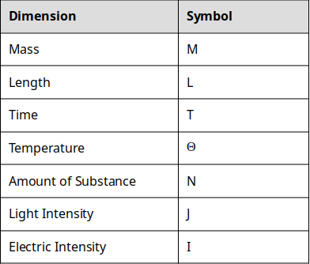
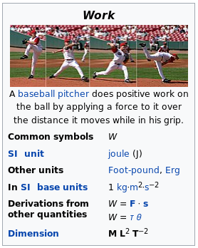
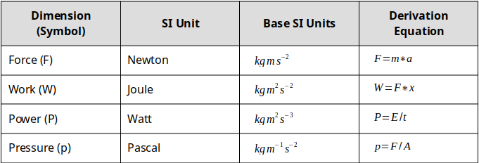

# Chapter 3 - Units, Dimensions, and Conversions

||
|:---:|
|*Figure 3.1: The important part is to understand when you need to convert units.*|

Although it seems basic, one of the first steps of becoming a successful engineer is having an **intuitive** understanding of units and dimensions. Intuitive means that when you see 4 inches or 4 millimeters you can "see" the difference between those two and understand how they are different. Intuitive means that when someone says that they are 6 meters tall, you raise your eyebrows and likely reply "I don't think meters means what you think it means". Unfortunately, it takes practice and time to have an intuitive understanding of anything (that is one of the reasons why we expect engineers to spend 4 years in school!). Therefore, the goal of this chapter is not that you will have an intuitive understanding by the time you are finished. It is important to understand that the learning process does not end at the completion of each chapter but instead is a lifelong process. The goal is that by the end of the chapter you will know how to appropriately look things up and that you understand how to be careful when converting units.

In this chapter, we will learn a ton! We are going to learn the difference between units and dimensions and how you will be expected to manipulate them as an engineer. We will explore the following:

- The metric system
- Inferior unit systems (aka US Customary Units and why we should switch!)
- How to convert between unit systems
- The fundamental dimensions of the universe! (Grandiose but true!)
- Dimensional homogeneity (a fancy way of saying dimensional consistency) and analysis
- How to intuit the difference between precision and accuracy

## Motivation - The Gimli Glider

On July 22, 1983, Air Canada flight 143 took off from Montreal to Edmonton. Before takeoff, routine checks showed all systems were functional and that everything was ready to go. While cruising at 12,500 meters, an alarm started blaring in the cockpit, warning the pilots that the fuel pressure on the left side of the airplane was low. The pilots silenced the alarm, figuring it was a fuel pump problem, and they knew gravity could handle moving the fuel around until they landed. The fuel gauges were not working correctly (or so it seemed), but the flight computer let the pilots know they had **plenty** of fuel to make the flight. A few minutes later, the right-side fuel pressure alarm went off. Seconds after that, the left engine shut down. The pilots called air traffic control and prepared to land with a single engine in Winnipeg. As they were discussing the plan with air traffic control in Winnipeg, the "all engines down" alarm went off and the cockpit went blank. The pilots consulted the manual and couldn't find a section that told them what to do when all engines fail. Luckily, the pilots managed to safely crash land the plane, and no one was hurt.

||
|:---:|
|*Figure 3.2: The Gimli Glider before it crashed...duh*|

### Why did it crash?

I hope that you can guess based on the chapter title. The problem was an incorrect unit conversion (and a whole host of other errors)! In 1983 when the incident occurred, Canada was in the process of converting the country to the metric system. The new 767 involved in the incident was supposed to be calibrated using metric units, but all other Air Canada aircraft at the time were still operating with Imperial Units. The pilot calculated that the flight required 22,300 kilograms of fuel. A [float stick](https://en.wikipedia.org/wiki/Floatstick) check showed that there were already 7,682 liters of fuel in the tanks. Note that the calculation is in *kilograms*, a unit of mass, and the float stick indicated a volume, in *liters*. The crew used an incorrect *conversion factor* that related mass of a liter of fuel to pounds, an error that went unnoticed by the flight crew. We will explore the specific mathematical errors the crew made later in this chapter. The moral of the story, a flight crew made a bad conversion, that crashed a plane. Luckily, no one died but the story highlights the importance of converting units carefully.

## Units vs Dimensions

It is easy to get units and dimensions mixed up. It helps to think of dimensions as **fundamental and usually unspoken** whereas units are **derived from the dimension and quantify the dimension**. 

||
|:---:|
|*Figure 3.3: In basketball, taller is usually better.*|

As an example, let's say you are recruiting someone to play on your basketball team. You know that in basketball, there are significant advantages for tall players. You might ask a potential Canadian player "How tall are you?" and she might reply "I am 1.8 meters tall". In this case, the **dimension** we are considering is \\( {length} \\) (aka "height" in colloquial terms), and the **unit** we are using to describe the dimension length is **meters**. However, if you ask an American player who is the exact same height as the Canadian player, she might reply "I am 5 feet 11 inches tall". In this case, the **dimension** ***is still*** \\( {length} \\), but now the units being used to describe that dimension, are now **feet and inches**.

## Dimensions

To summarize what you read in the previous section, a **dimension** describes the measurement of interest, which in the case above was \\( {length} \\). There are no other dimensions necessary nor does it even make sense to think about another "dimension to height". On the other hand, the **unit** meter is used to quantify the dimension and there are multiple different units we can use. Some units are more practical than others as we will see later in this chapter. For now, let's concentrate our mental effort on understanding dimensions.

### The Fundamental Dimensions of the Universe

Now that we have an idea of what a dimension is, we can easily list out **all of the dimensions needed to describe anything in the universe**. Yes, that is a bold statement but it is true. It turns out there are only a few fundamental dimensions of the universe and we can measure every single physical phenomenon you can think of using combinations of these dimensions.

||
|:---:|
|*Table 3.4: The fundamental dimensions of the universe and their corresponding symbols.*|

That is it. That is all the dimensions you need to describe everything in the universe.

Hold on a second, you might say. What about something like \\( {volume} \\)? Isn't \\( {volume} \\) a dimension? Well yes, but it is a **derived dimension**. The dimensions listed above are the fundamental dimensions that we can then combine in different ways to arrive at derived dimensions.

> Question 3.1: Fundamental Dimensions and Symbols
> Without looking at the table above (because it totally defeats the purpose!) try and match the dimension to the symbol we will use to represent that dimension.

### Derived Dimensions

You are already familiar with some of the derived dimensions. For example, it is likely that you already understand that \\( {volume} \\) is really just \\( {length} * {length} * {length} = {length^3} \\). Similarly, you probably already knew that the dimension \\( {area} \\) is simply \\( {length} * {length} = {length^2} \\). As we explore more complex concepts in engineering, you can expect the dimensions to get more complex.

### A Quick Note on Notation

Now is a good time to put this concept into practice. Before we do, just a quick note on notation. Consider the dimension of \\( {velocity} \\). You may have learned in physics class that \\( {velocity} = {{distance}\over{time}} \\). Now, we remember that distance is really the same thing as the dimension \\( {length} \\) which is represented by the symbol \\( {L} \\). Similarly, we have learned that time is represented by the symbol \\( {T} \\). Therefore, the dimensions of velocity is \\( {{L}\over{T}} = {L}/{T} = {L}{T}^{-1} \\)
 
As you can see, all of the ways of writing out the notation are equally as valid. However, the \\( {L}{T}^{-1} \\) is the most space efficient and the form that we will be using for the rest of the chapter. [If you need a refresher on the math behind this, click here.](https://www.freemathhelp.com/negative-exponents.html)

> Question 3.2: Quantity to Dimensions
> Match the Quantity to the Fundamental Dimensions that describe that quantity. The dimensions will be written in the "negative exponent" notation to indicate division for the sake of saving space. For some of these, you may intuit the answer. For others, you may have to do some outside research in order to determine which of the dimensions match the quantity.

### Deep Dive Into the Dimensions of Something a Bit More Complex

Now that we have covered some of the simple quantities and your brain muscles are loose, let's take one more look at dimensions and consider the physical concept of \\( {work} \\). If you remember what \\( {work} \\) is from your physics class, great! If not (or even if you do, it is a good video), take a minute to watch the following YouTube clip to familiarize yourself with the concept.

[Video 1: Video Courtesy of PBS Digital Studios: Work, Energy, and Power](https://youtu.be/w4QFJb9a8vo)

So what are the dimensions of \\( {work} \\)? Let's logically follow the steps below:

**Step 1)** From the video we saw that \\( {Work} = {Force} * {Distance} \\). We already know that \\( {Distance} \\) has dimension of \\( {Length} \\), but we don't have any idea about the dimensions of \\( {Force} \\). That leaves us here.

\\[ {Dimension \: of \: Force?} * {L} \\]

**Step 2)** Well, luckily for us, the video also states that \\( {Force} = {Mass} * {Acceleration} \\) and we know that \\( {Mass} \\) is a fundamental dimension. So we can then expand our analysis.

\\[ {M} * {Dimension \: of \: Acceleration?} * {L} \\]

**Step 3)** We are making progress but now we have another unknown dimension, the dimensions of \\( {acceleration} \\). But wait! You should have found above in Question 2 that \\( {acceleration} \\) has dimensions of \\( {L}{T^{-2}} \\). Now we just need to put it all together!

\\[ {M} * {L} * {T^{-2}} * {L} = {M} * {L^2} * {T^{-2}} \\]
  
**That means our final answer is:** \\( {M}{L^2}{T^{-2}} \\)

Now try and do this on your own by filling in the blanks to question 3.3:

> Question 3.3: Figure out the dimensions
> Consider electric potential. Electric potential is defined as the () needed per unit charge to move a test charge between two points. Analyzing the dimensions of electric potential show that it should be () \\( {L^2}{T^{-3}} \\) () \\( ^{-1} \\)

I tricked you into learning something, surprise! You have just done **dimensional analysis**! Dimensional analysis is a powerful tool in engineering. It allows us to understand a physical quantity by understanding the underlying fundamental dimensions of the quantity. In fact, if you go to the Wikipedia page for [work](https://en.wikipedia.org/wiki/Work_(physics)) you will see they list the dimensions of work as part of the summary.

||
|:---:|
|*Figure 3.5: Screenshot of Wikipedia page for Work showing the dimensions. I told you it's important.*|

## Unit Systems and History

Take another look at figure X above. Notice how it talks about the "SI unit" used to describe work? You can also see that there is a little section describing "Other units". Wikipedia is following the scientific and international standard of using the SI System. So what is the SI system and why did Canada risk crashing an airplane to switch?

### The History of the SI System (aka the Metric System)

SI stands for The International System of Units. It is derived from the french, French *Le Système International d’Unités* (hence the seemingly back words abbreviation, SI). The SI system is commonly referred to as the metric system and both metric and SI will be used interchangeably throughout the book. The history of SI is pretty interesting. Watch the following video to get a feel for how SI units came to be.

[Video 2: A nice TEDEd video that describes the history of units. Easily worth a watch! You could use a quick little break anyway...](https://youtu.be/7bUVjJWA6Vw)

> Discussion 3.1: Should America switch to SI?
> This post is not anonymous. The professor and participants can see the responses and the author.
> Well I will answer the question posed in the title for you. Yes! Let's say that you get elected President of the United States and you make the decision that the US should switch to SI. You make an executive order, and overnight, the US is supposed to switch to the metric system. For this discussion, think of one good consequence, and one potentially disastrous consequence from America switching to metric overnight. Comment on a classmate's response and have a discussion.

## What Engineers Need to Know About the SI System

It should be clear to you that the SI system has significant advantages over the United States Customary Units (USCU) that are in use in the US today. So what are the units, how were they set up, and why are they so advantageous? **There are three main concepts that you need to understand to fully understand the SI system: The Base Units, Derived Units, and Metric Prefixes.** Once you understand these three concepts you are well on your way to being an SI expert! *Do you notice the similarities of "The Base Units" and "Derived Units" to our sections on dimensions?*

### The Base Units

The SI base units are the building blocks of the whole system. They are analogous to the fundamental dimensions discussed in this chapter earlier. Since the units are simply descriptors of the quantity of a dimension, let's go ahead and pair them up!

||
|:---:|
|*Table 3.6: The fundamental dimensions matched to the SI unit.*|

So when we want to talk about the height of a basketball player, a scientist (or as we learned from the video, anyone not in the US, Myanmar, or Liberia) would say that Michael Jordan is 1.98 meters tall. The dimension is \\( {length} \\) and the SI unit for \\( {length} \\) is the meter. Similarly, in the SI system Michael Jordan is listed as having a \\( {mass} \\) of 98 kg. The dimension, in this case, is \\( {mass} \\), and the associated SI unit is the kilogram.

The only common exception to this rule is for the dimension of *time*. If you ask a scientist how old Michael Jordan is it is highly unlikely that they would reply that he is 1767226000 seconds old unless they were *really* into the SI system. However, for any of the other dimensions listed above, you should use the SI unit for the dimension when you can.

## Derived Units

Just like the dimensions, we can then combine different combinations of units to help us quantify more complex physical dimensions. 

For example, we discussed the concept of force above. We already determined that the dimensions of force are \\( {M}{L}{T^{-2}} \\). Similarly, force has a **derived SI unit** of Newtons. Remember, unlike dimensions, units are quantities that describe dimensions, and the values attributed to them are arbitrary. 

What I mean by arbitrary is let's consider a different derived unit, the joule. 1 joule is defined as the amount of work done moving 1 Newton by 1 meter. That is arbitrary. Why isn't 1 joule defined as moving 10 Newtons over 12 meters? Although it seems easier to use the number 1 (it is easier) it doesn't HAVE to be that way. It just is because that's what a bunch of french dudes decided. That being said, they did make some great decisions that make calculations and understanding units much easier as we will see.

Remember: **Dimensions are universal concepts but units are not**. What I mean by that is if we ever meet aliens, they will know what the dimension of \\( {length} \\) is and what it refers to, but they will have no idea what a meter is.

||
|:---:|
|*Figure 3.7: If we ever meet aliens they WILL know about length, but they WON'T know what a meter is.*|

Some of the derived units are pretty easy. Consider \\( {area} \\). Since the base SI unit for \\( {length} \\) is the meter, and we know that \\( {area} = {length} * {length} \\), it follows that the SI unit for area is simply \\( {meter} * {meter} = {meters^2} \\)

> Question 3.4: Derived Units
> Following the same logic presented above, match the appropriate derived dimension to the correct SI unit for that dimension. You may have to do a little background work (that is OK because that is a good brain workout!) to remind yourself what each derived dimension represents.

There are currently 22 derived units with special names. [Click here to see the list](https://en.wikipedia.org/wiki/International_System_of_Units#Derived_units). You will notice that almost all of the names are the names of famous scientists and engineers who were involved in the discovery of the scientific concept covered by the unit. A table of the most common derived SI units is shown below.

||
|:---:|
|*Figure 3.8: A small collection of the derived units.*|

## Metric Prefixes

Up until this point, it may seem there is little to no difference between the metric system and USCU (United States Customary Units) and you are right! USCU also has a unit for \\( {length} \\) (e.g. the inch) and you can also create derived units for \\( {area} \\) (e.g. the square inch). If you live in the United States or are familiar with the USCU you should know that there are actually **multiple different units used for** \\( {length} \\). In the US they are most commonly, the inch, the foot, the yard, and the mile. You should also know that the mile is used for long distances, the yard for intermediate distances, etc. The different units are designed to allow us to talk about different quantities easily. But converting between inches and yards is NOT straightforward.

> The metric system does not have an equivalent confusing structure. There is ONLY the meter for the dimension of length.

The beauty of the metric system is that it does not have an equivalent confusing structure. **There is ONLY the meter for the dimension of length**. So what happens when we want to talk about different magnitudes of different quantities? That is where the metric prefixes come into play. **The prefixes work by changing the magnitude of the dimension**. For example, if we are talking about the height of a person, it is likely that it will be described in numbers of meters. However, if we are talking about the circumference of the earth, we would likely talk about **kilo**meters. In this example, the metric prefix is "kilo" which stands for 1000. So instead of saying the circumference of the earth is 40,000,000 meters we would say that it is 40,000 kilometers. Here is a table of the *most common* metric prefixes:

||
|:---:|
|*Table 3.9: A small collection of SI prefixes.*|

Keep in mind that there are more metric prefixes than this. For a complete list, [check out this page](https://en.wikipedia.org/wiki/Metric_prefix).

Now we can combine any of the metric prefixes with any of the units to change dimension. For example, let's consider a blink of an eye.

||
|:---:|
|*Figure 3.10: In the blink of an eye...*|

It takes about 0.3 to 0.4 seconds to blink your eye. We could say that it takes 3 to 4 deciseconds because the prefix "deci" corresponds to \\( 10^{-1} \\).

\\[ {0.3} \: {seconds} \: = {3} \: {deciseconds} \: = {3} * {10^{-1}} \: {seconds} \: \\]

However, no one really talks about deciseconds, so instead, you might say that an eye blink takes 300 to 400 **milli**seconds. In this case the prefix "milli" corresponds to \\( 10^{-3} \\) so it is still equivalent (see table 3.4). 

Make sure to work out your brain until this concept makes sense to you! You can make up your own problems easily here depending on what you are into. Do you like swimming? How many **centi**meters are there in a 100-meter swim? You get the idea.

> Question 3.5: Metric Prefix Practice
> For this problem, let's consider the dimension of Mass. We know that the SI (or metric) unit for mass is the kilogram. How many grams are in 1 kilogram?

## Inferior Unit Systems

The United States Customary System (USCS) units are the system of measurements used in the United States of America. While the history behind them is interesting, they are a burden to use and introduce many complications for the 1st year engineering student. For that reason, this book suggests that you always work in metric units, even if the problem is stated in USCS units. If you would like to read more about USCS units you can find the [wikipedia page here](https://en.wikipedia.org/wiki/United_States_customary_units).

## Proof that USCS is Inferior

\\[ {1 \: foot \:} = {12 \: inches \:} \\]

\\[ {1 \: mile \:} = {5280 \: feet \:} \\]

Try figuring out how many inches are in a mile. Now let's look at the metric equivalent:

\\[ {1 \: meter \:} = {100 \: centimeters \:} \\]

\\[ {1 \: kilometer \:} = {1000 \: meters \:} \\]

Figure out how many centimeters are in a kilometer. I rest my case.

For now, it is simply important to understand that USCS units exist and that whenever they are encountered, they should be converted to their SI equivalent because USCS units are garbage and way too confusing to be useful.

## Converting Units and Conversion Factors

Up until this point, you should have a good grasp of what a dimension is, and what a unit is. You should also have gathered that for almost everything that we do in this book, we will use the SI system (again, I will use the term *metric* and *SI* interchangeably). Now the question becomes, how can we use all of this knowledge to convert between different units and prefixes? The last piece of the puzzle is going to be conversion factors. If you can't find the conversion factor you need, google it! We will use conversion factors as a kind of "decoder ring" to help us arrive at the unit of interest. To start, let's begin with some of the conversion factors for the dimension of Length.

||
|:---:|
|*Table 3.11: Some conversion factors for length.*|

There are a couple of things to notice from the table above. First, the conversion factors can be between USCS and metric (e.g. 1 meter = 3.281 feet) or from USCS to USCS (e.g. 1 foot = 12 inches). The reason you don't see any conversion factors from metric to metric is because we use *prefixes* instead of different units to describe quantities of different magnitudes. Remember? That is why it is easier.

The way to read the conversion factors is "There are 0.621 miles for every 1 kilometer" or mathematically that can be represented as:

\\[ {1}={{0.621 mi}\over{1 km}} \\]

It is important to note that since \\( {0.621 \: mi \:} = {1 \: km \:} \\) that the ratio \\( {0.621 mi}\over{1km} \\) is actually a dimensionless 1. Now, time for a quick math problem...

> Question 3.6: What do you know about 1?
> We all know that 1 is the loneliest number. Maybe it is because of its unique property when multiplied. What does 1*1881 equal?

OK, well that was an easy question but the idea is to get you to consider that the ratio of \\( {0.621 mi}\over{1km} \\) is the same as \\( {1 km}\over{0.621 mi} \\) which is the same as the number 1. We also know that we can multiply any number by 1 without changing the number. OK, so why is this useful? Let's look at an example to illustrate.

### Marathon Example (Converting Length)

Let's say that we wanted to convert the number of miles in a marathon to kilometers. We know that a marathon is \\( {26.219} \\) \\( {miles} \\). We know that our conversion factor tells us that \\( {0.621 \: mi \:} = {1 \: km \:} \\). Now all we have to do is multiply our original quantity, \\( {26.219 \: miles \:} \\) by one of the two ratios: \\( {0.621 mi}\over{1km} \\) or \\( {1km}\over{0.621 mi} \\). But which one should we use? **The trick is to select the ratio such that the unit that is being converted is eliminated, and the unit we are trying to convert to remains**.

||
|:---:|
|*Figure 3.12: Marathons are hard. 26.219 miles? Running? Ouch*|

If we try the first ratio we get: \\( {26.219 \: mi \:} * {{0.621 mi}\over{1km}} = {16.282} \\) \\( {mi^2}\over{km} \\) which is clearly a completely meaningless answer. What are the units \\( {mi^2}/{km} \\) and what does that have to do with distance? We acknowledge that *technically* that answer is correct because the quantity \\( {0.621 \: mi \:} / {1 \: km \:} \\) is just the number \\( {1} \\), *but it does not answer our original question*.

However, if we try the second ratio we get: \\( {26.219 \: mi \:} * {{1km}\over{0.621 mi}} = {42.221 \: km \:} \\) we can see that the unit \\( {mi} \\) cancels out algebraically and we are left with \\( {km} \\) for our answer. So therefore we can say that a marathon is 27.219 mi or 42.221 km.

Putting this all together we can come up with...

### Steps for converting units:

1. Determine the appropriate conversion factor(s) to be used.
2. Set up a ratio based on the conversion factor that will result in the current unit being eliminated, and the unit of interest being preserved.
3. Perform multiplication and algebra

> Question 3.7: Practice Converting Units
> Let's say that you are helping design a phone for a big company that has offices in the USA and in London. The office in London requests that the height of the phone be specified in centimeters. You know that the phone is 6 inches tall. Using the conversion factor (see table 3.11 above) and the process outlined above, what is the height of the phone in centimeters?

### Complicated Conversions - Units as Ratios

In the previous example (and a lot of the time in engineering applications), conversions can be completed in one step and with one conversion factor. Sometimes, instances will arise where you need to perform multiple steps and use multiple conversion factors. As long as you understand how to use the steps for converting units, you can apply that logic to more complicated situations.

For example, lets consider converting \\( {55 \: miles/hour \:} \\) to \\( {kilometers}/{second} \\). In this case, we can see that we are going to need to convert \\( {miles} \\) to \\( {kilometers} \\) and \\( {hours} \\) to \\( {seconds} \\). Although this seems more complicated, it is almost the exact same conversion process as we have done before. This time though, we need to do 2 conversions. See if you can follow along with the steps we outlined above:

**Step 1) Determine the appropriate conversion factors to be used**

In this case, the conversion factors of interest will be: 

\\( {1 \: kilometer} = {0.621 \: miles } \\) AND \\( {1 \: hour } = {3600 \: seconds} \: \\)

**Step 2) Set up a ratio based on the conversion factor that will result in the current unit being eliminated, and the unit of interest being preserved.**

\\( {1 \: kilometer}\over{0.621 \: miles} \\) AND \\( {1 \: hour}\over{3600 \: seconds} \\)

We set up the ratios this way so that when we multiply \\( {55} \:{{miles}\over{hour}} \\) by those ratios, we can see that miles will be eliminated and kilometers will remain in the numerator AND hour will be eliminated but seconds will remain in the denominator.

**Step 3) Perform multiplication and algebra**

Multiplying everything and canceling reveals:

\\[ 55 \: {{miles}\over{hour}} * {{1 \: kilometer}\over{0.621 \: miles}} * {{1 \: hour}\over{3600 \: seconds}} = {0.0246} \:{{kilometers}\over{seconds}} \\]

> Question 3.8: Complicated Conversions
> Using the same process outlined above, convert \\( {20}{{gal}\over{min}} \\) to \\( {{liters}\over{sec}} \\)

### Complicated Conversions - Units with Exponents

The last thing you need to be aware of when you are performing unit conversions is when we look at squared, cubed, and other higher power units. For example, lets consider the dimension \\( {volume} \\). We know that SI unit for the dimension \\( {volume} \\) is the cubic meter (\\( {m^3} \\)). The important thing here is the "cubic" part. If we want to convert from cubic meters to say, cubic inches, we can use the conversion factors: \\( {1 \: meter} = {3.281 \: feet} \\) and \\( {1 \: foot} = {12 \: inches} \\) in a two-part process to eliminate meters and end up with inches. Notice, however, that our conversion factors are NOT in powers of three. We have to account for that when we are performing our conversions. All you have to do, **is cube the ratios that you develop** during *Step 2* of our conversion process technique.

To illustrate this, lets convert \\( {12.3}{m^3} \\) to \\( {in^3} \\). We will follow the same steps we used in the previous examples.

**Step 1) Determine the appropriate conversion factors to be used**

In this case, we already discussed that the conversion factors would be:

\\( {1 \: meter} = {3.281 \: feet} \\) and \\( {1 \: foot} = {12 \: inches} \\)

**Step 2) Set up a ratio based on the conversion factor that will result in the current unit being eliminated, and the unit of interest being preserved.**

This is where things get tricky. In order for this to work, we can tell that we need cubic feet in the numerator for the first multiplication step and cubic meters in the denominator. However, our conversion factors identified do not correspond to the cubic quantities. **The solution is simply to cube the appropriate ratio to create a new conversion factor**. For this example the two conversion ratios then become:

\\( {{3.281ft}\over{1m}} * {{3.281ft}\over{1m}} * {{3.281ft}\over{1m}} = {{35.32 ft^3}\over{1m^3}} \\)

AND

\\( {{12in}\over{1ft}} * {{12in}\over{1ft}} * {{12in}\over{1ft}} = {{1728in^3}\over{1ft^3}} \\)

**Step 3) Perform multiplication and algebra**

Now that we have conversion factors with appropriate units, we can perform the multiplication steps and eliminate unwanted units.

\\( {12.3} \: {m^3} * {{35.32 ft^3}\over{1m^3}} * {{1728in^3}\over{1ft^3}} = {750705} \: {in^3} \\)

> Question 3.9: Complicated Conversions (Area)
> Using the same process outlined above, convert 14.2in^3 to m^3. Make sure you are giving this a good try and working out your brain!

> Question 3.10: The Smoot
> Throughout their existence, fraternities have been making pledges as a rite of initiation into the fraternity. However, in my opinion, an MIT fraternity prank in 1958 is the most clever, long-lasting, and humorous prank in existence. In October 1958, Oliver R. Smoot a pledge to the Lambda Chi Alpha fraternity was required to repeatedly lay down so they could use his height to measure the length of the Harvard Bridge. The bridge's length was measured to be 364.4 smoots plus or minus one ear. You are given that Oliver Smoot was 1.70 meters tall at the time of the prank. Using conversion factors and the steps outlined in this book, what is the length of the Harvard Bridge in feet? (Note: you can ignore the plus or minus one ear) Fun fact: Oliver Smoot became the chairman of the American National Standards Institute!

## Ethics

Humans are fantastically complicated and intelligent (sometimes) creatures but we still make mistakes on the occasion. Sometimes the consequences are small (i.e. a typo in a textbook) or sometimes the consequences are huge (i.e. a plane crashes and hundreds of people die).

In engineering, making mistakes can have *huge* consequences. You can find examples of engineering mistakes killing people all over the place. For example, the [Colombia space shuttle disaster](https://www.space.com/19436-columbia-disaster.html) resulted from a piece of foam that came off of a tank and cut through the wing. An engineer designed [a crappy bridge at FIU](https://www.cnn.com/2019/06/12/us/fiu-bridge-collapse-ignored-cracks/index.html) and it collapsed killing people. The list goes on, and the point is, that when engineers make mistakes, disasters happen.

The ethics questions I would like you to consider for this chapter is: who is to blame and how should we punish them?

> Ethics: Engineering Disaster
> This post is not anonymous. The professor and participants can see the responses and the author.
> For this prompt I would like you to consider a disaster, something like the Columbia disaster or any instance where an engineering mistake causes someone to lose their life. I want you to consider what the consequences should be and what should determine the consequences. For example, if I design a roller coaster and someone dies on the roller coaster, what questions should be asked? Do you instantly arrest the engineer? Or did the person that died do something they weren't supposed to do? Think through this and create a discussion post that describes a real or made-up disaster, what questions need to be answered, and what consequences (if any) the engineer that designed the product should face.

## End of Chapter Items

> Personal Reflection - Chapter 3
> This is a completely anonymous submission. The professor will be able to see the responses but the responses will not be attributed to an author. Your participation is required.
> What do you think about the content of this chapter? This was the first technical chapter we had. Did you learn anything new? Do you need to do some more practice? Do some personal reflection.

> Request for Feedback - Chapter 3
> This is a completely anonymous submission. The professor will be able to see the responses but the responses will not be attributed to an author. Your participation is required.
> What did you think of this chapter? Does anything stand out as exceptionally good? Anything that you would like to see differently? Any feedback is appreciated.

## Image Credits

Image 3.1 courtesy of wokandpix under license CCO 

Image 3.2 courtesy of Aero Icarus under license CC BY-SA 2.0

Image 3.3: courtesy of 12019 under license CCO 

Image 3.4: Image courtesy of Samuel Bechara, used with personal permission.

Image 3.5 Image courtesy of Rick Dikeman under license CC BY-SA 3.0

Image 3.6: Image courtesy of Samuel Bechara, used with personal permission

Image 3.7: Image courtesy of kalhh, under license CC0

Image 3.8: Image courtesy of Samuel Bechara, used with personal permission

Image 3.9: Image courtesy of Samuel Bechara, used with personal permission

Image 3.10: Image courtesy of Skitterphoto under license CCO.

Image 3.11: Image courtesy of Samuel Bechara, used with personal permission

Image 3.12: Image courtesy of Skeeze, used with CC0