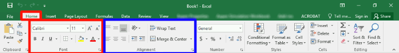

# Chapter 4: Excel Basics

||
|:---:|
|*Figure 4.1: The dreaded spreadsheet*|

## What is data analysis and why is it important?

Unlike some professions which may be more qualitative in nature, most engineering professions are quantitative. Consequently, engineers typically deal with a lot of data (values derived from scientific experiments). As was mentioned in Chapter 1, engineers are in the business of building things that turn ordinary people into superhumans. In order to build things in a safe and responsible manner, engineers are obligated to conduct a lot of experiments and collect a lot of data on those experiments. Engineers then use different statistical tools and methods to analyze the data. We will investigate some of these methods in Chapter 4. For this Chapter, we will investigate one of the main tools engineers use to tabulate and interpret data.

Different types of engineers deal with different types of data. For example, a mechanical engineer may have data pertaining to the stress and strain measured in a deforming material. A biomedical engineer may have data on the electrical potential from an electrocardiogram. The list goes on but the one thing that is true is that **engineers deal with a lot of data**. One tool to analyze and review data is Microsoft Excel.

Most engineering undergraduates have some exposure to Excel, perhaps you had to learn how to use it in high school, you watched your parents use it to keep track of a budget, or you saw a teacher use it to keep track of grades. Whatever your experience level is with Excel, we will spend the next two chapters investigating the capabilities of Excel and what you as an engineer will be expected to be able to accomplish with the software. Before we jump into learning, it is helpful to learn what you know about Excel already.

> Survey 4.1: Level of Experience with Excel
>
> How would you rate your familiarity with Microsoft Excel?
> 1. I am an expert
> 2. I am very familiar with and comfortable using Excel
> 3. I am somewhat familiar with Excel
> 4. I can use Excel but am not confident in my abilities
> 5. I know nothing about Excel
 

In this chapter, we will explore Microsoft Excel and what we will be expected of you as an engineering student. That means learning:

- How spreadsheets work
- Formatting options
- Cell Addressing
- Formulas
- Built-in Excel Functions
- Conditional formatting

## Before We Begin Excel: How to Learn Software

This is the first chapter in this book where we will learn how to use a computer software package (in subsequent chapters we will learn about MATLAB and other tools). It is assumed that you have access to Microsoft Excel. Luckily for you, most Universities give the entire Microsoft Office suite free to their students. If you do not have Microsoft Excel, you can use a free alternative such as [LibreOffice](https://www.libreoffice.org/). *Most* everything will be the same as Microsoft Excel.

||
|:---:|
|*Figure 4.2: Roll up those sleeves and get your hands dirty!*|

Before we dive into Excel, I think it is necessary to remind you of *how I expect you to approach learning this material*. **The key to learning how to use software is to roll up your sleeves and get your hands dirty (proverbially)**. What I am trying to say is that just *reading* about Excel (or any software package really) is insufficient for learning Excel. What you really need to do is open up Microsoft Excel, and follow along with the material *as you are reading about it*. Reading alone will not be enough to help you learn how to use it. For example, if you are reading about how to enter data into cells in Excel, you need to take a minute to practice that and actually enter data into cells in Excel.

In my opinion, the best way to learn the material on Excel and MATLAB is to have the book opened up in your web browser of choice, and also have the software package of interest opened up beside it (Figure 4.3 below). That way you can read and practice simultaneously.

||
|:---:|
|*Figure 4.3: Example of how I expect your desktop to look when learning about software packages.*|

Remember, **learning is working out your brain muscles**. Some of you are stronger than others in certain areas. For example, maybe your Excel brain muscle is very strong because you have worked it out a lot in High School. Then you don't need to put as much time into the mental gym (i.e. practicing Excel) because you are already strong! Others of you have never used Excel and will need to put a LOT of time in the mental gym to get up to speed. That is okay too! The point is, that **you** need to figure out how much **you** need to practice so that **you** are successful. See how all the "you" are bolded in that previous statement? That is because learning is an individual effort and you should never compare yourself to others, just worry about your own learning. Do not skip your brain workouts if you want to build brain muscle!

The last thing I want to mention about learning is that you also need to go beyond this textbook. Spend time playing around with the software package on your own. Find ways to use it for other classes or projects even if it is a little contrived. Watch YouTube videos on Microsoft Excel if you need to. Do whatever it takes so that you learn the material. With all that said, let's jump in...

## Open Excel

Go ahead, fire it up! When you first open excel, you are presented with this glorious screen:

||
|:---:|
|*Figure 4.4: What you are presented with when you open Microsoft Excel.*|

There is a LOT going on here, especially if you are new to Excel. Let's dive into what all this stuff means, and how we can use it to analyze data.

## Cell Addressing

The most basic use case for Excel is to simply use it to organize information into cells. 

**The cell is the basic storage unit of the spreadsheet.** Cells are the little boxes you see above in Figure 4.4 and below in Figure 4.6. You can select any of the cells, and begin typing in numbers, letters, or any combination of the two. 

**Cells are identified by their column (which are identified by letters) and their row (which are identified by sequentially increasing numbers). The combination of the column letter and the row number is called their address.** 

||
|:---:|
|*Figure 4.5: A cell address is just like your home address.*|

The analogy of a home address is particularly apt here. Just like your home address is likely identified by a number and name (e.g. 1374 Mulberry Street), **the home of each cell in a spreadsheet is identified by a letter and number.** 

For example, in Figure X below, the cell `A3` contains the text `Chad Personson`. The cell `B1` contains the text `Night Shift Employees`. The cell `B4` is currently empty. Etc.

Excel also gives you some advanced formatting tools to make things look nice. For example, you could use it to keep track of employees working different shifts (again, figure 4.6 below). In this example, I used the formatting tools (*and specifically the "Format as Table" option under the style tab*) .

||
|:---:|
|*Figure 4.6: Example of using Excel for simple data entry.*|

The main formatting tools you need to know about are located on the "Home" tab on the main tool banner. The two most important are inside the "Font" box (this is highlighted in red Figure 4.7 below) and inside the "Alignment" box on the same tab (highlighted in blue in figure X below).

||
|:---:|
|*Figure 4.7: Screenshot and highlights of areas of interest on the "Home" tab of the main tool banner.*|

## Try It!

For now, don't worry about being able to replicate Figure 4.6 exactly. **Instead, take a second to open up Microsoft Excel and play around with typing text into cells, formatting the text, and playing around with the "Font" and "Alignment" options.** If you are already familiar with how to use excel, it still is useful to play around a little bit, click on buttons you haven't before, etc. Do not skip this brain workout! After this, it will be assumed you understand how all these buttons and formatting options work!

## Formulas (`=`) and Cell Referencing

Now that we are familiar with cell addressing and how to enter data into cells, we can begin to explore one of the most powerful features of Excel, using **cell formulas**.

By using formulas, we can have Excel perform a calculation and show the result in the cell that contains the formula. Excel formulas start with an `=` sign and work essentially like a calculator. For example, if we wanted to calculate the area of a circle (recall \\( {area}={\pi}{r^2} \\)), with a radius of 0.24 meters, we could simply type the following formula into any cell (let \\( \pi \\) be approximated by \\( 3.1415 \\) ):

`= 3.1415 * 0.24 ^ 2`

Voila! We can then see that the area is \\( {0.18095} {meters^2} \\). However, we are missing the true power of Excel in this case which is cell referencing.

To see an example of cell referencing in action, let's consider a situation where we need to calculate the areas of a bunch of different circles. To start, recreate the spreadsheet shown in Figure 4.8 below (you should be able to recreate this using the formatting tools highlighted in Figure 4.7 above).

||
|:---:|
|*Figure 4.8: Example spreadsheet we will work on.*|

So now all we need to do is tell Excel to calculate those values and store the corresponding area in the appropriate B cell. To do that, we *could* just type in an individual formula into each appropriate cell.

For example, you *could* (but you shouldn't) type the following into `B4`:

`= 3.1415 * 2.1 ^2`

Then we could (again, don't do this) type the following into `B5`:

`= 3.1415 * 3.4 ^2`

But you can already see this would be exceptionally tedious! Especially if we wanted to calculate hundreds or even thousands of areas! This is where cell referencing comes into play. The key is to notice that the value `2.1` is stored in cell `A4`. The power of Excel is that we can actually just **reference** the cell `A4` in the formula.

You *should* type the following into cell `A4`:

`= 3.1415 * A4 ^2`

Once you hit enter, you can see that it uses the data from the cell `A4` in the calculation. Now, here is the trick. You can use cell addressing to create formulas and calculate the areas for the other cells automatically! To do so, select cell `B4` by clicking on it. You should notice a little green box (called the "fill handle") in the lower right corner. Click on that, and drag it down so that it fills all the cells in which we would like to calculate an area. This is called copying the cell formula. If you are a little confused about what to do, see video X below.

|:---:|
|[Video 1: Excel Cell Formulas and Referencing](https://www.youtube.com/watch?v=W2khobI_-MM&feature=emb_logo)|
|What you should notice (and can see in Video 1 in the link above) is that Excel automatically creates *new* formulas that have the correct cell address! That is because when we copied the formulas to the new cells Excel assumed that we wanted it to create a new formula with a cell in the same **relative** position as `A4`.|

For example, let's think about the *new* formula in `B10`. You can see the new formula by double-clicking on it. Notice that the new formula is:

`= 3.1415 * A10 ^2`

Since `B4` (the location of the original formula) is 6 cells above `B10`, when we copied the formula, Excel automatically adjusted the `A4` from the original formula to `A10` because it is 6 cells lower. That is called **relative cell addressing**. There are two more types of cell addressing in Excel.

For instance, lets say that instead of typing \( {3.1415} \) we wanted to store an approximation of \( {\pi\cong\frac{22}{7}} \) into a cell and use that in our calculations. To do so, add `=22/7` to the cell `D4` and format it like the figure below.

||
|:---:|
|*Figure 4.9: Add 22/7 in cell D4 as an approximation of Pi.*|

Hopefully, you can see that **relative cell addressing** will be a problem in this case. To see what I mean, type `=D4*A4^2` into cell `B4`. Everything should be ok. But when you try to copy the formula down to `B10` you should notice that everything is filled with 0. What is going on? If you look at one of the formulas (for example see the new formula in cell `B6`), you should notice that instead of cell `D4` which corresponds to our approximation of \\( \pi \\), Excel assumed we wanted to try and use a value in `D6` for the calculation. Since there is nothing in `D6`, the calculation is equal to 0!

What we need to do to fix it, is go back to the formula in `B4` and create an **absolute cell address** for `D4`. To do so, add `$` symbols in front of both the `D` and the `4` like this: `$D$4`. Now when you try to copy the formula to the cells below, it will use **relative cell addressing** for the A cells (which is what we want) and it will use **absolute cell addressing** for the `D4` cell!

|:--:|
|[Video 2: Excel Absolute Cell Referencing](https://www.youtube.com/watch?v=S6RawRDnOP8&feature=emb_logo)|
|A short video showing this is shown in Video 2 in the link above.|

The last little piece when it comes to cell addressing is there is one more form Excel accepts, **mixed addressing**. You can fix either the row or the column designation by adding a `$` sign. For example, `D$4` would only fix the row and would allow the column to change if the formula is copied.

To recap this section, there are three types of cell addressing that you can use in your Excel formulas:

- **Absolute Addressing:** in this case, Excel will always refer to the exact same cell if the formula is copied to a new location. You create an absolute cell address by adding a /({$}/) immediately before both the column and row of the cell of interest (e.g. `$B$5`)
- **Relative Addressing**: in this case, Excel will refer to the cell in the same relative position as the cell containing the formula, no matter where the formula is copied in the worksheet. (e.g. `B5`)
- **Mixed Addressing:** in this case, either the row or the column is fixed. (e.g. `$B5`)

> Question 1: Cell Addressing and Formulas
>
> Consider typing "24" into cell C6 and
>
> `=$C$6 + 10`
>
> into cell D6. Copy cell D6 down to cell D9. This is an example of __________ cell addressing. The value __________ is displayed in cell D9.

## Built-in Functions

So far you have learned a good deal about what you need to know as an engineering Excel user. Knowing how to create formulas and use cell addressing to make quick calculations of tabulated data is significant. To expand on these concepts, it is important to introduce some built-in Excel functions.

Part of what makes Excel powerful are the built-in functions that are commonly used in engineering applications as part of Excel formulas. [There are hundreds of them ranging from trigonometry, mathematics, statistics, and more](https://support.microsoft.com/en-us/office/excel-functions-alphabetical-b3944572-255d-4efb-bb96-c6d90033e188?ui=en-us&rs=en-us&ad=us).

The functions have very specific names that you must type in exactly to use and they take different numbers of input arguments.

## The parts of an Excel Function

Each excel function must be written in a specific but similar way. Just like typing in a formula, you start with the `=` sign. Next, you type in the function name, at this point, Excel will often start showing you options and auto-correct suggestions. After the function name, you **must** include parenthesis and the input arguments to the function inside the parenthesis. In its generic form an Excel function looks like this:

`= function_name(input,arguments)`

The input arguments in the function can refer to individual cells, or a range of cells, or might even be entirely optional. For example, Excel has a function =pi() that takes no input arguments. That doesn't mean that the parenthesis are optional though! All Excel functions **must include parenthesis after the function name**. For now, open your script you have been using to follow along and replace the cell that contains the approximation of \\( \pi = 22/7 \\) with `=pi()`.

||
|:---:|
|*Figure 4.10: For following along, change **D4** to **=pi()** and add a total row.*|

To illustrate a use of an Excel function that *does* require input arguments, let's consider the case that we need to add all of our area calculations in column B. See figure 4.10 to the right for what your Excel spreadsheet should look like. As it would be extremely tedious to type in a formula that adds up all the areas, we can use the Excel function `sum()` to add all of the cells in that range automatically!

To use the `sum()` function click on cell B11 and type in the following:

`= sum(B4:B10)`

Notice that Excel automatically adds all of the areas in the column! Neat! You should also notice that when functions require a range of cells (such as `sum()`) you can specify the cell range using a colon OR by clicking and dragging to select the range of cells of interest. You can see both ways of adding a range of cells in Video 3 below.

|:--:|
|[Video 3: Excel Functions](https://www.youtube.com/watch?v=sfFEbwdCf9I&feature=emb_logo)|

If you understand how to use the `sum()` function you are in great shape! Almost all Excel functions work in an identical way. Here is a list of functions that you should be familiar with. You do not have to memorize them, but you should know what they are and how to use them. 

For your brain workout, I suggest looking at Table 4.1 below and coming up with **your own** practice problems for each of them. That way you will remember how to use them in the future! For example, add some fake data to 5 cells and use the `average()` function to calculate the average. You can also find the standard deviation of those numbers using the `stdev.p()` function. You get the idea.

||
|:---:|
|*Table 4.11: A non-comprehensive but important list of Excel functions to learn how to use.*|

## Ethics: Rush to Finish

Currently, there is an ongoing "replication crisis" in science. The crisis arises because it has been found that ["many scientific studies are difficult or impossible to replicate or produce"](https://en.wikipedia.org/wiki/Replication_crisis). This is a huge problem because the scientific method relies on the ability of other scientists to replicate and verify experiments. Although some of the crisis can be attributed to bad actors (i.e. scientists forging data), it was found that 50% of scientists were failing to replicate *their own research*. A huge part of the problem is the scientific problem with the "publish or perish" culture in academia.

Engineering (and other science) faculty have a lot of pressure to publish scientific papers in order to keep their jobs and achieve tenure. Unfortunately, this pressure can lead to engineers taking shortcuts and not adhering to good scientific practices. Similarly, as a professional engineer in the workplace, you may feel like you have an unrealistic deadline and are rushed to finish your work.

> Ethics: Being Rushed at Work
>
> For this prompt, I would like you to consider being an employee at an engineering firm (since very few of you will go into academia and most of you will go into industry). Let's imagine that you are given a design task that has significant safety concerns but that your boss gives you an unreasonably short deadline. When you bring it up to your boss, she says "Do your best but the design has to be turned in on time, even if you have to cut some corners". What do you do? Do you go over your boss's head and talk to higher-ups? Is there a limit to how dangerous the design has to be before you do that? What if it wouldn't kill anyone but someone might get hurt? Think of some different scenarios that might arise like this, and explain what you would do in your imagined scenario.

## End of Chapter Items

> Personal Reflection - Chapter 4
>
> What do you think about the content of this chapter? This was the first chapter in which we discussed a specific program. Did you follow along like you were asked to? Did you find it useful to have Excel opened up beside the book? Did you make up your own problems like you were asked on the Excel functions? Do a little personal reflection.

> Request for Feedback - Chapter 4
>
> What did you think of this chapter? Does anything stand out as exceptionally good? Anything that you would like to see differently? Any feedback is appreciated.

## Image Citations:

Image 1 courtesy of PhotoMIX-Company via [Pixabay](https://pixabay.com/es/photos/marketing-digital-seo-google-1725340/), under [Pixabay License](https://pixabay.com/es/service/license/)

Image 2 courtesy Michael Gaida via [Pixabay](https://pixabay.com/es/photos/mano-los-dedos-la-piel-textura-3588162/), under [Pixabay License](https://pixabay.com/es/service/license/)

Images 3 - 11 courtesy of Samuel Bechara, used with personal permission.