#Chapter 5: Creating Charts in Excel

||
|:---:|
|*Figure 5.1: There are SO MANY stock images of people working on macs in coffee shops it isn't funny*|

The old adage "a picture is worth a thousand words" is especially relevant in the 21st century. Our smartphones and computers are excellent at displaying graphs and pictures and a good graph can convey a ton of useful information. It is a useful and marketable skill to be able to make legible, easy-to-read, and beautiful graphs. Furthermore, in the current digital age with [the rise of misinformation and fake news](https://journalistsresource.org/studies/society/internet/fake-news-conspiracy-theories-journalism-research/), it is useful to learn how to make correct and honest graphs so that when you encounter poor or misleading graphs, you are more likely to identify them as such.

In this chapter, we will explore how to make graphs in Excel, and what all *good* graphs have in common. In the next chapter, we will learn how to safely use Excel's built-in mathematical modeling as an engineer.

As mentioned above, this chapter will concentrate on how to make graphs in Excel. This will include learning the following:

- The elements of a good graph (axes labels, etc).
- Available chart types in Excel and why most are trash.
- How to create a scatter plot in Excel.
- How to create a column chart in Excel.
- How to use the "Format Cells..." menu.

##The Elements of a Good Graph

Before we dive into *how to make* graphs in Excel, it is useful to first understand what makes a good graph. For this example, let's consider [Hooke's Law](https://en.wikipedia.org/wiki/Hooke%27s_law). You might recall from your physics class that Hooke's Law is a law of physics that describes that the force **\\( {F} \\)** required to displace (stretch or compress) a spring by some distance **\\( {x} \\)** is linearly proportional to the distance **\\( {x} \\)**. That sentence translates to a mathematical equation:

\\[ F = kx\\]

Where **\\( {F} \\)** is the force, **\\( {x} \\)** is the distance, and **\\( {k} \\)** is what is called the "spring constant" which is characteristic of the spring and can vary depending on the spring. For example, a spring that has a very low spring constant would deform a lot when a little force is applied.

Let's imagine that you are working as a professional engineer and are reverse engineering a competitor's product (yes, this is a real thing that actually happens in professional environments). You find a spring on the product and need to determine its spring constant. You devise an experiment that consists of loading the spring with several different masses such that when it is oriented vertically, it applies a stretching force. Then you measure all of the distances, **\\( {x} \\)**, that arise from the different forces. Aren't you so clever?!

|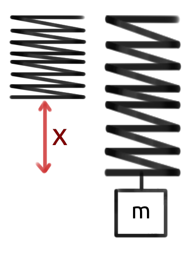|
|:---:|
|*Figure 5.2: In this figure, the spring is the black squiggly line. At first, the spring is unstretched. When a mass, \\( {m} \\), is added (creates a force \\( {F} \\) that is not shown) to the spring, it stretches \\( {x} \\) meters.*|

Next, you realize that Excel would be excellent for this type of data! Good thing you were paying attention in your introductory engineering courses! You enter your data into Excel as shown in figure 5.3 below.

||
|:---:|
|*Figure 5.3: Example of data entry from the experiment described.*|

Finally, you realize that you can plot this data and that it *should* look relatively linear. When you were reading Chapter 5 in your Hands-On Engineering textbook your freshman year (meta, I know), you skimmed that particular chapter because you were so confident in your Excel graphing skills. So this is the plot you come up with.

|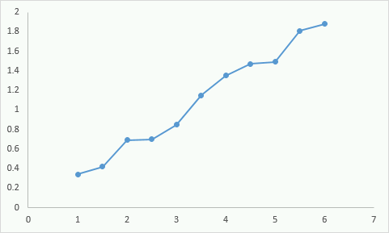|
|:---:|
|*Figure 5.4: Your graph from the experimental data.*|

You look at the plot, realize that it looks fairly linear (which is what you expect from the relationship **\\(F=kx\\)**) and you submit this to your boss explaining that you solved the mystery of the spring constant! Your email explains that it isn't perfectly linear because of measurement errors but that you can derive the spring constant from this graph. 

Is your boss happy with your work? Or is your boss upset at your graph? I'll go ahead and tell you she would be upset. Why? She would not be upset about the non-perfect measurements. She understands that your plot will not be perfectly linear. She would be upset because this plot, while technically incorrect, **is too difficult to read**. There are no grid lines so it is impossible to get a good feel for the data. There are no axes labels so it is not possible to know what is being plotted. The data points are connected which makes no sense. There is no title...the problems with this graph could take up the rest of the chapter.

Contrast the plot in Figure 5.4 with the plot in Figure 5.5 below.

|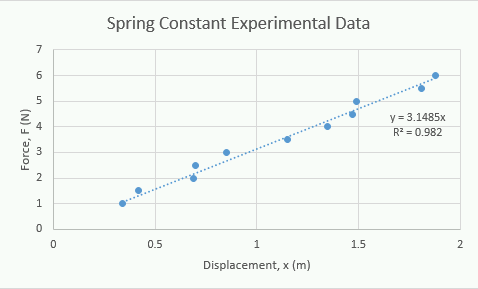|
|:---:|
|*Figure 5.5: A significantly improved graph of your experimental data*|

The plot in figure 5.5 above is *clearly* better. We don't even have to dive into physics or math, it is much easier to understand on its own. It displays more information, is easier to read, and is much easier to understand what the data is saying. Before we learn how to graph it is important to keep the following guidelines in mind.

##Graphing Guidelines

- Label axes clearly and make sure you include the name, symbol, and units.
- Provide grid lines so that readers can make estimations of the data points.
- If there is more than one line or data set on the graph, you must include a legend.
- Measurements of data points should be represented as points on a graph. Never connect the dots.
- Lines are reserved for theoretical values.
- Use a different symbol color and/or shape for each different data set.
- Ensure that the font, size, and color of the text are easy to read.

The nice thing about learning and remembering these graphing guidelines before we start learning how to graph is it will inform us on what is important to learn. We will also learn about what the mathematical model (the trendline and equation) on the graphs means, how to select an appropriate one, and how to interpret R^2 values.

>**Question 5.1: A similar experiment**

>Consider running the same experiment with a spring described above, except with two springs. You create the following graph. What is missing from the graph according to the graphing guidelines above?

|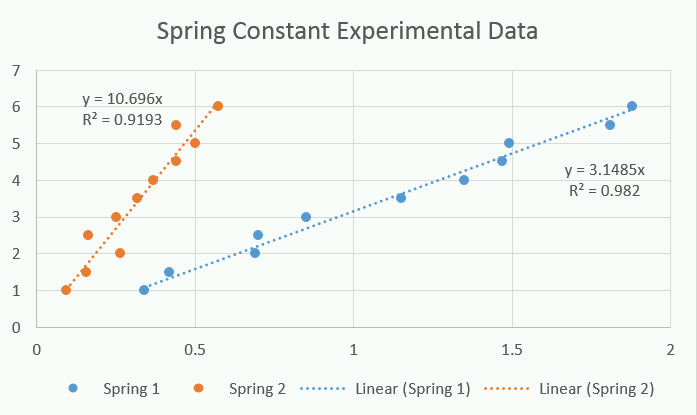|
|:----:|
|*Question 5.1*|

>A: Legend
B: Axes labels
C: Different colors for data sets
D: Title

##What is the Right Chart Type?
One of the things that we will see in a moment, is that Excel has a *plethora* of chart options. 

||
|:---:|
|*Figure 5.6: Pictured, most of the charts available in Excel*|

However, **most of them are complete garbage**. There are a lot of smart, hard-working, and admirable engineers working at Microsoft but how some of these chart types got off the drawing board and into the software baffles me. 

Unless you are using other charts for very compelling and good reasons **there are only two types of charts that you should ever use:**

**The Scatter Plot**

- Use when plotting raw experimental data.
- Useful for showing trends and creating mathematical models.

**The Column Chart**

- Use when *comparing* averaged (or other statistical manipulations) data.
- Useful for comparing values.

||
|:---:|
|*Figure 5.7: The only two charts you will need*|

That is the whole list. What Excel calls a bar chart (essentially a horizontal version of the column chart) is inferior because our brains are used to comparing height. Anything with "3D" in it is a terrible way to convey information and just makes it more confusing. 

"Ahh, not so fast Dr. Bechara, what about the mighty pie chart?!" you may be thinking. But you are wrong!

 **The pie chart is also a trash chart.** 

|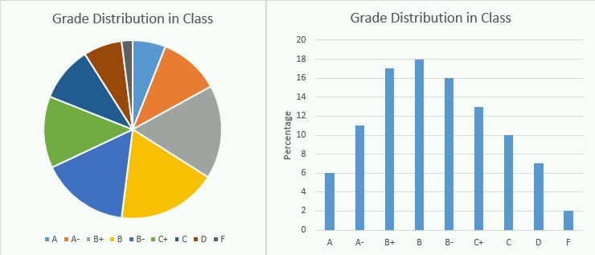|
|:---:|
|*Figure 5.8: Proof the pie chart is a garbage chart. Notice how the exact same information in a column chart is MUCH easier to compare and understand.*|

||
|:---:|
|*Figure 5.9: Mic drop. I hate pie charts.*|

Even *if* all the data add up to 100%, it is still easier to compare a column chart over a pie chart. I made up some numbers for grade distribution in a class and it is shown in two charts in figure 5.8 above. Which one is easier to compare? Looking at the pie chart, can you tell if the class had more B+, B, or B- grades? Now look at the column chart. Figure 9 is my mic drop.

Whenever you are creating plots, you should think about if you need a **scatter plot** or a **column chart**.

>**Question 5.2: Select all the appropriate chart types**

>For this question, select all of the trash chart types. Yes, Excel actually has THIS many trash options and this isn't even comprehensive! It is truly baffling.
>>A: Pie Chart
>>B: Line Chart
>>C: Scatter Plot
>>D: 3D Area Plot
>>E: 3D Column Chart
>>F: Column Chart
>>G: Bar Chart
>>H: 3D Bar Chart
>>I: 3D Pie Chart

Please accept my apologies if your great uncle invented the pie chart. I have been teaching for long enough to have seen *seniors* present garbage charts in their senior design presentations. I am just doing my part to ensure that future professors will not have to endure the hardship that is the 3D pie chart. Honestly, just typing those words sent shivers down my spine.

##How to Make a Scatter Plot in Excel
To learn how to create graphs pin Excel, let's continue the spring experiment example. The last thing to note before we get started is that there are 102098489127459745 different ways to do the exact same thing in Excel. I am going to show you a long way, but a way that will **always work the way that you expect it to**. When you start to get more experienced and play around with Excel, you will find other ways to create charts and graphs. Feel free to use those ways but you can always fall back on this technique if you need to!

To get started, recreate the spreadsheet shown below in figure 5.10. It would be helpful for you if your rendition is exactly the same as mine (that means that the numbers look the same and they are in the same cells). That is OK because it is good practice to remind yourself how to use the formatting tools. Remember, we are here to work out our brains!

|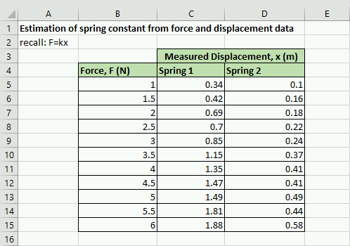|
|:---:|
|*Figure 5.10: Roll up those sleeves, open Excel, and recreate the spreadsheet shown here.*|

In this case, we want to create two plots on the same axes showing the different springs. Since we are plotting the raw data, we will want to use a **scatter plot** to visualize the data and identify any trends. The process for creating the graph is a little bit complicated so I suggest that you follow along closely:

||
|:---:|
|*Figure 5.11: Where to insert charts to your Excel spreadsheet*|

**Step 1)** Click the "Insert" tab along the top of the main navigation banner.

**Step 2)** You will see a lot of different trash chart options. Click the "Scatter Plot" chart type button. If you have a hard time figuring out which button is which, hover your cursor over the buttons and a small tooltip of text will pop up and let you know which chart option that button relates to.

**Step 3)** When you click the "Scatter Plot" button you will get a drop-down list with a bunch of options. Pick the option in the upper left-hand corner, the "Scatter Plot".  At this point, Excel should have automatically generated a chart and inserted it randomly into your spreadsheet. You can click on the chart and move it around if it is covering up your data.

**Step 4)** Now that you have your blank chart, we need to tell Excel where to look for the data. To do that, make sure that the chart is selected by clicking on it. Notice that the navigation banner has a new option category called "Chart Tools". Underneath the "Chart Tools" designation is a "Design" tab. Click on the "Select Data" button in the design tab.

||
|:---:|
|*Figure 5.12: Where the "Select Data" button is located. You must click on the chart for the correct button to show.*|

**Step 5)** A "Select Data Source" wizard box should pop up that looks similar to figure 5.13 below. Notice that Excel has *attempted* to guess what you want to plot. Go ahead and remove any of the items under the legend entries area of the wizard by selecting them and hitting the remove button. We want to add the data manually.

**Step 6)** Now that you have removed any auto-added entries, your "Select Data Source" wizard box should look *exactly* like figure 5.13 below. Click on the "Add" button under the "Legend Entries (Series)" section of the box.

|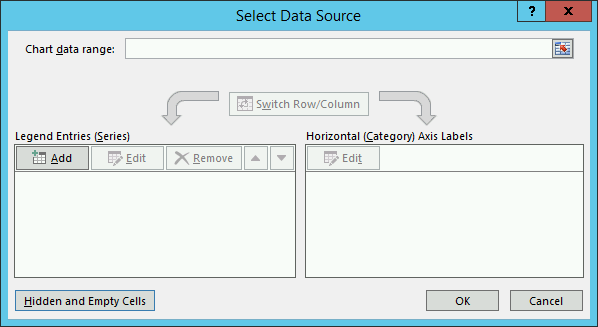|
|:---:|
|*Figure 5.13: By step 6 your "Select Data Source" wizard window should look exactly like this.*|

|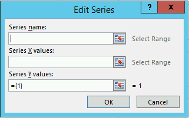|
|:---:|
|*Figure 5.14: The "Edit Series" box*|

**Step 7)** At this point a new box pops up titled "Edit Series" (figure 5.14 to the right). We are finally at the point where Excel wants us to tell it where our data lives. **FINALLY**. The way the "Edit Series" box works is that you click the text box inside the "Edit Series" box for the area that you want. Let's start with the "Series Name". So click inside the blank text box under the series name. Next, click on the *Excel cell that contains the text you want the data series to be named after*. Since we already have a nice label for Spring 1 in box C4 (see figure 5.12 above), we can now just **click on the cell C4 in the spreadsheet**. The correct Excel equation should automatically populate in the text area.

||
|:---:|
|*Figure 5.15: A "Edit Series" box for Spring 1*|

**Step 8)** We still need to add the X and Y values for our scatter plot. The process is very similar except this time we are going to be selecting a *range of cells*. We will plot the displacement values, **\\( {x} \\)**, on the x-axis and the force values, **\\( {F} \\)**, on the y-axis. To do so, click inside the text box under the "Series X values:" label. Next click on cell C5, without lifting your finger off the mouse, drag all the way down to C15. Repeat the process for the y-values but make sure you erase the ={1} that Excel automatically applies before clicking and dragging. When you are complete, your "Edit Series" box should look identical to figure 5.15 above. Click the "Ok" button to return to the "Select Data Source" window.

**Important Note)** When you are selecting x and y data this way, Excel does not function the way you are used to word processors functioning. If things get messed up, do not despair! Instead, select everything inside of a text box, delete it, and try again.

**Step 9)** Repeat the process for **step 8** but this time select spring 2 data where appropriate.

**Step 10)** Once you have selected the data appropriately, you can click "Ok" under the "Select Data Source" window and, viola! Your chart is *almost* done!

Whew, that was a lot! For a quick video recap of the entire process, see video 5.1 below.

|:--:|
|[Video 5.1: A recap of steps 1-10 on how to create a chart in Excel.](https://www.youtube.com/watch?v=WbevBtFvKqA&feature=emb_logo)|

##Adding a Title, Axes Labels, and More

You will notice that leaves us with a nice chart but it is still lacking components that are necessary according to the graphing guidelines that we established above. Luckily, the rest of the required components are available to add from one menu button, the "Add Chart Element" button (see figure 5.16 below).

|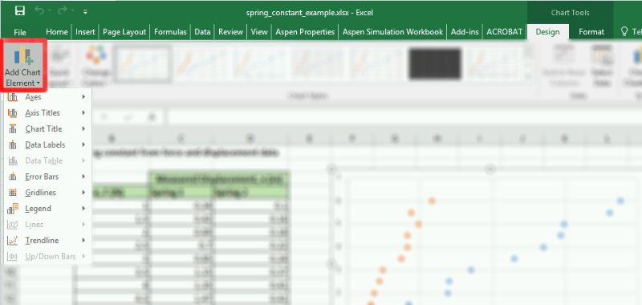|
|:---:|
|*Figure 5.16: Add chart element button. Notice that it is under the "Design" tab under the "Chart Tools" section of the main navigation bar. Remember, **this menu only shows up if the chart is selected**!*|

To finish our chart, we are going to use the "Axis Titles", "Chart Title", and "Legend". We will investigate the "Trendline" in the next section of this chapter. For now, go ahead and add the titles and legend. You can just select the appropriate item from the menu, then edit the field by double clicking on it. When you are finished your chart should like identical to the one below (figure 5.17). Good work!

||
|:---:|
|*Figure 5.17: The completed scatter plot.*|

If you are confused about how to do this, video 5.2 shows how this process is completed.

|:---:|
|[Video 5.2: A short video showing how to add the essential chart elements.](https://www.youtube.com/watch?v=MG3X6mhpWmk&feature=emb_logo)|

Just because this chapter does not explicitly cover the other options (namely; "Axes", "Data Labels", and "Error Bars") does not mean that you shouldn't know how they work. There are cases where these options can be useful. Go ahead and save a copy (go to "File" then "Save as") of your spreadsheet to this point and play around with those options to see what they do and how they work!

###Don't Forget to Save!
We are going to jump into how to make a column chart next but we will be returning to the spring example in the next chapter. Don't forget to save your Excel file somewhere where you will remember so we can refer back to it!

##How to Make a Column Chart in Excel
The process for creating a column chart is very similar to the process of creating a scatter plot. The main idea is the same: get the data into the spreadsheet, add the appropriate chart type to the spreadsheet, and then edit the chart so that Excel knows where to look for the data.

In this example, let's compare the average cost of tuition for a few different types of Universities. This data is real (and kind of frightening! whew private colleges are pricey) and comes from [collegeboard.org](https://research.collegeboard.org/trends/college-pricing/figures-tables/average-published-charges-sector-over-time). To start, make the following spreadsheet (figure 5.18 below). Again, it behooves you to make it exactly the same as my chart below.

|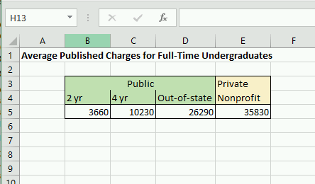|
|:---:|
|*Figure 5.18: What your Excel spreadsheet should look like. Private Universities are EXPENSIVE.*|

###Formatting Cells
Since we are comparing these 4 values, it makes sense to use a column chart. Since these are dollar amounts, we should learn how to have Excel display them as currency. To do this, select all the cells that contain the dollar amounts, then right-click and select the "Format cells..." menu item. From there, you will see several options (again, it is a good idea to explore these on your own) but the one we are interested in is located under the "Number" tab. Select the "Currency" option, reduce the decimal places option to 0 (or leave it at 2, your call), then click Ok. The cells should automatically populate with dollar signs. Cool!

Before you move on, don't skip your brain workout! Spend a few seconds poking around the "Format cells..." menu to see what everything does!

###Insert the Column Chart
Now that the cells are formatted nicely, the next step is to insert the column chart. The process here is *very similar* to inserting a scatter plot. This is another good brain workout opportunity. Try and figure out how to create the column chart on your own, remembering that the process is almost identical to the scatter plot! Try and use the "Add Chart Element" options to create the chart shown below in figure 5.19. Try and make it as close to the exact same thing as possible.

||
|:---:|
|*Figure 5.19: You can do it! Don't worry if you get stuck or if it takes a little time!*|

To double-check your process, you can see how I accomplished creating this chart in the video below.

|:--:|
|[Video 3: Before you watch the video make sure that you gave it a try! You can do it!](https://www.youtube.com/watch?v=zzl9XJoRwEk&feature=emb_logo)|

>**Question 5.3: Where is the "Add Chart Elements" menu?**

>Look at the following screenshot. You should notice that the main ribbon does not have the "Chart Tools" section which we would need to access the "Add Chart Elements" menu to add items such as a legend or grid lines. Why is this ribbon item missing?
>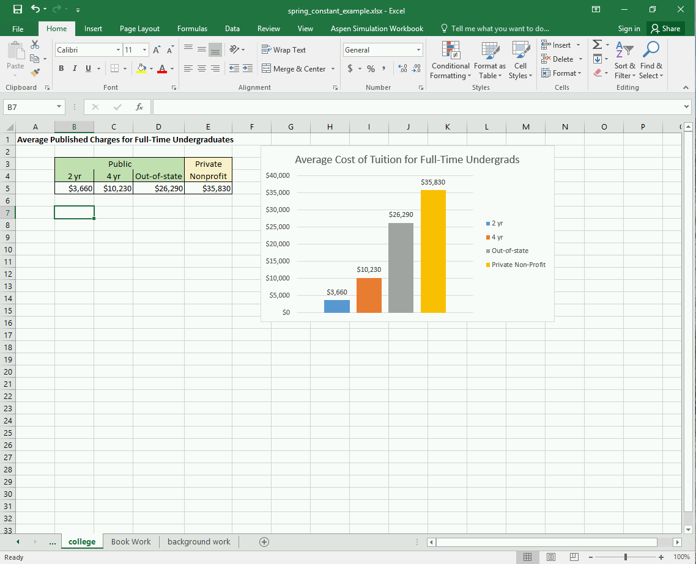
>>A: There is no such ribbon item as described.
>>B: The menu in question is under the "Insert" tab on the ribbon.
>>C: The chart needs to be selected by clicking on it.

>**Question 5.4: How do I move the legend?** 

>Consider the following screenshot. If I wanted to move the legend on the chart to the bottom of the chart, where would you FIRST need to click?
>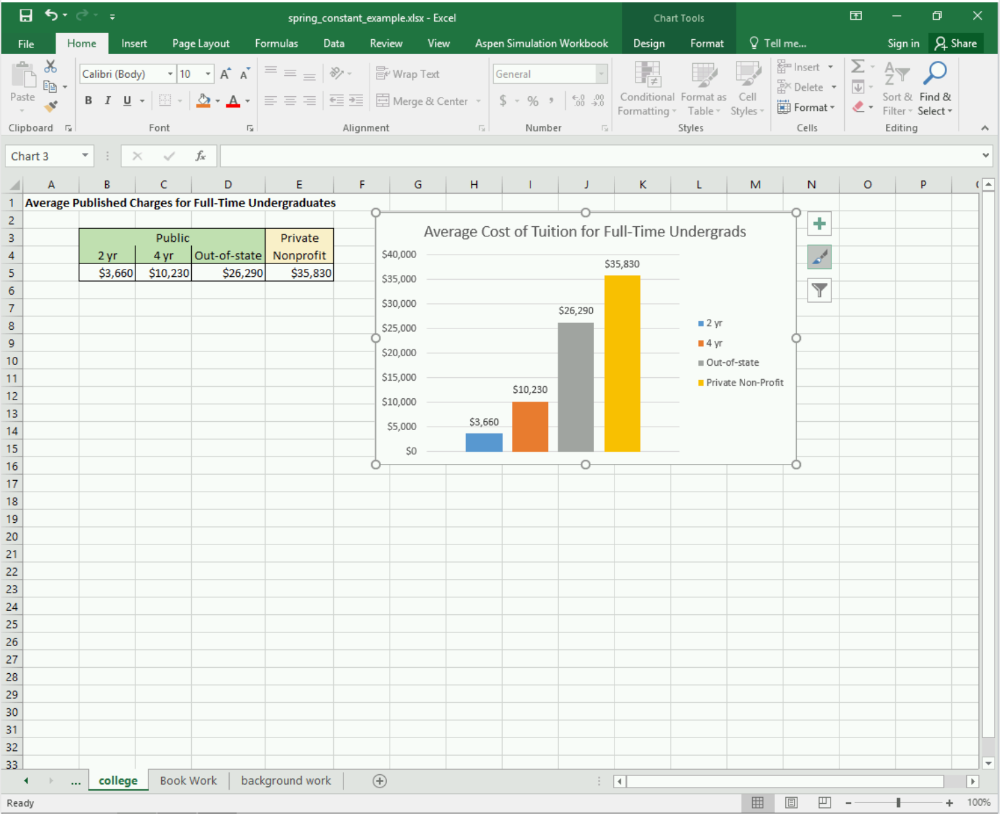

##Ethics: Misleading Graphs
Sometimes people create misleading graphs as a way to deliberately mislead the people trying to interpret the graph. Other times, it is because the people making the graphs do not understand how to make graphs correctly. In any case, the three major ways that people mislead through graphs are:

- The vertical scale is not appropriate and/or doesn't start at zero.
- The graph is not labeled properly.
- Incorrectly plotted data points.

For example, consider the newspaper clipping below that shows that "The Times leaves the rest behind...".

|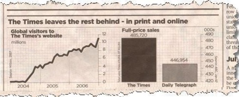|
|:---:|
|*Figure 5.20: The Times leaves the rest behind...but do they?*|

Notice how at an initial glance the bar chart looks like The Times has almost 2x the number of subscribers as the Daily Telegraph! But wait, when you look at the numbers it looks like they only have 38,766 more subscribers or an 8.7% increase over the Daily Telegraph. Sneaky sneaky. This is a classic graph manipulation technique, changing the vertical scale so that it doesn't start at zero.

As another example, look at the Fox News graph below (during my search for misleading graphs there are SO many Fox News examples. Seems like they really enjoy a good misleading chart...).

||
|:---:|
|*Figure 5.21: Gasp! Obama's policies suck! Or do they? source: [http://cloudfront.mediamatters.org](http://cloudfront.mediamatters.org)*|

In this example, Fox News is using a few misleading tactics. One, the last data point (8.6%) is plotted at the same level as the previous data point (9.0%) to hide the fact that the unemployment rate actually decreased a little bit. Furthermore, the data also appears as if the unemployment rate has gone up dramatically since March but in reality, it has held pretty stably at 9% throughout the whole graph.

>**Ethics: Misleading Graphs**

>>This post is not anonymous. The professor and participants can see the responses and the author.

>For this ethics discussion post, I would like you to consider misleading graphs. Do you think they are a big problem or do you think it is up to people to be smarter and more critical about reading graphs? If a future boss of yours asked you to "change the axes" to make the data look better for a presentation, would you? Is there a specific instance or case where you would draw the line and refuse?

##End of Chapter Items
>**Personal Reflection - Chapter 5**

>>This is a completely anonymous submission. The professor will be able to see the responses but the responses will not be attributed to an author. Your participation is required.

>What do you think about the content of this chapter? Did you learn anything new? Do you need to do some more practice? What do you think about the other chart types (that I said were garbage)? Do you agree/disagree? Do some personal reflection.

>**Request for Feedback - Chapter 5**

>>This is a completely anonymous submission. The professor will be able to see the responses but the responses will not be attributed to an author. Your participation is required.

>What did you think of this chapter? Does anything stand out as exceptionally good? Anything that you would like to see differently? Any feedback is appreciated.

##Images Citations:
Image 1 courtesy of [Pexels](https://www.pexels.com/photo/apple-caffeine-coffee-coffee-shop-134504/), under [pexels licence](https://www.pexels.com/license/). 

Image 2 courtesy of Samuel Bechara, used with personal permission.

Image 3 courtesy of Samuel Bechara, used with personal permission.

Image 4 courtesy of Samuel Bechara, used with personal permission.

Image 5 courtesy of Samuel Bechara, used with personal permission.

Image 6 courtesy of [Pixabay](https://pixabay.com/es/photos/basura-contenedor-de-residuos-2729608/), under [Pixabay Licence](https://pixabay.com/es/service/license/).

Image 7 courtesy of Samuel Bechara, used with personal permission.

 Image 8 courtesy of Samuel Bechara, used with personal permission.

Image 9 courtesy of [Pixabay](https://pixabay.com/es/photos/ca%C3%ADda-el-micr%C3%B3fono-mano-lado-2945055/), under [Pixabay Licence](https://pixabay.com/es/service/license/).

Image 10 courtesy of Samuel Bechara, used with personal permission.

Image 11 courtesy of Samuel Bechara, used with personal permission.

Image 12 courtesy of Samuel Bechara, used with personal permission.

Image 13 courtesy of Samuel Bechara, used with personal permission.

Image 14 courtesy of Samuel Bechara, used with personal permission.

Image 15 courtesy of [Statistics Show](https://www.statisticshowto.com/misleading-graphs/), under public domain.

Image 16 courtesy of [Statistics Show](https://www.statisticshowto.com/spurious-correlation/), under public domain.

