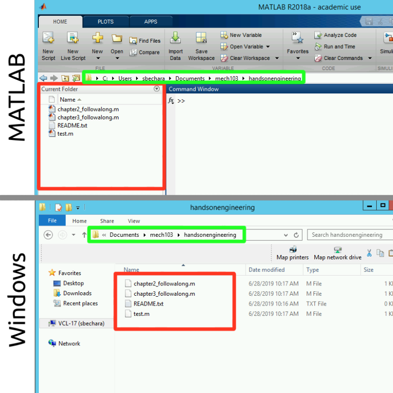

# Chapter 7: Introduction to MATLAB

MATLAB is a professional software suite and programming language that is commonly used by engineers to analyze data, create complex algorithms (more about these in Chapter 2), and more. MATLAB stands for **mat**rix **lab**oratory and is designed to work well with matrices and other types of arrays. MATLAB can help with digital signal processing, control systems, computer vision, and the list goes on. It is stable, robust, relatively fast, well optimized, and can run on Windows, Mac, Linux, and even on Embedded Systems. MATLAB is a pretty amazing bit of software that is well maintained, regularly updated, and well supported.

But...

||
|:---:|
|*Figure 7.1: MATLAB is so expensive it should be featured in rap videos as "bling". Dolla Dolla bills, y'all.*|

MATLAB is *pricey*. [Currently, a single standard license is $2150](https://www.mathworks.com/pricing-licensing.html). Obviously, any piece of software that can cost $2150 *per user* to a company must be worth learning about but I would understand the hesitation to purchase that as a student. 

Luckily, if you are a student you can sometimes get MATLAB for the low, low price of $0. Some universities pay for their engineering students to have MATLAB licenses! Inquire with your University's IT departments to see if you can download MATLAB for free on your personal computer. If your university does not have a site license, [you can purchase a student license for $49](https://www.mathworks.com/pricing-licensing.html?prodcode=ML&intendeduse=student), which isn't that bad. Since this book is going to use MATLAB in every chapter, you will need to figure out a way to have access to a MATLAB installation.

In this chapter, we will explore the basics of MATLAB which will culminate in learning how to use MATLAB as an overpriced calculator. That means learning:

- Why you should bother to learn MATLAB instead of <insert_programming_language_here>.
- What are the different components of the MATLAB GUI are.
- How your computer stores files and why that is important to MATLAB.
- How to use MATLAB as a glorified calculator.
- How to use variables to store information and simplify your calculations.

## Why MATLAB instead of <insert_programming_language_here>?

At this point in your life, you have probably been exposed to different software,  you might even have programming experience, and it is even possible that you have a preference for a specific programming language. So why MATLAB instead of Python? Instead of C++? Instead of Go? (Clearly, the list could go on and on).

The reason this book concentrates on MATLAB is that as of the publication of this book, **MATLAB is an extremely popular programming suite that engineers are expected to know how to use**. MATLAB is popular because it is a general-purpose language that lends itself to productivity. MATLAB is worth knowing because...

- It is easy to express computational mathematics. (You will see this shortly later in the chapter!)
- MATLAB is *specifically designed for engineers* which means the documentation and functions are easy to use and remember.
- The environment is tuned for iterative workflows and rapid prototyping.
- There are a TON of toolboxes which means that a lot of code is already available for you to use. You do not need to reinvent the wheel.
- The MATLAB debugging tool is extremely powerful and easy to use.
- MATLAB is *fast*. It is optimized and can solve big problems quickly.

The list goes on and on but MATLAB is expensive for a reason. The reason is that it is a powerful, easy-to-use software development suite designed for rapid prototyping. Furthermore it was designed specifically for engineers which means the documentation is excellent and tuned toward engineers and the functions available were written with engineers in mind.

## MATLAB GUI

When you are first learning MATLAB it may seem easy to ignore the MATLAB graphical user interface (GUI) and just focus on the command window. It is important to learn what each section of the MATLAB GUI does, and how you can use it to your advantage. When you first open MATLAB, you should see something very similar to the default GUI shown below.

||
|:---:|
|*Figure 7.2: The default MATLAB GUI layout.*|

Let's dive into some of the areas of this program and explain what they do, and how you will use them. In each of the sub-sections below, the area of interest will be boxed in red. It is highly recommended that you open up a copy of MATLAB and click around as you are learning about each part of the workspace. Remember to work out your brain!

## Command Window

||
|:---:|
|*Figure 7.3: The MATLAB Command Window is boxed in red.*|

The command window provides flexibility to MATLAB and how users interact with your programs. It is the place where you can issue a single line of code to be executed by MATLAB. *You can issue any command that is a valid line of MATLAB code*. The command window is a unique feature of MATLAB and is an invaluable tool for debugging programs, testing functions, making quick calculations, and more.

In your career, you will often use the Command Window for quick calculations or to check your work (in essence turning it into a very expensive calculator). For example, lets say that you are working on a problem and need to convert \\( {15.23} \ {degrees} \\) to \\( {radians} \\). You remember the conversion factor is \\( {π \ radians}\over {180 \ degrees} \\) and when you calculate it by hand you get \\( {15.23} \ {degrees} = {0.27} \ {radians} \\). You want to check your answer in MATLAB and you remember that MATLAB has a built-in function to automatically convert a number from degrees to radians (`deg2rad()`). So you quickly type the following in the command window (see Figure 7.4). Voila! You were right. Don't panic yet! I don't expect you to know the function `deg2rad()` yet, I am just showing an example of how to use the command window.

||
|:---:|
|*Figure 7.4: Example of how to use the Command Window.*|

## Current Folder

||
|:---:|
|*Figure 7.5 The Current Folder Path and the Current Folder Browser are boxed in red.*|

It is very important to organize your files and folders when working with MATLAB. One of the most common problems students have when starting to learn MATLAB is improper file management. They start storing all of their script files, functions, and algorithms inside the same folder. While this works for 2 or 3 files when you have 200 or 300 in the same folder, things get messy. Today is the day to get your digital life organized! I suggest creating a new folder in your documents folder that is named after the name of your course. So if you are taking MECH103: Intro to Mechanical Engineering, name your folder `mech103` (or something else that makes sense and makes you happy). Then add folders into *that* folder as appropriate. For example, it might be a good idea to create a folder called `assignments` that you use to store your assignments into, etc. It is assumed that you understand how and where to store things on a computer.

||
|:---:|
|*Figure 7.6: Example of a Windows File Explorer file management scheme.*|

You do not need to be an IT Professional to understand MATLAB. But a critical skill is understanding file structures and directories. For example, you should know that the "path" to the folder shown in figure 7.6 above is `C:\Users\sbechara\Documents\mech103`. If you need a quick refresher on Windows File Structures, try watching the following video to catch up. I personally use GNU/Linux operating systems so when you see screenshots of MATLAB you may notice that the path is a little different (UNIX-like systems such as macOS and Linux use `/` instead of `\` and do not have drive letters like `C:` or `D:`).

|:--:|
|[Video 7.1: Windows File Structures Review Video](https://www.youtube.com/watch?v=4xS5IOg_nDw)|

To illustrate the similarities between MATLAB's current folder browser and the current folder path to Windows Explorer, see figure 7.7 below. In figure 7.7, **the green boxes indicate the folder path (also sometimes called the current working directory)** (note: in figure 7.7 Windows truncated and doesn't show the full path, to see the full path click the << to the left of Documents) which in this case is `C:\Users\sbechara\Documents\mech103\handsonengineering`. The **red boxes indicate the current folder contents**, since the folder is the same we would expect both the Windows File Explorer and MATLAB File Explorer to contain the same files, and they do! The only difference is that MATLAB puts different cute icons to help you quickly understand what your files are. Isn't that nice?

||
|:---:|
|*Figure 7.7: Showing the similarities between MATLAB and Windows File Explorer. The green box indicates the folder path and the red box indicates the folder contents.*|

The next thing to learn is how to navigate your computer's file system inside MATLAB. **You do it the same way that you navigate Windows File Explorer in Windows or Finder in macOS**. The problem here is that there are a ton of options. I encourage you to take a small brain workout and try each of these in MATLAB on your own.

- You can click inside the path and type in a new path
- You can double-click the folders displayed in the current folder
- You can click on the little + symbols to show sub-directories and their contents
-  You can right-click inside the current folder window and add new folders and files
- More?
 
I created a video showing me navigating a file system. See Video 7.2 below for an example. Again, **do not let this be a substitute for actually trying it on your own**!

|:---:|
|[Video 7.2: Examples of MATLAB file and folder organization and manipulation capabilities.](https://www.youtube.com/watch?v=7dZKGjWnvnE&feature=emb_logo)|
|Examples of MATLAB file and folder organization and manipulation capabilities. Can be seen in the video above|

So the main thing to remember is that the "Current Folder" window in the MATLAB workspace is showing the files in the folder MATLAB is currently working out of. The way to navigate files and folders within MATLAB should be familiar to any Windows, macOS, or Linux user. The keys are to be able to know where you are and what is in the folder you are currently in.

> **Question 7.1: What is the path?**
>
> Look at the MATLAB screenshot taken on a Windows computer. What is the user's current path (also called the current working directory) based on this image?
> 
>
>> - A. C:\Users\sbechara\Documents\MATLAB\question
>> - B. C:\Users\sbechara\Documents\MATLAB\question\problem1.m
>> - C. C:\Users\sbechara\Documents\MATLAB\
>> - D. C:/Users/sbechara/Documents/MATLAB/question
>> - E. C:/Users/sbechara/Documents/MATLAB/

## Workspace

||
|:---:|
|*Figure 7.8: The MATLAB Workspace is boxed in red. Currently, it is empty indicating that there are no workspace variables available to the user.*|

The area labeled "Workspace" and boxed in red above in figure 7.8, is the place where MATLAB lets the user know what variables are loaded and available to the user. We will learn about variables below, but for now, you can think of them as a string of letters that can be used to store a number.

||
|:---:|
|*Figure 7.9: Example workspace variables*|

In figure 7.9 to the left, notice that there are workspace variables. In this case, there are 3: "apples" has the value 10 stored in it, "bananas" has the value 20 stored in it, and "pie" has pi stored in it.

Again, you will learn later how to create your own variables and use them, but for now, it is just important that you understand how MATLAB displays the information to you about what variables are currently defined and what numbers they contain.

## MATLAB Banner

||
|:---:|
|*Figure 7.10: The MATLAB Banner*|

The MATLAB banner is the part of the GUI that sits on top of everything else. There are multiple tabs (that will actually change depending on what you are doing) and there are a bunch of buttons with a little descriptive text. Almost all of the buttons are labeled in such a way that it should be pretty obvious as to their function.

For example, the "New Variable" button creates a new variable in the workspace. The "Preferences" button opens up a modal dialogue box that contains a whole bunch of options that you can change in MATLAB.

Take some time to familiarize yourself with the banner and the buttons located on it (especially the buttons in the "Home" tab). In the next chapters, I will refer to the buttons on the banner so you must know where to look.

Take a second or two to play around with the buttons on the "Home" tab of the banner. You can't really break anything and it is good to explore them to see what happens. Also, take a second to click through the other available tabs to see what buttons are available on those. A lot of what we will be learning throughout the rest of this book will rely on your ability to find the correct button on the banner so don't skip this step!

## Quick Recap

If you were paying attention, working out your brain muscles, and following along, hopefully now you know:

- What the command window is and what it is used for.
- What the current folder path and current folder browser are, how to navigate your file system using the current folder browser, and know how to add and remove files from your file system using MATLAB.
- What the Workspace area is for, how to interpret what variables are currently stored in MATLAB, and get a quick idea about the values they contain.

If any of the above three bullet points seem fuzzy to you, please take some time to re-read those sections or seek help elsewhere. From this point forward, it will be assumed that you understand these three areas of the MATLAB GUI and what they are used for.

## MATLAB as a Glorified Calculator

Even though we spent the preceding section praising MATLAB for its powerful capabilities we are going to spend the rest of this chapter learning how to use it as a calculator. It is going to seem that this is boring and easy, however, there are key concepts that are easy to miss! To best learn, I recommend that you open MATLAB and practice these concepts in the MATLAB command window.

## Arithmetic Operators (for scalars)

To use MATLAB as a calculator, we first need to learn what symbols are reserved for use as arithmetic operators. Keep in mind this section only applies to arithmetic performed on **scalars** (A quantity (such as mass or time) that has a magnitude describable by a real number and no direction. In other words, it is NOT a vector!). Future chapters will cover mathematical operations with vectors. Most of the following operators should seem pretty obvious to you.

||
|:---:|
|*Table 7.1: The basic MATLAB mathematical operators.*|

Now that we know the symbols, we can execute basic mathematical operations in MATLAB!

> **Question 7.2: Mathematical Operators in MATLAB**
>
> Match the description of the mathematical operation with the MATLAB command.
>
> 1. four plus five
> 2. three to the power of six
> 3. fifteen divided by three squared
> 4. six minus seven times eight
>
>> - A. 4+5
>> - B. 15/3^2
>> - C. 6-7*8
>> - D. 3^6

## Important Symbols / Commands

As we continue throughout this book, we will be adding to the list of MATLAB commands and reserved symbols. For now, these symbols and commands are the ones that I think are the most important for you to learn.

||
|:---:|
|*Table 7.2: Other important MATLAB commands and symbols.*|

## Order of Precedence

Analogous to what you learned in previous mathematics courses about **order of operations** (A lot of you probably learned an acronym like PEMDAS: Parenthesis, Exponents, Multiplication/Division, Addition/Subtraction) MATLAB has a built-in **order of precedence**. The concept is the same, the order of precedence is built into MATLAB and specifies the order in which mathematical operations will be performed.

As we learn new operators (specifically logical and relational) we will be updating this list. For now, the MATLAB Order of Precedence is as follows.

1. Parenthesis
2. Exponentiation
3. Multiplication / Division
4. Addition / Subtraction

For example, consider if MATLAB were to execute the following two mathematical operations:

`>> 4 + 6 * 2`

and

`>> (4 + 6) * 2`

In the first instance, based on the order of precedence, the result would be `16`. Why? MATLAB will evaluate the `6 * 2` portion of the operation first, as it is higher in order of precedence than addition.

In the second instance, the result would be `20`. In this case, the operations in the parentheses will be evaluated first `(4 + 6)` and then the result of that will be multiplied by `2`.

> **Question 7.3: Order of Precedence with Arithmetic**
>
> Consider MATLAB evaluating the expression ( 4 * 4 ^ 2 / 2 ) + ( 3 - 34 * 2 ). Based on the MATLAB order or precedence, what should the resultant be?

## Variable Basics

To complete our lesson on how to use MATLAB as a calculator we need to discuss variables. Luckily, assigning variables in MATLAB is very easy and MATLAB is very forgiving with its variable naming rules. To assign a variable, you simply use the `=` operator. (Note: you don't need to type in the `>>`. From now on I will put the `>>` in when you should type a command into the command window. Notice how the command window prompt in MATLAB is `>>`.)

`>> csu = 1881;`

In this case, the variable named `csu` will be assigned the value `1881` (recall that the semicolon simply suppresses the output to the command window. Try typing the example into MATLAB yourself with and without the semicolon to see it in action!). At this point, you should notice that a new variable csu has been added to the workspace. Now we can use the variable `csu` in any mathematical operation.

`>> csu + 19`

You should notice that without the semicolon, `1900` is output to the command window. Sure enough, that is `1881 + 19`! The other thing to notice is that if you do not specify a variable to store an operation in, MATLAB will default to storing the value in a variable named `ans`. You can see this in the workspace. The `ans` variable is OK, but it is not a safe place to store information. MATLAB will overwrite the `ans` variable every time an operation is performed that does not include an assignment. Let's re-try that last operation and this time assign the resultant to a new variable called `total`.

`>> total = csu + 19`

When you try this, you should notice a NEW variable named `total` added to the workspace and that it contains the value `1900`. If you have been following along, you should have three variables in your workspace; `csu`, `ans`, and `total`.

The last thing we should mention about variables is the variable naming rules:

- MATLAB variables **must start with a letter**
- After the first letter, other letters, digits, or underscores can follow. No other characters can be used
- Variables are case sensitive meaning the variable `RAMS` and `rams` are NOT the same
- This is just a guideline but your variable names should be descriptive of the quantity that they are storing

> **Question 7.4: Variable Naming**
>
>Is the following variable name valid or invalid?
>
> `>>x7`
>
>> A. Valid
>
>> B. Invalid

## Important Functions

MATLAB includes *thousands* of built-in functions that can do calculations for you. That is actually one of the reasons why it is so expensive (it costs a lot of money to pay programmers to make those functions for you!). Functions in MATLAB work very similar to functions in Excel in that you give them some input (typically a number or variable that has a number stored in it) and they return a value based on some calculation. For example, if you wanted to calculate the square root of 16, you could type the following into the command window:

`>> sqrt(16)`

In this case, the function is `sqrt()` and the input is `16`. When you hit enter you should see that MATLAB spits out:

`ans =`

`     4`

Which is the square root of 16 (remember to leave off the semi-colon when we want to see the answer displayed in the command window). We could have also stored 16 in a variable and asked for the square root of the variable.

`>> number = 16;`

`>> sqrt(number)`

Will work the exact same way.

We won't be learning about every MATLAB built-in function available, but here are a few that you may find useful right away. For your brain workout, spend a few minutes looking over table 7.3 below and practicing using those functions. I suggest trying a combination of numbers and variables as input arguments to the function.

||
|:---:|
|*Table 7.3: Some important built-in functions that you should be able to use.*|

## Getting Help

As you can probably already tell, there is *a lot* to learn when you are studying MATLAB. *It is not likely that you will remember everything you read about in this book*. While the book is and will continue to be a resource for you, I thought it would be useful to point out two tools that can help you when you feel like you are stuck. I recommend that you attempt to seek out help in the following order:

1. First try: MATLAB Built-In `help`
2. If that doesn't work, try: Google (*dangerous*)

Be honest with yourself and remember that we are here to work out our brains! It is OK to seek out help from external resources but you need to make sure that you are *learning* the material.

## MATLAB Built-In `Help`

The MATLAB help documentation is very good and is a good place to start when you are stuck. The only problem is it will only help you if you *know* what function or command you need help with. For example, if you are confused about how to use the `cosd()` function you can type in:

`>> help cosd`

and MATLAB will display a descriptive help text explaining what the function is and how it works. **This is the best way to get help when you are first learning MATLAB**. It forces you to think about what you need help with specifically and it doesn't answer your problem *exactly*. That is a good thing when you are practicing. It is OK to get a little spot when you are working out, but you don't want your spotter pulling the bar up for you because then you wouldn't be working out your muscles! In fact, a good brain workout would be to go into the list of functions above in table 7.3 and read through the help text on each of those functions. Some of the text may be gibberish to you, but it is a good idea to start practicing reading technical documentation now.

## Using Google for Help

If you are stuck and you have read through MATLAB help text and you still need a little extra help, you can usually use google to search for and quickly find an answer to your problem. However, I caution you to do this only in extreme circumstances! This is the equivalent of having your spotter lift the bar for you above. If you are totally maxed out and can't figure it out, it is OK, but you need to go back a little later and try it again for yourself to make sure you learn how to do it on your own.

Another good resource is the [MATLAB subreddit](https://www.reddit.com/r/matlab/). If you are not familiar, Reddit is a forum website where users can submit questions and get answers from a community. I actually frequently respond to posts on the MATLAB subreddit so if you post a question there, I might be the one answering it for you!

In the end, it is important to remember, that the goal of this book is to work out your brain. I will trust that you will use the internet with discretion, understanding that learning the material is more important than "getting the answer".

At this point, the best thing you can do is play around with MATLAB as a calculator. Do some arithmetic operations, assign some variables, use the semi-colon, omit the semi-colon, try typing in clear to see what happens, etc. DO NOT SKIP THE PLAYING STEP. You can read about these concepts, but if you want to learn you need to see them in practice. The best way to do that? PLAY!

## End of Chapter Items

> **Personal Reflection - Chapter 7**
>>This is a completely anonymous submission. The professor will be able to see the responses but the responses will not be attributed to an author. Your participation is required.
>
> What do you think about the content of this chapter? It is a ton, right? Do you need some more practice before you understand this material? Do some personal reflection about your learning.

> **Request for Feedback - Chapter 7**
>>This is a completely anonymous submission. The professor will be able to see the responses but the responses will not be attributed to an author. Your participation is required.
>
> What did you think of this chapter? Does anything stand out as exceptionally good? Anything that you would like to see differently? Any feedback is appreciated.

# Image Citations:

Image 1 courtesy of [Pixabay](https://pixabay.com/es/illustrations/dollar-moneda-dinero-us-dollar-726884/), under [pixabay license](https://pixabay.com/es/service/license/).

Images 2 - 11 courtesy of Samuel Bechara, used with personal permission.