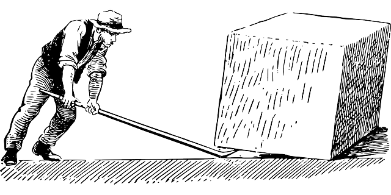
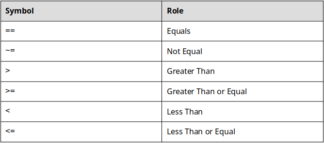
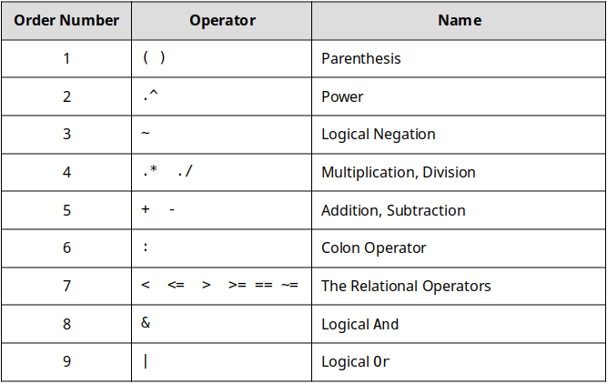
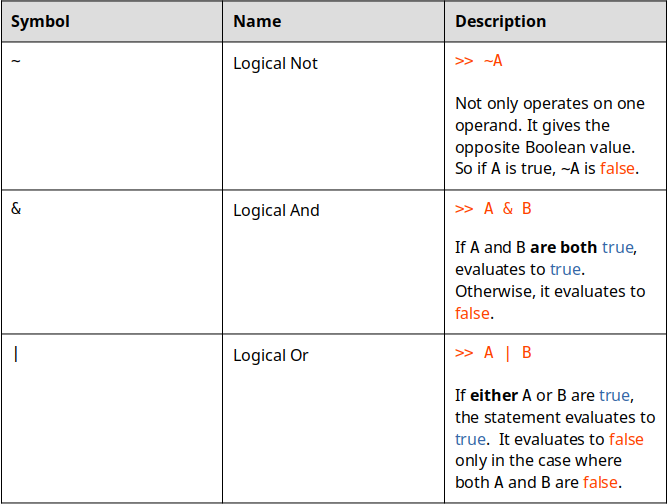

# Chapter 11: Relational and Logical Operators

||
|:---:|
|*Figure 11.1: ""Give me a lever long enough and a fulcrum on which to place it, and I shall move the world." - Archimedes " - Sam Bechara*|

This chapter is a little weird. We are going to learn about relational and logical operators but it will seem out of place because we will not learn how to apply them until next chapter. Eventually, we will use what we learn in this chapter to give our programs the ability to *flow* and *make decisions*. Until then, concentrate on learning how these operators work with my promise that it will make more sense why they are important in coming chapters.

Before we jump in, a quick warning on this chapter. It is *really easy* to skip your brain workouts for this chapter. It is so tempting to type everything into MATLAB to get the answers without thinking. I urge you not to do this! When evaluating relational and logical expressions it is important to understand how they work in order to use them correctly. Be honest, follow along with this text, and be sure to not skip your brain workouts! Without further ado...

||

In this chapter we will learn what the relational and logical operators are and how they work. We will save for *why* we need them until the next chapter. For now, we will learn:

- What the relational and logical operators are and how they work.
- What the order of precedence is and why it matters.
- How to evaluate statements with mathematical, relational, and logical operators.

||

## Relational Operators

Before we can start creating programs that can make decisions we have to learn the framework to have our programs start comparing entities. That is where the relational operators come in. The relational operators look the same as math inequalities and they work in a similar fashion. The difference is, with math you are typically looking to ["solve" the inequality](https://www.mathsisfun.com/algebra/inequality-solving.html), when we use the relational operators, we are simply interested if the operation is **True** or **False**.

For example, consider the following:

\\( 7 + 2 > 8 \\)

Does it evaluate to **True** or **False**? Well since \\( 7 + 2 = 9 \\) and \\( 9 > 8 \\) this particular statement evaluated to **True**! We will learn how this helps our programs make decisions in sections below. For now the important thing is to understand what the relational operators *are* (table 11.1 below) and how they are used in MATLAB.

||
|:---:|
|*Table 11.1: The Relational Operators*|

The relational operators can be used to compare variables, combinations of variables and numbers, or even mathematical operations. The important thing to remember, is that when the operation is completed, either **True** or **False** comes out.

The only ones that might not seem intuitive are == and ~= but again, they are very similar. For example consider the following:

```MATLAB
>> 4 == 4
```

Since 4 does in fact equal 4, the preceding statement equals **True**. Nothing groundbreaking here. Lets consider one more:

```MATLAB
>> 4 ~= 4
```

In table X above you can see that the ~= operator is the not equal operator. In this case 4 does equal 4 so the statement 4 is not equal to 4 is **False**.

## True and False

We saw above that the relational operations evaluate to either **True** or **False**. In computer science **True** and **False** are referred to as [booleans](https://en.wikipedia.org/wiki/Boolean_data_type). That isn't super important to remember for now. Instead, the important thing to learn is that unlike other programming languages, **MATLAB is extremely flexible and allows both True and False to be represented in a number of ways**. 

In MATLAB, the keyword ```true``` can be used or the number ```1``` can be used to represent **True**. Similarly, the keyword ```false``` and the number ```0``` can be used to represent **False**.

||

The best way to understand what I am trying to say is to try it yourself. So fire up MATLAB and let's investigate how the relational operators work. The brain workout park of this is that *you should stop and think about what should happen before you run any of the following commands!* It will be impossible for anyone to know if you skip this step or not but do not skimp on your brain workouts!

To begin, lets define a few variables in the workspace to work with (we will use them in other examples so it is a good idea to keep them around):

```MATLAB
>> tomato = 23;

>> cucumber = -12;

>> salmon = 7 * 8;
```

Next, we can use those variables to investigate how the relational operators work. For example, try executing the following operation in the command window. Before you hit enter, what do you **think** should happen?

```MATLAB
>> tomato + cucumber
```

Hopefully you aren't jumping ahead and are actually taking a moment to think. In any case, you should notice that MATLAB assigns the automatic variable ```ans``` the value of ```1``` which is to say that the operation evaluated as ```true```. That makes sense since ```tomato``` is a variable storing the number ```23``` and ```cucumber``` is storing ```-12```, it is clear that \\( 23 > -12 \\) and we would expect MATLAB to think this is **true**.

We can also *assign the output of a relational operation to a variable*. To see this in action try:

```MATLAB
>> result_1 = salmon < tomato
```

Notice that MATLAB creates a new variable in the workspace called ```result_1``` and that it is storing the number ```0``` which is the same thing as ```false```. That is what we would have expected the following operation to evaluate to.

||

> Question 11.1: Match the relational operations to their result
> For this question, match the relational operation to the correct result. Assume that the following 3 variables are already loaded into the workspace.

## The Order of Precedence

||
|:---:|
|*Figure 11.2: MATLAB operators have to wait for their turn.*|

There is actually one more important way that we can use relational operators, we can use them in combination with mathematical operators. For example, we COULD perform an operation like this.

```MATLAB
>> pie + salmon^2 > tomato * salmon + 2
```

The problem is that we have not discussed [the order of precedence](https://www.mathworks.com/help/matlab/matlab_prog/operator-precedence.html) (link is to MATLAB's description). This is very similar to the mathematical concept of the order of operations. The only difference is that the order of operations does not include the relational or logical operators (we will talk about them later).  Just like the order of operations, the order of precedence lets us know what mathematical, relational, and logical operation steps will happen in what order. MATLAB's order of precedence is presented in table X below. 

You can think about it like the operators are waiting in line to get into a club. The bouncer is going to let everyone in but they don't all get to come in first come first serve. There is a hierarchy, and that hierarchy is listed in table 11.2 below.

||
|:---:|
|*Table 11.2: The MATLAB Order of Precedence*|

You should note that this is slightly different than what MATLAB presents as the order of precedence, I truncated the [official list](https://www.mathworks.com/help/matlab/matlab_prog/operator-precedence.html) down to what we will be using in this book. Let's take another look at that MATLAB statement we started this section with:

```MATLAB
>> pie + salmon^2 > tomato * salmon + 2
```

Now we can see how to apply the order of precedence and evaluate this statement! **The best way to solve these types of statements is to reduce according to the order of precedence and then continue.** For example:

1. There are no parenthesis so we can skip that
2. We need to evaluate the power. Since we have salmon^2 we can evaluate that first. ```salmon = 7*8``` implies that ```salmon^2``` = \\( 56^2 = 3136 \\)
3. Now our statement has reduced to: ```pie + 3136 > tomato * salmon + 2``` Next on the order of precedence is ```.*```. We have one multiplication operation, ```tomato * salmon``` \\( = 23 * 56 = 1288 \\).
4. Now our statement has reduced to: ```pie + 3136  > 1288 + 2``` We now perform the math operations. Recall ```pie = pi*2``` which is \\( ≈ 6.2832 \\). So... ```pie + 3136``` = \\(6.2832 + 3136 = 3142.2832 \\) and ```1288 + 2``` = \\( 1230 \\) 
5. We are almost done. At this point we have: ```3142.2832 > 1230``` Lastly, we have a relational operator, ```>```. We are now ready to evaluate it!

> Question 11.2: True or False
> Continuing with the previous example, what is the result of the relational operation?

Hopefully you nailed Question X above. Let's try one more little brain workout before we move on and discuss the Logical Operators.

> Question 11.3: Match the statement to the question.
> In this question, consider the MATLAB statements on the left and match them to their correct output on the right. Keep in mind the order of precedence! You can also assume that the following variables are loaded into the workspace:

## The Logical Operators

The last thing we need to learn before we can start having our programs make decisions is how to combine multiple relational operators together. Although it is jumping a little ahead, lets consider *why* we need the logical operators.

Consider designing a piece of software that needs to make a decision about a range. For example, I personally ride my bike to work but won't ride if the forecast high is above 35 degrees C or if the forecasted low is below -10 degrees C. If I wanted to make an app that could tell me if I should ride my bike to work or not, I would need a program that could determine if: forecast high is less than 35 C ```AND``` forecast low is greater than -10 C. The AND in the previous statement is formatted in code because it represents where we would have included a ```logical and```.

||
|:---:|
|*Figure 11.3: You know who else is into logic? These old boys.*|

The logical operators give us a way to string together multiple relational statements and get one **true** or **false** out. When looking at the order of precedence you may have noticed the three logical operators, shown in table X below. **Take a minute to look at table X below and read the description of each of the logical operators**.

||
|:---:|
|*Table 11.3: The logical operators*|


You can see that the logical operators ```&``` and ```|``` allow us to string together multiple relational operations! Cool! Consider the following  MATLAB command:

```MATLAB
>> 6 >= 7 & 5 >= 6
```

According to the order or precedence we **evaluate the relational operators first**. That means that the statement reduces to: 

```MATLAB
>> false & true
```

Looking up in table X for the .correct way to use the logical operator, we can see that ```false & true``` evaluates to **false**! 

Logical ```&``` is the type A logical operator. It needs *all* the relational operators to evaluate to true in order to return true. If logical ```&``` was a person they would be kind of uptight but would probably be very successful. Only the truest of the true for logical ```&```!

Logical ```|``` is the cool guy logical operator. If *any* of the relational operators evaluate to true, it calls the whole thing true.  Logical ```|``` probably drives a Volkswagen bus and says "rad" a lot. All logical ```|``` cares about is at least one truth.

In the future, we will see how both ```&``` and ```|``` are critical to create complex programs. Just like yin and yang, we need both ```&``` and ```|``` to make our programs work. Logical ```&``` and logical ```|``` are a little tricky but once you understand the logic, you will be able to make some cool programs.

> Question 11.4: Logical and Relational Operators
> Consider the following bit of MATLAB code:
> 4*4 > 16 | 2 == 2 
> Paying special attention to table X and how the logical operators work, what does the MATLAB code evaluate to?

### A Short Note on Logical Not ```~```

Logical ~ is a little weird because I find it is redundant and unnecessary. Why? If you have a statement like: 

```MATLAB
>> ~(4>5) 
```

We can see that the ```(4>5)``` will evaluate to false. Then ```~false``` is **true**. Ok but why not just put ```4<5```? See what I am getting at? If you just reverse your relational statement, you shouldn't need to flip your Boolean value. There might be a good reason that I have not yet run into for using a logical not. If you run into a good and necessary use of logical not, please email me and let me know (samuel.bechara@colostate.edu)!

## Putting It All Together

Using the order of precedence, you should now be able to evaluate statements with mathematical, relational, and logical operators all in tandem. The trick is to reduce the statement using the order of precedence until you are left with a single Boolean value.

||
|:---:|
|*Figure 11.4: A lovely tandem*|

Lets consider one more example together to tie it all together:

```MATLAB
>> the_answer = 3 == 3 & (~ (42 == 21 * 2 | 65-2 == 65 + 3))
```

||

Before you move on to see my solution, make sure you try to solve it on your own! Remember, use the order of precedence, and reduce the statement until you are left with one Boolean value. You can do it! It is important to not skip your brain workouts!

||

Ok, now that you have your solution, I will show you how **I** would solve this problem:

Since parenthesis are first on the order of precedence, we will start with the inner most set and reduce this chunk first: 

```MATLAB
(42 == 21 * 2 | 65-2 == 65 + 3)
```

According to the order of precedence we will want to perform the multiplication step first. I am also going to show you a shortcut.

```MATLAB
( 42 == 42 | <some other relational operation>)
```

Why did I do the ```21*2``` but skip everything on the right side of the logical ```|```? Remember, logical ```|``` is chill, if either of the statements being compared evaluates to **true**, the whole thing is **true**. Since ```42 == 42``` is **true**, it doesn't matter what ```<some other relational operation>``` evaluates to! Returning back to our original statement we have:

```MATLAB
>> the_answer = 3 == 3 & (~ true)
```

The next step would be to evaluate the parenthesis. In this case ```~true``` is **false** so we reduce to:

```MATLAB
>> the_answer = 3 == 3 & false
```

We are almost done! Here we could take another shortcut even though the ```3 == 3``` is easy. Remember, logical ```&``` is uptight. Since we have a **false** being compared with a logical ```&```, it doesn't matter what ```3 == 3``` evaluates to (hopefully it is obvious to your that ```3 == 3``` is **true**)! The whole thing is going to turn out false!

```MATLAB
>> the_answer = false
```

## Disclaimer

The reality is that you will never have to solve problems like this in the real world. Instead you will be asked to utilize relational and logical operators in tandem to create complicated programs that can react intelligently to different inputs. That is what our programs have lacked so far! The ability to make decisions. Hopefully now you can see how combinations of these operators might allow use to control the flow of our programs in the future.

> Question 11.5: Challenge Problem
> Consider the following MATLAB line of code: 
> challange = yes & yes == yes | no == ~yes 
> Let the following two variables be assigned in the workspace: 
> yes = 1 
> no = 0
> There is a tiny trick, you need to remember that 1 and true are the exact same thing in MATLAB! What is the value stored in the variable challange after the code is run?

## End of Chapter Items

> Personal Reflection - Chapter 11
> This is a completely anonymous submission. The professor will be able to see the responses but the responses will not be attributed to an author. Your participation is required. What do you think about the content of this chapter? It is a little weird right? Do you need some more practice before you understand this material? Do you think you know why relational and logical operators will be important for programming? Do some personal reflection about your learning.

> Request for Feedback - Chapter 11
> This is a completely anonymous submission. The professor will be able to see the responses but the responses will not be attributed to an author. Your participation is required. What did you think of this chapter? Anything stand out as exceptionally good? Anything that you would like to see differently? Any feedback is appreciated.

## Image Citations

Image 1 courtesy of Pixabay, under Pixabay Licence.

Image 2  courtesy of Pxhere, under CC0 public domain.

Image 3 courtesy of Pixabay, under Pixabay Licence.

Image 4 courtesy of Pixabay, under Pixabay Licence.
