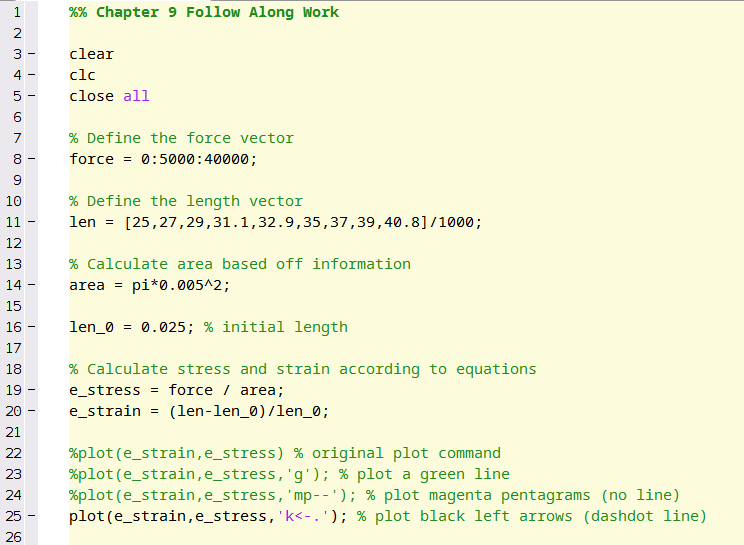
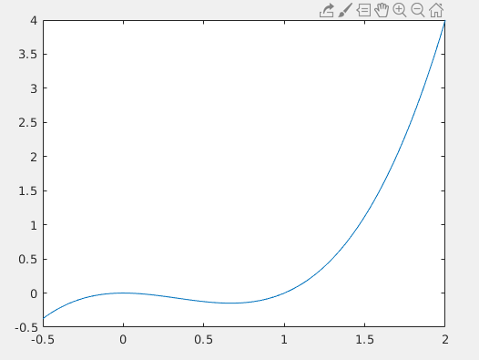

# Chapter 10: MATLAB Plotting

||
|:---:|
|*Figure 10.1: A picture is worth a thousand words!*|

Remember, most cliches are cliches because there is a hint of truth in them. For example, the adage "a picture is worth a thousand words" is persistent because graphs and plots are extremely useful at portraying information in a compact manner. MATLAB has robust plotting and graphing capabilities and can generate plots in very few lines of code. Unlike Excel, there is very little in terms of buttons or menus that you have to navigate. Instead with MATLAB, you need to remember a few lines of code but in the end it is much faster and much more flexible in generating your plots.

As I did in Chapter 8, **I highly recommend that you create a new script** called `chapter10_examples.m` and save it somewhere that you will remember. When you are following along with this chapter, make notes and comments to that script so that you can refer to it later and what you have learned.


In this chapter we will learn how to create good plots in MATLAB. We will remember everything we learned in Chapter 5 and in addition will learn:

- How to use what we have already learned about arrays to streamline making plots in MATLAB.
- How to appropriately label axes, title, and add legends to our plots. 
- What `hold on` and `hold off` mean and when and how to use them.
- How to format our plots with different colors, line styles, and other advanced formatting options.
- Subplots
- Histograms


## Let's Make a Plot!

Remember, the philosophy of this book is that diving in and getting your hands dirty (metaphorically at least) is good for learning! So before we dive into too many details about plotting, lets consider the case of a real engineering application, the tension test. Don't worry, we won't dive into too many of the details as you will learn all this in a later class, just the basics so we do not have to work on a contrived example.

||
|:---:|
|*Figure 10.2: A typical tensile specimen with labels. The black dots indicate what is called the gauge length (\\( L_{0} \\)) and the red lines indicate the direction of the applied force (F).*|


The goal of a tensile test is usually to determine the materials [elastic modulus](https://en.wikipedia.org/wiki/Elastic_modulus).

When the tensile specimen is pulled, the material will deform and the initial \\( L_{0} \\) will increase to a new length \\( L \\). We call this **engineering strain** and it is defined as:

\\[ \epsilon_{e}=\frac{L-L_{0}}{L_{0}} \\]

Note that the units for engineering strain are Length / Length which means it is a unit-less quantity! It is just a ratio of the change in the length to the original length of the specimen.

The force used to deform the specimen divided by the specimens cross sectional area is called the **engineering stress**:

$$\sigma_{e} = {{F}\over{A_0}}$$

> Question 10.1: Review of Units
>
> Remembering what you learned about SI units, what should the SI unit for engineering stress be?
>
> - A. Newton - Meter
> - B. Newton
> - C. Pascal
> - D.	Newton / Meter

You can probably intuit that as the force keeps increasing, the specimen keeps getting pulled further and further apart and eventually it will break. But before it breaks if you let go of the force, the material will return back to its original shape and size. A property of the material (before it breaks) called elastic modulus can be determined by the ratio of the stress and strain:

\\[ E=\frac{\sigma_e}{\epsilon_e} \\]   

Since we determined that the units of stress were Pascals, and strain is unit-less, the units of elastic modulus are also Pascals.

There is a lot more to learn about elastic modulus and tensile testing but this information should give you enough knowledge to start!


Look at the equation for elastic modulus again. Can you figure out why it is useful. Elastic modulus gives the engineer an idea of how much the material resists being deformed. Can you understand that from the equation?


Now that we have that out of the way, lets do a real world example of how to plot in MATLAB!

Lets consider a specimen made of high density polyethylene (HDPE). The specimen has a round cross section with radius 5 mm (this implies that the cross sectional area is \\( 7.854*10^{-5} meters^2 \\), make sure you can calculate this on your own! It is good units practice). Consider the following Force (N) and gauge length (m) data from a tensile test experiment shown below in table 10.1.

||
|:---:|
|*Table 10.1: The results from a tensile test experiment.*|


Enter the values of Force in as a vector `force`, and enter the values for the length in as a vector variable `len` (Don't use the variable name 'length' because that will overwrite the built-in function that we learned about last chapter.) in a new script. Now that we have these in, we need to create vectors called `e_stress` and `e_strain` that correspond to the engineering stress and engineering strain respectively. Can you do this on your own? Try before reading on below! Don't skip your brain workout!


Your script should look very similar to mine shown below in figure 10.3:

||
|:---:|
|*Figure 10.3: What your script should look like, or should at least be VERY similar. I took a shortcut on line 7 and typed in the lengths in mm then converted to meters at the end by dividing by 1000. Sneaky!*|

Now to the plotting! Since we have arrays `e_strain` and `e_stress` already defined in the MATLAB workspace, we simply need to tell MATLAB to plot them! Engineers typically look at stress vs strain plots with strain on the x-axis and stress on the y-axis. To accomplish this in MATLAB, add the following line to your script:

`>> plot(e_strain,e_stress)`

||
|:---:|
|*Figure 10.4: The MATLAB plot of stress vs strain.*|

When you hit the run button, you should see the following figure pop up (see figure 10.4 above). Congratulations! You just plotted in MATLAB! Plotting in MATLAB is really that easy. The line isn't perfectly straight because experimental data is never perfect. But here we can observe that there is a linear relationship between how much strain the specimen is under and how much it deforms! Just for fun, the slope of this line would be the elastic modulus for HDPE.

Now we just need to learn some of the details. For example, the plot in Figure 10.4 looks nice but it is missing labels, titles, and legends which we learned in Chapter X are important to have. For the next section, I will assume that you have vectors `e_stress` and `e_strain` loaded into your workspace so that you can follow along.

## The `plot()` function

As you have just seen, MATLAB has a built-in `plot()` function that can accept a single or multiple vector inputs. In our example the inputs were `e_stress` and `e_strain` but keep in mind they can be *any variable that is a vector* to generate plots.

There are lots of advanced plotting functionalities, to see a comprehensive list of available options, type `>> help plot` at the command line and read the help text for the `plot()` function. **Go ahead and take a second to skim through the help text**. Don't skip this step, it will help setup our discussion for the rest of this chapter. The most important section of the help text is displayed below in Figure 10.5. In this chapter, the three main options of the `plot()` function that we will concentrate on will be:

1. Plot Colors
2. Plot Symbols
3. Plot Lines

||
|:---:|
|*Figure 10.5: Example of plot() help text that is most important for our Chapter.*|

## Plot Colors

The default blue color is nice, but MATLAB includes easy to use commands to change the colors of your graphs. For example, lets say we wanted the same plot that we just completed but we want the line to be green. You should have noticed from the help text that there is an *optional* third input to the `plot()` function that allows us to change the plot colors.

To change the color of your plot to green, simply add the third input to the `plot()` function as a character string (A character string is surrounded in single quotes. So for the color green, the third input to the function needs to be 'g'.)'g'. So you need to change the line in your script from:

`>> plot(e_strain,e_stress);`     *change to*     `>> plot(e_strain,e_stress,'g');`

||
|:---:|
|*Figure 10.6: New green line, and it is so easy and fast!*|

When you re-run your script, you should notice that the line color has changed to green (Figure 10.6)! 


Take a moment to play around with some of the different color options to see what they look like. Note (see the help text or Figure 10.6 above) that some of the color codes are a little weird. For example, to make the line black, you need to use the character string 'k' because 'b' is reserved for blue.


## Plot Symbols

When you are displaying experimental data (as we are in this example), scientists and engineers usually prefer to represent each point of data with a symbol. This visual cue tells the reader of the plot that there is not continuity between the points, instead each point represents a distinct measurement.

So lets change our plot so that MATLAB displays each point as a magenta pentagram. Looking at the help text in Figure 10.6 above we can see that the character string, `'m'` corresponds to the color magenta and that the character string `'p'` corresponds to the pentagram symbol.

So to change our plot so that is showing magenta pentagrams we can change the line of our script from:

`>> plot(e_strain,e_stress);`      *change to*     `>> plot(e_strain,e_stress,'mp');`

||
|:---:|
|*Figure 10.7: Magenta pentagrams.*|

Voila! Our plot is now magenta pentagrams!

Don't forget to take a moment and play around with some of the other symbol options! Notice that there a bunch of different triangle options (triangle down, triangle up, etc). Play around with those symbols and see if you can see the difference!

Another thing to notice is that **the order of the character strings does not matter**. That means that `plot(e_strain,e_stress,'mp')` works the same as `plot(e_strain,e_stress,'pm')`!

## Plot Lines

The last thing that we need to learn is how to change the plot line. Again, direct your attention to the help text for the plot function (and figure 10.7 above). Notice that we can add a character string to create solid, dotted, and other types of lines.

We can do so in the exact same way, by adding a characters to the character string. So for this example, lets say we wanted **black** (remember, that is character string 'k'), **left triangle marks** connected with a **dashdot** line. Just like before we would change the last line of our script:

`>> plot(e_strain,e_stress);`      *change to*     `>> plot(e_strain,e_stress,'k<-.');`

||
|:---:|
|*Figure 10.8: Black left arrows connected by a dashdot line.*|

And that is all there is to it! Remember, the order of the character strings *does not matter*. You should also remember that you **do not have to memorize these character string codes!** Just remember that you can look them up at any time from the command window by typing in `>> help plot`.


> Question 10.2: Have you been paying attention?
>
> Which of the following lines of code would create a plot with each data point being represented by yellow diamonds with no line connecting the data points?
>
> - A. ```plot(e_strain,e_stress,'y''d')```
> - B. ```plot(e_strain,e_stress,'yd')```
> - C. ```plot(e_strain,e_stress,'yellow','diamonds')```
> - D. ```plot(e_strain,e_stress,'diamonds','yellow')```
> - E. ```plot(e_strain,e_stress,'dy','no-line')```


## Example Script File Up To This Point

Hopefully you have been following along. This is what my script looks like up to this point. Notice that I commented out the plot commands I wasn't using (line 22-24 in figure 10.9) because they will overwrite eachother and it is nice to keep a record of what you did for studying later. You should also notice how my comments make my script easy to read!

||
|:---:|
|*Figure 10.9: Example script file up to this point.*|

## Multiple Plots

A lot of the time it is useful to show someone multiple plots. Perhaps you want to compare two materials or show different projections. MATLAB has capabilities to plot multiple plots on the same axes or display multiple plots in the same figure. See figure 10.10 below for an example.

||
|:---:|
|*Figure 10.10: Examples of the different kinds of multiple plotting you can accomplish in MATLAB.*|

You should have also noticed that the plots in Figure 10.10 above have titles, axes labels, and legends (where appropriate). In the next section of this chapter we will learn how to accomplish this. For now, lets concentrate on what we need to learn to either:

1. Create two plots on the same axes.
2. Create multiple plots *in the same figure window*.


Before we jump into learning those two points, you should have noticed that I added tensile testing data on Teflon to the charts. To follow along, you will need to do so as well. Go ahead and add a new array called `len_teflon` to your script with the following values:

`len_teflon = [25 28.2 31.4 34.5 37.8 40.8 44.1 47.3 50.5]/1000;`

We will consider the case where the teflon specimen has the exact same starting dimensions as the HDPE specimen we are using before. We will also test the teflon under the exact same engineering stresses. With that being said, calculate the engineering stress in an array called `e_stress_teflon` and the engineering strain in an array called `e_strain_teflon`. Do not skip ahead to see my solution UNTIL you have tried it yourself!


To calculate the engineering stress and engineering strain in teflon, I added the following 2 lines to my script:

`e_stress_teflon = force / area;`

`e_strain_teflon = (len_teflon-len_0)/len_0;`

## Create Multiple Plots on the Same Axes

Now that we have two sets of data, we can practice plotting them on the same axes. To do so, you just need to pretend you are a cowboy, and that MATLAB is a horse. So we just need to tell MATLAB "to hold on there partner, I want to plot multiple plots on the same axes".

||
|:---:|
|*Figure 10.11: Woah there, partner. Hold on.*|

I wasn't kidding! You really just have to add the line `hold on` to your script! For example, if we wanted to plot the HDPE and teflon tensile test data on the same axes, we can just type in:

`plot(e_strain,e_stress,'mp--');`

`hold on`

`plot(e_strain_teflon,e_stress_teflon,'g*--');`

`[any number of plotting commands can go here]`

`hold off`

The first line plots the HDPE data as we have done before (make sure you know what `'mp--'` does!). The second line (`hold on`) tells MATLAB to wait and plot subsequent plots on the same axes. After you turn `hold on`, MATLAB will put ALL plots on those axes. Therefore, it is a good idea to turn `hold off` when you are done in case you need to plot other things not on the same axes.

Go ahead and try it in your script! Notice how it plots the two plots on the same graph!

## Creating Multiple Plots in the Same Figure Window

In this particular example (tensile test data of HDPE and teflon) it makes most sense to plot the graphs on the same axes. But for the sake of learning, lets go ahead and create a new figure window and create multiple plots in the same figure window. To do so, we will need to use the `subplot()` function.

||
|:---:|
|*Figure 10.12: Example of how to use the subplot() function and what m, n, and p should be.*|

First, take a second and type in `help subplot` into the command window and read the help text. 

The trick with subplot is to follow the following steps *before you start coding*: 

1. Think about how many plots you need. For this thought experiment, lets say we need 6 plots. 
2. Then think about how you want your plots arranged. It really helps to sketch it out on a little piece of paper (kind of like in figure 10.12) to get a good idea. Lets say for this example we want 2 rows and 3 columns of plots. 
3. After you think, you are ready to use the `subplot()` function.

The `subplot(m,n,p)` function divides the figure window into `m`x`n` rectangular plots. The `p` indicates the number of the subplot. The subplots are numbered starting at 1 in the upper left corner and increase in number from left to right. Figure 10.12 is illustrating this. For the plot in the upper left corner, the user would type in:

`subplot(2,3,1)`

`[insert plot command here]`

Then if the user wanted to plot the next one to the left they would just continue...

`subplot(2,3,2)`

`[insert plot command here]`

And so on and so forth.

||
|:---:|
|*Figure 10.13: Example of 6 plots in the same figure using the `subplot()` command.*|


Go ahead and try creating a 2x3 subplot grid with our tensile test data. You can reuse the data, so this IS a contrived example after all! But it is good practice. 

||
|:---:|
|*Figure 10.14: My sketch of how I wanted my subplots to look.*|

I suggest sketching out your plan. Change the colors between each subplot and write them out on paper BEFORE you code to make sure you understand what is going to happen.

It is ok to struggle a little bit here! Don't jump straight to the solution until you try it! Subplots are kind of complicated and not straightforward but you need to practice.


## Subplot Solution

To create the 6 subplots shown in Figure 10.14 above, this is what I added to my script.

||
|:---:|
|*Figure 10.15: Solution to `subplot()`. Try it!*|

## Titles, Labels, and Legends

The plots that we have created so far looked good, but they lack information necessary to make it a *good plot*. Namely, they needs axes labels, titles, and legends. Don't worry! The hardest part of this chapter is done (looking at you SUBPLOT).

**For now, comment out all of the stuff you have about subplots.** We are going to concentrate on the plot with the HDPE and teflon data on the same axes. If you have been following along, you should have something very similar to figure 10.16 below. We are going to *start* at line 34, just below all this stuff.

||
|:---:|
|*Figure 10.16: Example script of where you need to be. You need to have this and be ready to type on line 34.*|

When you hit run on the script above, you should get a figure with magenta pentagrams connected by a dotted line and green stars connected by a dotted line on the same axes. Note that the magenta stars are the HDPE data and the green stars are the teflon data.

## Adding a Title

To add a title to the plot, use the `title()` function. That is it. The title function accepts a character string input. So if we wanted to create a title for the plot called "Tensile Test Data" we would add a new line to our script that looks like:

`title('Tensile Test Data');`

Go ahead and add that line to your script and re-run it. I told you it was easy! Just remember that the input to the `title()` function must be a character string which just means it needs `'` marks surrounding the text.

## Adding Axes Labels

To add axes labels to the plot, we are going to use the `xlabel()` and `ylabel()` functions that coorespond to the x-axis and y-axis respectively. Just like with the `title()` function we need to input character string. Since in this particular plot the x-axis cooresponds to the strain which is unitless and the y-axis cooresponds to stress which has units of Pascals, we just need to add the following two lines of code:

`xlabel('Strain (ratio)');`

`ylabel('Stress (Pa)');`

Add those lines, re-run the script and watch the magic happen!

## Adding a Legend

MATLAB makes creating legends easy, but you **have to remember the order in which you plotted your data**. In this example, we plotted the HDPE data *before* the teflon data. So to add an appropriate legend we would use the `legend()` command, and then supply character string inputs that coorespond to the data. For example:

`legend('HDPE','Teflon');`

Notice that when you add that line to your script and re-run it, you get a nice little legend! Nifty huh? There are some more advanced functionalities to the `legend()` function that won't be discussed in this book. But if you are interested type in `>> help legend` and checkout some of the other features!

||
|:---:|
|*Figure 10.17: Sadly, this legend cannot be created in MATLAB.*|

## The Final Script

If you have been following along, this is what your final script should look like. Keep in mind the subplot stuff is commented out below. If I were you, I wouldn't delete it!

||
|:---:|
|*Figure 10.18: My script up until this point.*|

## Plotting Functions

Once you have mastered plotting in MATLAB plotting functions is actually very easy. For example, lets make a simple plot of \( y = x^3-x^2 \) from \( x = -0.5 \) to \( x = 2 \).

In the previous chapter, there was an example that showed us how to evaluate a function at different values. The key was to first, create an array of \( x \) values, then to mathematically evaluate those \( x \) values with the mathematical function of interest. We will do the same thing here. In your script, type:

`>> x = -0.5:0.01:2;`

`>> y = x.^3 - x.^2;`

*Notes: We choose an increment of 0.01 so that the graph looks "smooth". What we are really doing is creating a non-smooth graph but since the increment is so small, it appears smooth. Also, remember, we need the `.^` because we are performing exponentiation on the \( x \) array.*

Now, lets plot \( x \) versus \( y \). To create this plot in MATLAB, just add the following line to your script:

`>> plot(x,y)`

You should see a graph pop up that looks like figure 10.19. That's all there is to it! 

||
|:---:|
|*Figure 10.19: What your MATLAB plot of x versus y should look like.*|

## End of Chapter Items

> Personal Reflection - Chapter 10
>
> What do you think about the content of this chapter? It is a ton, right? Do you need some more practice before you understand this material? Do some personal reflection about your learning.

> Request for Feedback - Chapter 10
>
> What did you think of this chapter? Anything stand out as exceptionally good? Anything that you would like to see differently? Any feedback is appreciated.

## Image Citations:

Image 1 courtesy of [Pixabay](https://pixabay.com/es/illustrations/dollar-moneda-dinero-us-dollar-726884/), under [pixabay license](https://pixabay.com/es/service/license/).

Image 2 courtesy of [Wikimedia Commons](https://commons.wikimedia.org/wiki/File:Tensile_specimen-round_and_flat.jpg), under License [CC BY-SA 3.0](https://creativecommons.org/licenses/by-sa/3.0/deed.en)

Image 3 courtesy of Samuel Bechara, used with personal permission.

Image 4 courtesy of Samuel Bechara, used with personal permission.

Image 5 courtesy of Samuel Bechara, used with personal permission.

Image 6 courtesy of Samuel Bechara, used with personal permission.

Image 7 courtesy of Samuel Bechara, used with personal permission.

Image 8 courtesy of Samuel Bechara, used with personal permission.

Image 9 courtesy of Samuel Bechara, used with personal permission.

Image 10 courtesy of Samuel Bechara, used with personal permission.

Image 11 courtesy of [Pixabay](https://pixabay.com/es/illustrations/dollar-moneda-dinero-us-dollar-726884/), under [pixabay license](https://pixabay.com/es/service/license/).

Image 12 courtesy of Samuel Bechara, used with personal permission.

Image 13 courtesy of Samuel Bechara, used with personal permission.

Image 14 courtesy of Samuel Bechara, used with personal permission.

Image 15 courtesy of Samuel Bechara, used with personal permission.

Image 16 courtesy of Samuel Bechara, used with personal permission.

Image 17 courtesy of [Pixabay](https://pixabay.com/es/illustrations/dollar-moneda-dinero-us-dollar-726884/), under [pixabay license](https://pixabay.com/es/service/license/).

Image 18 courtesy of Samuel Bechara, used with personal permission.


