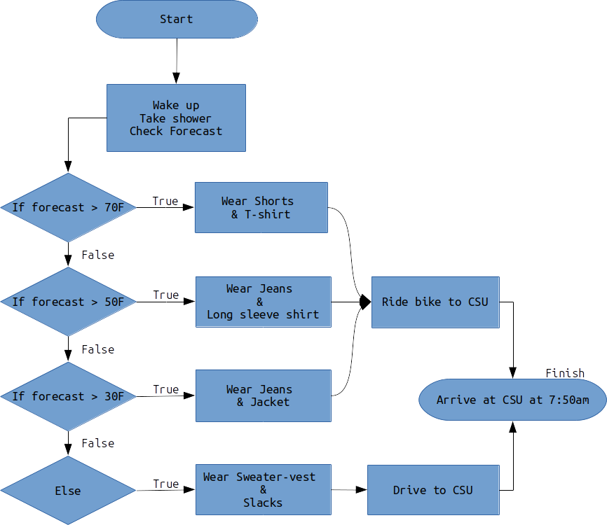

# Chapter 12: Thinking Algorithmically

||
|:---:|
|*Figure 12.1: Think algorithmic thoughts.*|

Professional engineers are well known for their ability to solve complex problems. Throughout the rest of this book, we will continue to learn how to use MATLAB as a tool to solve problems. However, before we jump back into MATLAB syntax and usage, it is important to remember the end goal: **to learn how to solve problems algorithmically.**

In the spirit of learning how to think algorithmically, in this chapter you will be presented with material that will help you start to *think* like a computer. The key to it all is to remember that computers are really, really, really, dumb. 


In this chapter, we will take a break from MATLAB to learn how to think algorithmically. That means we will explore the following:

- How to approach solutions to problems
- What an algorithm is
- Where algorithms arise in everyday life and in engineering contexts
- How to "think algorithmically"
- How to write pseudocode
- How to create flowcharts


## The 8 AM Attendance Problem

Getting to a class that is held early in the morning is a problem that some college freshmen and professors can relate to. Although, we professors typically complain about it much less (*and some of us, myself included, even enjoy early classes!*). Based on the attendance of classes I have taught at 8 AM, it **really is a problem that doesn't have a definite solution yet!** There are a ton of things that you need to do, to solve the problem of attending class at 8 AM. First, you have to start by waking up at a specific time that is often earlier than the time you are accustomed to waking up at. Presumably, your solution to this problem will look similar to my solution. Certain details may be different but you get the idea. 

||
|:---:|
|*Figure 12.2: [PSA - Science says you shouldn't use your phone as an alarm clock!](https://lifehacker.com/why-you-should-stop-using-your-phone-to-wake-up-and-buy-1789840303)*|

## Professor's Solution - Speech

I wake up using a cheap digital alarm clock I have on my bedside table set for 6 AM. It cost me about $4 and as a bonus, I avoid the temptation to check my smartphone before I go to bed. I found that I sleep better that way. I am not really a "snooze" guy, so I just pop up out of bed as soon as the alarm goes off. I take a shower, appreciating the clean, reliable, hot water, being delivered to my wall. If only my ancestors could imagine such luxury, such magnificence! Next, I check the weather on the internet, then put on some weather-appropriate clothing for bike riding. I hop on my bike and ride towards Colorado State University. I am fortunate that my commuting route doubles as a scenic route. It travels through an area of Fort Collins known for its beautiful turn-of-the-century houses and great, big, old, happy, trees. As I pedal through Old Town, I remind myself how lucky I am to live in a city with drivers that are educated on bicycle safety and are respectful to riders. I arrive at CSU, lock my bike, and get to class at 7:50 am.

## What is your solution?

> **Discussion 12.1: Your 8 AM Algorithm**
>
> What are the individual steps you take to solve the problem of attending class and arriving on time for the lectures? It is likely your solution will look similar to mine, but inevitably your routine has some unique distinctions. Do you hit the snooze? How many times? Etc. Feel free to describe as much or as little as you would like but be sure to list it out step-by-step as in the Professor's Solution example.

Congratulations you just wrote out an algorithm! You just authored a list of step-by-step instructions to solve a problem. That is what an algorithm is!

**An algorithm is a set of instructions for solving a problem, step-by-step.**

Millions of algorithms are present in our everyday life, it is just not common for us to acknowledge them as such. When we bake, we follow recipes that are just baking algorithms. That one is obvious but there are many more examples! When you are buying groceries you automatically gravitate towards the checkout line that *appears* as if it will take the least amount of time. Think about how complicated *that* algorithm is. You would likely prefer to be behind two people with three items each than one person with 50 items. Most of the algorithms that humans follow are just outside of our conscious thought so we don't realize that they are there even though our human algorithms govern almost every decision we make and every action we take.

## How to write algorithms people (or computers) can actually follow

Part of learning how to be a professional engineer is learning how to do things efficiently, in a way that is repeatable by others. It is important that if you solve a unique problem, that others don't need to solve it all over again. 

Now, if I wanted to describe to someone my solution to the 8 AM attendance problem, I could write it out as I did above (see Professor's Solution). However, there are some language flourishes that are unnecessary, take up space, and *do not contribute to your understanding of how I arrive at the solution*. If we strip those away, it then becomes clear that there are a lot of details that are missing. For example, if you wanted to copy my solution exactly, you may wonder what types of clothes I wear and when I wear them. Also, you may wonder if I ride my bike to work in all weather conditions. Do I ever drive? Etc.

For your algorithms to be usable by other people, **the algorithm needs to be as specific as possible**. You need to write algorithms down in such a way that a computer (sometimes, but less often, a human) can follow the steps to complete the solution. It is important to write your algorithms so that *nothing is implied*! To make sure I am writing my algorithms appropriately, I pretend that I am writing them for a really, really, dumb person. Even though we say things with computers are "smart" (i.e. smartphones), in reality, computers are shockingly dumb. They are just really *fast* which we can confuse as smart. For now, when crafting algorithms, remember to be as specific as you possibly can.

**It is important to write your algorithms so that nothing is implied!**

Let's break down the Professor's Solution to the problem as an ordered list of instructions that should be followed step-by-step:

## Professor's solution - Algorithm

Below, is the Professor's Solution to the 8 AM attendance problem.

Instructions to ensure success when following the algorithm that solves the 8 AM attendance problem: 

- Steps should be read from the top to bottom (line numbers are displayed in yellow to the left)
- Follow the instructions on each line to their logical conclusion
- Either *continue one line down* OR *follow the instruction on line designating skip location*

||
|:---:|
|*Figure 12.3: Professor's solution to the 8 AM problem.*|

Let's take a look at line 4: `If forecast >= 70 continue, else go to line 7`

Translated from Algorithm-ese into English, that is equivalent to saying: 

**If** the temperature is **forecast** to be **greater than or equal to** 70 degrees F, **continue** to line 8 which tells you to wear a t-shirt and shorts. Or **else** you should consider other clothing options.

Let's say the forecast indicates it will be 61 degrees today. Therefore when I evaluate my algorithm, the statement `If forecast >= 70 continue,` evaluates to false. It isn't true, so I shouldn't follow the instruction. This is where the algorithm following rule **Follow the instructions on each line to their logical conclusion** comes into play. Since it is not true that it is 61 degrees, I should follow the else go to line 7 bit. So I skip to line 7 and am on my merry way.

> **Question 12.1: Follow the Logic**
>
> Let ```forecast = 56```
>
> The algorithm suggests that you wear ______ and ______.

## Bugs

Notice how the steps are written in such a way, **that you can not mess them up if you follow the instructions**. If you start from the top and follow the instructions, you can't both ride the bike AND drive the car at the same time. You will not be instructed to wear both a t-shirt and a long sleeve, etc. You may think the way of writing `go to line 7` is unnecessary because you are smart and can understand that some things are implied. However, it is crucial to ensure that someone following the algorithm does not wear multiple items of clothing if they are dumb.

> *A bug in your algorithm is an erroneous instruction(s) included in your steps that causes your algorithm to behave in a way you didn't anticipate.*

||
|:---:|
|*Figure 12.4: Always check for bugs in your code.*|

Remember, it might be useful to you to think about writing algorithms for a very, very, very dumb person. For example, consider the following Professor's Solution - Algorithm with the following, small, yet critical change (figure 12.5 below). Now, read it and pretend that you are exceptionally dumb and just follow the instructions blindly. Furthermore, let's say that the forecast is 61 degrees F. Before continuing reading the text, look at the picture below and see if you can find the bug.

||
|:---:|
|*Figure 12.5: Can you find the bug?*|

The dumb person MIGHT start at the top of the list, notice that the forecast is NOT greater than or equal to 70, deduce that the tabs imply that you should only follow the instructions if the preceding statement is true, then skip to line 6 (doubtful, but let's say that this particular dumb person is having a good day). When the dumb person gets to line 6, they notice that hey, `If forecast >= 50` is true so they continue and put on a long sleeve shirt and jeans. When they get to line 8, they notice that `If forecast >= 30` is ALSO true! So they put on a jacket and jeans over the long sleeve shirt and jeans they already have on. *That is the bug!* We didn't intend for someone to remember that an algorithm is a step-by-step process that should be written with nothing implied. Wear two pairs of jeans or two tops!

> **Question 12.2: Find the Bug**
>
> For the next question, consider the following algorithm for determining where to go out to eat with a boyfriend or girlfriend. Find the bug in the algorithm. What is the line number that contains the bug?
>
> ||

## Decisions and Loops

Almost always, an algorithm needs to make a decision. We saw that in the 8 am attendance problem solution. The algorithm helped choose clothing based on the variable forecast. As mentioned earlier, computers are fast but really dumb. We can't just ask a computer what we should wear. We need to be specific in the steps it needs to follow to determine what we wear. Whenever we need to have a computer make a **decision**, we use an `if` statement. (e.g. `if forecast >= 60`)

Another thing that computers are really good at is doing boring, repetitive tasks over and over. For example, let's think about a computer program that assigns people to a military draft. Let's say that we need to draft 20,000 men into the armed services. We can write a computer program that randomly assigns all eligible men a draft number, then randomly chooses 20,000 numbers. If a human had to do this, it would take a very long time, but a computer can get this done very quickly! Whenever we need a computer to do a task over and over again (aka: **loop**) we use a `for` statement.

## Decisions - `if` Statements

`if` statements are actually very simple and elegant ways to get computers to make decisions. They work by evaluating some conditional statements. If the statement evaluates to <span style="color:blue">true</span>, you do what follows. Optionally, you can include an **else** to specify what to do if the if statement evaluates to <span style="color:red">false</span>. 

Generically, if statements look like this:

`If condition then do`

`        sequence 1`

`Else do`

`        sequence 2`

For example, consider line 4 in the pseudocode in figure 12.5: 

`If forecast >= 70, continue, else go to line 7.`

The decision is made based on the conditional statement. If the forecast temperature is greater than or equal to 70 degrees you continue, else you go to line 7. That is the decision! Hopefully, you know and understand how this works, and if you do, you are already thinking algorithmically!

> **Question 12.3: Exam studying algorithm**
>
> Consider that a student designs an algorithm that informs them how much they should be studying each school day for an exam. The algorithm makes a decision about how much the student should study based on how far away the exam is. The student "runs" the algorithm once a day in the morning. Consider that the exam is 9 days away. How much time does the student spend studying according to this algorithm?
>
> ||
>
>> - A. 15 minutes
>> - B. 30 minutes
>> - C. 1 hour
>> - D. 2 hours

## Loops - `for` Statements

`for` statements allow us to write down repetitive actions algorithmically. Consider the generic `for` statement to get an idea of how it works:

`for number of iterations`

`        sequence repeats a number of iterations`

The idea of a `for` statement is that you already have an idea of how many iterations need to be performed, then you algorithmically define the sequence that is to be performed beneath it. Let's return to the military drafting example to illustrate this. Consider the algorithm below that assigns all eligible men a draft number, then randomly chooses 20,000 numbers.

||
|:---:|
|*Figure 12.6: for statement example algorithm*|

Looking at figure 12.6 above, hopefully, you can see why it is called a **loop**. Starting at the top, we first assign all eligible men a draft number. Let's say there are 150,000 eligible men, so the next line tells us to set the variable `number_eligible` to 150,000. On line three we have our `for` statement and *enter the loop*. The statement is telling us to start drafting at 1 and continue until 20,000. On line 4 we choose a random number, then on line 5, we draft the person with that number. Now the loop comes into play. Because we are in a `for` loop, we *automatically* increment `draft` by one and continue repeating lines 4 and 5 19,999 more times.

I understand that `for` loops can be tricky. Take some time to think about this section and if you are still confused supplement your reading with the [Wikipedia page on for loops](https://en.wikipedia.org/wiki/For_loop). Don't skip your brain workouts!

## Nested Statements

The last thing we should mention about algorithms is that you can *nest* statements within each other. For example, look at the following algorithm below in figure 12.7.

||
|:---:|
|*Figure 12.7: Example of nesting statements*|

Notice how we *nested* a `for` statement *within* an `if` statement. Nesting is a way to allow your algorithms to only loop if certain conditions are met (`for` within an `if`), or to make certain decisions a number of times (`if` within a `for`).

Again, this can be a confusing concept but once you start to use it in your programming it will make more sense. We will see the concept of nesting pop up in later chapters. For now, just know that it is an option.

## Good Algorithm Checklist

All good algorithms have the following characteristics:

- Remember that an algorithm is a step-by-step process that should be written with *nothing* implied.
- Consider the variables that will be used in the algorithm. For example, in the 8 am the solution, the variable was forecast. Thinking about this ahead of time will make writing computer algorithms in MATLAB easier.
- Check for bugs. To do this it is best to pretend you are *really* dumb (this can actually be difficult to do). Make sure that the algorithm performs exactly the way that you want it to.
- If there are decisions or loops necessary, make sure that they are written out in such a way that they are easy to read and understand. Only use them if necessary.

## Communicating Algorithms

There are probably other ways to communicate algorithms, but for this class, we will only consider two: pseudocode and flowcharts. I highly recommend getting used to both ways of communicating algorithms as they are often most useful when used in conjunction. I have worked at several engineering companies and I can safely affirm that engineers often use both pseudocode and flowcharts in conjunction.

The last thing to note is that there are no *rules* when it comes to pseudocode or flowcharting there are just guidelines. I once had a student that used to draw elaborate pictures for her "flowcharts". Elephants meant something I can't remember, but it was crazy. Her technique worked for her, but it was impossible for anyone else to follow. The guidelines that I will present below are standardized and should be understandable by your professors, tutors, or TAs.

## Pseudocode

Lucky for us we have already seen examples of pseudocode. **Pseudocode (seen in figures 12.3, 12.5, 12.6, 12.7) is just an implementation of an algorithm in plain English**. Writing pseudocode can be helpful because you *think* about how your algorithm will work before you start to worry about programming it. The only real rule for pseudocode is that it needs to describe the logic of the algorithm so that when you go to translate the algorithm into a computer programming language, it is simply a task of changing English to MATLAB.

## Flowcharting

Another common way to write down algorithms is using a flowchart. Before we talk about some general rules for flowcharting, look at the flowchart for the 8 am problem shown below in figure X. I think the best way to learn about how to flowchart, is to look at a flowchart and discover its logic on your own.

||
|:---:|
|*Figure 12.8: Flowchart showing solution to the 8 AM Attendance Problem*

As you can see, flowcharts are nice because they are pictures with arrows which makes it easy to follow along. Just like your pseudocode, in order for flowcharts to be effective, they need to fully describe the logic of the algorithm. Again, that makes copying the algorithm into MATLAB (or whatever programming language) much easier.

There are some generally accepted standards for flowcharting presented below in figure 12.9.

||
|:---:|
|*Figure 12.9: Flowchart standards*|

The only real rule with flowcharts is that they are useful to you. Honestly, I prefer flowcharting to pseudocode but in my professional life, I use both to help organize my thoughts and force me to think algorithmically. Whichever you decide to use is a matter of personal taste, but all good engineers *will use at least one of these techniques*.

> **Discussion 12.2: Algorithms in life**
>
>> This post is not anonymous. The professor and participants can see the responses and the author.

>What is an algorithm you use in everyday life that is unique to yourself? Perhaps you are a gifted gardener and know exactly how to prune apple trees? Are you into repairing cars and know the best procedure to follow to diagnose and replace an alternator? I am willing to bet that there is something that you know how to do that a lot of your classmates would not understand (it doesn't matter how nerdy or weird it is). Think about an algorithm that only you would know (or very few of your classmates), and explain it "algorithmically" as either a flowchart OR pseudo-code. The only requirement is that it should have some decisions to make and should contain no bugs.
My suggestion is to avoid recipes, they are kind of boring and aren't really unique TO YOU. If you decide to do a flowchart, you can upload an image of your flowchart to this discussion for credit.

## End of Chapter Items

> **Personal Reflection - Chapter 12**
>
>> This is a completely anonymous submission. The professor will be able to see the responses but the responses will not be attributed to an author. Your participation is required. 
>
> What do you think about the content of this chapter? It is a ton, right? Do you need some more practice before you understand this material? Do some personal reflection about your learning.

> **Request for Feedback - Chapter 12**
>
>> This is a completely anonymous submission. The professor will be able to see the responses but the responses will not be attributed to an author. Your participation is required. 
>
> What did you think of this chapter? Does anything stand out as exceptionally good? Anything that you would like to see differently? Any feedback is appreciated.

## Image Citations:

Figure 1: [Image](https://cdn.pixabay.com/photo/2018/03/02/03/44/unordered-3192273_960_720.png) courtesy of MMillustrates under [CC0 Creative Commons](https://creativecommons.org/publicdomain/zero/1.0/deed.en).

Figure 2: [Image](https://cdn.pixabay.com/photo/2015/12/14/17/16/morning-1092771_960_720.jpg) courtesy of 1767892 under [CC0 Creative Commons](https://creativecommons.org/publicdomain/zero/1.0/deed.en).

Figure 3: Image courtesy of Samuel Bechara, used with personal permission.

Figure 4: Image courtesy of [Pixabay](https://pixabay.com/es/illustrations/dollar-moneda-dinero-us-dollar-726884/), under [pixabay license](https://pixabay.com/es/service/license/).

Figure 5: Image courtesy of Samuel Bechara, used with personal permission.

Figure 6: Image courtesy of Samuel Bechara, used with personal permission.

Figure 7: Image courtesy of Samuel Bechara, used with personal permission.

Figure 8: Image courtesy of Samuel Bechara, used with personal permission.

Figure 9: Image courtesy of Samuel Bechara, used with personal permission.