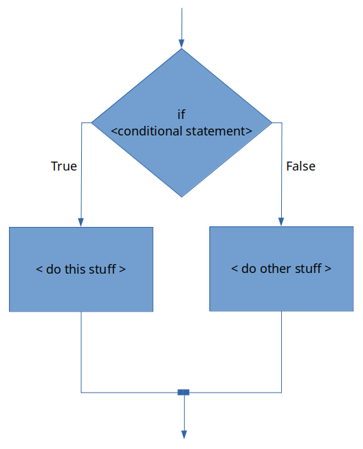
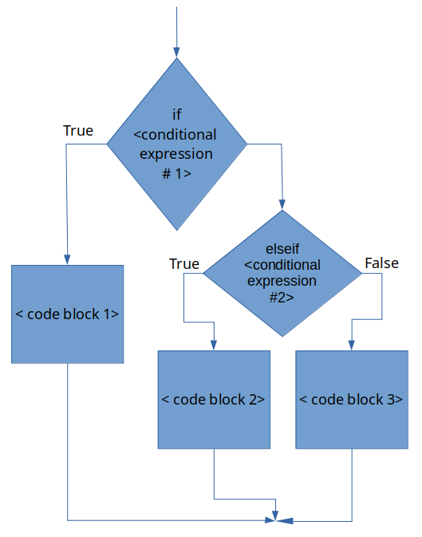

# Chapter 13: MATLAB Decisions

||
|:---:|
|*Figure 13.1: If we want our computers to be "smart" we need to have a way for them to make decisions.*|

So far, the programs we have been writing are great at performing calculations but they are limited and not like software that you are used to using. We are used to software making "decisions" based on information. For example, when it is going to rain, Google Assistant (or Siri, or Alexfontconfiga, or whatever) can send you an alert reminding you to bring an umbrella. When it is going to be sunny, that same assistant might suggest wearing sunblock. The software underpinning those technologies has the capability to make decisions about what it tells you depending on the weather. I am certain that you can think of several other instances of computer programs making decisions.

> **Discussion 13.1: Decisions in Software**
>
> Briefly, share with your classmates a unique way that a computer program makes a decision in some software that you regularly use. You can pick any computer program you like! For example, one of my favorite video games growing up was Mario Kart 64. My sister was WAY better than me at racing but the power-ups that you can collect change depending on what place you are in. Since I was usually in last place, and my sister was usually towards the front, the program made decisions to give me much more powerful items that allowed the race to be competitive! What is your story about computers making decisions?

The reason the scripts we have written so far seem so limited is that we haven't learned a way to control the **flow** of programs or have them make any decisions. Controlling the flow and allowing our programs to make decisions is what we will learn in this chapter. 

Our mantra and guiding process for writing complex programs will be: **think, sketch, code, test, repeat**. We will use what we learned about thinking algorithmically to make sure that we **think** before we do anything. We will **sketch** to ensure that we come up with a robust plan. After coming up with a sketch, we will write our **code**.  Then we will test the code using as many absurd and wide-ranging possibilities as we can think of. Finally, we will **repeat** the entire (or part of) the process until our code works the way we want it to!

||
|:---:|
|*Figure 13.2: Our mantra. Breathe it in. LIVE it.*|

In this chapter, we will learn: how to combine what we learned about thinking algorithmically with MATLAB syntax to make complex computer programs. That means learning:

- How to combine conditional statements with MATLAB `if` structures.
- How to use flowcharts to help understand our code.
- The specific syntax necessary to code `if` and the various derivatives of an `if` statement.

## Quick Note Before We Start

In my opinion, it is critical to follow along with this chapter, even more so than in previous chapters. Even if you have experience in other programming languages, the way that MATLAB handles loops and decisions is different. Make sure that you start MATLAB, create a new script, and follow along! It will help in two ways. First, you will get the experience from working on it today. Furthermore, by saving your script you can create good notes for future reference.

## Conditional Statements

Now we are going to combine everything we have learned about MATLAB to allow our programs to make decisions. The trick is to combine what we learned about the relational and logical operators and thinking algorithmically to create what are called conditional statements.

A [conditional statement](https://www.mathgoodies.com/lessons/vol9/conditional) is an if-then statement (there are a few other flavors that we will learn about shortly, but this is the most simple one). We already saw examples of these types of statements in the thinking algorithmically chapter, but here are a few examples of conditional statements to jog your memory:

- If I skip my brain workouts, then I will not understand the material.
- If I finish my homework on time, then I will receive a high grade on homework.
- If it is raining outside, then I will wear a jacket.

## MATLAB `if-end` Statements
The most basic form of a conditional statement is the `If-End` statement. Generically in MATLAB, an `If-End` statement looks like this:

`>> if < conditional expression is true >`

`>>        < do this stuff >`

`>> end`

Let's break this down:

- The MATLAB conditional statement *must* start with the keyword `if`
- The `if` is followed by a conditional expression. Recall that the `< >` indicate that you need to replace this with actual MATLAB code. A conditional expression is simply an expression with at least one relational operator and any number of logical operators. For example: `x > 12` is a conditional statement. So is `angle > 25 & angle < 100`.
- Next, we have `< do this stuff >`. This is simply the MATLAB code that we want to execute *only if the conditional expression evaluates to true*. MATLAB will automatically tab the text within the decision structure over to make it easy to read.
- Finally, the decision statement *must* be completed with the keyword `end`.

The generic flowchart for this can be found in figure 13.3 below:

||
|:---:|
|*Figure 13.3: A generic if-end statement flowchart.*|

## Example - Hourly Worker Calculation

To see this in action let's create a short script that calculates the weekly wage of an hourly worker. This program can be used to calculate the `pay` based on the number of hours worked and the worker's hourly wage using two variables: `hours_worked` and `hourly_wage`. If the worker works over 40 hours a week, they are compensated at 1.5x their normal hourly rate for *only the hours worked over 40*. For example, if a worker worked 42 hours for $10 an hour, they would get paid $10 per hour for the 40 hours and $15 per hour for the extra 2 hours over 40.

This is a perfect example of using our mantra: **think, sketch, code, test, repeat**! Do not skip your brain workout for these sections. For each of the prompts below, I am expecting you to stop and actually work on this particular problem before moving on.

**Think** - during the **think** phase you need to ask yourself and then answer a bunch of questions. I can't think for you but I can give you an example of my thinking process when solving the problem. Keep in mind that you might have other questions that need answering! That is OK! This is what I came up with as I was thinking.

- Do you understand what the problem is asking?
- What math is necessary to complete this problem? 
- Can you calculate expected answers based on a few different variables? That way you will have numbers to compare your program against to make sure it works. Example: if `hours_worked = 42` and `hourly_wage = 10`, we would expect `pay = 430`.
- How can you have the program calculate the correct value *algorithmically*? Remember, that means you need to write down the process into steps. Start with calculating the `pay` in the situation for under 40 hours a week. Then move on to what would happen at 41 hours a week...
- What conditional statement, if any, is needed?

**Sketch** - during the **sketch** phase, you need to draw a flowchart or write out a pseudocode for your algorithm that will solve this problem. The **sketch** phase will often require several **repeats** of the **think** stage. As you are sketching more questions may pop into your head about how to best solve this problem. Before scrolling down below, take a minute and try to sketch out a flowchart or write out pseudocode for this particular problem. Don't skip out on giving it a try!

||
|:---:|
|*Figure 13.4: **Every time someone scrolls and looks at my flowchart before creating their own, this puppy doesn't get a snuggle!** Don't be a monster! I was going to say the puppy gets hit but that is too dark. Look how cute he is!*|

The flowchart that I created for this particular problem is located below in figure 13.5.

||
|:---:|
|*Figure 13.5: My flowchart for the wage program. Note how there is both descriptive text and rough code.*|

Take a look at the flowchart. Hopefully, it looks very similar to yours. Ask yourself the following questions before moving on.

- Do you understand how the flowchart works?
- Can you follow the logic?
- Why is the calculation beneath the "Calculate Overtime" step multiplying by 0.5 and not 1.5?

Do not move on to the next section until you understand the flowchart above in figure 13.5.

**Code** - Now comes the fun part, translating our **sketch** into **code**! I highly encourage you to try this on your own before you look at my solution below! It is OK if you get stuck and struggle! That is what learning is about. Take a moment to review the generic version of the `if-end` statement (in Chapter 16) so you have a good idea of the MATLAB syntax necessary to complete the problem.

||
|:---:|
|*Figure 13.6: The lemur of judgment is majestically judging those who scroll down before trying to **code** on their own. Don't let the lemur down!*|

Did you try it on your own first? Good! Does your script work? If yes, good work! If not, it is OK! Struggling and practicing *IS* learning!

||
|:---:|
|*Figure 13.7: Example of my script file that calculates the pay. Notice I used sections (%%) to keep things organized and I have nice headers and comments explaining what each section does.*|

When you run the script with these example numbers, `hours_worked = 42` and `hourly_wage=10`, you can see that the value of the `pay = 430`!

**Test** - the testing phase might be the most fun. Just spend some time with the script to double-check that it works. Try substituting different values for variables and verifying by hand that the calculation works. This is an important step and becomes even more important the more complicated your scripts become! Just play around with it and make sure it works the way that you expect.

> **Question 13.1: Test the Script!**
>
> Test the script that we just made. What would the pay be for someone who worked 75.6 hours at an hourly wage of $24.25/hour?

Hopefully, by this point, you understand how the if-end statements are structured and how they are written in MATLAB. The reality is that there has been very little new material in this chapter. We have simply learned how to apply previous concepts to new problems. There are a few other decision structures MATLAB has that we should investigate.

The rest of the MATLAB conditional statements will be explained below and some example code will be provided but the **think, sketch, code, test, repeat** process will not be replicated in this much detail. The good thing is that the other MATLAB conditional statements are very similar and follow almost the exact same syntax.

## MATLAB `if-else-end` Statements

There are instances when writing computer programs where it is beneficial to make decisions that will run one set of instructions if the conditional statement is true, and it will run a different set of instructions if the conditional statement is false. This is called an `if-else-end` statement.

Generically, an `if-else-end` statement looks like this:

`>> if < conditional expression is true >`

`>>        < do this stuff >`

`>> else`

`>>        < do other stuff >`

`>> end`

Breaking this down:

- Notice that it is almost identical to the `if-end` statement with the exception that there is an `else` keyword.
- In this case, we have created two different branches. The `< do this stuff >` runs *only if the conditional statement is true*. Conversely, the `< do other stuff >` will only run if the conditional statement is false. In this case, it is not possible to run both `< do this stuff >` and `< do other stuff >`.

The generic flowchart for an if-else-end statement can be seen in figure 13.8 below.

||
|:---:|
|*Figure 13.8: The generic flowchart for the `if-else-end` statement.*|

You can see that the flowchart for an if-else-end statement is almost identical to an if-end statement, with the exception that an if-else-end statement can have two independent code blocks. Only one of the code blocks will be run depending on if the conditional statement evaluates as true or false.

Another thing to remember is that although our conditional statement was fairly simple in our wage example, conditional statements can be complex! For example, try this problem.

> **Question 13.2: Consider the following...**
>
> Do not just type this into MATLAB. Try it by hand first! That is how you learn. Consider the following script file:
>
> - `x = 10;`
> - `y = x - 4;`
> - `z = 2*x + y;`
>
> - `if x > y & z == 25`
> -    `output = x + y + z;`
> - `else`
> -    `output = x - y - z;`
> - `end`
>
> What is the value in the variable
> `output`
> when the program is finished running?

## MATLAB `if-elseif-else-end` Statements

Previously, we just saw how we can use an if-else-end statement to essentially create two blocks of code that can be run independently depending on the outcome of the conditional statement. There is another MATLAB conditional structure that is even more flexible and actually allows you to have however many independent code blocks you would like. The `if-elseif-else-end` statement allows this.

Generically, the `if-elseif-else-end` statement looks like this:

`>> if < conditional expression #1 is true >`

`>>        < code block 1>`

`>> elseif < conditional expression #2 is true >`

`>>        < code block 2 >`

`>> else`        * technically the else `here` is optional

`>>        < code block 3 >`

`>> end`

As you can see, this is very similar to the statements we have been covering thus far. However, there are a couple of things to note:

- Technically, the `else` is optional in an `if-elseif-else-end` statement. If you look at the flowchart in figure 13.9 below, omitting the final `else` would be equivalent to chopping off the `< code block 3 >` chunk of code.
- In this generic example there is only one `elseif` statement with a corresponding conditional expression. However, MATLAB lets you have *however many `elseif` statements that you need*.
- Note that because of the logic of the statement, you only need 2 conditions to run 3 separate blocks of code. In general, when designing an `if-elseif-else-end` statement that has \( n \) different conditions, you need \( n−1 \) conditional statements.

The generic `if-elseif-else-end` flowchart is shown below in figure 13.9. Again, keep in mind it can have *any number* of `elseif < conditional expression >` lines!

||
|:---:|
|*Figure 13.9: The generic `if-elseif-else-end` statement flowchart.*|

## Student Grades - if-elseif-else-end Example

I think that it is important to clarify the statement "when you have \( n \) different conditions, you need \( n−1 \) conditional statements". To do so, let's consider an example. Let's say that we have a variable `grade` that contains the final numeric grade for a person in a class.  Furthermore, let's say that this hypothetical class does not have + or - grades, instead, the final letter grade is calculated as follows:

||
|:---:|
|*Table 13.1: Student grading scheme example.*|

The problem is to create a MATLAB script that can take the numeric grade as a variable `grade`, determine the letter grade associated with it, and store that in a variable called `letter_grade`.

This may seem contrived because, in this particular example, we will only have 1 grade but in the next chapter, we will learn techniques that will allow us to analyze any number of grades in the same fashion. What we are working on now will be the bones of that future algorithm!

**Think and Sketch** - we can see that we have 4 different categories of grades. That means that \( n=4 \) (the grade can be an A, B, C, or F). Before you continue, can you create the flowchart necessary to complete this script? Take your time. I am hoping that by thinking and sketching it will be obvious why you only need \( n-1 = 3 \) conditional statements. 

If you are feeling like a tough workout today, go ahead and try to program this script on your own. Go you! If your brain is too tired from that it is OK, but don't skip the flowchart part.

I won't threaten you with puppies or lemurs anymore. I will trust that you care about your education and want to learn this material. Handshake?

||
|:---:|
|*Figure 13.10: Our handshake agreement that you are working on the material. I love stock images so much.*|

Here is my flowchart for the problem.

||
|:---:|
|*Figure 13.11: My flowchart for the letter grade problem.*|

Take a moment to compare our flowcharts. 

- Did you start from high to low? That is a common way of doing things and totally fine. Maybe I am just weird? It doesn't matter. 
- Do you notice how my flow chart only has three conditional statements? THAT is what I meant by \( n \) conditions requires \( n-1 \) conditional statements. Here is the logic:
    - `if` you scored less than 70, you get an F
    - `elseif` you scored less than 80, you get a C
    - `elseif` you scored less than 90, you get a B
    - `else`, you get an A. (*You do not need a conditional statement, because if you didn't get an F, C, or B, the only option left is an A!*)

Now is your chance to try and do the code, test, and repeat part of our process on your own to finish the problem! Even if you can't get it working perfectly, take some time and give it your best shot! Make sure you have a pen and paper handy and jot down notes, ideas, and snippets of code as you are working. You got this!

My script solution follows in figure 13.2.

||
|:---:|
|*Figure 13.12: My script solution.*|

## Nested Decisions

When designing your programs you may run into scenarios where it is useful to create nested decisions. Nested decisions describe the scenario of enclosing one decision into another. It may not seem intuitively obvious why this is necessary, but as your computer programs become more complex, it will be an extremely effective and useful strategy to consider.

||
|:---:|
|*Figure 13.13: Nested decisions allow for some neat program capabilities!*|

For example, consider the following flowchart, which describes an algorithm a new mother might use to stop her baby from crying:

||
|:---:|
|*Figure 13.14: Crying baby algorithm.*|

Notice how the "If the baby is wet" condition is *nested* inside of the "If the baby is crying" condition. That is what we mean by nesting! There is no difference in the way that you write the code. You just can put one `if` after the other. The only little trick to nesting is remembering that each `if` needs a corresponding `end`. When you have several nested decisions, it can get confusing which `end` keyword is referring to which `if` keyword. To help organize your code, MATLAB will automatically apply a tab after each `if` statement. That way you can see what "level" you are in.

For example, take a look at the code in figure 13.15 below. Keep in mind **I do not expect you to understand what is happening in this code!** (Spoiler: it is actually non-sensical code because I had to change some things to `if` statements so it didn't include programming concepts you haven't seen yet but that is not the point).

||
|:---:|
|*Figure 13.15: Example of non-sensical code of nesting.*|

You should be able to create a flow chart of this code from figure 13.15 alone. The key is to notice that on line 5, there is a *nested* `if` statement. Furthermore, there is a 2nd level *nested* `if` statement on line 13. The other thing that you should notice is that MATLAB has automatically applied a tab after each if statement.

Go ahead and type in some non-sensical code into MATLAB to see this auto-tab in action. Or you can just copy the code in figure 13.15.

## Smart Indent

If you ever mess up your tabbing, don't worry! Just select all your text, right-click, and select the "Smart Indent" option (see figure 13.16 below). Again, this is something that you should try yourself.

||
|:---:|
|*Figure 13.16: Selecting text, right-clicking, and then selecting "Smart Indent" will fix any indentation problems your code has and will make it easier to read!*|

## End of Chapter Items

> **Personal Reflection - Chapter 13**
>> This is a completely anonymous submission. The professor will be able to see the responses but the responses will not be attributed to an author. Your participation is required. 
>
> What do you think about the content of this chapter? It is a ton, right? Do you need some more practice before you understand this material? Do some personal reflection about your learning.

> **Request for Feedback - Chapter 13**
>> This is a completely anonymous submission. The professor will be able to see the responses but the responses will not be attributed to an author. Your participation is required. 
>
> What did you think of this chapter? Does anything stand out as exceptionally good? Anything that you would like to see differently? Any feedback is appreciated.

## Image Citations:

Image 1 courtesy of courtesy of [Pixabay](https://pixabay.com/es/illustrations/dollar-moneda-dinero-us-dollar-726884/), under [pixabay license](https://pixabay.com/es/service/license/).

Image 2 courtesy of Samuel Bechara, used with personal permission.

Image 3 courtesy of Samuel Bechara, used with personal permission.

Image 4 courtesy of courtesy of [Pixabay](https://pixabay.com/es/illustrations/dollar-moneda-dinero-us-dollar-726884/), under [pixabay license](https://pixabay.com/es/service/license/).

Image 5 courtesy of Samuel Bechara, used with personal permission.

Image 6 courtesy of courtesy of [Pixabay](https://pixabay.com/es/illustrations/dollar-moneda-dinero-us-dollar-726884/), under [pixabay license](https://pixabay.com/es/service/license/).

Image 7 courtesy of Samuel Bechara, used with personal permission.

Image 8 courtesy of Samuel Bechara, used with personal permission.

Image 9 courtesy of courtesy of [Pixabay](https://pixabay.com/es/illustrations/dollar-moneda-dinero-us-dollar-726884/), under [pixabay license](https://pixabay.com/es/service/license/).

Image 10 courtesy of Samuel Bechara, used with personal permission.

Image 11 courtesy of Samuel Bechara, used with personal permission.

Image 12 courtesy of courtesy of [Pixabay](https://pixabay.com/es/illustrations/dollar-moneda-dinero-us-dollar-726884/), under [pixabay license](https://pixabay.com/es/service/license/).

Image 13 courtesy of Samuel Bechara, used with personal permission.

Image 14 courtesy of Samuel Bechara, used with personal permission.

Image 15 courtesy of Samuel Bechara, used with personal permission.