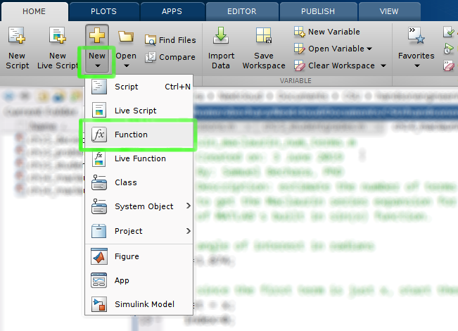

# Chapter 15: User Defined Functions

||
|:----:|
|Figure 15.1: Luckily for us, MATLAB functions aren't THIS complicated.|

Functions are a fundamental part of mathematics and most students are familiar with how they work. In math class you were likely taught that you can think of functions like little machines (figure 15.2) that associate a unique number \(y\), with any given number, \(x\). You may have even learned the terminology that the \(x\) value is the input, and the \(y\) value is the output.

||
|:----:|
|Figure 15.2: The function as a little number manipulation machine|

If you can understand how a mathematical function works, you are actually well on your way to understanding how MATLAB functions work! MATLAB functions work in the same way as mathematical functions. You have one (or more inputs), manipulate the input(s) according to some rules, and then you return one (or more outputs).

## Learning Goals

In this chapter we will learn the how to create our own MATLAB functions and why we should. That means learning:

- What MATLAB functions are and why they are important.
- Reviewing some of the most common MATLAB functions we have already been using.
- Where the help text of a function lives and why it is important to write good help text.

## MATLAB Built-In Functions
As mentioned above, a MATLAB function is very similar to a mathematical function. In fact, you have already been using MATLAB functions throughout this book! I have been careful to distinguish functions from other bits of code by appending a set of parenthesis on the end whenever we are discussing functions (i.e. `sin()`). Lets investigate a few MATLAB built-in functions to understand how functions work:

- `sin()`
- `mean()`
- `max()`

### Try It!

It is worth taking a moment and reading the help text for the 3 functions listed above. To do so, open MATLAB and type in `>> help function_name` into the command window. Obviously you should replace `function_name` with the function of interest (e.g. `>> help max`). You do not need to memorize anything but go ahead and read through the help texts to get an idea for how they work.

### `sin()` Function
The `sin()` function is perhaps the easiest to understand because you are likely already familiar with trigonometric functions. The `sin()` function takes an **input**, angle in radians, and returns an **output**, the ratio of the length of the side of a right triangle that is opposite that angle to the length of the longest side of the triangle.

An example of how to use the `sin()` function would look like (make sure you are trying for yourself in MATLAB!):

```MATLAB
>> x = 2.1; % in radians

>> ratio = sin(x);
```

Notice how the **output** of the `sin()` function is assigned to the `ratio` variable.

Now the real question is, how does MATLAB calculate that ratio? Well MATLAB engineers have created thousands of numerical algorithms stored in **functions** that they supply with the product. This brings us to the central idea behind functions: functions exist to make it easy to run snippets of code with different inputs.

> Key Concept: Functions exist to make it easy to run snippets of code with different inputs.

An example would be the sine trigonometric function. Most engineers and scientists do not want to have to program the algorithm that calculates sine of an angle every time they need to calculate sine. That is too much work! So you can create a function that calculates the sine of an angle, call is something that makes sense (in this case `sin()`), and allow it to work for any input!

### `mean()` Function

Recall that the `mean()` function accepts an array as in **input**, and returns the average value of the values inside the array as the **output**.

An example of how to use the `mean()` function could look like:

```MATLAB
>> array = [9 3 1 3 5];

>> avg = mean(array);
```

When you try this example, you should notice that the value stored in the variable average is 4.8, the mean of the array! Keep in mind that you could  have used a few different functions to calculate the exact same value. Recall: \({average}={sum}/{count}\). Therefore:

```MATLAB
>> avg_long_way = sum(array)/length(array);
```

Again give it a shot. You will notice that the value in `avg` is the same as `avg_long_way` which is unsurprising. However, you can imagine that if you had to constantly type out the long way, it would get tedious. The other thing to consider is that `sum()` and `length()` are functions themselves! Take those away and this problem of calculating a mean gets really complicated.

> Key Concept: Functions make your code easier to read and easier to type.

The key concept here is that functions make your code easier to read and easier to type. So when you have an algorithm that is likely to get run over and over again, it is a good idea to make a function for it!

>Question 15.1: Relational Operator Review

> How would you fill in the blanks below to see if the variable avg is equal to the variable avg_long_way and store the result in a new variable called are_they_equal?

### `max()` Function
Next up, lets consider the built-in function `max()`. This particular function is interesting because of its flexibility. The function accepts an array as an **input** and returns the maximum value in that array as it's **output**. That in itself is cool, but not that exciting (hopefully you read the help text for max() and know where this is going). The exciting part is that `max()` can *optionally* return the index where the maximum value is located within the array!  

To see this in action, let's try an example. We can use the array variable still located in our workspace from the previous example:

```MATLAB
>> biggest = max(array);
```

That will store the number 9 inside the `biggest` variable. Cool, but not exciting. Take an account of your workspace variables. Now try:

```MATLAB
>> [maximum, index] = max(array);
```

Look at your workspace now. Notice that it created two new variables, one called `maximum` that has the number 9 stored in. The execution of that code also created a new variable, `index` with the number 1 stored in it. The 9 is the biggest number in the array, and the 1 is the index of where the number is located.

The first key concept to learn from this example is that MATLAB functions can accept multiple **inputs** and can return any number of **outputs**.

> Key Concept: Functions can accept multiple inputs and can return any number of outputs.

To be specific, when you are creating a function:

- You can *require* any number of **inputs**. For example, you can require your user to specify at least one array, or you can say that a minimum of two arrays is required, etc.
- You can make any number of **inputs** optional. For example, you can have one required, and one optional input.
- The only output that is *not optional* is the first output. **All other outputs from a function are optional**. That means that you can not force your user to accept two outputs from your function. This is an important thing to consider when designing your own functions.

Let's continue with the max() function to investigate our next key concept. If you have been doing your brain workouts, you read through the `max()` help text. See figure 15.3 below, specifically the highlighted region.

||
|:----:|
|Figure 15.3: A portion of the MATLAB help text for max().|

Notice how well this function is described! It shows an example of how to use the function (`[M,I] = max(X)`) and gives a nice description of how it works.

The second key concept is that well written help text is critical to writing a good function. If the documentation for this function was poorly written or confusing, no one would use it!

> Key Concept: Well written help text is critical to writing a good function.

A good function is one that is well documented, not only for your users, but for yourself! Variable names and algorithms always make sense when you are working on them, but when you put them down for a while, you need good documentation to ensure that your code is still usable.

>Question 15.2: The Key Concepts

>Before we continue learning about functions, recall the four key concepts we just learned about MATLAB functions.  
>1) Functions exist to make it easy to run snippets of _______ with different _______.
2) Functions make your code easier to ________ and easier to type.
3) Functions can accept multiple _______ and can return any number of _______.
4) Well written _______ text is critical to writing a good function.

## User Defined Functions

Now that we have seen how MATLAB built-in functions work and what they are used for, it is time to create our own functions. However, before we can begin making our own functions, we need to have a quick review on the current working directory.

### The Importance of the Current Working Directory

Up until this point, you could have gotten away with bad file management. You could store all of your files in the same folder, put them all on your Desktop, it hasn't mattered. However, if you want to use your function files, you are going to have to be cognizant of your current working directory and your path.

As an analogy, think of MATLAB as a mechanics garage and think of functions as different tools. MATLAB comes pre-loaded with a bunch of tools (`sin()`, `length()`, `max()`, etc) and already knows where they are located. When *you* make a new tool called `impact_driver()`, you can store it anywhere. Maybe you are storing the your new `impact_driver()` in the shed out back (your My Documents folder). Maybe you threw it into the lake.  MATLAB has no idea where to look for it. So when you tell MATLAB you want to use your new `impact_driver()` it does the logical thing, it looks where you are standing (your current working directory). So if you tell MATLAB, "I want to use my new `impact_driver()`", and you are standing in your shed, MATLAB will check the shed for the tool. If it can't find it in the shed, MATLAB will check the garage (this is called the path). If it can't find it where you currently are (your current working directory) or the garage (the path) then it gives up. I don't blame it! It isn't a magician.

The moral of the story is that MATLAB will *always look in the current working directory for your user defined functions*.

||
|:----:|
|Figure 15.4: Maybe you throw your new `impact_driver()` into this shed. How is MATLAB supposed to know?|

This is important to remember when you save a function and are trying to run it. If the function is not located in either the path (the garage in our analogy) or the current working directory, it will throw an error.

>Question 15.3: Which files are in the current working directory?

>Look at the screenshot provided, what area lists the files in the current working directory?

## `sphere_vol()` - Your First Function

Before we start creating functions remember our mantra! **Think, sketch, code, test, repeat!** This will help us organize our thoughts and make sure that we are making the function correctly.

Imagine that you are working on a program that requires you to calculate the volume of a sphere several times. Recall: \({volume of sphere}={4}/{3}{pi}{r}^{3}\) so you are constantly writing that formula over and over again.

```MATLAB
>> volume1 = 4/3*pi*2^3;

>> volume2 = 4/3*pi*3^3;

...
```

This is a perfect candidate for a function! We can create a function that automatically calculates the volume and returns it. This will simplify our code! Now it will look like this:

```MATLAB
>> volume1 = sphere_vol(2)

>> volume2 = sphere_vol(3)

...
```

Notice how it is much easier to read and understand. In the lower example it is clear that the input is 2 for `volume1` and 3 for `volume2`. Not only that, but it is easier to type and the user is less likely to have errors.

**Think** - What will the input variables be? Will your user expect your function to work with an array of radii? What about the output variables? What will user expect to get back? The mathematics in this function aren't super complicated but make sure that you understand *how* to program MATLAB to correctly calculate the volume from an array and scalar input.

### How to Create a Function

Now that you understand the importance of the current working directory, navigate to a folder (or better yet create a new folder) to store your new function file. We are going to create a function called `spehere_vol()` that will take radius, `r`, as an **input**, and return the volume, `V` as an **output**.

To start, click the "New" drop down arrow on the "Home" tab of the MATLAB GUI toolbar. Click the "Function" option (see figure 15.5 below).

||
|:----:|
|Figure 15.5: What to click on to create a new function in MATLAB.|

Once click the correct button, a new editor window should pop up that looks like figure 15.6 below. MATLAB creates a template function that we can then modify to fit our needs. The reality is there is no difference between a script file and a function *except that a function must begin with the keyword* `function`.

||
|:----:|
|Figure 15.6: A blank function titled untitled().|

Take a second to look at this template function. Let's breakdown the very first line of code in this template function:

```MATLAB
function [outputArg1, outputArg2] = untitled(inputArg1, inputArg2)
```

- The very first thing to notice is that the function template *is structured in the exact same way as you would use a function*. For example, when we talked about the `max()` function above we did:
`>> [maximum, index] = max(array);`
The only difference is that the function definition starts with the word `function`. Makes it easy to remember!
- Notice how the *very first word on the very first line is* `function`. This must be true for MATLAB to understand this file as a function. You can not put *anything* above that word. Even a comment `%` preceding the word `function` will fool MATLAB.
- After `function` you can see the two **output** variables, `[outputArg1, outputArg2]`. You list your output arguments in square brackets `[]` separated by a comma.
- Next we have an `=` sign. Again, this mimics how you would use a function.
- The function name comes after the `=` sign and precedes the parenthesis. In the default case, the function name is `untitled()`. I will mention this again, but the function name needs to be *exactly the same* as the filename.
- Notice the **input** variables `(inputArg1, inputArg2)` are listed inside `()` and separated by a comma.
- Finally, there is no `;` at the end of a function line! This is a common mistake introductory programmers make.

#### Try It!

Brain workout time. This is a great opportunity to push your mental muscles a bit.

**Sketch** - Remember our goal is to create a function that can calculate the volume of a sphere. Before you start changing things in MATLAB, grab a pen and a piece of paper and write out what you *think* the first line should be. Recall that our function name is going to be `sphere_vol()`. We are going to have an **input** variable that is a scalar radius or array of radii. We will have an **output** variable that is a scalar volume or an array of volumes.

Did you give it your best shot? This is what I came up with.

```MATLAB
function [volume] = sphere_vol(radii)
```

Does yours look similar? Keep in mind that the variables `volume` and `radii` are what I *chose*. They could have been *anything*. You could still be 100% correct if you picked different variable names!

>Question 15.4: What does everything mean?

>From the function definition we deciced `function[volume]=sphere_vol(radii)` match the code with the correct description.

At this point go ahead and edit the function template according to my first line above (or even better, use your own variables) and then save your function. Click the save button in the MATLAB GUI. When the save dialogue box opens up, notice how it automatically fills in the function name in the "File Name" text edit box (figure 15.7 below). DO NOT CHANGE THE FILE NAME! If you change it, your function will not work. Don't forget about the current working directory!

||
|:----:|
|Figure 15.7: Notice how MATLAB automatically makes the function name the file name!|

The last thing to notice is your "Current Folder" browser. Notice the icon looks differently than a script file! It has a little \(f_x\) in the icon instead of the MATLAB logo. This is another little visual indicator when you are browsing your folders that it isn't a script file, but is actually a function file.

||
|:----:|
|Figure 15.8: Notice the icon in the current folder browser is different.|

### Creating Helpful `help` Text

Remember that helpful text that popped up when we typed in `>>help max` into the command window? We need to create that for our functions too. In our **think** and **sketch** phases we have come up with an idea for how this program should work. Now lets create help text so that when someone types in `>>help sphere_vol` into the command window, they get helpful hints for how to use our function.

When someone types in `>>help function_name` MATLAB returns all commented lines `%` below the initial function definition line. In the case of our template function, that is:

```MATLAB
%UNTITLED Summary of this function goes here

%   Detailed explanation goes here
```

You can see this in action! Go ahead and type >>help sphere_vol in the command window. See the text? Well that isn't very helpful. So let's replace it so that it is actually helpful. See figure 15.9 below for how I defined my help text.

||
|:----:|
|Figure 15.9: Our sphere_vol() function up to this point.|

There are a couple of good practices to notice. You can technically put whatever you want for your help text. However, good practices state that you should include:

- The first line should be the function name, followed by a short description of the function.
- The next line(s) should then include a more detailed description of the function. It's purpose, and how it works. In this case our function is pretty straightforward but as you make more functions, they will likely get more complicated and require more descriptions.
- After the description, include a list of all **input** and **output** variables and what they should be.

When you type this help text in, save the file, and then try typing `>>help sphere_vol` into the command window again. Notice how you now get your useful help text! Neat huh?

## The Meat (i.e. Math) of the Function

Now that we have everything defined and sketched out, it is time to program in the functions functionality! To do so let's erase the two `outputArg...` lines that came with the template and program in our function. Make sure not to delete the last line, the `end` keyword! All functions must start with the word `function`, and end with a line that just has `end` on it.

**Code** - Since this is just a simple function, we can accomplish this in one line of code:

```MATLAB
volume = (4/3)*pi*(radii.^3);
```

That is it! Notice that we had to use the `.^` to account for the possibility that our user would input an array of radii. If the user just inputs a scalar value, the function will still work. At this point we have completed the function. It should look similar (if you used your own variable names, those will be slightly different) to figure 15.10 below.

||
|:----:|
|Figure 15.10: Our completed sphere_vol() function!|

## Function Variables vs User Variables

Before I show you how to use your function, it is important to note the distinction between the internal function variables and the variables that your user uses as `inputs` and `outputs`.

> The user can use different variable names than the ones that you internally defined for your function.

This is a very important point and one that I see undergraduate programmers constantly confused about. To show you what I mean, lets use your function in the command window (or you can create a script if you would like).

First, lets define an array of radii (make sure you are following along with this example!):

```MATLAB
>> r = 1:10;
```

Next, lets use our new function `sphere_vol()` to calculate the volumes associated with those radii! Exciting!

```MATLAB
>> v = sphere_vol(r);
```

Remember that our function's internal variables were `radii` and `volume`. *You do not need to use these exact variable names when using your function*. In this case we used the variables `r` for the radii and we stored the volumes in variable `v`. The internal function variables are just placeholders that tell the function how to manipulate the **inputs** and where to store the **outputs**. The names inside the function do not matter to the user.

**Test** - Your function is ready to use! Go ahead and test the function with a bunch of different radii. Can you break the function? Make it throw an error?

**Repeat** - Again, this is a pretty simple function, but when you make more complicated functions it is a good idea to revise your help text or your sketches as you test and find issues.

## Adding a Folder to the Path

>Question 15.5: What is the path?

>Earlier in this book we discussed the importance of the "Current Working Directory". When working with functions, it becomes critical to remember what folder you are currently in, and what folder your functions are stored in. To review, look at the screenshot of the MATLAB GUI provided. What is the current working directory of this user?

If you are the organized type, you can actually add folders to your MATLAB path. Returning to our garage analogy: you can think about it like throwing the `impact_driver()` function into a box, and throwing it in the garage (path).

Adding folders to the path is a good way to increase the usefulness of your functions. Right now, the `sphere_vol()` function we created *will only work if you are currently in the directory that contains the file sphere_vol.m*! If we add the folder that sphere_vol.m is contained in to the path, we can call the `sphere_vol()` function from anywhere.

The idea is that once you create this cool new function, you might want to use it in scripts that are stored in different folders. You can only do this if you add the function file location to MATLAB's path.

To show you how this works, let's create a folder called "Functions" and store it somewhere on your computer that you will remember (MyDocuments? Somewhere else? You decide). Then navigate to the folder that contains this new folder in MATLAB. In the "Current Folder" browser you can then right click on the "Functions" folder, and select the "Add to path >" option. Then select the "Selected Folder and Subfolders" option. Viola! Now any function file inside this particular folder will be accessible regardless of your current working directory. You told MATLAB where to look!

## End of Chapter Items

> Personal Reflection - Chapter 15

> What do you think about the content of this chapter? Do you think it makes sense? Do you see why functions are useful? Are you still confused about it? Do some personal reflection about your learning.

> Request for Feedback - Chapter 15

> What did you think of this chapter? Anything stand out as exceptionally good? Anything that you would like to see differently? Any feedback is appreciated.

## Image Citations

Image 1 courtesy of [Pixabay](https://pixabay.com/illustrations/banner-header-mathematics-formula-982162/), under [pixabay licence](https://pixabay.com/service/license/).

Image 2 courtesy of Samuel Bechara, used with personal permission.

Image 3  courtesy of Samuel Bechara, used with personal permission.

Image 4 courtesy of [Pixabay](https://pixabay.com/photos/shelf-old-stock-container-industry-3190116/), under [pixabay licence](https://pixabay.com/service/license/).

Image 5 courtesy of Samuel Bechara, used with personal permission.

Image 6 courtesy of Samuel Bechara, used with personal permission.

Image 7 courtesy of Samuel Bechara, used with personal permission.

Image 8 courtesy of Samuel Bechara, used with personal permission.

Image 9 courtesy of Samuel Bechara, used with personal permission.

Image 10 courtesy of Samuel Bechara, used with personal permission.
