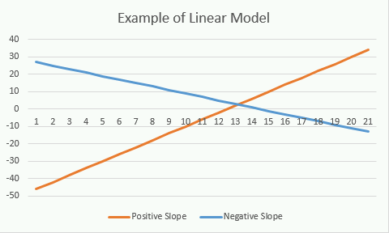
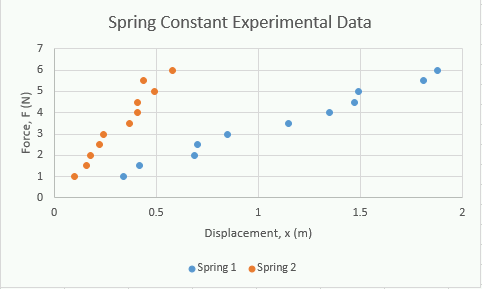

# Chapter 6: Mathematical Models
||
|:----:|
|Figure 6.1: Mathematical models are just math ways of talking about natural phenomena.|

The last thing we will cover about Excel is how to select a trendline type and what that actually means. It would actually be better to phrase that as "how to select the correct mathematical model". **Mathematical modeling** is the process of using math to represent real world phenomena. The reason the second terminology is better is because it correctly expresses the *thinking* that you must do to select a correct model. Before we jump into the different types of mathematical models (and associated trendlines) that you are expected to learn, we need to have a quick word on *thinking*.

## Learning Goals
The emphasis of this chapter will be in thinking. You need to think before you choose a model type. We will also learn how to:

- Explain what a model is and how it is used
- Recognize how to identify a linear, power, or exponential function
- Identify whether an equation represents a linear, power, or exponential model
- Determine the physical meaning and units of parameters of a linear, power, and exponential function.

## Think Twice, Model Once

There is an old-saying in carpentry that you should measure twice and cut once. The idea is that you can't un-cut a piece of wood so you better be sure you are cutting it correctly. While this analogy doesn't perfectly translate to mathematical modeling (you could technically re-run the model), the reality is that once you choose your model and think it is good enough, it is unlikely you will re-scrutinize it.

||
|:----:|
|Figure 6.2: Think twice, model once!|

The danger with mathematical modeling is that sometimes your data may *look* like they fit a certain type of model so you select that trendline type and move on. It is easier that way and uses less brain power. Humans are all lazy, and in fact, our laziness has led to some of our greatest inventions! However, your laziness can get the best of you when it comes to mathematical modeling.

You need to *think* about what you would expect the model would be off of your understanding of the underlying physics before you model it. What I am trying to convey is that you *think*, then choose your trendline type later. **Think twice, model once** will be our trendline selection mantra! Now that we have that out of the way, let's look at the different model types that we will consider: linear, power, and exponential.

## What is a Mathematical Model?
Engineers use mathematical models **all the time** to represent physical phenomena. For example, last chapter we learned about Hooke's Law, {F}={{k}{x}} for springs, that is a mathematical model. You may have also heard about Ohm's Law in physics, {V}={{I}{R}} for circuits, that is also a mathematical model. There is also Pascal's Law for fluid pressure, \Delta{P}=\rho{g}\Delta{H} , Stoke's Law for drag force, {F}_d={6}\pi\mu{R}{v} and the list goes on and on.

The point is that these mathematical models tell us something about the way things actually occur in the real world. Again, returning to Hooke's Law from the previous chapter, we saw that as we increase the force stretching a spring, the spring will stretch *linearly proportional* to the force applied. That means if we double the force, the distance the spring will stretch will double. We can intuitively understand this because we have all played with springs, and we can also see this reflected in the mathematical equation that describes the phenomena.

Almost all mathematical models  will have the following characteristics:

- They will take the form of an equation {y}= something with an {x}, {m}, and {b}.
-- {y} and {x} are variables of interest.
-- {b} is a constant (keep in mind sometimes it is 0 or 1 meaning it might be invisible)
-- {m} is the "slope". This will intuitively make sense to you for linear models but you need to keep in mind that the interpretation for slope with the other models will be slightly different.

### Linear Models
Linear models are straight lines and take on the form of the equation:

 {y}={m}{x}+{b}

||
|:----:|
|Figure 6.3: An example of what linear models look like when plotted|

#### Example of Linear Model - Hooke's Law
Let's look at Hooke's Law again:

 {F}={{k}{x}}

recall that {F} is the force deforming the spring, {x} is the distance it deforms, and {k} is a spring constant which is a characteristic of the spring (meaning it does *not* change). We can trust that this law is true so lets go ahead and determine what the units of {k} should be.

#### Stop & Think

Remember from our units chapter that we can use dimensional analysis to determine the units of {k} since we know that for this equation to be true, the dimensions on each side of the equal sign must be equal. It follows that the units must be equal on each side as well. I'll be honest, I tell you what the units are for {k} below. You will only be cheating yourself if you skip this quick brain workout.

>Question 6.1: Units of k

Hopefully you actually tried this on your own and found that the SI units for {k} are {N}/{m}. If you google search "buying springs" you can see that this specification is always listed for springs that are for sale. It may be in US units ({lbs}/{in}...gross) but you get the idea.

||
|:----:|
|Figure 6.4: Load up the Excel file you saved with this chart.|

Now, lets return to the Excel worksheet we were working on in the previous chapter. When we left off, we had a chart with two series plotted on it (we called them Spring 1 and Spring 2).

We know that these are springs and that they should obey Hooke's Law so we can use the Excel to add a linear trendline which will effectively mathematically model these equations.

#### How to add a Trendline
The process for adding a trendline is identical regardless of the mathematical model being used. Lets see how to add a trendline to our spring data and start with the spring 1 data. The process is also very similar to adding a legend or other chart element so this should be easy for you.

also very similar to adding a legend or other chart element so this should be easy for you.also very similar to adding a legend or other chart element so this should be easy for you.

**Step 0)** Think! What are we mathematically modelling? What type of trendline will we need to use?

**Step 1)** Click on one of the data points for the spring 1 dataset. You can click on any of them within the graph and you should notice that they are all selected. You can tell they are selected because Excel will put little circles around all the data points in the series (figure 6.5)

||
|:----:|
|Figure 6.5: Example of Spring 1 data series being selected.|

**Step 2)** Click on our old friend the "Add Chart Element" menu and select the "Trendline" option.

**Step 3)** In the sub-menu that presents itself, you can choose the type of trendline you want, in this case it is the "Linear" type. Select the "Linear" option and the trendline should automatically be added to the plot!

||
|:----:|
|Figure 6.6: What your chart should look like after you add the linear trendline to the spring 1 dataset.|

**Step 4)** We have the trendline, but we are still missing the mathematical model that represents the line. To get the model, you need to double click on the actual trendline itself. That will bring up the "Format Trendline" options (a menu should pop up similar to the one to the left in figure 6.7). It is here that you can change the trendline type if you need to.

**Step 5)** THINK AGAIN. We know this mathematical model should be linear so we don't need to change that. But should we set the intercept? Does that make sense in this case? Recall: {F}={k}{x} and {y}={m}{x}+{b}.  See what I am getting at here? Notice how in Hooke's Law we are assuming that the before the spring has mass added to it, we are expecting it to stretch 0 meters. Does that sound like an intercept?

||
|:----:|
|Figure 6.7: Format Trendline Options|

**Step 6)** Yes! Check the "Set Intercept" box and make sure that the value is 0. The b = 0 in Hooke's Law so we should set the intercept = 0. Any deviation from that in our mathematical model will be from errors in measurement, it would not be representing an actual physical phenomena!

**Step 7)** Click the "Display Equation on chart" and "Display R-squared value on chart" options. Then close the "Format Trendline" menu.

Now you can see the mathematical equation displayed on the graph! Notice that the equation is {y}=3.1485{x}. The equation is *giving us* {k}, the *spring constant!* In this case, we can say that the spring constant is: {k}\approx{3.1}

>Question 6.2: What about spring 2?

A quick video recap of this process is provided below in video X.

[Video 1: How to add a trendline to an Excel data series](https://www.youtube.com/watch?v=MCWWXoz9SJs&feature=emb_logo)

### Power Model
Power models are swoopy lines and take the form of the equation:

 {y}={b}{x}^{m}

||
|:----:|
|Figure 6.8: Example of two different power models. The blue line has a positive "slope" (m value) and the orange line has a "negative" slope.|

There are a few interesting things to note about power models:

- When {m} is positive, the power model has a value of {0} at {x}={0}
- When {m} is negative, the power model has a value of \infty a {x}={0}

#### Example of a Power Model - Volume of a Sphere

There are many examples of power models in engineering but perhaps the one that you are the most familiar with might be geometric functions.  For example, consider the volume of a sphere.

{V}={4}/{3}\pi{r}^{3}

in this particular example, {V} and {r} are the variables and correspond to the volume and radius of the sphere respectively,  {4}/{3}\pi is the constant, and +{3} (the three in the exponent) is the slope. We can see that if we double the radius, we do not double the volume of the sphere, we increase it by 8 times!

If {r}={1}, {V}={4}/{3}\pi

If {r}={2}, {V}={4}/{3}\pi({2}^{3})={32}/{3}\pi

##### Fun Fact
This is the reason why insects are small and you don't see human sized ants running around. Since insects "breathe" by diffusing oxygen through their shell they do not scale up nicely. [Technically, it is a little more complicated](https://www.nature.com/news/2003/030120/full/news030120-9.html) than just straight diffusion but the fact is, geometry limits their size. If an ant was two times bigger, it would have about 8 times more volume which is much more difficult to diffuse oxygen!

||
|:----:|
|Figure 6.9: Don't worry about him growing to the size of a person anytime soon. Worry about him going extinct.|

Identifying the units on this equation is a lot easier. We know that \pi is a dimensionless number, so the only dimensions are on {V} ({L}^{3}) and on the other {r}^{3} ({L}*{L}*{L}={L}^{3}) which checks out.

Other examples of power models in engineering include but are not limited to:

- Kinetic Energy: {K}{E}={1}/{2}{m}{v}^{2}

- Ideal gas law: {V}={{{n}{R}{T}}\over{P}}

​
### Exponential Model
Exponential models are also swoopy (and hence the reason you need to think to make sure you don't confuse it for a power model!) and take on the form of the equation:

{y}={b}{e}^{{m}{x}}

Keep in mind that the {e} in this equation refers to [the mathematical constant, the base of the natural logarithm](https://en.wikipedia.org/wiki/E_(mathematical_constant)). There are a couple of other interesting things to note about exponential models:

- The value {b} is the value at the start of the exponential growth (or decay).
- The {m} is called the rate of growth.
- When {m} is positive, the model is [asymptotic](https://www.mathsisfun.com/algebra/asymptote.html) to {0} for large negative values of {x}. This scenario is called **exponential growth**.
- Conversely, when {m} is negative, the model is asymptotic to {0} at large positive values of {x}. This scenario is called **exponential decay**.

||
|:----:|
|Figure 6.10: Examples of exponential models. The blue line has a positive m, the orange line has a negative m.|

##### Example of an Exponential Model - Atmospheric Pressure

||
|:----:|
|Figure 6.11: It is hard to breathe up there or so I am told. [But not just because of all the poop.](https://www.cnn.com/2018/08/05/health/mount-everest-biogas-project/index.html)|

The "standard" pressure at sea level is 101,325 Pascals. The reason standard is in quotes is because realistically it varies with weather, temperature, etc. but that is the number scientists commonly use to calculate things. Furthermore, it is known that atmospheric pressure ul if you could provide existing plans of your decreases by about 12% for every 1000 meters that you go up. Intuitively, you can see that this is an example of exponential decay! Furthermore, with a little cleverness, we can create a mathematical model and guess what the pressure should be in Fort Collins, CO (elevation 5003 feet) and on the top of Mount Elbert, the highest peak in Colorado (elevation 14,439 ft. or 4401 meters).

>Question 6.3: Unit practice

Looking at our model:

- We know that {b}={101325} because that is the pressure at sea level in Pa and the {b} is the value of what we are modeling before the decay.
- We know {y} is our pressure in Pascals and {x} is the distance above sea level in meters.
- We know that at {x}={1000}, {y} is {12}\% less than at sea level. We can use this to figure out what m is equal to!

 {12}\% of {101325} is {12159}. That means that {y}({1000})={101325}-{12159}={89166}. This implies that the pressure at {1000} meters is {89166} Pascals. Make sure you can follow this logic!

Plugging in everything we know to solve {m}:

{89166}={101325}{e}^{{1000}{m}}

Solving for {m}:

 {m}=\ln({0.88})/{1000}

Now our mathematical model becomes:

{y}={101325}{e}^{{\ln({0.88})\over{1000}}{x}} and we can use this to calculate the expected atmospheric pressure on the top of Mount Elbert!

#### Atmospheric pressure on the top of Mount Elbert
 {x}={4401}

{y}={101325}{e}^{{\ln({0.88})\over{1000}}{4401}}={57727}{Pa}

You can validate for yourself with a quick google search that this is a pretty accurate model!

>Question 6.4: Atmospheric pressure in Fort Collins

## End of Chapter Items
Personal Reflection - Chapter 5
This is a completely anonymous submission. The professor will be able to see the responses but the responses will not be attributed to an author. Your participation is required.
What do you think about the content of this chapter? This was the last chapter in which we will cover Excel. Did you learn anything new? Do you need to do some more practice? Do some personal reflection.

Request for Feedback - Chapter 5
This is a completely anonymous submission. The professor will be able to see the responses but the responses will not be attributed to an author. Your participation is required.
What did you think of this chapter? Anything stand out as exceptionally good? Anything that you would like to see differently? Any feedback is appreciated.

Image Citations:
Image 1 courtesy of [Pixabay](https://pixabay.com/es/illustrations/tablero-matem%C3%A1ticas-personajes-935455/), under [Pixabay Licence](https://pixabay.com/es/service/license/).

Image 2 courtesy of [Pixabay](https://pixabay.com/es/photos/mango-de-sierra-hoja-de-sierra-1337288/), under [Pixabay Licence](https://pixabay.com/es/service/license/).

Image 3 courtesy of Samuel Bechara, used with personal permission.

Image 4 courtesy of Samuel Bechara, used with personal permission.

Image 5 courtesy of Samuel Bechara, used with personal permission.

Image 6 courtesy of Samuel Bechara, used with personal permission.

Image 7 courtesy of Samuel Bechara, used with personal permission.

Image 8 courtesy of Samuel Bechara, used with personal permission.

Image 9 courtesy of [Pixabay](https://pixabay.com/es/photos/hormiga-macro-insectos-rojo-564617/), under [Pixabay Licence](https://pixabay.com/es/service/license/).

Image 10 courtesy of [Pixabay](https://pixabay.com/es/photos/everest-nepal-himalaya-1199431/), under [pixabay Licence](https://pixabay.com/es/service/license/).
