# Chapter 8: MATLAB Scripting and Arrays
||
|:---:|
|*Figure 8.1: Type, type, type.*|


To start this chapter I would like you to consider a situation where you need to perform the same *calculation* with *different numbers* multiple times. For example, lets pretend that you are preparing for a final exam, and you would like to know how different final exam grades will impact your overall average. You have already taken midterm 1, midterm 2, and midterm 3 so those grades are locked. You recall that to calculate average all you have to do is sum your values and divide the sum by the number of entries. For you math folks, the formula is:

\\[ average=\frac1n\sum_{i=1}^na_i \\]
​	
  

You MATLAB code might look something like this. Feel free to type this into the MATLAB command window yourself, it is good practice).


||

```MATLAB
>> midterm_1 = 86;
>> midterm_2 = 92;
>> midterm_3 = 82;
>> final = 91;
>> average_exam_score = (midterm_1 + midterm_2 + midterm_3 + final) / 4;
```

*Note: there are actually even better and more clever ways of performing this exact same calculation in MATLAB but for now, lets stick with this example.*

||

|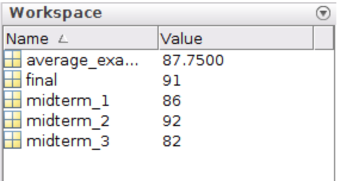|
|:---:|
|*Figure 8.2: Example of workspace variables*|

Viola! You can see that your average exam score would be 87.75. Now let's consider how a 75 on the final would effect the average exam score. We can see that the variables for the var scores are still present in the workspace (Figure 8.2 to the right). All we need to do is overwrite the final exam score so that it is 75, then re-run the average exam score calculation.


```MATLAB
>> final = 75; % This overwrites the value stored in the variable final

>> average_exam_score = (midterm_1 + midterm_2 + midterm_3 + final) / 4;
```

Hint, you can hit the up arrow key on your keyboard to bring up your recent command history to select the previous line of code so you don't need to retype it! This is a valuable tool to remember.


|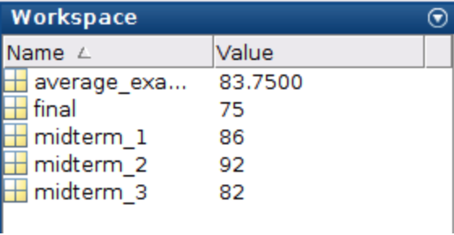|
|:---:|
|*Figure 8.3: Updated workspace variables.*|

At this point you can see that your ```average_exam_score variable``` has been updated to the value of 83.75. If you were following along, the variables in your workspace should look like this (Figure 8.3 to the right).


Here is the problem. If you close MATLAB and reopen it all of those variables are lost (technically you *could* recover them from your command history but that is a hassle). What happens if we want to re-calculate your grade to see what would happen if you get a 95 on the final? You would have to retype all of those lines back in! Clearly, that is not very efficient. The power in MATLAB and most scripting programming languages is that you can make a script that can be changed and re-run with whatever variables you choose. The *script* is just a linear series of commands that MATLAB executes stored in a file with a .m extension.


||
In this chapter we will expand off of the previous chapter to show you the real power of MATLAB. We will learn:

- How to write MATLAB programs (aka: scripts) and how to save them.
- What an array is and why it is so important in MATLAB.
- How to create vectors with equal spacing
- How to create linearly spaced vectors
- How to create matrices
- What the transpose operator is and how to use it
- How to address vectors and matrices
- Two of the built-in functions MATLAB provides for handling and manipulating arrays

||


##Script Files
||
|:---:|
|*Figure 8.4: How to create a script*|

To workout our brain muscles, lets create a script that calculates the average exam grade as in the example presented above. As we have learned, a script file is just a list of MATLAB commands to be executed in a specific order. So in a way, we already have the meat for our first script file. To start a new script, click the "New" button on the "Home" toolbar and then select "Script" (Figure 8.4 to the right, everything that you don't need to worry about it blurred out).

Once you click new script, you should have a new window open titled "Editor" with a little pencil and paper icon in the top left corner. That is where we will write our script file. Go ahead and type in the commands we went over. When you are done, you should have something that looks like figure 8.5. Make sure that you typed all of the commands into the editor window correctly.


|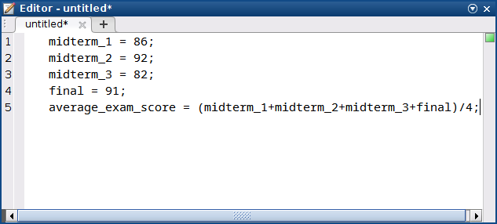|
|:---:|
|*Figure 8.5: What your editor window should look like*|


##Saving Scripts
Remember, the whole point of having scripts is so that we can save them and run them whenever we want and change the variables as we please. Notice that in Figure 8.5 that currently the editor is displaying "untitled*" in the window. This is mentioning to the user that the file currently does not have a neame and the asterisks is indicating that the file is currently not saved. Hold your horses, don't go saving that file yet! We need to make sure we know **where** we are saving it.


>**Question 8.1: What folder am I in?**

>Click on the location that displays the current working directory for MATLAB. This is the >directory that MATLAB currently has access to.

>|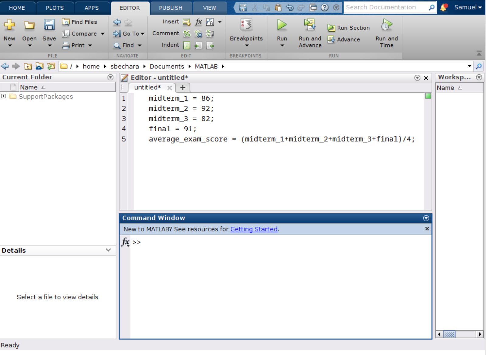|


In Question 8.1 above the current directory being displayed is ```/home/sbechara/Documents/MATLAB```. That seems like an easy place to remember *for me*. **You need to decide where to store your file**. If I were you, I would create a folder in my documents folder called "MATLAB Book Examples" or something like that. Then navigate to that folder in MATLAB (did you forget how? No worries, you can click here to jump to the chapter of the book where that was discussed).

Now that you know where you want to save your file, click the little "Save" icon on the "Editor" tab. Notice that MATLAB automatically appends a ```.m``` to the file as the extension. I saved mine as ```avgExam.m```. You should notice the file show up under the "Current Folder" portion of the workspace and notice that the asterisks is no longer listed next to the name (figure 8.6).


|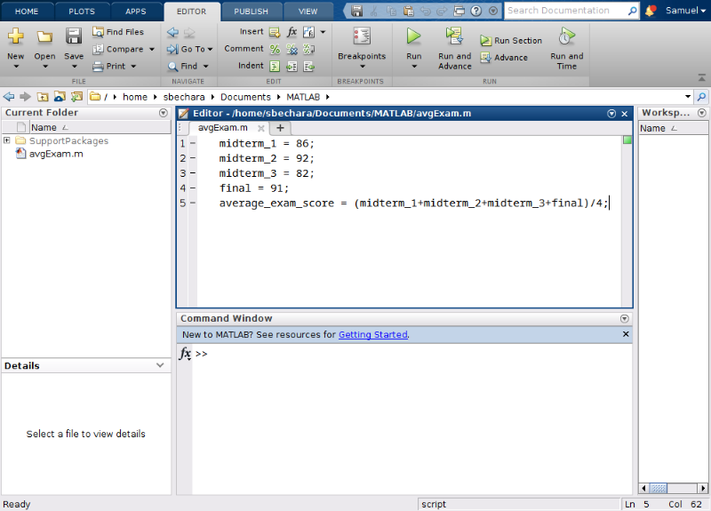|
|:---:|
|*Figure 8.6: Notice that the current folder now has avgExam.m and that the asterisks is no longer next to the filename indicating that the file was successfully saved.*|


##Running Your Script
||
|:----:|
|*Figure 8.7*|

Double check that you have ```avgExam.m``` in your "Current Folder". We are ready to run our first script! There are actually two ways to run the script.  The first way is to click the green "Run" button on the "Editor" banner. Go ahead and click it now! 


|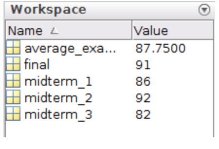|
|:----:|
|*Figure 8.8*|

If you typed everything in correctly, the only thing that you should notice when the program is complete is that you now have several new variables in your workspace corresponding to your variables (specifically the ```midterm_1, midterm_2, midterm_3, final```, and``` average_exam_score``` variables).


>**Question 8.2: What is displayed in the command window?**

>For this question, I am assuming that you named your file the same thing that I did, avgExam.m. With that being the case, what text is displayed in the command window when you click the run button?


The preceding question is actually the *other way* that you can run your ```.m``` files. As long as the current working directory contains a ```.m``` file, you can simply type the name of the ```.m``` file into MATLAB (omitting the .m extension) and it will run the script!


||
Remember, we need to workout your brain muscles to make them stronger and to ensure that you remember how to do this! **Do not skip these steps!**

- Try playing around with the different exam scores, saving, and re-running your script.
- Try navigating to a different folder. Then click the Run button. What does MATLAB do?
- Try clicking "Save As" and changing the file name. Try both methods you learned above to re-run the script.

||


##Script Headers and Commenting
Commenting is a critical component of scripting because it allows us to understand what we did in the past so that we can work with scripts in the future. Do you remember the correct symbol for commenting in MATLAB? (If not you can click here to return to that chapter to review). Hint: ```%```.

It is a good habit to create headers for your MATLAB scripts that contain useful information about your script. It may seem obvious what you are working on now, but open up this script a few weeks, months, or years, in the future and you will have no idea what it is for! That is why headers are so important. You can use comments because MATLAB ignores commented lines of code. I suggest that your script header contains the following information:

- The filename (redundant I know, but it helps in case something gets changed on accident)
- Your name
- The date the script was created
- The date the script was last modified
- A brief description of what the script does

In general, it is a good idea to comment all of your script files so that you can follow your scripts in the future. Script headers plus comments play a huge role in helping future you understand what you were doing with a particular script. Remember, as soon as MATLAB sees % it ignores everything after the % on the same line. That means you can have in-line or whole-line comments. It also turns it a nice green color for the user to have a visual indication that the line is commented out. 


|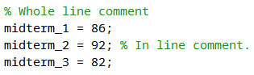|
|:----:|
|*Figure 8.9: Whole line vs in-line comments*|


This is where the *art* of commenting comes into play. How much commenting is too much or too little commenting? There really isn't a hard and fast rule with this. It depends. I suggest that you comment enough so that you understand what is happening in each chunk of code. What is a chunk of code? Again it depends. See figure 8.10 to see my script header and how I would comment the ```avgExam.m``` script we have been working on.


|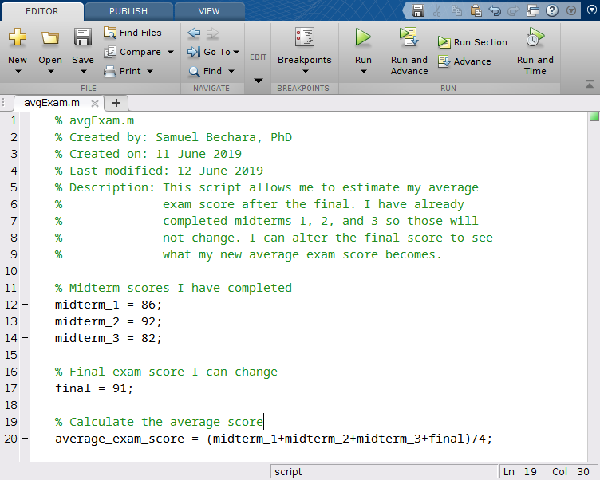|
|:----:|
|*Figure 8.10: You can see my script header and comments.*|


Looking at figure 8.10 above, you can see how the header helps the user see what the script does and how it is intended to work. Keep in mind there is no right or wrong answers when it comes to commenting. Depending on where you work, your company might have specific requirements about how much commenting and what headers should look like. The important thing for now is to make sure that from now on you are commenting your script files and including some form of header so that you can understand what your scripts do in the future.

For now, you can save this script (we will use it in the next Chapter) and close it. The rest of the chapter we will just work out of the command window.


#Arrays - The Fundamental Data Type of MATLAB
As we will see in future chapters, our script can be further improved using arrays, the fundamental data type in MATLAB. An array is a list of numbers arranged in rows and/or columns. In practice, **one dimensional arrays are called vectors** and has numbers stored in either a row or a column. **Two dimensional arrays are called matrices** and are collections of numbers stored in both rows and columns.


|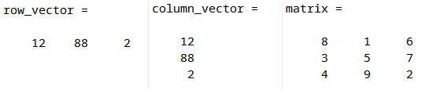|
|:----:|
|*Figure 8.11: Examples of different kinds of arrays.*|


##Creating Vectors
To create a **row vector** in MATLAB, you use square brackets and input your data in the brackets using either spaces or commas: 

```MATLAB

row_vector = [vector elements go here] OR row_vector = [vector,elements,go,here]

```

Try typing the following line into the *command window*. Instead of spaces, you can put commas between the numbers if you prefer. I recommend trying it both ways for your brain workout. Do not copy and paste! typing it out will help with remembering: 

```MATLAB

>>final = [88 89 90 91 92 93 94 95 96 97 98 99]

```

When you hit enter, you should see MATLAB displays the row vector to you in the command window. Now we have a row vector that corresponds to a bunch of different scores to the final. This can be useful because it allows us to calculate a whole array of different averages based on the different exam scores! We will learn how to do that in the next chapter. For now, concentrate on learning the basics of arrays.

To create a **column vector** in MATLAB, you use square brackets just like before except you hit ENTER or use semi-colons between each data element:

```MATLAB
column_vector = [vector;elements;go;here]

```

Try typing the following line into the command window. Like before, try hitting ENTER after each element instead for your brain workout):

```MATLAB

>> final = [88;89;90;91;92;93;94;95;96;97;98;99]

```


>**Question 8.3: Making vectors**

>Which of the following will create a row vector named row_boi containing the values 65 12 1 and 5? (Note: the numbers do not necessarily need to be in that order...)

>A: row_vector = ​[65 12 1 5]
B: row_boi = ​[1,5,12,65]
C: row_vector = ​[1;5;12;65]
D: row_boi = ​[65;12;1;5]
E: row_boi = ]65,12,1,5]


##Creating Vectors with Constant Spacing
When you were typing out ```final = [88 89 90 91 92 93 94 95 96 97 98 99]``` you may have found that tedious. It was! Whenever you find yourself doing something tedious there is a good chance that there is a better way to do it. MATLAB programming should never be tedious like that, it was designed for speed. Notice for the variable ```final``` as we defined it, the spacing is equal to 1 between each element.

To create vectors with constant spacing we can use the colon operator, : as follows:

```
constant_spaced_variable = [start:spacing:end]
```

In this case ```start``` is referring to the first term in the series, `spacing` is indicating how far apart you want your numbers to be, and `end` indicates the last number in the series.


||
Try typing the following into the command window to see how it works:

```MATLAB
>> final = [88:1:99]
```
||


I am sure you will agree that is a lot better! Brain workout time, try messing around with different numbers to see how MATLAB reacts. Try creating different equally spaced variables and name them different things. Spend a moment to see how they show up in the workspace.


>**Question 8.4: True or False?**

>True or False. Typing in variable = ​[2:2:11] will throw an error because you are starting at the number 2, spacing by an even number 2, and asking MATLAB to complete the array on the number 11 which is not even.

>A: True
B: False


One last note when using the `:` operator. If you want to create an equally spaced array with spacing equal to 1, you can omit the `spacing` because MATLAB will default to 1. This can save you a little time.

For example) `>> final = [88:99]` will create an array from 88 to 99 spaced by 1 automatically.


>**Question 8.5: Negative spaced arrays?**

>Which of the following commands will create a negatively spaced array called backwards_boi that contains the numbers 99 through 88 in decreasing order?

>A: backwards_boi = ​[99:-1:88]
B: backwards_boi = ​[88:-1:99]
C: backwards_boi = ​[99:1:88]
D: backwards_boi = ​[88:1:99]


##Creating a Vector with Linear Spacing
Sometimes it is useful to create arrays that contain a *specific number* of values between two points. In these cases, it might be difficult to use the `:` operator. For example, we might need 12 equally spaced points between 2 and 4. You can do the math to figure out how to use the `:` operator but since that sounds tedious, you can bet there is a built-in MATLAB function to make our lives easier.

The `linspace()` function will do this for us. We can create these types of variables using `linspace()` as follows:

```MATLAB
linear_spaced_variable = linspace(first,last,num)
```

This will create a variable called `linear_spaced_variable` starting at the number `first`, to the number `last`, with `num` number of elements. There are a few important things to note. Although we are creating an array, we do not use the square brackets. That is because `linspace` is a function and functions are called using parenthesis. We will learn more about this in future chapters, but for now just be careful about the parenthesis.

Lets try it with our example above by typing the following into the command window:

```MATLAB
>> linear_boi = linspace(2,4,12)
```

Notice how the array is equally spaced and that there are exactly 12 elements in the array. Brain workout time. Play around with ```linspace``` on your own. Try different combinations of numbers and variable names. Notice how they appear in the workspace. **DO NOT SKIP YOUR WORKOUT!***


##Creating Matrices
Recall that a matrix has numbers in both row and columns. They are used extensively in science and engineering and are useful for storing numbers in table like formats or for other linear algebra techniques that you will learn in future classes.

The terminology we will use in the this class is to describe matrices by the number of rows and columns they have. Furthermore, you can have either square or non-square matrices depending on the number of rows and columns. Consider the following two matrices:


|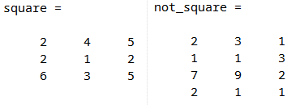|
|:----:|
|*Figure 8.12: Example matrices*|


In figure 8.12 above, we can see that the matrix `square` has 3 rows and 3 columns. To make it easy to write, it is common to say that this is a 3x3 (pronounced "three by three") matrix. Square matrices have the same number or rows and columns. It follows that since `not_square` has 4 rows and 3 columns that it is not square. We would say this is a 4x3 matrix (pronounced "four by three").

Creating matrices in MATLAB is as easy as combining what we have learned about creating row and column matrices above. To create a matrix you type:

```MATLAB
matrix_name = [1st row elements; 2nd row elements; ... ; Last row elements]
```


||
Lets try making our own matrix by typing the following into the command window:

```
>> neo = [1 2 3; 4 5 6; 7 8 9]
```

||


Notice that this creates a 3x3 matrix called `neo`s. Brain workout time.He had a 64.99 which rounds to 65 according to my course policy. I also state that a 66 

The only difference between matrices and vectors is that *all the rows must have the exact same number of elements*. For example, you can't have row 2 have 3 elements, while row 3 has 4 elements.


>**Question 8.6: MATLAB Error**

>What is the error that is displayed if you try to type in a matrix where the number of elements in each row is not the same?

>A: The number of elements in each row is not equal.
B: Dimensions of arrays being concatenated are not consistent.
C: The dimensions requested are not available.


##Creating Arrays of all 0's or all 1's
Sometimes it is useful to create vectors or matrices with all zeros or all ones in their spots. You *could create* a 4x4 matrix with all ones by typing this:

```MATLAB
>> tedious_ones = [1 1 1 1; 1 1 1 1; 1 1 1 1; 1 1 1 1]
```

You can imagine that creating a 4x4 matrix with all 0's would be equally as annoying. But as we have learned, if something sounds tedious, there is a better way to do it. MATLAB has built-in functions that will do this automatically for us.

To create an array of all 1's you use the MATLAB function `ones()` as follows:

```MATLAB
all_ones = ones(rows,columns)
```

Similarly, to create an array of all 0's you use the MATLAB function (you guessed it) `zeros()` as follows:

```MATALB
all_zeros = zeros(rows,columns)
```

In both cases, you only specify the dimensions of the output array. For example, if you want a variable named `skinny_boi` to be a 5 element column vector with all ones you would type in:

```MATLAB
>> skinny_boi = ones(5,1)
```

As always, do your brain workout. Play around with both the ones and zeros commands to make sure that you can create row vectors, column vectors, and matrices using the commands. As usual, store them in different variable names and notice how they appear in the workspace.

>**Question 8.7: What is the variable?**

>Given the following three MATLAB commands:
```MATLAB
>> thomas = ones(9,1)
>> BANANA = ones(1,9)
>> rhino = ones(9,9)
```

>Which variable will be a row vector of all ones?
A: thomas
B: rhino
C: BANANA


##The Transpose Operator `'`
Remember, that if I want a row vector variable called rex containing the elements 2,4,6,8,10 I can simply type in ``>>rex = [2:2:10]``. But what happens if I want a column vector that contains those elements? Tedious alert! That means there is a shortcut. In this case, we are talking about the transpose operator '.

**The transpose operator will switch the row to columns of any type of an array**. That means if you apply the transpose operator to a column vector, it will turn into a row vector. If you apply the transpose operator to a matrix, it will switch the rows with the columns.

If you ran the ```>>rex = [2:2:10]``` line of code above in the MATLAB command window you can create a new column vector named `tex` by typing in ```>> tex = rex'```.

>**Question 8.8: Transpose neo**
>Given the image of the user's workspace, consider command trinity = neo' to be entered into the command window. What would the trinity variable look like in the workspace after typing in that command?

>|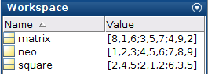|
A: trinity = ​[1,4,7;2,5,8;3,6,9]
B: trinity = ​[1,2,3;4,5,6;7,8,9]
C: trinity = ​[7,8,9;4,5,6;1,2,3]
D: trinity = ​[9,8,7;6,5,4;3,2,1]


##Array Addressing
You might already be able to see why arrays are powerful tools to utilize in MATLAB. For example, we could have arrays that correspond to the position or a moving object with respect to time. Lets pretend that we have the following position and time data. Go ahead and define the following variables in your workspace by typing them into the command window.

```MATLAB
>> time = [0:5:20] % time in seconds

>> position = [0, 4, 8, 12, 30] % position in meters
```

You might recall from physics that we can calculate the average velocity between two points in time using this data. We can see that the object starts at time 0 at position 0. It then moves in the positive direction 4 units in 5 time units. We could calculate the average velocity of the object for any time period by:

 \\[ avgVelocity=\frac{x_2-x_1}{t_2-t_1}​ \\]	
 
​	
  

where \\( x_2 \\) and \\( x_1 \\) correspond to positions and \\( t_2 \\) and \\( t_1 \\) correspond to times.

Since we have already created the arrays `time` and `position` in MATLAB we can use array addressing to pull out individual numbers within the array.


##Vector Addressing


|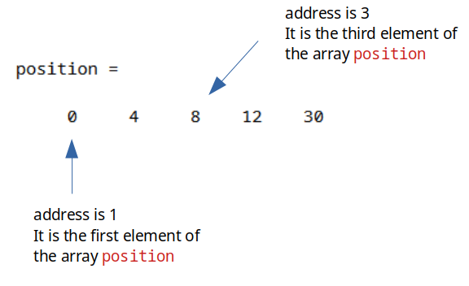|
|:----:|
|*Figure 8.13: Example of our position array.*|

In this example, our array `position` has 5 elements in it corresponding to the numbers 0, 4, 8, 12, and 30. In this example, the number 8 has an address of 3. It is the third element in the array position. To access this number, we can call the array position and specify that we want the third element out of it.

Try typing this into the command window:

```MATLAB
>> position(3)
```

You should notice that MATLAB stores the number 8 into the `ans` variable. We have accessed the number 8 from the `position` array! It may not be obvious now (some of you may be asking, why not just type in the number 8?) but believe me when I say this is a fundamental skill to have in MATLAB and is critical to your future success!

See if you can guess what the output of the following command will be, before typing it in:

```MATLAB
>> anyone_home = position(4) + 4
```

What happens when you type that in? You create a new variable called `anyone_home` and it stores the number 16 in it. Why 16? Because `position(4)` accesses the 4th element in the array position!

Lets go back to our position and time arrays and calculate the average velocity of the object between times 15 and 20.


>**Question 8.9: Velocity**

>Which of the following lines of code would correctly calculate the velocity of our object from the time 15 to time 20? Hint: the answer should be 3.6

>A: vel = (position(4)-position(5))/(time(5)-time(4))
B: vel = (position(5)-position(4))/(time(4)-time(5))
C: vel = (position(5)-position(4))/(time(5)-time(4))
D: vel = (position(4)-position(5))/(time(4)-time(5))


As you can see, addressing values inside of vectors is as easy as typing in the vector name, followed by parenthesis, and then typing in the number that corresponds to it's position!


||
Brain workout time. Try creating different size row and column vectors with random numbers and use array addressing to make sure that you understand how to pull out the correct values. Array addressing on row and column vectors works the exact same way. The addresses start at 1 and go from there.

||


##Matrix Addressing
Matrix addressing works the same way as vector addressing, the only difference is that with matrices we need to specify *both the row and the column* of the value of interest. Take a look at figure 8.14 for an example.


|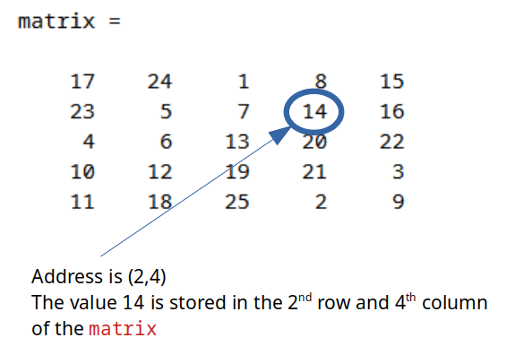|
|:---:|
|*Figure 8.14: Example of addressing the number 14 in the matrix **matrix**.*|


Go ahead and enter the matrix in figure 8.14 into your workspace. It is good practice to remember how to enter in all of the values. When you are done double check that your matrix is the same as mine. 

Now that you have done that, lets try accessing the value 18. We can see that it is in the 5th row and the 2nd column of matrix. That means, to get the number 18 our we can type in:

```MATLAB
>> matrix(5,2)
```

And now you know array addressing for both matrices and vectors! The main trick to remember is that when we are talking about array addressing (and honestly pretty much everything dealing with a matrix in MATLAB) it always goes **ROWS then COLUMNS**.


||
You know the drill. Brain workout time. I suggest that you make a random 4x5 matrix on a sheet of paper. Make sure that you can successfully type that matrix into MATLAB. Next, use array addressing to make sure that you can pull out numbers successfully. The nice thing about not using a square matrix is, it will show you if you really understand the row/column law of MATLAB.
||


>**Question 8.10: Matrix addressing practice**

>Given that you have the correct matrix variable stored in your workspace, what is the answer to matrix(2,2) + matrix(4,1) - matrix(1,1)?

>A: -2
B: -4
C: 17
D: 10


##Quick Recap on Arrays
Up to this point, you should be able to do the following with arrays:

- Create row vectors.
- Create column vectors.
- Create equally spaced arrays using the : operator.
- Create linearly spaced arrays using the linspace() function.
- Create matrices.
- Create arrays using all 1's and all 0's using the ones() and zeros() functions.
- How to use the transpose operator '.
- How to address arrays and access the values they contain.

Whew! That is a ton. Good work!

We have one more topic to go over but you have been working out your brain hard and your brain muscles are probably sore. You could use a one minute break. Here is a video of a Bernese mountain puppy barking at a lemon.


[Video 1: Totally unrelated but you need a break now and then!](https://www.youtube.com/watch?v=JFIpCSmLVhs&feature=emb_logo)


OK, that was cute. Brain muscles relaxes? Ready for one last set of our brain workout? Good, there is one last topic for this chapter...


#Advanced Array Addressing with the `:` Operator
You can couple what we have learned about the `:` operator with addressing for arrays to do some really cool stuff. **The key thing to remember is that the `:` operator defaults to a spacing of 1!** That means **you can use the `:` operator to address a range of elements in a vector or a matrix.**


##Using `:` with vectors
As mentioned above, we can use the : operator to address a range of elements from a vector. The most general use case is as follows:

```MATLAB
range_from_vector = vector_name(m:n)
```

This would take out the \\( m^{th} \\) through the \\(n^{th} \\) elements of vector `vector_name` and store them in a new vector called `range_from_vector`. It's that easy!

For this example, lets add a random vector `v_man` to our workspace as follows:

```MATLAB
>> v_man = [22 61 45 51 68 98 11 90 17]
```
We can use the : operator to address different ranges of elements from the vector v_man. Lets say for this application we want to create a new variable called two_to_five and we want to store the 2nd through the 5th elements of vector v_man.
```MATLAB
>> two_to_five = v_man(2:5)
```
That will accomplish our goal!

Before you try that on your computer, do you know what those elements values should be? Take a second to write them down before trying to make sure you understand array addressing!

##Using `:` with Matrices
Because matrices have two dimensions, there are many more ways that we can use the `:` operator to address ranges of elements within a matrix. However, the logic is the exact same as with vector addressing. Again, **the key is to remember the row/column law of MATLAB.**


Hopefully you still have some matrices stored in your workspace. Before you continue, see if you can guess how to use the `:`s operator on matrices to pull out a range of values. Can you figure out at least a couple of ways to make it work?

If you couldn't figure any out, *that is OK!* The fact that you tried is all that matters.

||

Here are some of the ways that you can address a range of elements within a matrix. For this example, lets consider the general case of a matrix `A`. It can have any number of rows and columns. 

- Refer to the elements in *all rows* of *column n* of the matrix `A`.
`A(:,n)`
- Refer to the elements in *all columns* of *row m* of the matrix `A`.
`A(m,:)`
- Refer to the elements in *all the rows* between *columns m and n* of the matrix `A`.
`A(:,m:n)`
Refer to the elements in *all the columns* between *rows m* and *n* of the matrix `A`.
`A(m:n,:)`
Refer to the elements in *rows m through n* and columns *y through z* of the matrix `A`.
`A(m:n,y:z)`

For your brain workout for this section, try everyone of the bullet points above on one of the matrices we have previously defined to make sure you understand how this works!


##Housekeeping
The last thing I would like to mention about scripts is that it is a good idea to include what I call "housekeeping" lines of code at the **top** of your script. Most of my scripts start with `clear` and `clc`. For example, look at a script that we will work on in Chapter 13 below in figure 8.15.


|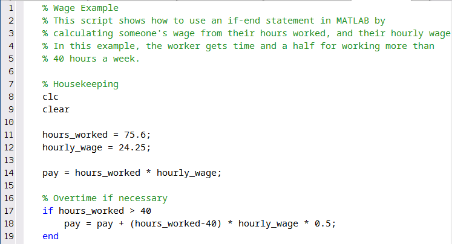|
|:------:|
|*Figure 8.15: An example script.*|


Don't worry about what this script does (yet). Instead notice how I started the script with a `clc` and then a `clear` command. This is good practice to ensure that your scripts will work on a *fresh start* of MATLAB and do not rely on a variable that is currently in the workspace. You are not required to start your scripts this way, but it is good practice.


#End of Chapter Items
>**Personal Reflection - Chapter 8**

>This is a completely anonymous submission. The professor will be able to see the responses but the responses will not be attributed to an author. Your participation is required.
What do you think about the content of this chapter? Did you learn anything new? Do you need to do some more practice? There sure was a lot of information. Do you think you need to go through everything again (maybe tomorrow since now you are sore)? Do some personal reflection.

>**Request for Feedback - Chapter 8**

>This is a completely anonymous submission. The professor will be able to see the responses but the responses will not be attributed to an author. Your participation is required.
What did you think of this chapter? Anything stand out as exceptionally good? Anything that you would like to see differently? I know this chapter is a lot so be specific in your feedback so that I can improve it. Any feedback is appreciated.

#Image Citations
Image 1 courtesy of [Pixabay](https://pixabay.com/es/photos/trabajo-escribir-equipo-port%C3%A1til-731198/), under [Pixabay licence](https://pixabay.com/es/service/license/).

 Image   2 courtesy of Samuel Bechara, used with personal permission.

Image 3  courtesy of Samuel Bechara, used with personal permission.

Image 4  courtesy of Samuel Bechara, used with personal permission.

Image 5  courtesy of Samuel Bechara, used with personal permission.

Image 6  courtesy of Samuel Bechara, used with personal permission.

Image 7  courtesy of Samuel Bechara, used with personal permission.

Image   8  courtesy of Samuel Bechara, used with personal permission.

Image 9  courtesy of Samuel Bechara, used with personal permission.

Image 10 courtesy of Samuel Bechara, used with personal permission.

Image 11 courtesy of Samuel Bechara, used with personal permission.

Image 12  courtesy of Samuel Bechara, used with personal permission.

Image 13  courtesy of Samuel Bechara, used with personal permission.

Image 14  courtesy of Samuel Bechara, used with personal permission.

Image 15  courtesy of Samuel Bechara, used with personal permission.

Image 16 courtesy of Samuel Bechara, used with personal permission.