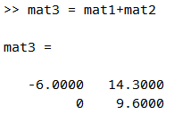
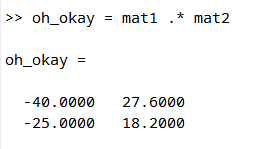
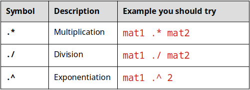
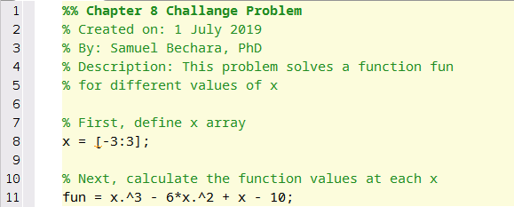

# Chapter 9: Math Operations With Arrays

||
|:---:|
|*Figure 9.1: A different kind of array*|

At this point we have learned how to store and manipulate data inside of arrays. It is really important that you remember everything in Chapter 8, so it is a good idea to go back and review the previous material.

Up until this point, the power of MATLAB has been below the surface. If you recall from Chapter 8, MATLAB stands for **MAT**rix **LAB**oratory. In this chapter, we will learn functions and commands that make use of the most powerful MATLAB features.

To keep track of your work, it is a good idea to work on all of the examples presented in this chapter as part of a new script. I suggest creating and saving a new script called ```chapter9_examples.m``` to keep track of your work. Make little comments so you can remember what and why you are doing things.


As suggested, we will spend the majority of this chapter learning about how to manipulate arrays to perform complex mathematical operations quickly. To do so we will learn:

- Element-by-Element Math Operations on Arrays
	- Addition, Subtraction (no dot)
	- Multiplication, Division, Exponentiation (dot)
- MATLAB Built-In Functions for Working with Arrays
- Other useful MATLAB Functions
	- ```mean()```
	- ```max()```
	- ```min()```
	- ```sum()```
	- ```sort()```
	- ```median()```
	- ```std()```


## Quick Note - Warning on Linear Algebra

The linear algebra capabilities in MATLAB are part of what makes it powerful but because this is an introductory course, linear algebra *will not be covered*. The reason that I mention it here is because the [linear algebra syntax](https://www.mathworks.com/help/matlab/linear-algebra.html) is very similar to what we will learn in this section on element-by-element math operations. It is possible that you can make a tiny mistake when you are practicing problems in this section (e.g. omitting a single .) that will be hard to notice. Make sure you are being diligent!

## Addition and Subtraction with Arrays

Addition and subtraction of arrays works in the exact way that you think that it would. When you attempt to use the **+** (addition) or **-** (subtraction) operator on arrays **of identical size**, the corresponding elements are added or subtracted. It is that easy. 

In the general case, if we have a matrix A and a matrix B with elements:

\\( {A} = \begin{bmatrix}
      a_{11} &a_{12} \\
      a_{21} &a_{22}
    \end{bmatrix} \\)

and

\\( {B} = \begin{bmatrix}
      b_{11} &b_{12} \\
      b_{21} &b_{22}
    \end{bmatrix} \\)
    
(in this case \\( a_{11} \\) could be any number, \\( a_{12} \\) could be any number, etc)

Now if we subtract A from B we get:

\\( [A] - [B] = \begin{bmatrix}
               a_{11} - b_{11} &a_{12} - b_{12} \\
               a_{21} - b_{21} &a_{22} - b_{22}
            \end{bmatrix} \\)
            
We simply subtract the corresponding elements. Addition works the exact same way. It also works the exact same way with vectors (Recall, vectors are 1 dimensional arrays). The main thing to remember is that the arrays \\( [A] \\) and \\( [B] \\) must be the exact same size!


To see it in action, open up MATLAB and define the following four arrays (if you do not remember how to create these arrays in MATLAB, see Chapter 8). You should notice that I am not showing you the exact commands to enter these variables into the MATLAB workspace. From now on, I will assume you know how to create vectors and matrices.

\\( {mat1} = \begin{bmatrix}
      4 &12 \\
      -5 &2.6
    \end{bmatrix} \\)
    
\\( {mat2} = \begin{bmatrix}
      -10 &2.3 \\
      5 &7
    \end{bmatrix} \\)
    
\\( {vec1} = \begin{bmatrix}
      0 &12 &24
    \end{bmatrix} \\)
    
\\( {vec2} = \begin{bmatrix}
      11 &36 &59
    \end{bmatrix} \\)
    
*Hint: the first matrix can be input by typing* ```>> mat1 = [4 12; -5 2.6];``` *but you need to figure out the rest on your own!*


||
|:---:|
|*Figure 9.2: Before continuing make sure your Workspace variables are identical!*|

Now that those four arrays are loaded into your Workspace (see figure 9.2 to the right to make sure you are on the same page) you can add or subtract the matrices. **Keep these 4 arrays in your Workspace. We will be using them throughout the chapter.**

First, try adding \\( {[mat1]} + {[mat2]} \\) and storing that operation into a new variable called \\( {[mat3]} \\). You can see the what that looks like in figure 9.3 below.

||
|:---:|
|*Figure 9.3: Example of adding matrices in command window*|

Notice that it simply adds up the corresponding elements. The 1st row, 1st column of \\( {[mat3]} \\) contains the value \\( {-6} \\) which is just \\( {4} + {(-10)} \\) which are the values in the 1st row, 1st column of \\( {[mat1]} \\) and \\( {[mat2]} \\) respectively.

> Question 9.1: Subtraction of Vectors
> Using the variables stored in your workspace, try the following subtraction operation: vec2-vec1 and store it in a new vector called vec3. What is the value of vec3(1)?

### Remember, arrays must be identical in size

Hopefully, you agree that addition and subtraction with arrays is pretty straightforward. If you still need a little practice, I suggest just trying out different combinations of vectors and matrices in MATLAB and adding them and subtracting them until you are able to predict what the values of the output will be before you hit enter.

Just to make sure you understand when you do make mistakes, make sure that you still have the original 4 arrays in your Workspace (see figure 9.3 above) and try the following in the command window:

```MATLAB
>> mat1 + vec1
```

You should see matlab displays an error ```Matrix dimensions must agree```. The reason MATLAB is displaying this error to you is because the **dimensions of** \\( {mat1} \\) **and** \\( {vec1} \\) **are NOT identical.** Whenever you see the error ```Matrix dimensions must agree``` you should go back and look through your arrays to make sure they are the exact same size!

## Adding or Subtracting a Scalar to an Array

Adding or subtracting a scalar from an array is even easier than adding or subtracting arrays. You should recall in Chapter 6 that we learned that scalars are just single numbers (as opposed to arrays which are collections of numbers).

In the general case if we want to add the number \\( {s} \\) to the array \\( {[A]} \\):

\\( {A} + {s} = \begin{bmatrix}
      a_{11} + {s} &a_{12} + {s} \\
      a_{21} + {s} &a_{22} + {s}
    \end{bmatrix} \\)
    
You simply add \\( {s} \\) to every value in the array \\( {[A]} \\)! Subtraction works the exact same way.

> Question 9.2: Subtract a scalar
> Using the 4 variables still stored in your Workspace, subtract the scalar 4 from mat1 and store in a new matrix called mat4. What is the value of mat4(1,1)?

## Multiplication, Division, and Exponentiation with Arrays

If we want to perform element-by-element multiplication (or division, or exponentiation) on arrays it is almost identical to addition or subtraction, *with just one tiny difference*. What I mean by element-by-element multiplication would look like this in the general case:

\\( [A] * [B] = \begin{bmatrix}
               a_{11} * b_{11} &a_{12} * b_{12} \\
               a_{21} * b_{21} &a_{22} * b_{22}
            \end{bmatrix} \\)
            
So if we multiply a 2x2 matrix \\( {[A]} \\) with a 2x2 matrix \\( {[B]} \\), the output is the multiplication of the corresponding elements. Hopefully you still have the 4 variables still stored in your Workspace.


Before continuing, THINK about multiplying \\( {mat1} * {mat2} \\) and storing in a new matrix called ```huh```. What should the value of ```huh(1,1)``` be? Do not skip your brain workout! It only takes one second and will make the following example much more compelling.


Ok, now that you have a prediction for what happens, go ahead and type in ``` >> huh = mat1 * mat2``` into the command window. Your new variable ```huh``` should look identical to figure 9.4 below.

||
|:---:|
|*Figure 9.4: Did we break MATLAB?*|

So did we break MATLAB? Is MATLAB incapable of doing such a simple mathematical operation? The value of ```mat(1,1)``` is \\( {4} \\) and the value of ```mat2(1,1)``` is \\( {-10} \\) so \\( {4} * {-10} \\) should equal \\( {-40} \\) so why is the number \\( {20} \\) showing up in ```huh(1,1)```?

Don't worry, MATLAB is NOT broken. It is simply *doing a different type of math* than what you are expecting. I'll explain what is happening in a bit, but for now, try the exact same operation, but this time, add a ```.``` before the ```*``` and lets store the result in a new matrix called ```oh_okay```. Type the following into the command window:

```MATLAB
>> oh_okay = mat1 .* mat2
```

||
|:---:|
|*Figure 9.5: Now it works?*|

Now THAT looks like what we are expecting! So what is going on?

Remember that *quick note* at the beginning of the chapter? The reason you need to add the ```.``` for multiplication is to signify element-by-element operations. The ```*``` is reserved for linear algebra multiplication (as are the ```/``` and ```^``` symbols) so we need to specify the ```.``` to let MATLAB know we want to perform element-by-element operations.

That means that unless you are specifically doing linear algebra, you will want to put a ```.``` before you perform multiplication, division, or exponentiation *with arrays*. Do not indiscriminately add dots to your equations! Table 9.1 below shows the only times that you need dots.

||
|:---:|
|*Table 9.1: When to use the . operator.*|

Lets put this all together in an example in MATLAB. In the script that you have already started, create a new section. If you forgot how to do this, a quick recap of Chapter 7 should help.

Now, Let us consider the function \\( {f(x)} = {x^3} - {6x^2} + {x} - {10}\\) and say that for whatever reason we would like to calculate the value of the function at different values of \\( {x} \\). Specifically, lets consider evaluating the function at the following values: \\( -3, -2, -1, 0, 1, 2, 3\\). Finally, lets store all of the corresponding values of the evaluated function in a new array called ```fun```.

How can we perform the preceding question in MATLAB? We COULD type out the correct mathematical operation for every value like this:

```>> fun(1) = (-3)^3 - 6*(-3)^2 + (-3) - 10```

```>> fun(2) = (-2)^3 - 6*(-2)^2 + (-2) - 10```

... etc etc... but please **DO NOT DO THIS**!


The above "solution" would be wasting the power of MATLAB and would be extremely tedious. Instead, **think** about what we have learned and how it relates to this problem. Do not continue reading until you have some ideas about how to proceed.


I hope you didn't skip your brain workout. It is important! I hope that you have some inclination that we can use arrays and array mathematics to solve this problem quickly.

**Solution:**

**Step 1)** define the \\( {x} \\) array in MATLAB. Notice that the values of x are from -3 to 3 and are equally spaced by 1. Sound familiar? Sure! Just type in ```>> x =[-3:3]``` to define that vector.

**Step 2)** To solve for the function at every different value of \\( {x} \\), you just need to perform the mathematical operations onto the array of x like this: ```>> fun = x.^3 - 6*x.^2 + x - 10;```

When you are done, the section in your script file should look similar to figure 9.6 below.

||
|:---:|
|*Figure 9.6: What your section script should look like. Hopefully, you wrote your comments in your own words. Also notice how the header and comments make it easier to understand what is going on!*|

> Question 9.3: Now here is the beauty of MATLAB!
> For this question, lets consider the preceding example, but this time, redefine x to be from x = 1 to x=999 equally spaced by 1. To accomplish this, you should only have to modify two numbers in your script. After running it, you have now created a fun array with 1000 entries! Using this and what you know about MATLAB what is the function value evaluated at x = 257?

That is the beauty of MATLAB! You can change one or two numbers, and re-run your script without having to do much work. If you struggled with the question above, it is ok! If you are struggling than you are learning! But you also need to figure out a plan to make sure that you learn this material. It is critical to being a successful MATLAB programmer.

## MATLAB Functions for Working With Arrays

As mentioned in the previous chapter, arrays are the fundamental way to store data in MATLAB. Fun fact: a scalar in MATLAB is actually just stored as a 1x1 array!

Because arrays are so fundamental to the way that MATLAB operates, MATLAB comes pre-packaged with several functions that can perform analysis on arrays. A non-comprehensive (but useful) list of these functions is presented in the table below.

To learn these, I suggest that you create a new section of your ```chapter8_examples.m``` script, and practice them on the 4 Workspace variables \\( (mat1, mat2, vec1, vec2) \\) that we have been using this chapter. Don't forget to read the help text on these functions as well as it can be very helpful!

In table 9.2, A is considered an array (don't forget an array can be a vector or a matrix).

||
|:---:|
|*Table 9.2: A collection of functions that work specifically on arrays.*|

Note: some of the functions above work a little differently on matrices than on vectors. For example) in the command window type ```>> help std```, read the help text introductory paragraph, then answer the following question.

> Question 9.4: Help! std!
> For this question, consider a 5x8 matrix stored in the variable random_man with random values. When the user types in y = std(random_man) what is/are the dimensions of the variable y?

## End of Chapter Items

> Personal Reflection - Chapter 9
> This is a completely anonymous submission. The professor will be able to see the responses but the responses will not be attributed to an author. Your participation is required. What do you think about the content of this chapter? Again, there is a lot of new material in this chapter wouldn't you agree? Do you need some more practice before you understand this material? Do some personal reflection about your learning.

> Request for Feedback - Chapter 9
> This is a completely anonymous submission. The professor will be able to see the responses but the responses will not be attributed to an author. Your participation is required. What did you think of this chapter? Anything stand out as exceptionally good? Anything that you would like to see differently? Any feedback is appreciated.

## Image Citations

Image 1 courtesy of Pixabay, under Pixabay Licence.

Image 2 courtesy of Samuel Bechara, used with personal permission.

Image 3 courtesy of Samuel Bechara, used with personal permission.

Image 4 courtesy of Samuel Bechara, used with personal permission.

Image 5 courtesy of Samuel Bechara, used with personal permission.

Image 6 courtesy of Samuel Bechara, used with personal permission.