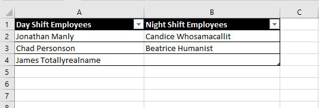
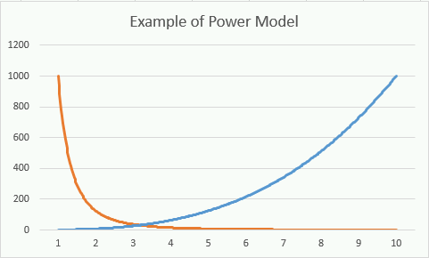
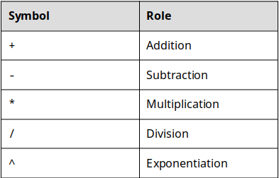
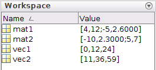
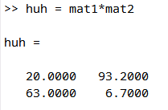
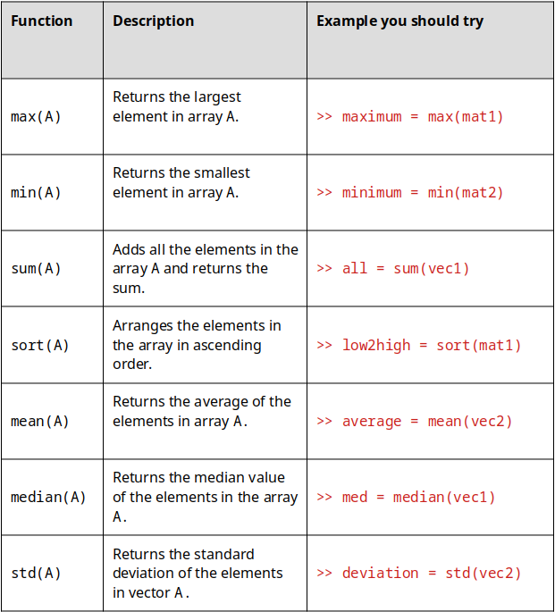
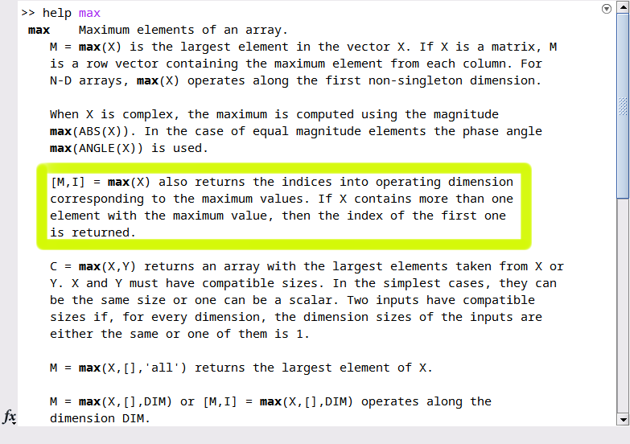

<center>
<br>
<br>
<br>
<br>
<br>
<br>
<br>
<br>
# Introduction to Engineering
<br>
<br>


<br>
<br>
<br>
### Samuel Bechara, PhD

An interactive, free, introduction to engineering textbook. For more information go to www.intro2eng.com.

</center>

# Chapter 0 Goes Here

# Chapter 1: Is it a bird? Is it a plane?

||
|:----:|
|*Figure 1.0: Engineers bestow superhuman powers.*|

Typical engineering textbooks often start off be asking legitimate questions but respond by giving boring answers. The typical questions are:

- What does it mean to be an engineer?
- What do engineers do?
- What ethical problems arise with engineers?

These are valid questions for the starting engineering student and the answers are exciting!

Before we get any further, take a minute to write out a short description of what **YOU** think an engineer is and what they do:

>Discussion 1.1: What is an engineer?
> Before we jump into this book, take a minute to reflect. After all, you chose this major for some reason. What do you think an engineer does? Why did you choose this major? Your answer doesn't need to be a page long, just write a few sentences to reflect.

## Learning Goals

In this chapter we will learn about engineering in general. That includes learning:

- What it means to be an engineer and what engineers do.
- What engineering careers look like and how they are projected to grow.
- How to approach your schooling and why I think that school is a gym for your mind.
- What engineering ethics are and how to approach ethical dilemmas.
- What the non-cognitive skills are for success as an engineer.
- The dangers of having a smart professor.

## Engineers Give Humans Superpowers

Engineers build things that give people superpowers and in the process, make the world a better place. It really is that simple.

||
|:----:|
|*Figure 1.1: Engineers turn ordinary people into Superheroes!*|

Currently, the fastest man in the world (for the 100m dash) tops out at approximately 44.72 km/h while running. Mechanical Engineers have developed vehicles that allow humans to travel at 120 km/h for sustained periods of time. These vehicles are comfortable, safe, relatively affordable, and more importantly, the user doesn't even have to break a sweat!

### Pretend we are in 1918...

Consider, explaining to someone 100 years ago the powers that engineers have given mere mortals. Go ahead, close your eyes, and pretend that you are someone from 100 years ago. You can even come up with a old-timey name for yourself if it helps (my old-timey name is Horatio Winterberry). [Go on Wikipedia and try and see what life was like in 1918](https://en.wikipedia.org/wiki/1918). That page should allow you to see a bunch of historically important events that happened over 100 years ago. Click through the Wikipedia page, do a little more background research, and get a good feel for the type of technology they had available to them.

||
|:----:|
|*Figure 1.2: Horatio Winterberry in his new horseless carriage... probably*|

Now, continuing our imagination, someone comes from the future and tells you some of the things engineers have created. Engineers have made it so that a business man can travel to New York from London in a matter of hours! Engineers have created robotic prosthetics that can be controlled from a the mind of an amputee! Horatio Winterberry from 1918 would  have thought you are crazy.

> Discussion 1.2: Time traveler
> For this discussion, we are going to continue role playing as if we were from 1918. Consider being transported to the year 2018 for a year, long enough to learn about current technology. After a year you are transported back to 1918! Draft a short letter to your mother explaining a current technology to a person in 1918. To complete the old-timey feel, you can also hand-write your response and upload it instead!

Engineers are in the business of building things that give individual people and humanity as a whole super powers. Bio-engineers have made crops that can sit super close together so we can grow more food. Agricultural engineers improved agriculture. The list goes on.

### Engineering Disciplines

Engineers are broken into several disciplines, typically by prepending a descriptor to "Engineer" that describes a broad category of things that they make that gives humans super powers. Example: Electrical Engineers use electronics to give people super powers.

Note: *There are many more specialties than presented in this section.* This list was decided as you can find most of these engineering majors at most large universities:

- Aerospace Engineering
- Agricultural Engineering
- Biomedical Engineering
- Chemical Engineering
- Civil Engineering
- Computer Engineering
- Electrical Engineering
- Environmental Engineering
- Industrial Engineering
- Mechanical Engineering

The US Bureau of Labor Statistics (BLS) has excellent information on these careers. They describe what they do, job outlook, pay, area information, and more. You can find a list of all the tracked engineering careers on the [BLS website here](https://www.bls.gov/ooh/architecture-and-engineering/). In addition to those careers, you should pursue the BLS site and look at other careers and options. You might be surprised what is growing fastest!

> Question 1.1: BLS Stats on Engineering
> Your task for this problem is to sort the engineering careers by "Job Outlook, 2016-2026" in descending order (High to Low). "Job Outlook, 2016-2026" (Links to an external site.) represents a BLS estimation of how fast the engineering careers will grow in the next decade. Keep in mind the careers we are looking at are NOT tech jobs!

Based off of the following activity you may think to yourself "Ah, I should switch my major to the career growing the fastest!" Not so fast. Part of being a good engineer is learning how to analyze and interpret information. For example: consider that Biomedical Engineering is projected to grow much more quickly than Computer Hardware Engineering (7% vs 5% respectively) then answer the following question.

> Question 1.2: Another look at those statistics...
> Look at the BLS projections for Biomedical Engineering vs Computer Hardware Engineering. Based off the projections, and even though Biomedical Engineering is growing faster, how many more Computer Hardware Engineers will be employed as compared to Biomedical Engineers in the year 2026?

## Stop and Think

Finally, spend some time perusing the BLS page for your chosen major or field you would like to go into. Click around on all the tabs. Looks at where they are employed, what they do, how much they are paid, etc. Then take some time to reflect.

> Discussion 1.3: What is your major?
> What engineering major are you currently enrolled in? What does the BLS say they do? What type of thing do they make? Are you interested in making that thing? Make sure to write in your own words, plagiarism is not OK! If you are a double major, you can either pick one, or pick both to describe here.

## Don't Do It for the Money (or for your parents, or for prestige, etc)

Engineering is hard and there are right and wrong reasons to pursue it as a major. Several students pursue engineering because they heard that engineers make a lot of money. For example, the BLS says that the median pay for Chemical Engineers is 102,160 USD. This is crazy seeing as how the median salary for employed workers in the US is currently 37,690 USD. Before we continue, lets tell a little story...

## Case Study

### Consider the following scenario:

Steve is an 18 year old about to graduate from Generic High School. Steve is very smart and exceptionally clever. He has always been interested in electronics, computers, and baseball. He built an arduino-based biometric lock for his bedroom to keep his sister out when he was only 7 years old. However, Steve has no muscular definition or hand eye coordination to speak of. Steve was the only player to strike out in his t-ball league (a record him and his dad laugh about often). As part of his high school capstone project Steve designed an "e-bat" that was able to measure the swing velocity and force imparted onto the ball for his High School Baseball team. Even though he didn't make the team, Steve was proud to see his e-bat used to enhance the performance of the players by giving them information on their swing speed, angle, etc. Steve graduates High School with a 3.9 GPA and gets a full ride scholarship offer from Colorado State University to study engineering. Steve has always been interested in baseball and hears that MLB players make a lot of money. Steve decides to skip college and instead he begins training to become an MLB baseball player.

||
|:----:|
|*Figure 1.3: DEFINITELY not Steve*|

### What is the point of that weird story?

While we may be rooting for Steve (we all love an underdog story), it seems clear that his logic is absurd. Steve does not have the physical characteristics necessary to be a successful MLB player. While he might, with a lot of training and hard work, achieve this dream, it is more likely that he will fail. It is clear to us that Steve should have chosen that Colorado State University scholarship and studied Mechanical Engineering! Just like it is absurd for Steve to choose to be an MLB player, it is equally as absurd to arbitrarily choose a college major.

> *Engineering is hard and there are right and wrong reasons to pursue it as a major.*

If you signed up for an engineering major because you think engineers make a lot of money (typically true but not always the case), or because your parents pushed you into it, you are going to be in for a long four years and a potentially miserable career. **If you signed up because you love learning and are interested in making things that help turn ordinary people into super heroes, you are in for a treat.** Engineering school will equip you with the tools and mindset necessary to analyze problems and design novel solutions using technical knowledge and personal ingenuity. **However, if you are uninterested in working hard, long hours on difficult problems that require advanced mathematical understanding and computational thinking, you may want to look at other degree options that might be more interesting to you.**

There are lots of college majors and it can be difficult to pick a potentially life long career when you are a freshman in college. I get it. But take some time to reflect.

> Discussion 1.4: Do you have what it takes?
> Use these questions to reflect on: 
> What are your strengths?
> What are your weaknesses?
> Do you have good time management skills?
> Are you ok with studying for long hours and working on hard problems without easy solutions?
> Use this self reflection to make sure that you are in the right place. There are no right or wrong answers to these questions. They are simply for you to start having a conversation with your self about what is right for you.


## Non Cognitive Skills For Success

The purpose of the proceeding section was not to get you to change majors! If you are interested in engineering please stick with it! In my experience, students drop out of engineering for two reasons:

1. They think it is *too hard* and want to switch to an "easier" major
2. They think they aren't *smart* enough

Both of these are **not valid reasons** to change your major as long as you are interested and really want to be an engineer. Yes, engineering is difficult and requires advanced mathematics, physics, and scientific training. Is that hard? Of course it is, but if you are interested in it, than you should also find it *fun*.

A lot of the problems that students have with engineering comes from the way society prepares us. Lets consider another story to illustrate what I mean by this.

## Case Study

Pretend you are going to a concert to see Yo Yo Ma play Bach's Cello Suite No. 1 in G Major. Go ahead and do yourself a favor, take a few minutes out of your day, close your eyes, and imagine being lucky enough to hear him play this for you live. Seriously, it is only a few minutes long and it is strikingly beautiful. Hit the play button, and close your eyes...

[Video 1: Yo Yo Ma - Bach Cello Suite No.1 in G Major](https://www.youtube.com/watch?v=1prweT95Mo0)

Woah. He is good right? Did you listen to the whole thing? I think it is difficult to listen to that piece and not have some kind of emotion come flooding into your head. That is how good Yo Yo Ma is.

Now comes the million dollar question. **Could you ever be that good?** *This is the question that society has prepared us to answer incorrectly.* Society tells us no. Society tells us that Yo Yo Ma is super talented and that you could never do that because you aren't as talented as he is. It is easy to think that, well, Yo Yo Ma is super talented and I am not so I guess I can never play cello as good as he can so I won't start.

**I am trying to tell you that you can be that good, you are just too lazy to put in the effort.** That is OK, not everyone needs to be an amazing cellist. But you *should* be amazing at *something* which means that you are going to have to get to working hard and failing! What you don't see when you see someone do something amazing on YouTube is the countless hours of them failing, getting up, and trying it again. You don't see YouTube videos of Yo Yo Ma practicing the piece for hundreds, maybe thousands of hours before he is able to play it that well. It doesn't matter what amazing thing you are seeing, the story is the same. It is extremely rare for someone to just stumble upon wealth and success.

Do not delude yourself into thinking that you aren't smart enough to be an engineer, you are! **The point is that engineering is hard but you can do it, you are just going to need to improve some of you non-cognitive character skills.**

These are the non-cognitive character skills that all successful people have (in order of importance):

1. **Grit** also known as *passionate* persistence. This is the main secret to success.
2. **Conscientiousness**. This will help with your professional life and help cultivate relationships that will vault your career.
3. **Planning**. How well you can create goals and execute plans to complete those goals.

You should also notice that these non-cognitive skills are also skills that are useful for physical fitness. The workout analogy holds true!

## Ethics is Hard
In my opinion, engineering ethics deserves the devotion of an entire course to the topic. Unfortunately, for most engineers, their ethical training is limited to a couple of slides to meet some ABET accreditation requirement and it is not emphasized throughout the curriculum.

In this book I will try and change that. Throughout the book you will encounter ethical quandaries that are intended to provoke discussion. One thing that you should always keep in mind, *ethics is hard and there are not always right answers*.

### Example of Why Ethics is Hard
A lot of engineering ethics ask silly questions. Here is an example that I have found in a current edition textbook, that I find particularly silly: "A cashier gives you too much change for a purchase. Do you correct the cashier?". **OF COURSE YOU DO!** This question lacks nuance or depth that arise in real life ethical dilemmas.

A better ethical question would be: "A cashier gives you too much change for a purchase. You are struggling for money after being laid off. Your son's shoes have holes in them and as the Wisconsin winter approaches you are worried that his feet might get frostbite if he doesn't get new shoes. You don't even care if they are new, you are willing to get him a used pair, but you don't even have enough money to pay the rent and money is tight. However, having worked in grocery before getting laid off, you understand that the cashier will be held personally responsible for the missing money and you do not want to get them in trouble. Do you correct the cashier if the amount in question is 1 dollar? 5 dollars? 100 dollars?"

Real life ethical dilemmas do not have clear cut solutions or consequences. Keep that in mind throughout the semester as we discuss these topics. For your first discussion this week, lets consider a name we all know, Nobel. It is most likely that you associate the name "Nobel" with prizes and science and smart stuff! That is just what Alfred Nobel was going for. He was almost known for something quite different...

> Ethics: Nobel's Legacy
> Most people recognize the name Nobel and associate it with the Nobel Prize. The Nobel Prizes are arguably the most prestigious and famous scientific, literary, and social achievement awards in human history. What most people do not realize is that it was named after Alfred Nobel, a Swedish engineer credited with inventing dynamite. Nobel had an interesting opportunity to read his own obituary (it was published on accident) which was scathing and condemned him for profiting off of the sale of weapons. Realizing that his legacy was one of death and destruction, Alfred bequeathed his fortune to create the Nobel Prizes.
> In the future you may have the opportunity to design and create something that will be used in a way you didn't intend. Let's pretend that you create a software algorithm that eliminates the jobs of 100,000 people. Your company is pleased and you get a raise! After all, you have increased profits by a huge margin. For this weeks online discussion post, write your own obituary. What do you think it will say? Will the world look kindly on the innovator that gave them the algorithm that increased productivity and profits? Will it lament the loss of jobs and curse you as a job killer? Read some NY Times obituaries (Links to an external site.) to get a feel for how they are written before you write your own.


## Mindset: Engineering as a language, not as a puzzle

Up until now, I have just told you everything is going to be hard, which it is, but DO NOT DESPAIR!

In the next chapter of this book, we are going to introduce units, dimensions, and other important considerations. Later we will learn how to use both Microsoft Excel and MATLAB to perform data analysis and write programs. When you are first learning how to write programs and other engineering concepts, it is most effective to think of it as learning a new language, *not learning how to solve a puzzle*. I have seen students going online and picking and choosing bits of code, changing variables, and then when it "works", they save it, submit it as their completed homework. Students might also figure out a "process" for solving a particular type of problem, only to find out that (usually when they get to the test) that they don't really understand the underlying concepts. **This is not the correct way to think about homework or computer programming.**

> When you are first learning how to write programs and other engineering concepts, it is most effective to think of it as learning a new language, not learning how to solve a puzzle.

If this student was suddenly required to repeat the homework from scratch, it is unlikely that they would be adequately prepared from the homework.


### Remember our Workout Analogy

One of the dangers I would like to alert you to is that your professor has very strong mental muscles. When you go to class or ask your professor for help, they will likely be able to answer you. When you think about it the amount of knowledge your professors have is amazing huh?

||
|:----:|
|*Figure 1.4: Your professor has huge mental muscles.*|

Your professor (or TA, or tutor) is so good, she makes it look easy. **This is super dangerous for you, the student!** Your professor makes it *look* easy but that doesn't actually mean that it is. The student  is going to have a hard time if he simply watches their professor deadlift a huge amount of weight, doesn't workout him/herself, and then shows up to the 60 minute workout test (the Professor fished this problem in 30min! How hard can it be?), confident that they know what they are doing. At this point, it is easy to see the mistake of the student.

Similarly, when your instructors / TA's / whoever shows you how to do things it is important to pay attention. You need to see someone perform the workout so that you know how to position your body, etc. But it *isn't going to help you build your mental muscles.* The learning comes from practicing, doing the same repetitious thing over and over.

> in addition to reading and working on homework, **it is critical that you practice everything, on your own, until you achieve mastery.**

Throughout the semester we will revisit this analogy. It will be used as a reminder that in addition to reading and working on homework, **it is critical that you practice everything, on your own, until you achieve mastery.** In our student's case, he was overconfident in his abilities to lift weights and as a result, bombed his test.

## End of Chapter Items

> Personal Reflection - Chapter 1

>Request for Feedback - Chapter 1

### Image Credits

Figure 1.0: Image courtesy of Elias Sch under [CCO Creative Commons](https://creativecommons.org/publicdomain/zero/1.0/deed.en)

Figure 1.1: Image courtesy of Pixabay under [Pixabay License](https://pixabay.com/service/license/)

Figure 1.2: Image courtesy of wikiimages under  [CCO Creative Commons](https://creativecommons.org/publicdomain/zero/1.0/deed.en)

Figure 1.3: Image courtesy of KeithJJ under [CCO Creative Commons](https://creativecommons.org/publicdomain/zero/1.0/deed.en)

Figure 1.4: Image courtesy of Pexels under CCO [Creative Commons](https://creativecommons.org/publicdomain/zero/1.0/deed.en)

# Chapter 2: Engineers are Professionals

|  |
| :-------: |
| *Figure 2.1: You will be doing lots of writing as a professional.* |

One of the most important things to learn early in your journey as an engineer is that **engineers are professionals**. The word professional is synonymous to "white-collar" and implies that you are going to be using your brain instead of your body or hands to earn a living.

**IMPORTANT NOTE: At this point it is important to note that society relies on "blue-collar" or non-professional workers and *I do not mean to imply any negativity towards those who have chosen this type of work for their career* **. Historically "blue-collar" has negative connotations but manual laborers play a significantly important role in our society and should be respected for their contributions. The color of your shirt doesn't matter and **everyone should be treated with respect and dignity.** Manual labor jobs are great options for a lot of people. Several of you may have worked (or known someone who has worked) in a manual labor setting and will likely have inherited experience and traits that will help you succeed as an engineering professional.

When we are talking about engineering as a career, the reality is that it is a professional career path governed by unspoken cultures, expectations, and rules of conduct that you are likely unfamiliar with. Some of the content in this chapter may be surprising to you, and other parts may just seem like common sense. The goal of this chapter is to get you up to speed on what it means to be a professional and how to conduct yourself as a professional to maximize your success in your future workplace.

I acknowledge that this chapter contains a ton of "no duh" information. However, in my almost decade of experience as a higher education professional, I think taking some time to review this is necessary and will prove to be helpful.


In this chapter, you will learn several important skills that are critical to your success in a professional setting:

* Why it is important to act professionally.
* How to conduct yourself as a professional. How to talk to other professionals (including your professors).
* The power of humility and what it means to be respectful.
* Taking responsibility and pride in your work.
* How to say thank you and how to apologize.
* What is business casual and why dress is important (both as a student and as a professional).
* How to write email and why it is important. 


## Why is this important?
Why is dedicating a whole chapter to things that seem like common sense important? Because...

>*I want to make sure that you can get a job and be successful in that job.*

People say they are going to college for various reasons but the reality is *everyone comes to college to get a job*. Thinking about our workout analogy, you hire a personal trainer to build up your muscles but really you want to get fit and strong. Your professors will train your mental muscles but the end goal is employment, not the learning in itself. That is OK and doesn't mean that the learning isn't fun or important.

Universities like to say things like they "are making you global citizens" or "well rounded life long learners" but for most students, they simply see college as a path to a career where they can be successful and make money. I do not blame you! That is a great reason to attend college! Although none of you are professional engineers yet, you will be an engineer soon (with a little bit of studying, help, and perseverance). It is important to learn how to conduct yourself, what your future colleagues will expect from you, and what should expect from your future colleagues. It is important **so that you can get a job and be successful in that job**. It is also important to begin to use what you learn in this chapter right away, both towards your professors and towards your fellow classmates.


## It's Not What You Know, It's Who You Know
You may have heard this cliché before. A lot of clichés are clichés because there is some truth in them. First, it is important to note that **technical competence and ability is by far the most important factor when it comes to your professional success**. If you can't do the job, you won't get the job. This section is not insinuating that it isn't important to study and learn. The question is: how can you distinguish yourself from a crowded field of graduates? You will be graduating with and competing against thousands of other people that have the exact same qualifications as you do. How do you get a job?    


|  |
| :-------: |
| Figure 2.2: It is important to start building your network now. |


**You cultivate relationships.** It is important that you act professionally and cultivate relationships with everyone you come into contact with at a University. Everyone is italicized for emphasis because I mean everyone at the University. From the President of your University, to the administrative assistants in your department, all your professors, your classmates, the academic advisers, the janitorial staff... everyone.

I could fill a whole chapter on anecdotes that show this is true but you probably already have a gut feeling that this is true. This may be the most common sense piece of advice in this entire book that I have noticed most students not taking to heart.

Why is it important to treat everyone professionally and how does that help you get a job? Lets list out a decidedly non-comprehensive list of ways people can help you:

* Your current classmates might be your future co-workers or even bosses. If they like and respect you, they might hire you or suggest you for hire by their boss.

* Your professors likely have contacts and friends in industry but they will not stake their professional reputation on a student they don't believe in. By treating your professors with respect and working hard in their classes, they will be more likely to recommend you.

* Your academic adviser usually gets solicited by companies looking for the students for prestigious internships and experiences. In my experience, they do not pick the A students randomly, they pick the students they like and who treated them professionally.

  

  The list goes on and on but the common thread through all of it, **is acting professionally and courteously can go a long way in helping you get a job.** You need to realize that hiring is risky and scary and people are always looking for a known quantity over an unknown one. If you can get a recommendation from a professor, or other University official, it will go a long way. If you slack off in your classes, argue with your professors, and treat the University support staff disrespectfully, you will have a much harder time getting a job.
  
>Discussion 2.1: What is your story?
This post is not anonymous. The professor and participants can see the responses and the author.
I am certain that a lot of you have a personal story of how a connection that you had helped you get a job, get some paperwork through, fast tracked you through customs, etc. Take a moment to talk to someone that you know is a professional and ask them if they have a story where "it's not what you know, it is who you know" has helped them in life (also make sure they are comfortable with you sharing this info). This can be a professor, a parent, a grandparent, a friend, or anyone who is in a career. Please share with your classmates the story that you heard. If you have a personal and compelling story, you can use that instead.
Responses
Reply Ordered by Newest Responses


## How To Communicate Professionally and Courteously

This is easy because you already know how, you just sometimes choose not to communicate professionally. Here is what I mean. Imagine that you have opportunity to meet your personal hero. It can be whoever you respect the most, admire the most, whatever. How would you talk to them? How would you address them?


|  |
| :-------: |
| *Figure 2.3: Who is your knight in shining armor?* |


My guess is that you would **address them by their professional title** (Mister, Misses, Doctor, Professor, Mr. President, Sir, etc.), that you would **be polite in your choice of words**, that you would **be humble** (more on that later), and that you would **defer to their expertise**. This is exactly how you act professionally and how you should treat everyone you come into contact with at a University.

Here is a handy checklist for how to conduct yourself professionally:

* Treat everyone like you would treat your personal hero or a celebrity. You never know when you will need a favor. In general, it is better to have people like you, and people like being treated nicely.
* Always use last names and titles to address people unless you are explicitly asked to call them something else. It is always better to say Dr. Johnson or Mrs. Stevenson when addressing people you do not have a personal relationship with. If you do not know their title, you can always use the title "Professor" for someone that teaches a university class or "Mr." or "Ms." for University staff if you are unsure if they have a PhD. I will tell you, I have never heard anyone that doesn't have a PhD upset that they were called Doctor but I do know PhDs who get upset if they aren't called Doctor.
* Do not use slang, unprofessional language (i.e. swearing), or other colloquialisms when talking or writing in a professional capacity. Be as formal as possible.

Follow these checkpoints, and you will be thought of as a respectful and courteous student.


## Tips for Networking
The goal of this chapter up until this point is to convince you that being respectful and nice to people goes a long way. You are convinced that "it is not what you know it is who you know". "Who you know" is your network. The second part of the "getting a job when you are done with college" formula is building a network.

Some of you are extroverted and find building a network of people easy and fun. Good for you, you will have a significant advantages when it comes to finding a job because you make friends naturally and people like you. I personally am an introvert and find networking functions unbearable and painful. Just because you don't like to actively network, does not mean that it isn't critical to getting the job you want and deserve. The good news is, there are tactics that you can learn and use to become better at networking. Take a minute to watch the video below where Mr. Duane (see what I did there?) explains his tricks to networking effectively. Make sure to take notes on what he calls "lifelines" and "landmines" when networking.

| :----: |
| Video 2.1: [TJ Duane explores the power of a personal network and offers strategies for leveraging those key relationships](https://www.youtube.com/watch?v=NzpYBTeZdWw&feature=emb_logo). |

> Question 2.1: Networking "Lifelines" and "Landmines"
In the video, Mr. Duane gives tips to be successful in making relationships. First, he advises that people establish a common
 early in the conversation. He also advises that people be centered and actively listen and pay attention to the person they are talking to. He warns people not to get
 and gives an example of a meeting he had on times square. Furthermore, Mr. Duane suggests showing your value but to make sure not to
 because it can be a turnoff. Next, Mr. Duane suggests that following up and following
 is critical. It doesn't work in the dating world or in industry.

## The Power of Modesty and Respect
Being modest and respectful is critical to building your network and advancing your career as a professional. As a student, a significant portion of your network will consist of University professors and staff and the best way to stay on their good side is to be modest and respectful.


|  |
| :-------: |
| *Figure 2.4: Respect, the magic 7 letter word.* |


Furthermore, the power dynamic between a student and professors is unbalanced in a dramatic way. Faculty and staff have almost all of the power, and students have very little if any at all. Hopefully, you trust your University to hire competent employees who will act fairly and on your behalf. For the most part this is true, but what it means for you is that *it does not pay to be disrespectful or immodest*.

Consider the following exchange between an academic adviser (not a professor) and a student they are advising. Lets say that the student sees the adviser's office door open and swings by without an appointment. Keep in mind, in this scenario, it is unclear who is to blame for the problem.

*Academic Adviser: "Hello Student, it is good to see you. How can I help you today?"*

*Student: "Hey. I am good but you messed up, now I am not going to graduate, and I need you to fix my schedule right now!"*

How do you think the academic adviser will respond? I am guessing they will say something like "I don't have time right now, please schedule an appointment".

This is what I meant when I said **that staff has all the power and it doesn't pay to be disrespectful**. This student is severely lacking in modesty and did not acknowledge that it could have been their mistake, instead, they blamed the adviser. The student also failed to apologize for his intrusion! The academic adviser does not have to help the student right away and the accusatory tone will only serve to alienate the adviser. My questions is: **WHY WOULD YOU DO THAT?** The advisers are hard working, underpaid, intelligent people who are here to help you. Do not make them dislike you! Lets see how that exchange could have played out differently.

*Academic Adviser: "Hello Student, it is good to see you. How can I help you today?"*

*Student: "Hello Mr. Adviser. I am sorry to bother you, but I noticed that there is a mistake on my schedule and I am worried it will impact my graduation. Do you have some time to help me fix the issue? If we can't meet today I totally understand and would be happy to setup an appointment. Thanks so much for your help."*

Again, like a lot of things in this chapter, this is obviously the correct way to respond. In this case the student did not blame the adviser for the problem (they didn't even necessarily take credit for the problem either), they were respectful of the adviser's time, and humbled themselves. The adviser still might not be able to drop everything and help the student right away, but you can be sure that they are more eager and willing to help in this situation when compared to the first.

All of this comes back to being a professional. **Successful professionals are always modest and respectful.** People like people who treat them with respect and differ to their expertise.


## You Shouldn't Judge a Book By It's Cover
Before we jump into this section, take a moment to answer the following question. It might make you feel uncomfortable, but be honest because I am trying to make a point.


>Question 2.2: Judge a book by its cover.
>For this question, lets pretend that you have a successful engineering firm and that you need to contract an accountant to help balance your books and do your taxes. You get two offers from women who have a similar educational background, similar experience, and quote you similar prices. They are both excellent candidates in your opinion. You check their consulting company websites and they have the following pictures in their "About Me" section. Obviously pictures are not the best way to select your candidate, but the two women are equal in every other way. Which of the two would you hire? (Figure 2.5)
>  


**Please make sure you answer the preceding question before reading the rest of this section.**

A common idiom is "don't judge a book by it's cover". In my opinion, this is a noble endeavor, but it is counter to what humans actually do. Who did you select in the image above? Why? I am hoping that you selected the person wearing professional attire. After all, the prompt informed you that you wanted an accountant. Accounting requires attention to detail and professionalism. *The woman that is wearing the suit looks like a professional* so it is natural to lean her way when selecting candidates. Humans do this sort of thing all the time!


|  |
| :-------: |
| *Figure 2.6: Don't judge a book by its cover is a good thing to try and live by but no one actually does that. In any case these books have amazing covers.* |


Why do we judge people by what they look like? Humans assess information quickly and we are predominately visual animals. Plus, a lot of the time it can be useful to understand patterns and make quick judgement. To illustrate this, try the following problem which is probably the easiest problem you will ever have in college.


>Question 2.3: Illustrating
Show Correct Answer
Show Responses
question description
 

> This image shows an illustration of a ___________________________________ .

Or for another example, think about the last time you looked up companies online. It is easy to get caught up in the marketing and fancy visuals of their website and to attribute those qualities to mean that the company must have high quality even though a fancy website has nothing to do with how the company actually performs. The list goes on and on, but the fact is that we judge books by their cover. If you are interested in reading more about this, [here is a nice, short little blog post discussing this from a psychological perspective.](https://www.psychologytoday.com/us/blog/happiness-in-world/201208/judging-book-its-cover)


## What can you do about it? Make a Good Impression.
The goal of this section is not to change humanity. The goal is to show that although it is wrong, it is important to acknowledge that bias exists and that human nature dictates that it is unlikely that humans will change anytime soon. It is important for you to know this and use whatever is at your disposal to use it to your advantage. It means that part of being a professional is dressing professionally because people will see you and automatically think you are professional (as we have seen it is also important to act professionally). It also means that it is never appropriate to wear your favorite old shirt, your favorite ripped jeans, and your expensive flashy basketball shoes when you are working as or with a professional.

Whenever you give a presentation in school, go to a job interview, go to a networking event, or interact with engineering professionals in any way (outside of the classroom) it is important to look professional so that you make a good impression. Do not let someone's personal bias be the reason you don't get the job! Dressing up and looking professional will help make you seem more qualified than your peers who do not follow this advice. That might be enough to get you the job!


|  |
| :-------: |
| *Figure 2.8: These two epitomize looking professional.* |


### Tips to Looking Professional

This is not a comprehensive list. Instead it is a rough guide for how to look professional.

* Practice regular personal hygiene. When in doubt, clean shaven is best but some professionals have adopted beards. In either case, clean and trimmed is important.
* Have a neat, professional hairstyle. This will obviously differ between men and women but the importance is on clean, neat, and subdued.
* Make sure you have a neutral scent. Do not wear excessive perfumes or other fragrances.
* Wear solid colors and long sleeves.
* Shoes should be moderate and conservative.
* Socks should be dark and unobtrusive.
* Pants should be worn. Sorry Men, there is no such thing as professional shorts.
* Ties and bow-ties are optional but should be conservative.

## Professional Emails and Communication

Emails are often times annoying, but they continue to be an important tool for professional communication. There are newer communication tools that are beginning to penetrate the professional work space ([i.e. slack](https://slack.com/)) but they aren't ubiquitous and they will require you write professionally similar to the way I will outline in this section. The most difficult part about this is that social media and instant communication have different rules and norms that you are likely familiar with and may not realize are unprofessional. While there are undoubtedly benefits to instant communication in texting and the like, it has led to some bad communication habits that you will need to break to be successful in a professional setting.

It is important to remember that **you can't delete a badly written email and they can be held against you**. So how do you make sure that you do not mess up your emails? Starting today, whenever you write an email to anybody that you are not friends with (and especially the University faculty and staff), remember to follow the rule outlined above, treat everyone like you would treat your personal hero or a celebrity. That means being coherent, precise with your language, proofreading your email to ensure there are no typos, and to always be respectful. Below are a few bullet points diving into a little more detail on what a professional email looks like.


### Email Checklist
* Have a professional email address. Limit it to initials or full spellings of your name and resort to numbers only if you have to. For example, if you have a common name (e.g. John Jeremy Smith) you can try "john.j.smith" or "j.j.smith" or "jj.smith" etc.
* Proofread your emails before you send them. It is important to remember that sending someone an email is the same thing as asking them to spend time on you. The recipient of the email will have to take part of their day to read and assess your email. That means that you can show them respect by making sure the email is well written and free of typographical errors.
* Be sure to use the most formal possible title to address whomever you are writing, regardless of their standing, rank, or position. It is ok to refer to a close co-worker or friend using a first name, but unless you are explicitly told not to, use a formal title. For example, you should always start your email to your professors with either "Dear Professor Bechara" or "Dear Dr. Bechara" unless you are directed otherwise.  If you are unsure about the educational attainment or professional title of the person you are emailing, use Mr. or Ms. as appropriate.
* Complete all of your emails with a professional sign off. That means that after you complete the body of text, add a space, include a sign off (sincerely, respectfully, etc), add another space, and then complete with your name.
* Follow all of the previous advice in this chapter. That means being respectful, humble, etc.

>Question 2.4: An Email
To give an obvious example, lets consider a hypothetical email from a student to a professor. In this case we will consider that the professor actually DID make a mistake (it happens, we are human) and they typed in a grade incorrectly. So this is an instance where the student is in the right and needs to correct the professor. The email is:
​[i]Hey,
You messe d up my grade on quiz for. I got a 87 but you put 78 in the gradbeook. Be more carfeul next time.
Student McNotRespeftulson[/i]
Which of the following mistakes did this student make? Select all that apply
A) Lack of humility and unprofessional tone.
B) Student did not proofread.
C) A professional signoff was not included.

## Ethics - We Still Have Work to Do
There is one last, uncomfortable issue to address when it comes to professionalism and the workplace. It is important to address that despite significant progress towards eliminating racial and gender discrimination, they are real and persistent in our society. It is unfortunate and frankly embarrassing to admit, but in the United States, white men currently have significant advantages over racial minorities and women. That does not mean that racial minorities or women should give up! If you are black, Hispanic, or a women, you are in the right place. Please keep up the hard work and seek the help and resources you need to be successful! We need you to be a role model for future students that look like you.

Although it is uncomfortable and patently unfair, I think it would be foolish and actually detrimental to ignore the realities. Instead, we need to educate ourselves to the problems and actively work to address these problems. The racial and gender makeup of our workplace should reflect the racial and gender makeup of our society but that is currently not true. In fact, engineering is one of the worst offenders. According to a study by the pew research center 73% of United States engineers are white, 12% are Asian, but only 5% are black and only 8% are Hispanic. Furthermore, the statistics on gender are equally as bad. The Society of Women Engineers states that only 13% of engineers are female! These disparities are unacceptable and need to be addressed.


>Ethics: Gender and race in the workplace.
For this ethics prompt I would like you to discuss ways in which you believe would be beneficial to get more women and underrepresented minorities into engineering. I do not want this to be a debate about diversity in the workplace (numerous studies have shown it to be advantageous and I do not consider this up for debate) but instead I would like you to concentrate on potential social policies or other strategies you can think of to encourage more women and underrepresented minorities to seek out engineering. If you are from an underrepresented population and would like to share personal anecdotes about why you are studying engineering or obstacles that you had to overcome that you wish were eliminated that would be wonderful to hear but is not required.
Responses
Reply Ordered by Newest Responses


## End of Chapter Items
>Personal Reflection - Chapter 2
This is a completely anonymous submission. The professor will be able to see the responses but the responses will not be attributed to an author. Your participation is required.
What do you think about the content of this chapter? It isn't difficult technically, but did you learn anything new? Do you think that you will change your future behavior based on this?
Responses
Reply Ordered by Newest Responses


>Request for Feedback - Chapter 2
This is a completely anonymous submission. The professor will be able to see the responses but the responses will not be attributed to an author. Your participation is required.
What did you think of this chapter? Anything stand out as exceptionally good? Anything that you would like to see differently? Any feedback is appreciated.
Responses
Reply Ordered by Newest Responses


Figure 2.1: Image courtesy of [Max Pixel](https://www.maxpixels.net/Coffee-Business-Businesswoman-Cafe-Boss-Coffee-Cup-3753758), under license [CC0 public domain.]()

Figure 2.2: Image courtesy of [Geralt](https://pixabay.com/photos/mobile-phone-smartphone-keyboard-1917737/), under license [CC0 public domain.](https://creativecommons.org/share-your-work/public-domain/cc0/)

Figure 2.3 Image courtesy of [The Digital Artist,](https://pixabay.com/photos/knight-soldier-warrior-medieval-2826704/) under license [CC0 public domain.](https://creativecommons.org/share-your-work/public-domain/cc0/)

Figure 2.5: Image courtesy of [Fotografie Link](https://pixabay.com/accounts/login/?next=/photos/please-do-not-download-this-2697954/) under license [CC0 public domain](https://creativecommons.org/share-your-work/public-domain/cc0/) and [Vitabello](https://pixabay.com/photos/mobile-phone-smartphone-keyboard-1917737/) under license [CC0 public domain](https://creativecommons.org/share-your-work/public-domain/cc0/)

Figure 2.6: Image courtesy of [Gellinger](https://pixabay.com/photos/book-read-old-literature-pages-1659717/) under license [CC0 public domain .](https://creativecommons.org/share-your-work/public-domain/cc0/)

Figure 2.7: Image courtesy of [waldryano](https://pixabay.com/illustrations/doctor-work-hospital-health-1699656/), under license [CC0 public domain.](https://creativecommons.org/share-your-work/public-domain/cc0/)

Figure 2.8: Image courtesy of [rawpixel](https://pixabay.com/accounts/login/?next=/photos/beard-business-walking-businessman-2365810/), under license [CC0 public domain.](https://creativecommons.org/share-your-work/public-domain/cc0/)

# Chapter 3 - Units, Dimensions, and Conversions

||
|:---:|
|*Figure 3.1: The important part is understand when you need to convert units.*|

Although it seems basic, one of the first steps of becoming a successful engineer is having an **intuitive** understanding of units and dimensions. Intuitive means that when you see 4 inches or 4 millimeters you can "see" the difference between those two and understand how they are different. Intuitive means that when someone says that they are 6 meters tall, you raise your eyebrows and likely reply "I don't think meters means what you think it means". Unfortunately, it takes practice and time to have an intuitive understanding about anything (that is one of the reasons why we expect engineers to spend 4 years in school!). Therefore, the goal of this chapter is not that you will have an intuitive understanding by the time that you are finished. It is important to understand that the learning process does not end at the completion of each chapter but instead is a life long process. The goal is that by the end of the chapter you will know how to appropriately look things up and that you understand how to be careful when converting units.


In this chapter we will learn a ton! We are going to learn the difference between units and dimensions and how you will be expected to manipulate them as an engineer. We will explore the following:

- The metric system
- Inferior unit systems (aka US Customary Units and why we should switch!)
- How to convert between unit systems
- The fundamental dimensions of the universe! (Grandiose but true!)
- Dimensional homogeneity (fancy way of saying dimensional consistency) and analysis
- How to intuit the difference between precision and accuracy


## Motivation - The Gimli Glider

On July 22, 1983, Air Canada flight 143 took off from Montreal to Edmonton. Before takeoff, routine checks showed all systems functional and that everything was ready to go. While cruising at 12,500 meters, an alarm started blaring in the cockpit, warning the pilots that the fuel pressure on the left side of the airplane was low. The pilots silenced the alarm, figuring it was a fuel pump problem, and they knew gravity could handle moving the fuel around until they landed. The fuel gauges were not working correctly (or so it seemed), but the flight computer let the pilots know they had **plenty** of fuel to make the flight. A few minutes later, the right side fuel pressure alarm went off. Seconds after that, the left engine shut down. The pilots called air traffic control and prepared to land with a single engine in Winnipeg. As they were discussing the plan with air traffic control in Winnipeg, the "all engines down" alarm went off and the cockpit went blank. The pilots consulted the manual and couldn't find a section that told them what to do when all engines fail. Luckily, the pilots managed to safely crash land the plane and no one was hurt.

||
|:---:|
|*Figure 3.2: The Gimli Glider before it crashed...duh*|

### Why did it crash?

I hope that you can guess based off the chapter title. The problem was an incorrect unit conversion and a whole host of other errors)! In 1983 when the incident occurred, Canada was in the process of converting the country to the metric system. The new 767 involved in the incident was supposed to be calibrated using metric units, but all other Air Canada aircraft at the time were still operating with Imperial Units. The pilot calculated that the flight required 22,300 kilograms of fuel. A [float stick](https://en.wikipedia.org/wiki/Floatstick) check showed that there was already 7,682 liters of fuel in the tanks. Note that the calculation is in *kilograms*, a unit of mass, and the float stick indicated a volume, in *liters*. The crew used an incorrect *conversion factor* that related mass of a liter of fuel to pounds, an error that went unnoticed by the flight crew. We will explore the specific mathematical errors the crew made later in this chapter. The moral of the story, a flight crew made a bad conversion, that crashed a plane. Luckily, no one died but the story highlights the importance of converting units carefully.

## Units vs Dimensions

It is easy to get units and dimensions mixed up. It helps to think of dimensions as **fundamental and usually unspoken** whereas units are **derived from the dimension and quantify the dimension**. 

||
|:---:|
|*Figure 3.3: In basketball, taller is usually better.*|

As an example, lets say you are recruiting someone to play on your basketball team. You know that in basketball, there are significant advantages for tall players. You might ask a potential Canadian player "How tall are you?" and she might reply "I am 1.8 meters tall". In this case, the **dimension** we are considering is \\( {length} \\) (aka "height" in colloquial terms), and the **unit** we are using to describe the dimension length is **meters**. However, if you ask an American player who is the exact same height as the Canadian player, she might reply "I am 5 feet 11 inches tall". In this case, the **dimension** ***is still*** \\( {length} \\), but now the units being used to describe that dimension, are now **feet and inches**.

## Dimensions

To summarize what you read in the previous section, a **dimension** describes the measurement of interest, which in the case above was \\( {length} \\). There are no other dimensions necessary nor does it even make sense to think about another "dimension to height". On the other hand, the **unit** meter is used to quantify the dimension and there are multiple different units we can use. Some units are more practical than others as we will see later in this chapter. For now, lets concentrate our mental effort on understanding dimensions.

### The Fundamental Dimensions of the Universe

Now that we have an idea of what a dimension is, we can easily list out **all of the dimensions needed to describe anything in the universe**. Yes, that is a bold statement but it is true. It turns out there are only a few fundamental dimensions of the universe and we can measure every single physical phenomena you can think of using combinations of these dimensions.

||
|:---:|
|*Table 3.4: The fundamental dimensions of the universe and their corresponding symbols.*|

That is it. That is all the dimensions you need to describe everything in the universe.

Hold on a second, you might say. What about something like \\( {volume} \\)? Isn't \\( {volume} \\) a dimension? Well yes, but it is a **derived dimension**. The dimensions listed above are the fundamental dimensions which we can then combine in different ways to arrive at derived dimensions.

> Question 3.1: Fundamental Dimensions and Symbols
> Without looking at the table above (because it totally defeats the purpose!) try and match the dimension to the symbol we will use to represent that dimension.

### Derived Dimensions

You are already familiar with some of the derived dimensions. For example, it is likely that you already understand that \\( {volume} \\) is really just \\( {length} * {length} * {length} = {length^3} \\). Similarly, you probably already knew that the dimension \\( {area} \\) is simply \\( {length} * {length} = {length^2} \\). As we explore more complex concepts in engineering, you can expect the dimensions to get more complex.

### A Quick Note on Notation

Now is a good time to put this concept into practice. Before we do, just a quick note on notation. Consider the dimension of \\( {velocity} \\). You may have learned in physics class that \\( {velocity} = {{distance}\over{time}} \\). Now, we remember that distance is really the same thing as the dimension \\( {length} \\) which is represented by the symbol \\( {L} \\). Similarly, we have learned that timetime is represented by the symbol \\( {T} \\). Therefore, the dimensions of velocity is \\( {{L}\over{T}} = {L}/{T} = {L}{T}^{-1} \\)
 
As you can see, all of the ways of writing out the notation are equally as valid. However, the \\( {L}{T}^{-1} \\) is the most space efficient and the form that we will be using for the rest of the chapter. [If you need a refresher on the math behind this, click here.](https://www.freemathhelp.com/negative-exponents.html)

> Question 3.2: Quantity to Dimensions
> Match the Quantity to the Fundamental Dimensions that describe that quantity. The dimensions will be written in the "negative exponent" notation to indicate division for the sake of saving space. For some of these you may intuit the answer. For others, you may have to do some outside research in order to determine which of the dimensions match the quantity.

### Deep Dive Into the Dimensions of Something a Bit More Complex

Now that we have covered some of the simple quantities and your brain muscles are loose, lets take one more look at dimensions and consider the physical concept of \\( {work} \\). If you remember what \\( {work} \\) is from your physics class, great! If not (or even if you do, it is a good video), take a minute to watch the following YouTube clip to familiarize yourself with the concept.

[Video 1: Video Courtesy of PBS Digital Studios: Work, Energy, and Power](https://youtu.be/w4QFJb9a8vo)

So what are the dimensions of \\( {work} \\)? Let's logically follow the steps below:

**Step 1)** From the video we saw that \\( {Work} = {Force} * {Distance} \\). We already know that \\( {Distance} \\) has dimension of \\( {Length} \\), but we don't have any idea about the dimensions of \\( {Force} \\). That leaves us here.

\\[ {Dimension \: of \: Force?} * {L} \\]

**Step 2)** Well, luckily for us, the video also states that \\( {Force} = {Mass} * {Acceleration} \\) and we know that \\( {Mass} \\) is a fundamental dimension. So we can then expand our analysis.

\\[ {M} * {Dimension \: of \: Acceleration?} * {L} \\]

**Step 3)** We are making progress but now we have another unknown dimension, the dimensions of \\( {acceleration} \\). But wait! You should have found above in Question 2 that \\( {acceleration} \\) has dimensions of \\( {L}{T^{-2}} \\). Now we just need to put it all together!

\\[ {M} * {L} * {T^{-2}} * {L} = {M} * {L^2} * {T^{-2}} \\]
  
**That means our final answer is:** \\( {M}{L^2}{T^{-2}} \\)

Now try and do this on your own by filling in the blanks to question 3.3:

> Question 3.3: Figure out the dimensions
> Consider electric potential. Electric potential is defined as the () needed per unit charge to move a test charge between two points. Analyzing the dimensions of electric potential show that it should be () \\( {L^2}{T^{-3}} \\) () \\( ^{-1} \\)

I tricked you into learning something, surprise! You have just done **dimensional analysis**! Dimensional analysis is a powerful tool in engineering. It allows us to understand a physical quantity by understanding the underlying fundamental dimensions of the quantity. In fact, if you go to the Wikipedia page for [work](https://en.wikipedia.org/wiki/Work_(physics)) you will see they list the dimensions of work as part of the summary.

||
|:---:|
|*Figure 3.5: Screenshot of Wikipedia page for Work showing the dimensions. I told you it's important.*|

## Unit Systems and History

Take another look at figure X above. Notice how it talks about the "SI unit" used to describe work? You can also see that there is a little section describing "Other units".  Wikipedia is following the scientific and international standard of using the SI System. So what is the SI system and why did Canada risk crashing an airplane to switch?

### The History of the SI System (aka the Metric System)

SI stands for The International System of Units. It is derived from the french, French *Le  Système International d’Unités* (hence the seemingly back words abbreviation, SI). The SI system is commonly referred to as the metric system and both metric and SI will be used interchangeably throughout the book. The history of SI is pretty interesting. Watch the following video to get a feel for how SI units came to be.

[Video 2: A nice TEDEd video that describes the history of units. Easily worth a watch! You could use a quick little break anyway...](https://youtu.be/7bUVjJWA6Vw)

> Discussion 3.1: Should America switch to SI?
> This post is not anonymous. The professor and participants can see the responses and the author.
> Well I will answer the question posed in the title for you. Yes! Lets say that you get elected President of the United States and you make the decision that the US should switch to SI. You make an executive order, and overnight, the US is supposed to switch to the metric system. For this discussion, think of one good consequence, and one potentially disastrous consequence from America switching to metric overnight. Comment on a classmates response and have a discussion.

## What Engineers Need to Know About the SI System

It should be clear to you that the SI system has significant advantages over the United States Customary Units (USCU) that are in use in the US today. So what are the units, how were they setup, and why are they so advantageous? **There are three main concepts that you need to understand to fully understand the SI system: The Base Units, Derived Units, Metric Prefixes.** Once you understand these three concepts you are well on your way to being an SI expert! *Do you notice the similarities of "The Base Units" and "Derived Units" to our sections on dimensions?*

### The Base Units

The SI base units are the building blocks of the whole system. They are analogous to the fundamental dimensions discussed in this chapter earlier. Since the units are simply descriptors of the quantity of a dimension, lets go ahead and pair them up!

||
|:---:|
|*Table 3.6: The fundamental dimensions matched to the SI unit.*|

So when we want to talk about the height of a basketball player, a scientist (or as we learned from the video, anyone not in the US, Myanmar, or Liberia) would say that Michael Jordan is 1.98 meters tall. The dimension is \\( {length} \\) and the SI unit for \\( {length} \\) is the meter. Similarly, in the SI system Michael Jordan is listed as having a \\( {mass} \\) of 98 kg. The dimension in this case is \\( {mass} \\), and the associated SI unit is the kilogram.

The only common exception to this rule is for the dimension of *time*. If you ask a scientist how old Michael Jordan is it is highly unlikely that they would reply that he is 1767226000 seconds old unless they were *really* into the SI system. However, for any of the other dimensions listed above, you should use the SI unit for the dimension when you can.

## Derived Units

Just like the dimensions, we can then combine different combinations of units to help us quantify more complex physical dimensions. 

For example, we discussed the concept of force above. We already determined that the dimensions of force are \\( {M}{L}{T^{-2}} \\). Similarly, force has a **derived SI unit** of Newtons. Remember, unlike dimensions, units are quantities that describe dimensions and the values attributed to them are arbitrary. 

What I mean by arbitrary is lets consider a different derived unit, the joule. 1 joule is defined as the amount of work done moving 1 Newton by 1 meter. That is arbitrary. Why isn't 1 joule defined as moving 10 Newtons over 12 meters? Although it seems easier to use the number 1 (it is easier) it doesn't HAVE to be that way. It just is because that's what a bunch of french dudes decided. That being said, they did make some great decisions that make calculations and understanding units much easier as we will see.

Remember: **Dimensions are universal concepts but units are not**. What I mean by that is if we ever meet aliens, they will know what the dimension of \\( {length} \\) is and what it refers to, but they will have no idea what a meter is.

||
|:---:|
|*Figure 3.7: If we ever meet aliens they WILL know about length, but they WON'T know what a meter is.*|

Some of the derived units are pretty easy. Consider \\( {area} \\). Since the base SI unit for \\( {length} \\) is the meter, and we know that \\( {area} = {length} * {length} \\), it follows that the SI unit for area is simply \\( {meter} * {meter} = {meters^2} \\)

> Question 3.4: Derived Units
> Following the same logic presented above, match the appropriate derived dimension to the correct SI unit for that dimension. You may have to do a little background work (that is OK because that is a good brain workout!) to remind yourself what each derived dimensions represents.

There are currently 22 derived units with special names. [Click here to see the list](https://en.wikipedia.org/wiki/International_System_of_Units#Derived_units). You will notice that almost all of the names are the names of famous scientists and engineers who were involved in the discovery of the scientific concept covered by the unit. A table of the most common derived SI units is shown below.

||
|:---:|
|*Figure 3.8: A small collection of the derived units.*|

## Metric Prefixes

Up until this point it may seem there is little to no difference between the metric system and USCU (United States Customary Units) and you are right! USCU also has a unit for \\( {length} \\) (e.g. the inch) and you can also create derived units for \\( {area} \\) (e.g. the square inch). If you live in the United States or are familiar with the USCU you should know that there are actually **multiple different units used for** \\( {length} \\). In the US they are most commonly, the inch, the foot, the yard, and the mile. You should also know that the mile is used for long distances, the yard for intermediate distances, etc. The different units are designed to allow us to talk about different quantities easily. But converting between inches and yards is NOT straight forward.

> The metric system does not have an equivalent confusing structure. There is ONLY the meter for the dimension of length.

The beauty of the metric system is that it does not have an equivalent confusing structure. **There is ONLY the meter for the dimension of length**. So what happens when we want to talk about different magnitudes of different quantities? That is where the metric prefixes come into play. **The prefixes work by changing the magnitude of the dimension**. For example, if we are talking about the height of a person, it is likely that it will be described in numbers of meters. However, if we are talking about the circumference of the earth, we would likely talk about **kilo**meters. In this example, the metric prefix is "kilo" which stands for 1000. So instead of saying the circumference of the earth is 40,000,000 meters we would say that is is 40,000 kilometers. Here is a table of the *most common* metric prefixes:

||
|:---:|
|*Table 3.9: A small collection of SI prefixes.*|

Keep in mind that there are more metric prefixes than this. For a complete list, [check out this page](https://en.wikipedia.org/wiki/Metric_prefix).

Now we can combine any of the metric prefixes with any of the units to change dimension. For example, lets consider a blink of the eye.

||
|:---:|
|*Figure 3.10: In the blink of an eye...*|

It takes about 0.3 to 0.4 seconds to blink your eye. We could say that it takes 3 to 4 deciseconds because the prefix "deci" corresponds to \\( 10^{-1} \\).

\\[ {0.3} \: {seconds} \: = {3} \: {deciseconds} \: = {3} * {10^{-1}} \: {seconds} \: \\]

However, no one really talks about deciseconds, so instead you might say that an eye blink takes 300 to 400 **milli**seconds. In this case the prefix "milli" corresponds to \\( 10^{-3} \\) so it is still equivalent (see table 3.4). 

Make sure to workout your brain until this concept makes sense to you! You can make up your own problems easily here depending on what you are into. You like swimming? How many **centi**meters are there in a 100 meter swim? You get the idea.

> Question 3.5: Metric Prefix Practice
> For this problem, lets consider the dimension of Mass. We know that the SI (or metric) unit for mass is the kilogram. How many grams are in 1 kilogram?

## Inferior Unit Systems

The United States Customary System (USCS) units are the system of measurements used in the United States of America. While the history behind them is interesting, they are a burden to use and introduce many complications for the 1st year engineering student. For that reason, this book suggests that you always work in metric units, even if the problem is stated in USCS units. If you would like to read more about USCS units you can find the [wikipedia page here](https://en.wikipedia.org/wiki/United_States_customary_units).

## Proof that USCS is Inferior

\\[ {1 \: foot \:} = {12 \: inches \:} \\]

\\[ {1 \: mile \:} = {5280 \: feet \:} \\]

Try figuring out how many inches are in a mile. Now let's look at the metric equivalent:

\\[ {1 \: meter \:} = {100 \: centimeters \:} \\]

\\[ {1 \: kilometer \:} = {1000 \: meters \:} \\]

Figure out how many centimeters are in a kilometer. I rest my case.

For now, it is simply important to understand that USCS units exist, and that whenever they are encountered, they should be converted to their SI equivalent because USCS units are garbage and way to confusing to be useful.

## Converting Units and Conversion Factors

Up until this point you should have a good grasp of what a dimension is, and what a unit is. You should also have gathered that for almost everything that we do in this book, we will use the SI system (again, I will use the term *metric* and *SI* interchangeably). Now the question becomes, how can we use all of this knowledge to convert between different units and prefixes? The last piece of the puzzle is going to be conversion factors. If you can't find the conversion factor you need, google it! We will use conversion factors as a kind of "decoder ring" to help us arrive at the unit of interest. To start, lets begin with some of the conversion factors for the dimension of Length.

||
|:---:|
|*Table 3.11: Some conversion factors for length.*|

There are a couple of things to notice from the table above. First, the conversion factors can be between USCS and metric (e.g. 1 meter = 3.281 feet) or from USCS to USCS (e.g. 1 foot = 12 inches). The reason you don't see any conversion factors from metric to metric is because we use *prefixes* instead of  different units to describe quantities of different magnitudes. Remember? That is why it is easier.

The way to read the conversion factors is "There are 0.621 miles for every 1 kilometer" or mathematically that can be represented as:

\\[ {1}={{0.621 mi}\over{1 km}} \\]

It is important to note that since \\( {0.621 \: mi \:} = {1 \: km \:} \\) that the ratio \\( {0.621 mi}\over{1km} \\) is actually a dimensionless 1. Now, time for a quick math problem...

> Question 3.6: What do you know about 1?
> We all know that 1 is the lonliest number. Maybe it is because of it's unique property when multiplied. What does 1*1881 equal?

OK, well that was an easy question but the idea is to get you to consider that the ratio of \\( {0.621 mi}\over{1km} \\) is the same as \\( {1 km}\over{0.621 mi} \\) which is the same as the number 1. We also know that we can multiply any number by 1 without changing the number. OK, so why is this useful? Let's look at an example to illustrate.

### Marathon Example (Converting Length)

Lets say that we wanted to convert the number of miles in a marathon to kilometers. We know that a marathon is \\( {26.219} \\) \\( {miles} \\). We know that our conversion factor tells us that \\( {0.621 \: mi \:} = {1 \: km \:} \\). Now all we have to do is multiply our original quantity, \\( {26.219 \: miles \:} \\) by one of the two ratios: \\( {0.621 mi}\over{1km} \\) or \\( {1km}\over{0.621 mi} \\). But which one should we use? **The trick is to select the ratio such that the unit that is being converted is eliminated, and the unit we are trying to convert to remains**.

||
|:---:|
|*Figure 3.12: Marathons are hard. 26.219 miles? Running? Ouch*|

If we try the first ratio we get: \\( {26.219 \: mi \:} * {{0.621 mi}\over{1km}} = {16.282} \\) \\( {mi^2}\over{km} \\) which is clearly a completely meaningless answer. What are the units \\( {mi^2}/{km} \\) and what does that have to do with distance? We acknowledge that *technically* that answer is correct because the quantity \\( {0.621 \: mi \:} / {1 \: km \:} \\) is just the number \\( {1} \\), *but it does not answer our original question*.

However, if we try the second ratio we get: \\( {26.219 \: mi \:} * {{1km}\over{0.621 mi}} = {42.221 \: km \:} \\) we can see that the unit \\( {mi} \\) cancels out algebraically and we are left with \\( {km} \\) for our answer. So therefore we can say that a marathon is 27.219 mi or 42.221 km.

Putting this altogether we can come up with...

### Steps for converting units:

1. Determine the appropriate conversion factor(s) to be used.
2. Set up a ratio based off the conversion factor that will result in the current unit to be eliminated, and the unit of interest to be preserved.
3. Perform multiplication and algebra

> Question 3.7: Practice Converting Units
> Lets say that you are helping design a phone for a big company that has offices in the USA and in London. The office in London requests that the height of the phone be specified in centimeters. You know that the phone is 6 inches tall. Using the conversion factor (see table 3.5 above) and the process outlined above, what is the height of the phone in centimeters?

### Complicated Conversions - Units as Ratios

In the previous example (and a lot of the time in engineering applications), conversions can be completed in one step and with one conversion factor. Sometimes, instances will arise where you need to preform multiple steps and use multiple conversion factors. As long as you understand how to use the steps for converting units, you can apply that logic to more complicated situations.

For example, lets consider converting \\( {55 \: miles/hour \:} \\) to \\( {kilometers}/{second} \\). In this case, we can see that we are going to need to convert \\( {miles} \\) to \\( {kilometers} \\) and \\( {hours} \\) to \\( {seconds} \\). Although this seems more complicated, it is almost the exact same conversion process as we have done before. This time though, we need to do 2 conversions. See if you can follow along with the steps we outlined above:

**Step 1) Determine the appropriate conversion factors to be used**

In this case the conversion factors of interest will be: 

\\( {1 \: kilometer} = {0.621 \: miles } \\) AND \\( {1 \: hour } = {3600 \: seconds} \: \\)

**Step 2) Set up a ratio based off the conversion factor that will result in the current unit to be eliminated, and the unit of interest to be preserved.**

\\( {1 \: kilometer}\over{0.621 \: miles} \\) AND \\( {1 \: hour}\over{3600 \: seconds} \\)

We setup the ratios this way so that when we multiply \\( {55} \:{{miles}\over{hour}} \\) by those ratios, we can see that miles will be eliminated and kilometers will remain in the numerator AND hour will be eliminated but seconds will remain in the denominator.

**Step 3) Perform multiplication and algebra**

Multiplying everything and cancelling reveals:

\\[ 55 \: {{miles}\over{hour}} * {{1 \: kilometer}\over{0.621 \: miles}} * {{1 \: hour}\over{3600 \: seconds}} = {0.0246} \:{{kilometers}\over{seconds}} \\]

> Question 3.8: Complicated Conversions
> Using the same process outlined above, convert \\( {20}{{gal}\over{min}} \\) to \\( {{liters}\over{sec}} \\)

### Complicated Conversions - Units with Exponents

The last thing you need to be aware of when you are performing unit conversions, is when we look at squared, cubed, and other higher power units. For example, lets consider the dimension \\( {volume} \\). We know that SI unit for the dimension \\( {volume} \\) is the cubic meter (\\( {m^3} \\)). The important thing here is the "cubic" part. If we want to convert from cubic meters to say, cubic inches, we can use the conversion factors: \\( {1 \: meter} = {3.281 \: feet} \\) and \\( {1 \: foot} = {12 \: inches} \\) in a two part process to eliminate meters and end up with inches. Notice however, that our conversion factors are NOT in powers of three. We have to account for that when we are performing our conversions. All you have to do, **is cube the ratios that you develop** during *Step 2* of our conversion process technique.

To illustrate this, lets convert \\( {12.3}{m^3} \\) to \\( {in^3} \\). We will follow the same steps we used in the previous examples.

**Step 1) Determine the appropriate conversion factors to be used**

In this case we already discussed that the conversion factors would be:

\\( {1 \: meter} = {3.281 \: feet} \\) and \\( {1 \: foot} = {12 \: inches} \\)

**Step 2) Set up a ratio based off the conversion factor that will result in the current unit to be eliminated, and the unit of interest to be preserved.**

This is where things get tricky. In order for this to work we can tell that we need cubic feet in the numerator for the first multiplication step and cubic meters in the denominator. However, our conversion factors identified do not correspond to the cubic quantities. **The solution is simply to cube the appropriate ratio to create a new conversion factor**. For this example the two conversion ratios then become:

\\( {{3.281ft}\over{1m}} * {{3.281ft}\over{1m}} * {{3.281ft}\over{1m}} = {{35.32 ft^3}\over{1m^3}} \\)

AND

\\( {{12in}\over{1ft}} * {{12in}\over{1ft}} * {{12in}\over{1ft}} = {{1728in^3}\over{1ft^3}} \\)

**Step 3) Perform multiplication and algebra**

Now that we have conversion factors with appropriate units, we can perform the multiplication steps and eliminate unwanted units.

\\( {12.3} \: {m^3} * {{35.32 ft^3}\over{1m^3}} * {{1728in^3}\over{1ft^3}} = {750705} \: {in^3} \\)

> Question 3.9: Complicated Conversions (Area)
> Using the same process outlined above, convert 14.2in^3 to m^3. Make sure you are giving this a good try and working out your brain!

> Question 3.10: The Smoot
> Throughout their existence, fraternities have been making pledges as a rite of initiation into the fraternity. However, in my opinion, an MIT fraternity prank in 1958 is the most clever, long lasting, and humorous prank in existence. In October 1958, Oliver R. Smoot a pledge to the Lambda Chi Alpha fraternity was required to repeatedly lay down so they could use his height to measure the length of the Harvard Bridge. The bridge's length was measured to be 364.4 smoots plus or minus one ear. You are given that Oliver Smoot was 1.70 meters tall at the time of the prank. Using conversion factors and the steps outlined in this book, what is the length of the Harvard Bridge in feet? (Note: you can ignore the plus or minus one ear) Fun fact: Oliver Smoot became the chairman of the American National Standards Institute!

## Ethics

Humans are fantastically complicated and intelligent (sometimes) creatures but we still make mistakes on the occasion. Sometimes the consequences are small (i.e. a typo in a textbook) or sometimes the consequences are huge (i.e. a plane crashes and hundreds of people die).

In engineering, making mistakes can have *huge* consequences. You can find examples of engineering mistakes killing people all over the place. For example, the [Colombia space shuttle disaster](https://www.space.com/19436-columbia-disaster.html) resulted from a piece of foam came off of a tank and cut through the wing. An engineer designed [a crappy bridge at FIU](https://www.cnn.com/2019/06/12/us/fiu-bridge-collapse-ignored-cracks/index.html) and it collapsed killing people. The list goes on, and the point is, when engineers make mistakes, disasters happen.

The ethics questions I would like you to consider for this chapter is: who is to blame and how should we punish them?

> Ethics: Engineering Disaster
> This post is not anonymous. The professor and participants can see the responses and the author.
> For this prompt I would like you to consider a disaster, something like the columbia disaster or any instance where an engineering mistake causes someone to lose their life. I want you to consider what the consequences should be and what should determine the consequences. For example, if I design a roller coaster and someone dies on the roller coaster, what questions should be asked? Do you instantly arrest the engineer? Or did the person that died do something they weren't supposed to do? Think through this and create a discussion post that describes a realistic or made up disaster, what questions need to be answered, and what consequences (if any) the engineer that designed the product should face.

## End of Chapter Items

> Personal Reflection - Chapter 3
> This is a completely anonymous submission. The professor will be able to see the responses but the responses will not be attributed to an author. Your participation is required.
> What do you think about the content of this chapter? This was the first technical chapter we have had. Did you learn anything new? Do you need to do some more practice? Do some personal reflection.

> Request for Feedback - Chapter 3
> This is a completely anonymous submission. The professor will be able to see the responses but the responses will not be attributed to an author. Your participation is required.
> What did you think of this chapter? Anything stand out as exceptionally good? Anything that you would like to see differently? Any feedback is appreciated.

## Image Credits

Image 3.1 courtesy of wokandpix under license CCO 

Image 3.2 courtesy of Aero Icarus under lincense CC BY-SA 2.0

Image 3.3: courtesy of 12019 under license CCO 

Image 3.4: Image courtesy of Samuel Bechara, used with personal permission.

Image 3.5 Image courtesy of Rick Dikeman under license CC BY-SA 3.0

Image 3.6: Image courtesy of Samuel Bechara, used with personal permission

Image 3.7: Image courtesy of kalhh, under license CC0

Image 3.8: Image courtesy of Samuel Bechara, used with personal permission

Image 3.9: Image courtesy of Samuel Bechara, used with personal permission

Image 3.10: Image courtesy of Skitterphoto under license  CCO.

Image 3.11: Image courtesy of Samuel Bechara, used with personal permission

Image 3.12: Image courtesy of  Skeeze, used with CC0

# Chapter 4: Excel Basics

||
|:---:|
|*Figure 4.1: The dreaded spreadsheet*|

## What is data analysis and why is it important?

Unlike some professions which may be more qualitative in nature, most engineering professions are quantitative and consequently, engineers typically deal with a lot of data (values derived from scientific experiments). As was mentioned in Chapter 1, engineers are in the business of building things that turn ordinary people into super humans. In order to build things in a safe and responsible manner, engineers are obligated to conduct a lot of experiments and to collect a lot of data on those experiments. Engineers then use different statistical tools and methods to analyze the data. We will investigate some of these methods in Chapter 4. For this Chapter we will investigate one of the main tools engineers use to tabulate and interpret data.

Different types of engineers deal with different types of data. For example, a mechanical engineer may have data pertaining to the stress and strain measured in a deforming material. A biomedical engineer may have data on the electrical potential from a electrocardiogram. The list goes on but the one thing that is true is that **engineers deal with a lot of data**. One tool to analyze and review data is Microsoft Excel.

Most engineering undergraduates have some exposure to Excel, perhaps you had to learn how to use it in high school, you watched your parent's use it to keep track of a budget, or you saw a teacher use it to keep track of grades. Whatever your experience level is with Excel, we will spend the next two chapters investigating the capabilities of Excel and what you as an engineer will be expected to be able to accomplish with the software. Before we jump into learning, it is helpful to learn what you know about Excel already.

> Survey 4.1: Level of Experience with Excel
>
> How would you rate your familiarity with Microsoft Excel?
> 1. I am an expert
> 2. I am very familiar and comfortable using Excel
> 3. I am somewhat familiar with Excel
> 4. I can use Excel but am not confident in my abilities
> 5. I know nothing about Excel
 


In this chapter we will explore Microsoft Excel and what we will be expected of you as an engineering student. That means learning:

- How spreadsheets work
- Formatting options
- Cell addressing
- Formulas
- Built-in Excel Functions
- Conditional formatting


## Before We Begin Excel: How to Learn Software

This is the first chapter in this book where we will learn how to use a computer software package (in subsequent chapters we will learn about MATLAB and other tools). It is assumed that you have access to Microsoft Excel. Luckily for you, most Universities give the entire Microsoft Office suite free to their students. If you do not have Microsoft Excel, you can use a free alternative such as [LibreOffice](https://www.libreoffice.org/). *Most* everything will be the same as Microsoft Excel.


||
|:---:|
|*Figure 4.2: Roll up those sleeves and get your hands dirty!*|

Before we dive into Excel, I think it is necessary to remind you on *how I expect you to approach learning this material*. **The key to learning how to use software is to roll up your sleeves and get your hands dirty (proverbially)**. What I am trying to say is that just *reading* about Excel (or any software package really) is insufficient to learning Excel. What you really need to do is open up Microsoft Excel, and follow along with the material *as you are reading about it*. Reading alone will not be enough to help you learn how to use it. For example, if you are reading about how to enter data into cells in Excel, you need to take a minute to practice that and actually enter data into cells in Excel.

In my opinion, the best way to learn the material on Excel and MATLAB is to have the book opened up in your web browser of choice, and also have the software package of interest opened up beside it (Figure 4.3 below). That way you can read and practice simultaneously.

||
|:---:|
|*Figure 4.3: Example of how I expect your desktop to look like when learning about software packages.*|

Remember, **learning is working out your brain muscles**. Some of you are stronger than others in certain areas. For example, maybe your Excel brain muscle is very strong because you have worked it out a lot in High School. Then you don't need to put as much time in the mental gym (i.e. practicing Excel) because you are already strong! Others of you have never used Excel and will need to put a LOT of time in the mental gym to get up to speed. That is okay too! The point is, that **you** need to figure out how much **you** need to practice so that **you** are successful. See how all the "you" are bolded in that previous statement? That is because learning is an individual effort and you should never compare yourself to others, just worry about your own learning. Do not skip your brain workouts if you want to build brain muscle!

The last thing I want to mention about learning is that you also need to go beyond this textbook. Spend time playing around with the software package on your own. Find ways to use it for other classes or projects even if it is a little contrived. Watch YouTube videos on Microsoft Excel if you need to. Do whatever it takes so that you learn the material. With all that said, lets jump in...

## Open Excel

Go ahead, fire it up! When you first open excel, you are presented with this glorious screen:

||
|:---:|
|*Figure 4.4: What you are presented with when you open Microsoft Excel.*|

There is a LOT going on here, especially if you are new to Excel. Lets dive in to what all this stuff means, and how we can use it to analyze data.

## Cell Addressing

The most basic use case for Excel is to simply use it to organize information into cells. 

**The cell is the basic storage unit of the spreadsheet.** Cells are the little boxes you see above in Figure 4.4 and below in Figure 4.6. You can select any of the cells, and begin typing in numbers, letters, or any combination of the two. 

**Cells are identified by their column (which are identified by letters) and their row (which are identified by sequentially increasing numbers). The combination of the column letter and the row number is called their address.** 

||
|:---:|
|*Figure 4.5: A cell address is just like your home address.*|

The analogy of a home address is particularly apt here. Just like your home address is likely identified by a number and name (e.g. 1374 Mulberry Street), **the home of each cell in a spreadsheet is identified by a letter and number.** 

For example, in Figure X below, the cell `A3` contains the text `Chad Personson`. The cell `B1` contains the text `Night Shift Employees`. The cell `B4` is currently empty. Etc.

Excel also gives you some advanced formatting tools to make things look nice. For example, you could use it to keep track of employees working different shifts (again, figure 4.6 below). In this example, I used the formatting tools (*and specifically the "Format as Table" option under the style tab*) .

||
|:---:|
|*Figure 4.6: Example of using Excel for simple data entry.*|

The main formatting tools you need to know about are located on the "Home" tab on the main tool banner. The two most important are inside the "Font" box  (this is highlighted in red Figure 4.7 below) and inside the "Alignment" box on the same tab (highlighted in blue in figure X below).

||
|:---:|
|*Figure 4.7: Screenshot and highlights of areas of interest on the "Home" tab of the main tool banner.*|


## Try It!

For now, don't worry about being able to replicate Figure 4.6 exactly. **Instead, take a second to open up Microsoft Excel and play around with typing text into cells, formatting the text, and playing around with the "Font" and "Alignment" options.** If you are already familiar with how to use excel, it still is useful to play around a little bit, click on buttons you haven't before, etc. Do not skip this brain workout! After this, it will be assumed you understand how all these buttons and formatting options work!

## Formulas (`=`) and Cell Referencing

Now that we are familiar with cell addressing and how to enter data into cells, we can begin to explore one of the most powerful features of Excel, using **cell formulas**.

By using formulas, we can have Excel perform a calculation and show the result in the cell that contains the formula. Excel formulas start with an `=` sign and work essentially like a calculator. For example, if we wanted to calculate the area of a circle (recall \\( {area}={\pi}{r^2} \\)), with a radius of 0.24 meters, we could simply type the following formula into any cell (let \\( \pi \\) be approximated by \\( 3.1415 \\) ):

`= 3.1415 * 0.24 ^ 2`

Voila! We can then see that the area is \\( {0.18095} {meters^2} \\). However, we are missing the true power of Excel in this case which is cell referencing.

To see an example of cell referencing in action, let's consider a situation where we need to calculate the areas of a bunch of different circles. To start, recreate the spreadsheet shown in Figure 4.8 below (you should be able to recreate this using the formatting tools highlighted in Figure 4.7 above).

||
|:---:|
|*Figure 4.8: Example spreadsheet we will work on.*|


So now all we need to do is tell Excel to calculate those values and store the corresponding area in the appropriate B cell. To do that, we *could* just type in an individual formula into each appropriate cell.

For example, you *could* (but you shouldn't) type the following into `B4`:

`= 3.1415 * 2.1 ^2`

Then we could (again, don't do this) type the following into `B5`:

`= 3.1415 * 3.4 ^2`

But you can already see this would be exceptionally tedious! Especially if we wanted to calculate hundreds, or even thousands of areas! This is where cell referencing comes into play. The key is to notice that the value `2.1` is stored in cell `A4`. The power of Excel is that we can actually just **reference** the cell `A4` in the formula.

You *should* type the following into cell `A4`:

`= 3.1415 * A4 ^2`

Once you hit enter, you can see that it uses the data from the cell `A4` in the calculation. Now, here is the trick. You can use cell addressing to create formulas and calculate the areas for the other cells automatically! To do so, select cell `B4` by clicking on it. You should notice a little green box (called the "fill handle") in the lower right corner. Click on that, and drag it down so that it fills all the cells in which we would like to calculate an area. This is called copying the cell formula. If you are a little confused on what to do, see video X below.

|:---:|
|[Video 1: Excel Cell Formulas and Referencing](https://www.youtube.com/watch?v=W2khobI_-MM&feature=emb_logo)|
|What you should notice (and can see in Video 1 in the link above) is that Excel automatically creates *new* formulas that have the correct cell address! That is because when we copied the formulas to the new cells Excel assumed that we wanted it to create a new formula with a cell in the same **relative** position as `A4`.|

For example, lets think about the *new* formula in `B10`. You can see the new formula by double clicking on it. Notice that the new formula is:

`= 3.1415 * A10 ^2`

Since `B4` (the location of the original formula) is 6 cells above `B10`, when we copied the formula, Excel automatically adjusted the `A4` from the original formula to `A10` because it is 6 cells lower. That is called **relative cell addressing**. There are two more types of cell addressing in Excel.

For instance, lets say that instead of typing \( {3.1415} \) we wanted to store an approximation of \( {\pi\cong\frac{22}{7}} \) into a cell and use that in our calculations. To do so, add `=22/7` to the cell `D4` and format like below.

||
|:---:|
|*Figure 4.9: Add 22/7 in cell D4 as an approximation of Pi.*|

Hopefully you can see that **relative cell addressing** will be a problem in this case. To see what I mean, type `=D4*A4^2` into cell `B4`. Everything should be ok. But when you try to copy the formula down to `B10` you should notice that everything is filled with 0. What is going on? If you look at one of the formulas (for example see the new formula in cell `B6`), you should notice that instead of cell `D4` which corresponds to our approximation of \\( \pi \\), Excel assumed we wanted to try and use a value in `D6` for the calculation. Since there is nothing in `D6`, the calculation is equal to 0!

What we need to do to fix it, go back to the formula in `B4` and create an **absolute cell address** for `D4`. To do so, add `$` symbols in front of both the `D` and the `4` like this: `$D$4`. Now when you try to copy the formula to the cells below, it will use **relative cell addressing** for the A cells (which is what we want) and it will use **absolute cell addressing** for the `D4` cell!

|:--:|
|[Video 2: Excel Absolute Cell Referencing](https://www.youtube.com/watch?v=S6RawRDnOP8&feature=emb_logo)|
|A short video showing this is shown in Video 2 in the link above.|

The last little piece when it comes to cell addressing is there is one more form Excel accepts, **mixed addressing**. You can fix either the row or the column designation by adding a `$` sign. For example, `D$4` would only fix the row and would allow the column to change if the formula is copied.

To recap this section, there are three types of cell addressing that you can use in your Excel formulas:

- **Absolute Addressing:** in this case, Excel will always refer to the exact same cell if the formula is copied to a new location. You create an absolute cell address by adding a /({$}/) immediately before both the column and row of the cell of interest (e.g. `$B$5`)
- **Relative Addressing**: in this case, Excel will refer to the cell in the same relative position to the cell containing the formula, no matter where the formula is copied in the worksheet. (e.g. `B5`)
- **Mixed Addressing:** in this case, either the row or the column is fixed. (e.g. `$B5`)

> Question 1: Cell Addressing and Formulas
>
> Consider typing "24" into cell C6 and
>
> `=$C$6 + 10`
>
> into cell D6. Copy cell D6 down to cell D9. This is an example of __________ cell addressing. The value __________ is displayed in cell D9.

## Built-in Functions

So far you have learned a good deal about what you need to know as an engineering Excel user. Knowing how to create formulas and use cell addressing to make quick calculations of tabulated data is significant. To expand on these concepts, it is important to introduce some built-in Excel functions.

Part of what makes Excel powerful are the built-in functions that are commonly used in engineering applications as part of Excel formulas. [There are hundreds of them ranging from trigonometry, mathematics, statistics, and more](https://support.microsoft.com/en-us/office/excel-functions-alphabetical-b3944572-255d-4efb-bb96-c6d90033e188?ui=en-us&rs=en-us&ad=us).

The functions have very specific names that you must type in exactly to use and they take different numbers of input arguments.

## The parts of an Excel Function

Each excel function must be written in a specific but similar way. Just like typing in a formula, you start with `=` sign. Next you type in the function name, at this point, Excel will often start showing you options and auto-correct suggestions. After the function name, you **must** include parenthesis and the input arguments to the function inside the parenthesis. In it's generic form an Excel function looks like:

`= function_name(input,arguments)`

The input arguments in the function can refer to individual cells, a range of cells, or might even be entirely optional. For example, Excel has a function =pi() that takes no input arguments. That doesn't mean that the parenthesis are optional though! All Excel functions **must include parenthesis after the function name**. For now, open your script you have been using to follow along and replace the cell that contains the approximation of \\( \pi = 22/7 \\) with `=pi()`.

||
|:---:|
|*Figure 4.10: For following along, change **D4** to **=pi()** and add a total row.*|

To illustrate a use of an Excel function that *does* require input arguments, lets consider the case that we need to add all of our area calculations in column B. See figure 4.10 to the right for what your Excel spreadsheet should look like. As it would be extremely tedious to type in a formula that adds up all the areas, we can use the Excel function `sum()` to add all of the cells in that range automatically!

To use the `sum()` function click on cell B11 and type in the following:

`= sum(B4:B10)`

Notice that Excel automatically adds all of the areas in the column! Neat! You should also notice that when functions require a range of cells (such as `sum()`) you can specify the cell range using a colon OR by clicking and dragging to select the range of cells of interest. You can see both ways of adding a range of cells in Video 3 below.

|:--:|
|[Video 3: Excel Functions](https://www.youtube.com/watch?v=sfFEbwdCf9I&feature=emb_logo)|

If you understand how to use the `sum()` function you are in great shape! Almost all Excel functions work in an identical way. Here is a list of functions that you should be familiar with. You do not have to memorize them, but you should know what they are and how to use them. 


For your brain workout, I suggest looking at Table 4.1 below, and coming up with **your own** practice problems for each of them. That way you will remember how to use them in the future! For example, add some fake data to 5 cells and use the `average()` function to calculate the average. You can also find the standard deviation of those numbers using the `stdev.p()` function. You get the idea.


||
|:---:|
|*Table 4.11: A non-comprehensive but important list of Excel functions to learn how to use.*|

## Ethics: Rush to Finish

Currently, there is an ongoing "replication crisis" in science. The crisis arises because it has been found that ["many scientific studies are difficult or impossible to replicate or produce"](https://en.wikipedia.org/wiki/Replication_crisis). This is a huge problem because the scientific method relies on the ability of other scientists to replicate and verify experiments. Although some of the crisis can be attributed to bad actors (i.e. scientists forging data), it was found that 50% of scientists were failing to replicate *their own research*. A huge part of the problem is the scientific problem with "publish or perish" culture in academia.

Engineering (and other science) faculty have a lot of pressure to publish scientific papers in order to keep their jobs and achieve tenure. Unfortunately, this pressure can lead to engineers taking shortcuts and not adhering to good scientific practices. Similarly, as a professional engineer in the workplace, you may feel like you have an unrealistic deadline and are rushed to finish your work.

> Ethics: Being Rushed at Work
>
> For this prompt, I would like you to consider being an employee at an engineering firm (since very few of you will go into academia and most of you will go into industry). Lets imagine that you are given a design task that has significant safety concerns but that your boss gives you an unreasonably short deadline. When you bring it up to your boss, she says "Do your best but the design has to be turned in on time, even if you have to cut some corners". What do you do? Do you go over your bosses head and talk to higher ups? Is there a limit to how dangerous the design has to be before you do that? What if it wouldn't kill anyone but someone might get hurt? Think of some different scenarios that might arise like this, and explain what you would do in your imagined scenario.

## End of Chapter Items

> Personal Reflection - Chapter 4
>
> What do you think about the content of this chapter? This was the first chapter in which we have discussed a specific program. Did you follow along like you were asked to? Did you find it was useful to have Excel opened up beside the book? Did you make up your own problems like you were asked on the Excel functions? Do a little personal reflection.

> Request for Feedback - Chapter 4
>
> What did you think of this chapter? Anything stand out as exceptionally good? Anything that you would like to see differently? Any feedback is appreciated.

## Image Citations:

Image 1 courtesy of PhotoMIX-Company via [Pixabay](https://pixabay.com/es/photos/marketing-digital-seo-google-1725340/), under [Pixabay License](https://pixabay.com/es/service/license/)

Image 2 courtesy Michael Gaida via [Pixabay](https://pixabay.com/es/photos/mano-los-dedos-la-piel-textura-3588162/), under [Pixabay License](https://pixabay.com/es/service/license/)

Images 3 - 11 courtesy of Samuel Bechara, used with personal permission.

#Chapter 5: Creating Charts in Excel

||
|:---:|
|*Figure 5.1: There are SO MANY stock images of people working on macs in coffee shops it isn't funny*|

The old adage "a picture is worth a thousand words" is especially relevant in the 21st century. Our smartphones and computers are excellent at displaying graphs and pictures and a good graph can convey a ton of useful information. It is a useful and marketable skill to be able to make legible, easy to read, and beautiful graphs. Furthermore, in the current digital age with [the rise of misinformation and fake news](https://journalistsresource.org/studies/society/internet/fake-news-conspiracy-theories-journalism-research/), it is useful to learn how to make correct and honest graphs so that when you encounter poor or misleading graphs, you are more likely to identify them as such.

In this chapter, we will explore how to make graphs in Excel, what all *good* graphs have in common. In the next chapter we will learn how to safely use Excel's built in mathematical modeling as an engineer.


As mentioned above, this chapter will concentrate on how to make graphs in Excel. This will include learning the following:

- What a good graph contains (axes labels, etc).
- Available chart types in Excel and why most are trash.
- How to create a scatter plot in Excel.
- How to create a column chart in Excel.
- How to use the "Format Cells..." menu.


##The Elements of a Good Graph

Before we dive into *how to make* graphs in Excel, it is useful to first understand what makes a good graph. For this example, lets consider [Hooke's Law](https://en.wikipedia.org/wiki/Hooke%27s_law). You might recall from your physics class that Hooke's Law is a law of physics that describes that the force **\\( {F} \\)** required to displace (stretch or compress) a spring by some distance **\\( {x} \\)** is linearly proportional to the distance **\\( {x} \\)**. That sentence translates to a mathematical equation:

\\[ F = kx\\]

Where **\\( {F} \\)** is the force, **\\( {x} \\)** is the distance, and **\\( {k} \\)** is what is called the "spring constant" which is characteristic of the spring and can vary depending on the spring. For example, a spring that has very low spring constant would deform a lot when a little force is applied.

Let's imagine that you are working as a professional engineer and are reverse engineering a competitors product (yes, this is a real thing that actually happens in professional environments). You find a spring on the product and need to determine it's spring constant. You devise an experiment that consists of loading the spring with several different masses such that when it is oriented vertically, it applies a stretching force. Then you measure all of the distances, **\\( {x} \\)**, that arise from the different forces. Aren't you so clever?!

||
|:---:|
|*Figure 5.2: In this figure, the spring is the black squiggly line. At first, the spring is un-stretched. When a mass, m, is added (creates a force F that is not shown) to the spring, it stretches x meters.*|

Next, you realize that Excel would be excellent for this type of data! Good thing you were paying attention in your introductory engineering courses! You enter your data into Excel as shown in figure 5.3 below.

||
|:---:|
|*Figure 5.3: Example of data entry from experiment described.*|

Finally, you realize that you can plot this data and that it *should* look relatively linear. When you were reading Chapter 5 in your Hands On Engineering textbook your freshman year (meta, I know), you skimmed that particular chapter because you were so confident in your Excel graphing skills. So this is the plot you come up with.

||
|:---:|
|*Figure 5.4: Your graph from the experimental data.*|

You look at the plot, realize that it looks fairly linear (which is what you expect from the relationship **\\(F=kx\\)**) and you submit this to your boss explaining that you solved the mystery of the spring constant! Your email explains that the it isn't perfectly linear because of errors in measurement but that you can derive the spring constant from this graph. 

Is your boss happy with your work? Or is your boss upset at your graph? I'll go ahead and tell you she would be upset. Why? She would not be upset about the non-perfect measurements. She understands that your plot will not be perfectly linear. She would be upset because this plot, while technically incorrect, **is too difficult to read**. There are no grid lines so it is impossible to get a good feel for the data. There are no axes labels so it is not possible to know what is being plotted. The data points are connected which makes no sense. There is no title...the problems with this graph could take up the rest of the chapter.

Contrast the plot in Figure 5.5 with the plot in Figure X below.

||
|:---:|
|*Figure 5.5: A significantly improved graph of your experimental data*|

The plot in figure 5.5 above is *clearly* better. We don't even have to dive into the physics or math, it is much easier to understand on its own. It displays more information, is easier to read, and much easier to understand what the data is saying. Before we learn how to graph it is important to keep the following guidelines in mind.

##Graphing Guidelines

- Label axes clearly and make sure you include the name, symbol and the units.
- Provide grid lines so that readers can make estimations of the data points.
- If there is more than one line or data set on the graph, you must include a legend.
- Measurements or data points should be represented as points on a graph. Never connect the dots.
- Lines are reserved for theoretical values.
- Use a different symbol color and/or shape for each different data set.
- Ensure that the font, size, and color of text is easy to read.

The nice thing about learning and remembering these graphing guidelines before we start learning how to graph, is it will inform us on what is important to learn. We will also learn about what the mathematical model (the trendline and equation) on the graphs mean, how to select an appropriate one, and how to interpret R^2 values.

>Question 5.1: A similar experiment

>Consider running the same experiment with a spring described above, except with two springs. You create the following graph. What is missing from the graph according to the graphing guidelines above?

||
|:----:|
|*Question 5.1*|

>A: Legend
B: Axes labels
C: Different colors for data sets
D: Title

##What is the Right Chart Type?
One of the things that we will see in a moment, is that Excel has a *plethora* of chart options. 


||
|:---:|
|*Figure 5.6: Pictured, most of the charts available in Excel*|

However, **most of them are complete garbage**. There are a lot of smart, hard working, and admirable engineers working at Microsoft but how some of these chart types got off the drawing board and into the software baffles me. 


Unless you are using other charts for very compelling and good reasons **there are only two types of chart that you should ever use:**

**The Scatter Plot**

- Use when plotting raw experimental data.
- Useful for showing trends and creating mathematical models.

**The Column Chart**

- Use when *comparing* averaged (or other statistical manipulations) data.
- Useful for comparing values.

||
|:---:|
|*Figure 5.7: The only two charts you will need*|

That is the whole list. What Excel calls a bar chart (essentially a horizontal version of the column chart) is inferior because our brains are used to comparing height. Anything with "3D" in it is a terrible way to convey information and just makes it more confusing. 

"Ahh, not so fast Dr. Bechara, what about the mighty pie chart?!" you may be thinking. But you are wrong!

 **The pie chart is also a trash chart.** 


||
|:---:|
|*Figure 5.8: Proof the pie chart is a garbage chart. Notice how the exact same information in a column chart is MUCH easier to compare and understand.*|


||
|:---:|
|*Figure 5.9: Mic drop. I hate pie charts.*|

Even *if* all the data add up to 100%, it is still easier to compare a column chart over a pie chart. I made up some numbers for grade distribution in a class and it is shown in two charts in figure 5.8 above. Which one is easier to compare? Looking at the pie chart, can you tell if the class had more B+, B, or B- grades? Now look at the column chart. Figure X is my mic drop.


Whenever you are creating plots, you should think about if you need a **scatter plot** or a **column chart**.


>Question 5.2: Select all the appropriate chart types

>For this question, select all of the trash chart types. Yes Excel actually has THIS many trash options and this isn't even comprehensive! It is truly baffling.
A: Pie Chart
B: Line Chart
C: Scatter Plot
D: 3D Area Plot
E: 3D Column Chart
F: Column Chart
G: Bar Chart
H: 3D Bar Chart
I: 3D Pie Chart


Please accept my apologies if your great uncle invented the pie chart. I have been teaching for long enough to have seen *seniors* present garbage charts in their senior design presentations. I am just doing my part to ensure that future professors will not have to endure the hardship that is the 3D pie chart. Honestly, just typing those words sent shivers down my spine.


##How to Make a Scatter Plot in Excel
To learn how to create graphs pin Excel, lets continue the spring experiment example. The last thing to note before we get started is that there are 102098489127459745 different ways to do the exact same thing in Excel. I am going to show you a long way, but a way that will **always work the way that you expect it to**. When you start to get more experienced and play around with Excel, you will find other ways to create charts and graphs. Feel free to use those ways but you can always fall back to this technique if you need to!


To get started, recreate the spreadsheet shown below in figure 5.10. It would be helpful for you if your rendition is exactly the same as mine (that means that the numbers look the same and they are in the same cells). That is OK because it is good practice to remind yourself how to use the formatting tools. Remember, we are here to workout our brains!


||
|:---:|
|*Figure 5.10: Roll up those sleeves, open Excel, and recreate the spreadsheet shown here.*|


In this case, we want to create two plots on the same axes showing the different springs. Since we are plotting the raw data, we will want to use a **scatter plot** to visualize the data and identify any trends. The process for creating the graph is a little bit complicated so I suggest that you follow along closely:


||
|:---:|
|*Figure 5.11: Where to insert charts to your Excel spreadsheet*|

**Step 1)** Click the "Insert" tab along the top of the main navigation banner.

**Step 2)** You will see a lot of different trash chart options. Click the "Scatter Plot" chart type button. If you have a hard time figuring out which button is which, hover your cursor over the buttons and a small tooltip of text will pop up and let you know which chart option that button relates to.

**Step 3)** When you click the "Scatter Plot" button you will get a drop down list with a bunch of options. Pick the option in the upper left hand corner, the "Scatter Plot".  At this point, Excel should have automatically generated a chart and inserted it randomly into your spreadsheet. You can click on the chart and move it around if it is covering up your data.

**Step 4)** Now that you have your blank chart, we need to tell Excel where to look for the data. To do that, make sure that the chart is selected by clicking on it. Notice that the navigation banner has a new option category called "Chart Tools". Underneath the "Chart Tools" designation is a "Design" tab. Click on the "Select Data" button in the design tab.


||
|:---:|
|*Figure 5.12: Where the "Select Data" button is located. It is important that you click on the chart for the correct button to show.*|


**Step 5)** A "Select Data Source" wizard box should pop up that looks similar to figure 5.13 below. Notice that Excel has *attempted* to guess what you want to plot. Go ahead and remove any of the items under the legend entries area of the wizard by selecting them and hitting the remove button. We want to add the data manually.

**Step 6)** Now that you have removed any auto-added entries, your "Select Data Source" wizard box should look *exactly* like figure 5.13 below. Click on the "Add" button under the "Legend Entries (Series)" section of the box.


||
|:---:|
|*Figure 5.13: By step 6 your "Select Data Source" wizard window should look exactly like this.*|


||
|:---:|
|*Figure 5.14: The "Edit Series" box*|

**Step 7)** At this point a new box pops up titled "Edit Series" (figure 5.14 to the right). We are finally at the point where Excel wants us to tell it where our data lives. **FINALLY**. The way the "Edit Series" box works is that you click the text box inside the "Edit Series" box for the area that you want. Lets start with the "Series Name". So click inside the blank text box under series name. Next, click on the *Excel cell that contains the text you want the data series to be named after*. Since we already have a nice label for Spring 1 in box C4 (see figure 5.12 above), we can now just **click on the cell C4 in the spreadsheet**. The correct Excel equation should automatically populate in the text area.


||
|:---:|
|*Figure 5.15: A "Edit Series" box for Spring 1*|

**Step 8)** We still need to add the X and Y values for our scatter plot. The process is very similar except this time we are going to be selecting a *range of cells*. We will plot the displacement values, **\\( {x} \\)**, on the x-axis and the force values, **\\( {F} \\)**, on the y-axis. To do so, click inside the text box under the "Series X values:" label. Next click on cell C5, without lifting your finger off the mouse, drag all the way down to C15. Repeat the process for the y-values but make sure you erase the ={1} that Excel automatically applies before clicking and dragging. When you are complete, your "Edit Series" box should look identical to figure 5.15 to the left. Click the "Ok" button to return to the "Select Data Source" window.

**Important Note)** When you are selecting x and y data this way, Excel does not function the way you are used to word processors functioning. If things get messed up, do not despair! Instead, select everything inside of a text box, delete it, and try again.

**Step 9)** Repeat the process for **step 8** but this time select spring 2 data where appropriate.

**Step 10)** Once you have selected the data appropriately, you can click "Ok" under the "Select Data Source" window and, viola! Your chart is *almost* done!

Whew, that was a lot! For a quick video recap of the entire process, see video 5.1 below.

|:--:|
|[Video 5.1: A recap of steps 1-10 on how to create a chart in Excel.](https://www.youtube.com/watch?v=WbevBtFvKqA&feature=emb_logo)|

##Adding a Title, Axes Labels, and More

You will notice that leaves us with a nice chart but it is still lacking components that are necessary according to the graphing guidelines that we established above. Luckily, the rest of the required components are available to add from one menu button, the "Add Chart Element" button (see figure 5.16 below).

||
|:---:|
|*Figure 5.16: Add chart element button. Notice that it is under the "Design" tab under the "Chart Tools" section of the main navigation bar. Remember, **this menu only shows up if the chart is selected**!*|

To finish our chart, we are going to use the "Axis Titles", "Chart Title", and "Legend". We will investigate the "Trendline" in the next section of this chapter. For now, go ahead and add the titles and legend. You can just select the appropriate item from the menu, then edit the field by double clicking on it. When you are finished your chart should like identical to the one below (figure 5.17). Good work!


||
|:---:|
|*Figure 5.17: The completed scatter plot.*|


If you are confused about how to do this, video 5.2 shows how this process is completed.

|:---:|
|[Video 5.2: A short video showing how to add the essential chart elements.](https://www.youtube.com/watch?v=MG3X6mhpWmk&feature=emb_logo)|


Just because this chapter does not explicitly cover the other options (namely; "Axes", "Data Labels", and "Error Bars") does not mean that you shouldn't know how they work. There are cases where these options can be useful. Go ahead and save a copy (go to "File" then "Save as") of your spreadsheet to this point and play around with those options to see what they do and how they work!

###Don't Forget to Save!
We are going to jump into how to make a column chart next but we will be returning back to the spring example in the next chapter. Don't forget to save your Excel file somewhere where you will remember so we can refer back to it!

##How to Make a Column Chart in Excel
The process for creating a column chart is very similar to the process of creating a scatter plot. The main idea is the same: get the data into the spreadsheet, add the appropriate chart type to the spreadsheet, and then edit the chart so that Excel knows where to look for the data.

In this example, lets compare the average cost of tuition for a few different types of Universities. This data is real (and kind of frightening! whew private colleges are pricey) and comes from [collegeboard.org](https://research.collegeboard.org/trends/college-pricing/figures-tables/average-published-charges-sector-over-time). To start, make the following spreadsheet (figure 5.18 below). Again, it behooves you to make it exactly the same as my chart below.

||
|:---:|
|*Figure 5.18: What your Excel spreadsheet should look like. Private Universities are EXPENSIVE.*|

###Formatting Cells
Since we are comparing these 4 values, it makes sense to use a column chart. Since these are dollar amounts, we should learn how to have Excel display them as currency. To do this, select all the cells that contain the dollar amounts, then right click and select the "Format cells..." menu item. From there, you will see several options (again, it is a good idea to explore these on your own) but the one we are interested is located under the "Number" tab. Select the "Currency" option, reduce the decimal places option to 0 (or leave it at 2, your call), then click Ok. The cells should automatically populate with dollar signs. Cool!


Before you move on, don't skip your brain workout! Spend a few seconds poking around the "Format cells..." menu to see what everything does!

###Insert the Column Chart
Now that the cells are formatted nicely, the next step is to insert the column chart. The process here is *very similar* to inserting a scatter plot. This is another good brain workout opportunity. Try and figure out how to create the column chart on your own, remembering that the process is almost identical to the scatter plot! Try and use the "Add Chart Element" options to create the chart shown below in figure 5.19. Try and make it as close to the exact same thing as possible.

||
|:---:|
|*Figure 5.19: You can do it! Don't worry if you get stuck or if it takes a little time!*|

To double check your process, you can see how I accomplished creating this chart in the video below.

|:--:|
|[Video 3: Before you watch the video make sure that you gave it a try! You can do it!](https://www.youtube.com/watch?v=zzl9XJoRwEk&feature=emb_logo)|


>Question 5.3: Where is the "Add Chart Elements" menu?

>Look at the following screenshot. You should notice that the main ribbon does not have the "Chart Tools" section which we would need to access the "Add Chart Elements" menu to add items such as a legend or grid lines. Why is this ribbon item missing?
>
>A: There is no such ribbon item as described.
>B: The menu in question is under the "Insert" tab on the ribbon.
>C: The chart needs to be selected by clicking on it.


>Question 5.4: How do I move the legend?
>Consider the following screenshot. If I wanted to move the legend on the chart to the bottom of the chart, where would you FIRST need to click?
>


##Ethics: Misleading Graphs
Sometimes people create misleading graphs as a way to deliberately mislead the people trying to interpret the graph. Other times, it is because the people making the graphs do not understand how to do make graphs correctly. In any case the three major ways that people mislead through graphs are:

- The vertical scale is not appropriate and/or doesn't start at zero.
- The graph is not labeled properly.
- Incorrectly plotted data points.

For example, consider the newspaper clipping below that shows that "The Times leaves the rest behind...".


||
|:---:|
|*Figure 5.20: The Times leaves the rest behind...but do they?*|


Notice how at an initial glance the bar chart looks like The Times has almost 2x the number of subscribers as the Daily Telegraph! But wait, when you look at the numbers it looks like they only have 38,766 more subscribers or an 8.7% increase over the Daily Telegraph. Sneaky sneaky. This is a classic graph manipulation technique, changing the vertical scale so that it doesn't start at zero.

As an other example, look at the Fox News graph below (during my search for misleading graphs there are SO many Fox News examples. Seems like they really enjoy a good misleading chart...).


||
|:---:|
|*Figure 5.21: Gasp! Obama's policies suck! Or do they? source: [http://cloudfront.mediamatters.org](http://cloudfront.mediamatters.org)*|


In this example, Fox News is using a few misleading tactics. One, the last data point (8.6%) is plotted at the same level as the previous data point (9.0%) to hide the fact that the unemployment rate actually decreased a little bit. Furthermore, the data also appears as if the unemployment rate has gone up dramatically since March but in reality, it has held pretty stable at 9% throughout the whole graph.


>Ethics: Misleading Graphs

>This post is not anonymous. The professor and participants can see the responses and the author.
For this ethics discussion post, I would like you to consider misleading graphs. Do you think they are a big problem or do you think it is up to people to be smarter and more critical about reading graphs? If a future boss of yours asked you to "change the axes" to make the data look better for a presentation, would you? Is there a specific instance or case where you would draw the line and refuse?


##End of Chapter Items
>Personal Reflection - Chapter 5

>This is a completely anonymous submission. The professor will be able to see the responses but the responses will not be attributed to an author. Your participation is required.
What do you think about the content of this chapter? Did you learn anything new? Do you need to do some more practice? What do you think about the other chart types (that I said were garbage)? Do you agree / disagree? Do some personal reflection.


>Request for Feedback - Chapter 5

>This is a completely anonymous submission. The professor will be able to see the responses but the responses will not be attributed to an author. Your participation is required.
What did you think of this chapter? Anything stand out as exceptionally good? Anything that you would like to see differently? Any feedback is appreciated.


##Images Citations:
Image 1 courtesy of [Pexels](https://www.pexels.com/photo/apple-caffeine-coffee-coffee-shop-134504/), under [pexels licence](https://www.pexels.com/license/). 

Image 2 courtesy of Samuel Bechara, used with personal permission.

Image 3 courtesy of Samuel Bechara, used with personal permission.

Image 4 courtesy of Samuel Bechara, used with personal permission.

Image 5 courtesy of Samuel Bechara, used with personal permission.

Image 6 courtesy of [Pixabay](https://pixabay.com/es/photos/basura-contenedor-de-residuos-2729608/), under [Pixabay Licence](https://pixabay.com/es/service/license/).

Image 7 courtesy of Samuel Bechara, used with personal permission.

 Image 8 courtesy of Samuel Bechara, used with personal permission.

Image 9 courtesy of [Pixabay](https://pixabay.com/es/photos/ca%C3%ADda-el-micr%C3%B3fono-mano-lado-2945055/), under [Pixabay Licence](https://pixabay.com/es/service/license/).

Image 10 courtesy of Samuel Bechara, used with personal permission.

Image 11 courtesy of Samuel Bechara, used with personal permission.

Image 12 courtesy of Samuel Bechara, used with personal permission.

Image 13 courtesy of Samuel Bechara, used with personal permission.

Image 14 courtesy of Samuel Bechara, used with personal permission.

Image 15 courtesy of [Statistics Show](https://www.statisticshowto.com/misleading-graphs/), under public domain.

Image 16 courtesy of [Statistics Show](https://www.statisticshowto.com/spurious-correlation/), under public domain.

# Chapter 6: Mathematical Models
||
|:----:|
|Figure 6.1: Mathematical models are just math ways of talking about natural phenomena.|

The last thing we will cover about Excel is how to select a trendline type and what that actually means. It would actually be better to phrase that as "how to select the correct mathematical model". **Mathematical modeling** is the process of using math to represent real world phenomena. The reason the second terminology is better is because it correctly expresses the *thinking* that you must do to select a correct model. Before we jump into the different types of mathematical models (and associated trendlines) that you are expected to learn, we need to have a quick word on *thinking*.


The emphasis of this chapter will be in thinking. You need to think before you choose a model type. We will also learn how to:

- Explain what a model is and how it is used
- Recognize how to identify a linear, power, or exponential function
- Identify whether an equation represents a linear, power, or exponential model
- Determine the physical meaning and units of parameters of a linear, power, and exponential function.


## Think Twice, Model Once

There is an old-saying in carpentry that you should measure twice and cut once. The idea is that you can't un-cut a piece of wood so you better be sure you are cutting it correctly. While this analogy doesn't perfectly translate to mathematical modeling (you could technically re-run the model), the reality is that once you choose your model and think it is good enough, it is unlikely you will re-scrutinize it.

||
|:----:|
|Figure 6.2: Think twice, model once!|

The danger with mathematical modeling is that sometimes your data may *look* like they fit a certain type of model so you select that trendline type and move on. It is easier that way and uses less brain power. Humans are all lazy, and in fact, our laziness has led to some of our greatest inventions! However, your laziness can get the best of you when it comes to mathematical modeling.

You need to *think* about what you would expect the model would be off of your understanding of the underlying physics before you model it. What I am trying to convey is that you *think*, then choose your trendline type later. **Think twice, model once** will be our trendline selection mantra! Now that we have that out of the way, let's look at the different model types that we will consider: linear, power, and exponential.

## What is a Mathematical Model?
Engineers use mathematical models **all the time** to represent physical phenomena. For example, last chapter we learned about Hooke's Law, \\( {F}={{k}{x}} \\) for springs, that is a mathematical model. You may have also heard about Ohm's Law in physics, \\( {V}={{I}{R}} \\) for circuits, that is also a mathematical model. There is also Pascal's Law for fluid pressure, \\( \Delta{P}=\rho{g}\Delta{H} \\), Stoke's Law for drag force, \\( {F}_d={6}\pi\mu{R}{v} \\) and the list goes on and on.

The point is that these mathematical models tell us something about the way things actually occur in the real world. Again, returning to Hooke's Law from the previous chapter, we saw that as we increase the force stretching a spring, the spring will stretch *linearly proportional* to the force applied. That means if we double the force, the distance the spring will stretch will double. We can intuitively understand this because we have all played with springs, and we can also see this reflected in the mathematical equation that describes the phenomena.

Almost all mathematical models  will have the following characteristics:

- They will take the form of an equation \\( {y}= \\) something with an \\( {x} \\), \\( {m} \\), and \\( {b} \\).
- \\( {y} \\) and \\( {x} \\) are variables of interest.
- \\( {b} \\) is a constant (keep in mind sometimes it is 0 or 1 meaning it might be invisible)
- \\( {m} \\) is the "slope". This will intuitively make sense to you for linear models but you need to keep in mind that the interpretation for slope with the other models will be slightly different.

### Linear Models

Linear models are straight lines and take on the form of the equation:

\\( {y}={m}{x}+{b} \\)

||
|:----:|
|Figure 6.3: An example of what linear models look like when plotted|

#### Example of Linear Model - Hooke's Law

Let's look at Hooke's Law again:

\\( {F}={{k}{x}} \\)

recall that \\( {F} \\) is the force deforming the spring, \\( {x} \\) is the distance it deforms, and \\( {k} \\) is a spring constant which is a characteristic of the spring (meaning it does *not* change). We can trust that this law is true so lets go ahead and determine what the units of \\( {k} \\) should be.

#### Stop & Think

Remember from our units chapter that we can use dimensional analysis to determine the units of {k} since we know that for this equation to be true, the dimensions on each side of the equal sign must be equal. It follows that the units must be equal on each side as well. I'll be honest, I tell you what the units are for {k} below. You will only be cheating yourself if you skip this quick brain workout.

>Question 6.1: Units of k
> Based off of Hooke's Law and using dimensional analysis, what should the SI units of k be? (Let F have units of Newtons, and x have units of meters). (A) \\( M \\) (B) \\( m/N \\) (C) \\( N*m \\) (D) \\( N \\) (E) \\( N/m \\)


Hopefully you actually tried this on your own and found that the SI units for \\( {k} \\) are \\( {N}/{m} \\). If you google search "buying springs" you can see that this specification is always listed for springs that are for sale. It may be in US units (\\( {lbs}/{in} \\)...gross) but you get the idea.

||
|:----:|
|Figure 6.4: Load up the Excel file you saved with this chart.|

Now, lets return to the Excel worksheet we were working on in the previous chapter. When we left off, we had a chart with two series plotted on it (we called them Spring 1 and Spring 2).

We know that these are springs and that they should obey Hooke's Law so we can use the Excel to add a linear trendline which will effectively mathematically model these equations.

#### How to add a Trendline
The process for adding a trendline is identical regardless of the mathematical model being used. Lets see how to add a trendline to our spring data and start with the spring 1 data. The process is also very similar to adding a legend or other chart element so this should be easy for you.

also very similar to adding a legend or other chart element so this should be easy for you.also very similar to adding a legend or other chart element so this should be easy for you.

**Step 0)** Think! What are we mathematically modelling? What type of trendline will we need to use?

**Step 1)** Click on one of the data points for the spring 1 dataset. You can click on any of them within the graph and you should notice that they are all selected. You can tell they are selected because Excel will put little circles around all the data points in the series (figure 6.5)

||
|:----:|
|Figure 6.5: Example of Spring 1 data series being selected.|

**Step 2)** Click on our old friend the "Add Chart Element" menu and select the "Trendline" option.

**Step 3)** In the sub-menu that presents itself, you can choose the type of trendline you want, in this case it is the "Linear" type. Select the "Linear" option and the trendline should automatically be added to the plot!

||
|:----:|
|Figure 6.6: What your chart should look like after you add the linear trendline to the spring 1 dataset.|

**Step 4)** We have the trendline, but we are still missing the mathematical model that represents the line. To get the model, you need to double click on the actual trendline itself. That will bring up the "Format Trendline" options (a menu should pop up similar to the one to the left in figure 6.7). It is here that you can change the trendline type if you need to.

**Step 5)** THINK AGAIN. We know this mathematical model should be linear so we don't need to change that. But should we set the intercept? Does that make sense in this case? Recall: \\( {F}={k}{x} \\) and \\( {y}={m}{x}+{b} \\).  See what I am getting at here? Notice how in Hooke's Law we are assuming that the before the spring has mass added to it, we are expecting it to stretch 0 meters. Does that sound like an intercept?

||
|:----:|
|Figure 6.7: Format Trendline Options|

**Step 6)** Yes! Check the "Set Intercept" box and make sure that the value is 0. The b = 0 in Hooke's Law so we should set the intercept = 0. Any deviation from that in our mathematical model will be from errors in measurement, it would not be representing an actual physical phenomena!

**Step 7)** Click the "Display Equation on chart" and "Display R-squared value on chart" options. Then close the "Format Trendline" menu.

Now you can see the mathematical equation displayed on the graph! Notice that the equation is \\( {y}=3.1485{x} \\). The equation is *giving us* \\( {k} \\), the *spring constant!* In this case, we can say that the spring constant is: \\( {k} \approx{3.1} \\)

>Question 6.2: What about spring 2?
> Follow the exact same process for the spring 2 data in the Excel spreadsheet. What is the spring constant for spring 2? Hint: make sure that you set the y-intercept = 0 so that you get the same answer I did! Also, round to 1 decimal place. It doesn't make sense to include those non-significant figures. There is no way our measurements had that much precision.


|:--:|
|[Video 1: How to add a trendline to an Excel data series](https://www.youtube.com/watch?v=MCWWXoz9SJs&feature=emb_logo)|
|A quick video recap of this process is provided above in video 1.|

### Power Model
Power models are swoopy lines and take the form of the equation:

\\( {y}={b}{x}^{m} \\)

||
|:----:|
|Figure 6.8: Example of two different power models. The blue line has a positive "slope" (m value) and the orange line has a "negative" slope.|

There are a few interesting things to note about power models:

- When \\( {m} \\) is positive, the power model has a value of \\( {0} \\) at \\( {x}={0} \\)
- When \\( {m} \\) is negative, the power model has a value of \infty a \\( {x}={0} \\)

#### Example of a Power Model - Volume of a Sphere

There are many examples of power models in engineering but perhaps the one that you are the most familiar with might be geometric functions.  For example, consider the volume of a sphere.

\\( {V}={4}/{3}\pi{r}^{3} \\)

in this particular example, \\( {V} \\) and \\( {r} \\) are the variables and correspond to the volume and radius of the sphere respectively,  \\( {4}/{3}\pi \\) is the constant, and +\\( {3} \\) (the three in the exponent) is the slope. We can see that if we double the radius, we do not double the volume of the sphere, we increase it by 8 times!

If \\( {r}={1}, \\( {V}={4}/{3}\pi \\)

If \\( {r}={2}, {V}={4}/{3}\pi({2}^{3})={32}/{3}\pi \\)

##### Fun Fact
This is the reason why insects are small and you don't see human sized ants running around. Since insects "breathe" by diffusing oxygen through their shell they do not scale up nicely. [Technically, it is a little more complicated](https://www.nature.com/news/2003/030120/full/news030120-9.html) than just straight diffusion but the fact is, geometry limits their size. If an ant was two times bigger, it would have about 8 times more volume which is much more difficult to diffuse oxygen!

||
|:----:|
|Figure 6.9: Don't worry about him growing to the size of a person anytime soon. Worry about him going extinct.|

Identifying the units on this equation is a lot easier. We know that \pi is a dimensionless number, so the only dimensions are on \\( {V} \\) (\\( {L}^{3}) \\) and on the other \\( {r}^{3} ({L}*{L}*{L}={L}^{3}) \\) which checks out.

Other examples of power models in engineering include but are not limited to:

- Kinetic Energy: \\( {K}{E}={1}/{2}{m}{v}^{2} \\)

- Ideal gas law: \\( {V}={{{n}{R}{T}}\over{P}} \\)

​
### Exponential Model
Exponential models are also swoopy (and hence the reason you need to think to make sure you don't confuse it for a power model!) and take on the form of the equation:

\\( {y}={b}{e}^{{m}{x}} \\)

Keep in mind that the \\( {e} \\) in this equation refers to [the mathematical constant, the base of the natural logarithm](https://en.wikipedia.org/wiki/E_(mathematical_constant)). There are a couple of other interesting things to note about exponential models:

- The value \\( {b} \\)  is the value at the start of the exponential growth (or decay).
- The \\( {m} \\) is called the rate of growth.
- When \\( {m} \\) is positive, the model is [asymptotic](https://www.mathsisfun.com/algebra/asymptote.html) to \\( {0} \\) for large negative values of \\( {x} \\). This scenario is called **exponential growth**.
- Conversely, when \\( {m} \\) is negative, the model is asymptotic to \\( {0} \\) at large positive values of \\( {x} \\). This scenario is called **exponential decay**.

||
|:----:|
|Figure 6.10: Examples of exponential models. The blue line has a positive m, the orange line has a negative m.|

##### Example of an Exponential Model - Atmospheric Pressure

||
|:----:|
|Figure 6.11: It is hard to breathe up there or so I am told. [But not just because of all the poop.](https://www.cnn.com/2018/08/05/health/mount-everest-biogas-project/index.html)|

The "standard" pressure at sea level is 101,325 Pascals. The reason standard is in quotes is because realistically it varies with weather, temperature, etc. but that is the number scientists commonly use to calculate things. Furthermore, it is known that atmospheric pressure ul if you could provide existing plans of your decreases by about 12% for every 1000 meters that you go up. Intuitively, you can see that this is an example of exponential decay! Furthermore, with a little cleverness, we can create a mathematical model and guess what the pressure should be in Fort Collins, CO (elevation 5003 feet) and on the top of Mount Elbert, the highest peak in Colorado (elevation 14,439 ft. or 4401 meters).

>Question 6.3: Unit practice
> The elevation of Fort Collins is listed at 5003 feet. Take a minute to take out a piece of paper, look at your conversion sheet, and convert this elevation to meters. This is a good brain workout review! Don't skip it!

Looking at our model:

- We know that \\( {b}={101325} \\) because that is the pressure at sea level in Pa and the \\( {b} \\) is the value of what we are modeling before the decay.
- We know \\( {y} \\) is our pressure in Pascals and \\( {x} \\) is the distance above sea level in meters.
- We know that at \\( {x}={1000} \\), \\( {y} \\) is \\( {12}\% \\) less than at sea level. We can use this to figure out what m is equal to!

 \\( {12}\% \\) of \\( {101325} \\) is \\( {12159} \\). That means that \\( {y}( {1000})={101325}-{12159}={89166} \\). This implies that the pressure at \\( {1000} \\) meters is \\( {89166} \\) Pascals. Make sure you can follow this logic!

Plugging in everything we know to solve \\( {m} \\):

\\( {89166}={101325}{e}^{{1000}{m}} \\)

Solving for \\( {m} \\):

 \\( {m}=\ln({0.88})/{1000} \\)

Now our mathematical model becomes:

\\( {y}={101325}{e}^{{\ln({0.88})\over{1000}}{x}} \\) and we can use this to calculate the expected atmospheric pressure on the top of Mount Elbert!

#### Atmospheric pressure on the top of Mount Elbert
 \\( {x}={4401} \\)

\\( {y}={101325}{e}^{{\ln({0.88})\over{1000}}{4401}}={57727}{Pa} \\)

You can validate for yourself with a quick google search that this is a pretty accurate model!

>Question 6.4: Atmospheric pressure in Fort Collins
> Using the mathematical model we just developed for atmospheric pressure, what is the predicted atmospheric pressure in Fort Collins, Colorado?

## End of Chapter Items
Personal Reflection - Chapter 5
This is a completely anonymous submission. The professor will be able to see the responses but the responses will not be attributed to an author. Your participation is required.
What do you think about the content of this chapter? This was the last chapter in which we will cover Excel. Did you learn anything new? Do you need to do some more practice? Do some personal reflection.

Request for Feedback - Chapter 5
This is a completely anonymous submission. The professor will be able to see the responses but the responses will not be attributed to an author. Your participation is required.
What did you think of this chapter? Anything stand out as exceptionally good? Anything that you would like to see differently? Any feedback is appreciated.

##Image Citations:

Image 1 courtesy of [Pixabay](https://pixabay.com/es/illustrations/tablero-matem%C3%A1ticas-personajes-935455/), under [Pixabay Licence](https://pixabay.com/es/service/license/).

Image 2 courtesy of [Pixabay](https://pixabay.com/es/photos/mango-de-sierra-hoja-de-sierra-1337288/), under [Pixabay Licence](https://pixabay.com/es/service/license/).

Image 3 courtesy of Samuel Bechara, used with personal permission.

Image 4 courtesy of Samuel Bechara, used with personal permission.

Image 5 courtesy of Samuel Bechara, used with personal permission.

Image 6 courtesy of Samuel Bechara, used with personal permission.

Image 7 courtesy of Samuel Bechara, used with personal permission.

Image 8 courtesy of Samuel Bechara, used with personal permission.

Image 9 courtesy of [Pixabay](https://pixabay.com/es/photos/hormiga-macro-insectos-rojo-564617/), under [Pixabay Licence](https://pixabay.com/es/service/license/).

Image 10 courtesy of [Pixabay](https://pixabay.com/es/photos/everest-nepal-himalaya-1199431/), under [pixabay Licence](https://pixabay.com/es/service/license/).
# Chapter 7: Introduction to MATLAB

MATLAB is a professional software suite and programming language that is commonly used by engineers to analyze data, create complex algorithms (more about these in Chapter 2), and more. MATLAB stands for **mat**rix **lab**oratory and is designed to work well with matrices and other types of arrays. MATLAB can help with digital signal processing, control systems, computer vision, and the list goes on. It is stable, robust, relatively fast, well optimised and can run on Windows, Mac, Linux, and even on Embedded Systems. MATLAB is a pretty amazing bit of software that is well maintained, regularaly updated, and well supported.

But...

||
|:---:|
|*Figure 7.1: MATLAB is so expensive it should be featured in rap videos as "bling". Dolla dolla bills, y'all.*|

MATLAB is *pricey*. [Currently a single standard license is $2150](https://www.mathworks.com/pricing-licensing.html). Obviously, any piece of software that can cost $2150 *per user* to a company must be worth learning about but I would understand the hesitation to purchase that as a student. 

Luckily, if you are a student you can sometimes get MATLAB for the low, low price of $0. Some universities pay for their engineering students to have MATLAB licenses! Inquire with your University's IT departments to see if you can download MATLAB for free on your personal computer. If your university does not have a site license, [you can purchase a student license for $49](https://www.mathworks.com/pricing-licensing.html?prodcode=ML&intendeduse=student), which isn't that bad. Since this book is going to use MATLAB in every chapter, you will need to figure out a way to have access to a MATLAB installation.


In this chapter we will explore the basics of MATLAB which will culminate in learning how to use MATLAB as a overpriced calculator. That means learning:

- Why you should bother to learn MATLAB instead of <insert_programming_language_here>.
- What the different components of the MATLAB GUI are.
- How your computer stores files and why that is important to MATLAB.
- How to use MATLAB as a glorified calculator.
- How to use variables to store information and simplify your calculations.


## Why MATLAB instead of <insert_programming_language_here>?

At this point in your life you have probably been exposed to different software,  you might even have programing experience, and it is even possible that you have a preference for a specific programming language. So why MATLAB instead of Python? Instead of C++? Instead of Go? (clearly the list could go on and on).

The reason this book concentrates on MATLAB is because as of the publication of this book, **MATLAB is an extremely popular programming suite that engineers are expected to know how to use**. MATLAB is popular because it is a general purpose language that lends itself to productivity. MATLAB is worth knowing because...

- It is easy to express computational mathematics. (You will see this shortly later in the chapter!)
- MATLAB is *specifically designed for engineers* which means the documentation and functions are easy to use and remember.
- The environment is tuned for iterative workflows and rapid prototyping.
- There are a TON of toolboxes which means that a lot of code is already available for you to use. You do not need to reinvent the wheel.
- The MATLAB debugging tool is extremely powerful and easy to use.
- MATLAB is *fast*. It is optimized and can solve big problems quickly.

The list goes on and on but MATLAB is expensive for a reason. The reason is that it is a powerful, easy to use software development suite designed for rapid prototyping. Furthermore it was designed specifically for engineers which means the documentation is excellent and tuned towards engineers and the functions available were written with engineers in mind.

## MATLAB GUI

When you are first learning MATLAB it may seem easy to ignore the MATLAB graphical user interface (GUI) and just focus on the command window. It is important to learn what each section of the MATLAB GUI does, and how you can use it to your advantage. When you first open MATLAB, you should see something very similar to the default GUI shown below.

||
|:---:|
|*Figure 7.2: The default MATLAB GUI layout.*|

Let's dive into some of the areas of this program and explain what they do, and how you will use them. In each of the sub-sections below, the area of interest will be boxed in red. It is highly recommended that you open up a copy of MATLAB and click around as you are learning about each part of the workspace. Remember to workout your brain!

## Command Window

||
|:---:|
|*Figure 7.3: The MATLAB Command Window boxed in red.*|

The command window provides flexibility to MATLAB and how users interact with your programs. It is the place where you can issue a single line of code to be executed by MATLAB. *You can issue any command that is valid line of MATLAB code*. The command window is a unique feature to MATLAB and is an invaluable tool for debugging programs, testing functions, making quick calculations and more.

In your career, you will often use the Command Window for quick calculations or to check your work (in essence turning it into a very expensive calculator). For example, lets say that you are working on a problem and need to convert \( {15.23} {degrees} \) to \( {radians} \). You remember the conversion factor is \( {π radians/180 degrees} \) and when you calculate it by hand you get \( {15.23} {degrees} = {0.27} {radians} \). You want to check your answer in MATLAB and you remember that MATLAB has a built-in function to automatically convert a number from degrees to radians (`deg2rad()`). So you quickly type the following in the command window (see Figure 7.4). Voila! You were right. Don't panic yet! I don't expect you to know the function `deg2rad()` yet, I am just showing an example of how to use the command window.

||
|:---:|
|*Figure 7.4: Example of how to use the Command Window.*|

## Current Folder

||
|:---:|
|*Figure 7.5 The Current Folder Path and the Current Folder Browser boxed in red.*|


It is very important to organize your files and folders when working with MATLAB. One of the most common problems students have when starting to learn MATLAB is improper file management. They start storing all of their script files, functions, and algorithms inside of the same folder. While this works for 2 or 3 files, when you have 200 or 300 in the same folder things get messy. Today is the day to get your digital life organized! I suggest creating a new folder in your documents folder that is named after the name of your course. So if you are taking MECH103: Intro to Mechanical Engineering, name your folder `mech103` (or something else that makes sense and makes you happy). Then add folders into *that* folder as appropriate. For example, it might be a good idea to create a folder called `assignments` that you use to store your assignments into, etc. It is assumed that you understand how and where to store things on a computer.

||
|:---:|
|*Figure 7.6: Example of a Windows File Explorer file management scheme.*|

You do not need to be an IT Professional to do understand MATLAB. But a critical skill is understanding file structures and directories. For example, you should know that the "path" to the folder shown in figure 7.6 above is `C:\Users\sbechara\Documents\mech103`. If you need a quick refresher on Windows File Structures, try watching the following video to catch up. I personally use GNU/Linux operating systems so when you see screenshots of MATLAB you may notice that the path is a little different (UNIX like systems such as MacOS and Linux use `/` instead of `\` and do not have drive letters like `C:` or `D:`).

|:--:|
|[Video 7.1: Windows File Structures Review Video](https://www.youtube.com/watch?v=4xS5IOg_nDw)|

To illustrate the similarities between MATLAB's current folder browser and current folder path to Windows Explorer, see figure 7.7 below. In figure 7.7, **the green boxes indicate the folder path (also sometimes called the current working directory)** (note: in figure 7.7 windows truncated and doesn't show the full path, to see the full path click the << to the left of Documents) which in this case is `C:\Users\sbechara\Documents\mech103\handsonengineering`. The **red boxes indicate the current folder contents**, since the folder is the same we would expect both the Windows File Explorer and MATLAB File Explorer to contain the same files, and they do! The only difference is that MATLAB puts different cute icons to help you quickly understand what your files are. Isn't that nice?

||
|:---:|
|*Figure 7.7: Showing the similarities between MATLAB and Windows File Explorer. The green box indicates the folder path and the red box indicates the folder contents.*|

The next thing to learn is how to navigate your computers file system inside MATLAB. **You do it the same way that you navigate Windows File Explorer in Windows or Finder in MacOS**. The problem here is that there are a ton of options. I encourage you to take a small brain workout and try each of these in MATLAB on your own.

- You can click inside the path and type in a new path
- You can double click the folders displayed in the current folder
- You can click on the little + symbols to show sub-directories and their contents
-  You can right click inside the current folder window and add new folders and files
- More?
 
I created a video showing me navigating a file system. See Video 7.2 below for an example. Again, **do not let this be a substitute to actually trying it on your own**!


|:---:|
|[Video 7.2: Examples of MATLAB file and folder organization and manipulation capabilities.](https://www.youtube.com/watch?v=7dZKGjWnvnE&feature=emb_logo)|
|Examples of MATLAB file and folder organization and manipulation capabilities. Can be seen in the video above|

So the main things to remember is that the "Current Folder" window in the MATLAB workspace is showing the files in the folder MATLAB is currently working out of. The way to navigate files and folders within MATLAB should be familiar to any Windows, MacOS, or Linux user. The keys are to be able to know where you are and what is in the folder you are currently in.

> Question 7.1: What is the path?
>
> Look at the MATLAB screenshot taken on a Windows computer. What is the user's current path (also called the current working directory) based off this image?
> 
>
> - A. C:\Users\sbechara\Documents\MATLAB\question
> - B. C:\Users\sbechara\Documents\MATLAB\question\problem1.m
> - C. C:\Users\sbechara\Documents\MATLAB\
> - D. C:/Users/sbechara/Documents/MATLAB/question
> - E. C:/Users/sbechara/Documents/MATLAB/

## Workspace

||
|:---:|
|*Figure 7.8: The MATLAB Workspace boxed in red. Currently it is empty indicating that there are no workspace variables available to the user.*|

The area labeled "Workspace" and boxed in red above in figure 7.8, is the place where MATLAB lets the user know what variables are loaded and available to the user. We will learn about variables below, but for now, you can think of them as a string of letters that can be used to store a number.

||
|:---:|
|*Figure 7.9: Example workspace variables*|

In figure 7.9 to the left, notice that there are workspace variables. In this case there are 3: apples has the value 10 stored in it, bananas has the value 20 stored in it, and pie has pi stored in it.

Again, you will learn later how to create your own variables and use them, but for now it is just important that you understand how MATLAB displays the information to you about what variables are currently defined and what numbers they contain.

## MATLAB Banner

||
|:---:|
|*Figure 7.10: The MATLAB Banner*|

The MATLAB banner is the part of the GUI that sits on the top of everything else. There are multiple tabs (that will actually change depending on what you are doing) and there are a bunch of buttons with a little descriptive text. Almost all of the buttons are labeled in such a way that it should be pretty obvious as to their function.

For example, the "New Variable" button creates a new variable in the workspace. The "Preferences" button opens up a modal dialogue box that contains a whole bunch of options that you can change in MATLAB.

Take some time to familiarize yourself with the banner and the buttons located on it (especially the buttons in the "Home" tab). In the next chapters I will refer to the buttons on the banner so it is important that you know where to look.


Take a second or two to play around with the buttons on the "Home" tab of the banner. You can't really break anything and it is good to explore them to see what happens. Also take a second to click through the other available tabs to see what buttons are available on those. A lot of what we will be learning throughout the rest of this book will rely on your ability to find the correct button on the banner so don't skip this step!


## Quick Recap

If you were paying attention, working out your brain muscles, and following along, hopefully now you know:

- What the command window is and what it is used for.
- What the current folder path and current folder browser is, how to navigate your file system using the current folder browser, and know how to add and remove files from your file system using MATLAB.
- What the Workspace area is for, how to interpret what variables are currently stored in MATLAB, and get a quick idea about the values they contain.

If any of the above three bullet points seems fuzzy to you, please take some time to re-read those sections or seek help elsewhere. From this point forward, it will be assumed that you understand these three areas of the MATLAB GUI and what they are used for.

## MATLAB as a Glorified Calculator

Even though we spent the preceding section praising MATLAB for its powerful capabilities we are going to spend the rest of this chapter learning how to use it as a calculator. It is going to seem that this is boring and easy, however there are key concepts that are easy to miss! In order to best learn, I recommend that you open MATLAB and practice these concepts in the MATLAB command window.

## Arithmetic Operators (for scalars)

In order to use MATLAB as a calculator, we first need to learn what symbols are reserved for use as arithmetic operators. Keep in mind this section only applies to arithmetic performed on **scalars** (A quantity (such as mass or time) that has a magnitude describable by a real number and no direction. In other words, it is NOT a vector!). Future chapters will cover mathematical operations with vectors. Most of the following operators should seem pretty obvious to you.

||
|:---:|
|*Table 7.1: The basic MATLAB mathematical operators.*|

Now that we know the symbols, we can execute basic mathematical operations in MATLAB!

> Question 7.2: Mathematical Operators in MATLAB
>
> Match the description of the mathematical operation with the MATLAB command.
>
> 1. four plus five
> 2. three to the power of six
> 3. fifteen divided by three squared
> 4. six minus seven times eight
>
> - A. 4+5
> - B. 15/3^2
> - C. 6-7*8
> - D. 3^6

## Important Symbols / Commands

As we continue throughout this book, we will be adding to the list of MATLAB commands and reserved symbols. For now, these symbols and commands are the ones that I think are the most important for you to learn.

||
|:---:|
|*Table 7.2: Other important MATLAB commands and symbols.*|

## Order of Precedence

Analogous to what you learned in previous mathematics courses about **order of operations** (A lot of you probably learned an acronym like PEMDAS: Parenthesis, Exponents, Multiplication/Division, Addition/Subtraction) MATLAB has a built-in **order of precedence**. The concept is the same, the order of precedence is built into MATLAB and specifies the order in which mathematical operations will be performed.

As we learn new operators (specifically logical and relational) we will be updating this list. For now, the MATLAB Order of Precedence is as follows.

1. Parenthesis
2. Exponentiation
3. Multiplication / Division
4. Addition / Subtraction


For example, consider if MATLAB were to execute the following two mathematical operations:

`>> 4 + 6 * 2`

and

`>> (4 + 6) * 2`

In the first instance, based off the order of precedence, the result would be `16`. Why? MATLAB will evaluate the `6 * 2` portion of the operation first, as it is higher in order of precedence than addition.

In the second instance, the result would be `20`. In this case, the operations in the parentheses will be evaluated first `(4 + 6)` and then the result of that will be multiplied by `2`.


> Question 7.3: Order of Precedence with Arithmetic
>
> Consider MATLAB evaluating the expression ( 4 * 4 ^ 2 / 2 ) + ( 3 - 34 * 2 ). Based off of the MATLAB order or precedence, what should the resultant be?

## Variable Basics

To complete our lesson on how to use MATLAB as a calculator we need to discuss variables. Luckily, assigning variables in MATLAB is very easy and MATLAB is very forgiving with its variable naming rules. To assign a variable, you simply use the `=` operator. (Note: you don't need to type in the `>>`. From now on I will put the `>>` in when you should type a command into the command window. Notice how the command window prompt in MATLAB is `>>`.)

`>> csu = 1881;`

In this case, the variable named csu will be assigned the value 1881 (recall that the semicolon simply suppresses the output to the command window. Try typing the example into MATLAB yourself with and without the semicolon to see it in action!). At this point you should notice that a new variable csu has been added to the workspace. Now we can use the variable `csu` in any mathematical operation.

`>> csu + 19`

You should notice that without the semicolon, 1900 is output to the command window. Sure enough, that is 1881 + 19! The other thing to notice is that if you do not specify a variable to store an operation in, MATLAB will default storing the value in a variable named `ans`. You can see this in the workspace. The `ans` variable is OK, but it is not a safe place to store information. MATLAB will overwrite the `ans` variable every time an operation is performed that does not include an assignment. Lets re-try that last operation and this time assign the resultant to a new variable called `total`.

`>> total = csu + 19`

When you try this, you should notice a NEW variable named `total` added to the workspace and that it contains the value 1900. If you have been following along, you should have three variables in your workspace; `csu`, `ans`, and `total`.

The last thing we should mention about variables is the variable naming rules:

- MATLAB variables **must start with a letter**
- After the first letter, other letters, digits, or underscores can follow. No other characters can be used
- Variables are case sensitive meaning the variable `RAMS` and `rams` are NOT the same
- This is just a guideline but your variable names should be descriptive of the quantity that they are storing

> Question 7.4: Variable Naming
>
>Is the following variable name valid or invalid?
> `>>x7`
>
> A. Valid
> B. Invalid

## Important Functions

MATLAB includes *thousands* of built-in functions that can do calculations for you. That is actually one of the reasons why it is so expensive (it costs a lot of money to pay programmers to make those functions for you!). Functions in MATLAB work very similar to functions in Excel in that you give them some input (typically a number or variable that has a number stored in it) and they return a value based off of some calculation. For example, if you wanted to calculate the square root of 16, you could type the following into the command window:

`>> sqrt(16)`

In this case the function is `sqrt()` and the input is `16`. When you hit enter you should see that MATLAB spits out:

`ans =`

`     4`

Which is the square root of 16 (remember to leave off the semi-colon when we want to see the answer displayed in the command window). We could have also stored 16 in a variable and asked for the square root of the variable.

`>> number = 16;`

`>> sqrt(number)`

Will work the exact same way.

We won't be learning about every MATLAB built-in function available, but here are a few that you may find useful right away. For your brain workout, spend a few minutes looking over table 7.3 below and practicing using those functions. I suggest trying a combination of numbers and variables as input arguments to the function.

||
|:---:|
|*Table 7.3: Some important built-in functions that you should be able to use.*|

## Getting Help

As you can probably already tell, there is *a lot* to learn when you are studying MATLAB. *It is not likely that you will remember everything you read about in this book*. While the book is, and will continue to be a resource for you, I thought it would be useful to point out two tools that can help you when you feel like you are stuck. I recommend that you attempt to seek out help in the following order:

1. First try: MATLAB Built-In `help`
2. If that doesn't work, try: Google (*dangerous*)

Be honest with yourself and remember that we are here to work out our brains! It is OK to seek out help from external resources but you need to make sure that you are *learning* the material.

## MATLAB Built-In `Help`

The MATLAB help documentation is very good and is a good place to start when you are stuck. The only problem is it will only help you if you *know* what function or command you need help with. For example, if you are confused about how to use the `cosd()` function you can type in:

`>> help cosd`

and MATLAB will display a descriptive help text explaining what the function is and how it works. **This is the best way to get help when you are first learning MATLAB**. It forces you to think about what you need help with specifically and it doesn't answer your problem *exactly*. That is a good thing when you are practicing. When you are working out, it is OK to get a little spot, but you don't want your spotter pulling the bar up for you because then you wouldn't be working out your muscles! In fact, a good brain workout would be to go into the list of functions above in table 7.3 and read through the help text on each of those functions. Some of the text may be gibberish to you, but it is a good idea to start practicing reading technical documentation now.

## Using Google for Help

If you are stuck and you have read through MATLAB help text and you still need a little extra help, you can usually use google to search for and quickly find an answer to your problem. However, I caution you to do this only in extreme circumstances! This is the equivalent of having your spotter lift the bar for you above. If you are totally maxed out and can't figure it out, it is OK, but you need to go back a little later and try it again for yourself to make sure you learn how to do it on your own.

Another good resource is the [MATLAB subreddit](https://www.reddit.com/r/matlab/). If you are not familiar, Reddit is a forum website where users can submit questions and get answers from a community. I actually frequently respond to posts on the MATLAB subreddit so if you post a question there, I might be the one answering it for you!

In the end it is important to remember, the goal of this book is to workout your brain. I will trust that you will use the internet with discretion with the understanding that learning the material is more important than "getting the answer".


At this point, the best thing you can do is play around with MATLAB as a calculator. Do some arithmetic operations, assign some variables, use the semi-colon, omit the semi-colon, try typing in clear to see what happens, etc. DO NOT SKIP THE PLAYING STEP. You can read about these concepts, but if you want to learn you need to see them in practice. The best way to do that? PLAY!


## End of Chapter Items

> Personal Reflection - Chapter 7
>
> What do you think about the content of this chapter? It is a ton, right? Do you need some more practice before you understand this material? Do some personal reflection about your learning.

> Request for Feedback - Chapter 7
>
> What did you think of this chapter? Anything stand out as exceptionally good? Anything that you would like to see differently? Any feedback is appreciated.

# Image Citations:

Image 1 courtesy of [Pixabay](https://pixabay.com/es/illustrations/dollar-moneda-dinero-us-dollar-726884/), under [pixabay license](https://pixabay.com/es/service/license/).

Images 2 - 11 courtesy of Samuel Bechara, used with personal permission.
# Chapter 8: MATLAB Scripting and Arrays

||
|:---:|
|*Figure 8.1: Type, type, type.*|

To start this chapter I would like you to consider a situation where you need to perform the same *calculation* with *different numbers* multiple times. For example, lets pretend that you are preparing for a final exam, and you would like to know how different final exam grades will impact your overall average. You have already taken midterm 1, midterm 2, and midterm 3 so those grades are locked. You recall that to calculate average all you have to do is sum your values and divide the sum by the number of entries. For you math folks, the formula is:

\\[ average=\frac1n\sum_{i=1}^na_i \\]

You MATLAB code might look something like this. Feel free to type this into the MATLAB command window yourself, it is good practice).


```MATLAB
>> midterm_1 = 86;
>> midterm_2 = 92;
>> midterm_3 = 82;
>> final = 91;
>> average_exam_score = (midterm_1 + midterm_2 + midterm_3 + final) / 4;
```

*Note: there are actually even better and more clever ways of performing this exact same calculation in MATLAB but for now, lets stick with this example.*


||
|:---:|
|*Figure 8.2: Example of workspace variables*|

Viola! You can see that your average exam score would be 87.75. Now let's consider how a 75 on the final would effect the average exam score. We can see that the variables for the var scores are still present in the workspace (Figure 8.2 to the right). All we need to do is overwrite the final exam score so that it is 75, then re-run the average exam score calculation.


```MATLAB
>> final = 75; % This overwrites the value stored in the variable final

>> average_exam_score = (midterm_1 + midterm_2 + midterm_3 + final) / 4;
```

Hint, you can hit the up arrow key on your keyboard to bring up your recent command history to select the previous line of code so you don't need to retype it! This is a valuable tool to remember.


||
|:---:|
|*Figure 8.3: Updated workspace variables.*|

At this point you can see that your ```average_exam_score variable``` has been updated to the value of 83.75. If you were following along, the variables in your workspace should look like this (Figure 8.3 to the right).

Here is the problem. If you close MATLAB and reopen it all of those variables are lost (technically you *could* recover them from your command history but that is a hassle). What happens if we want to re-calculate your grade to see what would happen if you get a 95 on the final? You would have to retype all of those lines back in! Clearly, that is not very efficient. The power in MATLAB and most scripting programming languages is that you can make a script that can be changed and re-run with whatever variables you choose. The *script* is just a linear series of commands that MATLAB executes stored in a file with a .m extension.


In this chapter we will expand off of the previous chapter to show you the real power of MATLAB. We will learn:

- How to write MATLAB programs (aka: scripts) and how to save them.
- What an array is and why it is so important in MATLAB.
- How to create vectors with equal spacing
- How to create linearly spaced vectors
- How to create matrices
- What the transpose operator is and how to use it
- How to address vectors and matrices
- Two of the built-in functions MATLAB provides for handling and manipulating arrays


##Script Files
||
|:---:|
|*Figure 8.4: How to create a script*|

To workout our brain muscles, lets create a script that calculates the average exam grade as in the example presented above. As we have learned, a script file is just a list of MATLAB commands to be executed in a specific order. So in a way, we already have the meat for our first script file. To start a new script, click the "New" button on the "Home" toolbar and then select "Script" (Figure 8.4 to the right, everything that you don't need to worry about it blurred out).

Once you click new script, you should have a new window open titled "Editor" with a little pencil and paper icon in the top left corner. That is where we will write our script file. Go ahead and type in the commands we went over. When you are done, you should have something that looks like figure 8.5. Make sure that you typed all of the commands into the editor window correctly.


||
|:---:|
|*Figure 8.5: What your editor window should look like*|


##Saving Scripts
Remember, the whole point of having scripts is so that we can save them and run them whenever we want and change the variables as we please. Notice that in Figure 8.5 that currently the editor is displaying "untitled*" in the window. This is mentioning to the user that the file currently does not have a neame and the asterisks is indicating that the file is currently not saved. Hold your horses, don't go saving that file yet! We need to make sure we know **where** we are saving it.


>**Question 8.1: What folder am I in?**

>Click on the location that displays the current working directory for MATLAB. This is the >directory that MATLAB currently has access to.

>


In Question 8.1 above the current directory being displayed is ```/home/sbechara/Documents/MATLAB```. That seems like an easy place to remember *for me*. **You need to decide where to store your file**. If I were you, I would create a folder in my documents folder called "MATLAB Book Examples" or something like that. Then navigate to that folder in MATLAB (did you forget how? No worries, you can click here to jump to the chapter of the book where that was discussed).

Now that you know where you want to save your file, click the little "Save" icon on the "Editor" tab. Notice that MATLAB automatically appends a ```.m``` to the file as the extension. I saved mine as ```avgExam.m```. You should notice the file show up under the "Current Folder" portion of the workspace and notice that the asterisks is no longer listed next to the name (figure 8.6).

||
|:---:|
|*Figure 8.6: Notice that the current folder now has avgExam.m and that the asterisks is no longer next to the filename indicating that the file was successfully saved.*|

##Running Your Script
||
|:----:|
|*Figure 8.7*|

Double check that you have ```avgExam.m``` in your "Current Folder". We are ready to run our first script! There are actually two ways to run the script.  The first way is to click the green "Run" button on the "Editor" banner. Go ahead and click it now! 

||
|:----:|
|*Figure 8.8*|

If you typed everything in correctly, the only thing that you should notice when the program is complete is that you now have several new variables in your workspace corresponding to your variables (specifically the ```midterm_1, midterm_2, midterm_3, final```, and``` average_exam_score``` variables).

>**Question 8.2: What is displayed in the command window?**

>For this question, I am assuming that you named your file the same thing that I did, avgExam.m. With that being the case, what text is displayed in the command window when you click the run button?


The preceding question is actually the *other way* that you can run your ```.m``` files. As long as the current working directory contains a ```.m``` file, you can simply type the name of the ```.m``` file into MATLAB (omitting the .m extension) and it will run the script!


Remember, we need to workout your brain muscles to make them stronger and to ensure that you remember how to do this! **Do not skip these steps!**

- Try playing around with the different exam scores, saving, and re-running your script.
- Try navigating to a different folder. Then click the Run button. What does MATLAB do?
- Try clicking "Save As" and changing the file name. Try both methods you learned above to re-run the script.


##Script Headers and Commenting

Commenting is a critical component of scripting because it allows us to understand what we did in the past so that we can work with scripts in the future. Do you remember the correct symbol for commenting in MATLAB? (If not you can click here to return to that chapter to review). Hint: ```%```.

It is a good habit to create headers for your MATLAB scripts that contain useful information about your script. It may seem obvious what you are working on now, but open up this script a few weeks, months, or years, in the future and you will have no idea what it is for! That is why headers are so important. You can use comments because MATLAB ignores commented lines of code. I suggest that your script header contains the following information:

- The filename (redundant I know, but it helps in case something gets changed on accident)
- Your name
- The date the script was created
- The date the script was last modified
- A brief description of what the script does

In general, it is a good idea to comment all of your script files so that you can follow your scripts in the future. Script headers plus comments play a huge role in helping future you understand what you were doing with a particular script. Remember, as soon as MATLAB sees % it ignores everything after the % on the same line. That means you can have in-line or whole-line comments. It also turns it a nice green color for the user to have a visual indication that the line is commented out. 


||
|:----:|
|*Figure 8.9: Whole line vs in-line comments*|


This is where the *art* of commenting comes into play. How much commenting is too much or too little commenting? There really isn't a hard and fast rule with this. It depends. I suggest that you comment enough so that you understand what is happening in each chunk of code. What is a chunk of code? Again it depends. See figure 8.10 to see my script header and how I would comment the ```avgExam.m``` script we have been working on.


||
|:----:|
|*Figure 8.10: You can see my script header and comments.*|


Looking at figure 8.10 above, you can see how the header helps the user see what the script does and how it is intended to work. Keep in mind there is no right or wrong answers when it comes to commenting. Depending on where you work, your company might have specific requirements about how much commenting and what headers should look like. The important thing for now is to make sure that from now on you are commenting your script files and including some form of header so that you can understand what your scripts do in the future.

For now, you can save this script (we will use it in the next Chapter) and close it. The rest of the chapter we will just work out of the command window.


#Arrays - The Fundamental Data Type of MATLAB

As we will see in future chapters, our script can be further improved using arrays, the fundamental data type in MATLAB. An array is a list of numbers arranged in rows and/or columns. In practice, **one dimensional arrays are called vectors** and has numbers stored in either a row or a column. **Two dimensional arrays are called matrices** and are collections of numbers stored in both rows and columns.


||
|:----:|
|*Figure 8.11: Examples of different kinds of arrays.*|


##Creating Vectors
To create a **row vector** in MATLAB, you use square brackets and input your data in the brackets using either spaces or commas: 

```MATLAB
row_vector = [vector elements go here] OR row_vector = [vector,elements,go,here]
```

Try typing the following line into the *command window*. Instead of spaces, you can put commas between the numbers if you prefer. I recommend trying it both ways for your brain workout. Do not copy and paste! typing it out will help with remembering: 

```MATLAB
>>final = [88 89 90 91 92 93 94 95 96 97 98 99]
```

When you hit enter, you should see MATLAB displays the row vector to you in the command window. Now we have a row vector that corresponds to a bunch of different scores to the final. This can be useful because it allows us to calculate a whole array of different averages based on the different exam scores! We will learn how to do that in the next chapter. For now, concentrate on learning the basics of arrays.

To create a **column vector** in MATLAB, you use square brackets just like before except you hit ENTER or use semi-colons between each data element:

```MATLAB
column_vector = [vector;elements;go;here]
```

Try typing the following line into the command window. Like before, try hitting ENTER after each element instead for your brain workout):

```MATLAB
>> final = [88;89;90;91;92;93;94;95;96;97;98;99]
```


>**Question 8.3: Making vectors**

>Which of the following will create a row vector named row_boi containing the values 65 12 1 and 5? (Note: the numbers do not necessarily need to be in that order...)

>A: row_vector = ​[65 12 1 5]
B: row_boi = ​[1,5,12,65]
C: row_vector = ​[1;5;12;65]
D: row_boi = ​[65;12;1;5]
E: row_boi = ]65,12,1,5]


##Creating Vectors with Constant Spacing
When you were typing out ```final = [88 89 90 91 92 93 94 95 96 97 98 99]``` you may have found that tedious. It was! Whenever you find yourself doing something tedious there is a good chance that there is a better way to do it. MATLAB programming should never be tedious like that, it was designed for speed. Notice for the variable ```final``` as we defined it, the spacing is equal to 1 between each element.

To create vectors with constant spacing we can use the colon operator, : as follows:

```
constant_spaced_variable = [start:spacing:end]
```

In this case ```start``` is referring to the first term in the series, `spacing` is indicating how far apart you want your numbers to be, and `end` indicates the last number in the series.


Try typing the following into the command window to see how it works:

```MATLAB
>> final = [88:1:99]
```


I am sure you will agree that is a lot better! Brain workout time, try messing around with different numbers to see how MATLAB reacts. Try creating different equally spaced variables and name them different things. Spend a moment to see how they show up in the workspace.


>**Question 8.4: True or False?**

>True or False. Typing in variable = ​[2:2:11] will throw an error because you are starting at the number 2, spacing by an even number 2, and asking MATLAB to complete the array on the number 11 which is not even.

>A: True
B: False


One last note when using the `:` operator. If you want to create an equally spaced array with spacing equal to 1, you can omit the `spacing` because MATLAB will default to 1. This can save you a little time.

For example) `>> final = [88:99]` will create an array from 88 to 99 spaced by 1 automatically.


>**Question 8.5: Negative spaced arrays?**

>Which of the following commands will create a negatively spaced array called backwards_boi that contains the numbers 99 through 88 in decreasing order?

>A: ```backwards_boi = ​[99:-1:88]```
B: ```backwards_boi = ​[88:-1:99]```
C: ```backwards_boi = ​[99:1:88]```
D: ```backwards_boi = ​[88:1:99]```


##Creating a Vector with Linear Spacing

Sometimes it is useful to create arrays that contain a *specific number* of values between two points. In these cases, it might be difficult to use the `:` operator. For example, we might need 12 equally spaced points between 2 and 4. You can do the math to figure out how to use the `:` operator but since that sounds tedious, you can bet there is a built-in MATLAB function to make our lives easier.

The `linspace()` function will do this for us. We can create these types of variables using `linspace()` as follows:

```MATLAB
linear_spaced_variable = linspace(first,last,num)
```

This will create a variable called `linear_spaced_variable` starting at the number `first`, to the number `last`, with `num` number of elements. There are a few important things to note. Although we are creating an array, we do not use the square brackets. That is because `linspace` is a function and functions are called using parenthesis. We will learn more about this in future chapters, but for now just be careful about the parenthesis.

Lets try it with our example above by typing the following into the command window:

```MATLAB
>> linear_boi = linspace(2,4,12)
```

Notice how the array is equally spaced and that there are exactly 12 elements in the array. Brain workout time. Play around with ```linspace``` on your own. Try different combinations of numbers and variable names. Notice how they appear in the workspace. **DO NOT SKIP YOUR WORKOUT!***


##Creating Matrices
Recall that a matrix has numbers in both row and columns. They are used extensively in science and engineering and are useful for storing numbers in table like formats or for other linear algebra techniques that you will learn in future classes.

The terminology we will use in the this class is to describe matrices by the number of rows and columns they have. Furthermore, you can have either square or non-square matrices depending on the number of rows and columns. Consider the following two matrices:

||
|:----:|
|*Figure 8.12: Example matrices*|

In figure 8.12 above, we can see that the matrix `square` has 3 rows and 3 columns. To make it easy to write, it is common to say that this is a 3x3 (pronounced "three by three") matrix. Square matrices have the same number or rows and columns. It follows that since `not_square` has 4 rows and 3 columns that it is not square. We would say this is a 4x3 matrix (pronounced "four by three").

Creating matrices in MATLAB is as easy as combining what we have learned about creating row and column matrices above. To create a matrix you type:

```MATLAB
matrix_name = [1st row elements; 2nd row elements; ... ; Last row elements]
```


Lets try making our own matrix by typing the following into the command window:

```
>> neo = [1 2 3; 4 5 6; 7 8 9]
```


Notice that this creates a 3x3 matrix called `neo`s. Brain workout time.He had a 64.99 which rounds to 65 according to my course policy. I also state that a 66 

The only difference between matrices and vectors is that *all the rows must have the exact same number of elements*. For example, you can't have row 2 have 3 elements, while row 3 has 4 elements.


>**Question 8.6: MATLAB Error**

>What is the error that is displayed if you try to type in a matrix where the number of elements in each row is not the same?

>A: The number of elements in each row is not equal.
B: Dimensions of arrays being concatenated are not consistent.
C: The dimensions requested are not available.


##Creating Arrays of all 0's or all 1's
Sometimes it is useful to create vectors or matrices with all zeros or all ones in their spots. You *could create* a 4x4 matrix with all ones by typing this:

```MATLAB
>> tedious_ones = [1 1 1 1; 1 1 1 1; 1 1 1 1; 1 1 1 1]
```

You can imagine that creating a 4x4 matrix with all 0's would be equally as annoying. But as we have learned, if something sounds tedious, there is a better way to do it. MATLAB has built-in functions that will do this automatically for us.

To create an array of all 1's you use the MATLAB function `ones()` as follows:

```MATLAB
all_ones = ones(rows,columns)
```

Similarly, to create an array of all 0's you use the MATLAB function (you guessed it) `zeros()` as follows:

```MATALB
all_zeros = zeros(rows,columns)
```

In both cases, you only specify the dimensions of the output array. For example, if you want a variable named `skinny_boi` to be a 5 element column vector with all ones you would type in:

```MATLAB
>> skinny_boi = ones(5,1)
```

As always, do your brain workout. Play around with both the ones and zeros commands to make sure that you can create row vectors, column vectors, and matrices using the commands. As usual, store them in different variable names and notice how they appear in the workspace.

>**Question 8.7: What is the variable?**

>Given the following three MATLAB commands:
```MATLAB
>> thomas = ones(9,1)
>> BANANA = ones(1,9)
>> rhino = ones(9,9)
```

>Which variable will be a row vector of all ones?
A: thomas
B: rhino
C: BANANA


##The Transpose Operator `'`
Remember, that if I want a row vector variable called rex containing the elements 2,4,6,8,10 I can simply type in ``>>rex = [2:2:10]``. But what happens if I want a column vector that contains those elements? Tedious alert! That means there is a shortcut. In this case, we are talking about the transpose operator '.

**The transpose operator will switch the row to columns of any type of an array**. That means if you apply the transpose operator to a column vector, it will turn into a row vector. If you apply the transpose operator to a matrix, it will switch the rows with the columns.

If you ran the ```>>rex = [2:2:10]``` line of code above in the MATLAB command window you can create a new column vector named `tex` by typing in ```>> tex = rex'```.

>**Question 8.8: Transpose neo**
>Given the image of the user's workspace, consider command trinity = neo' to be entered into the command window. What would the trinity variable look like in the workspace after typing in that command?

>
A: trinity = ​[1,4,7;2,5,8;3,6,9]
B: trinity = ​[1,2,3;4,5,6;7,8,9]
C: trinity = ​[7,8,9;4,5,6;1,2,3]
D: trinity = ​[9,8,7;6,5,4;3,2,1]


##Array Addressing
You might already be able to see why arrays are powerful tools to utilize in MATLAB. For example, we could have arrays that correspond to the position or a moving object with respect to time. Lets pretend that we have the following position and time data. Go ahead and define the following variables in your workspace by typing them into the command window.

```MATLAB
>> time = [0:5:20] % time in seconds

>> position = [0, 4, 8, 12, 30] % position in meters
```

You might recall from physics that we can calculate the average velocity between two points in time using this data. We can see that the object starts at time 0 at position 0. It then moves in the positive direction 4 units in 5 time units. We could calculate the average velocity of the object for any time period by:

 \\[ avgVelocity=\frac{x_2-x_1}{t_2-t_1}​ \\]	
 
​	
  

where \\( x_2 \\) and \\( x_1 \\) correspond to positions and \\( t_2 \\) and \\( t_1 \\) correspond to times.

Since we have already created the arrays `time` and `position` in MATLAB we can use array addressing to pull out individual numbers within the array.


##Vector Addressing


||
|:----:|
|*Figure 8.13: Example of our position array.*|

In this example, our array `position` has 5 elements in it corresponding to the numbers 0, 4, 8, 12, and 30. In this example, the number 8 has an address of 3. It is the third element in the array position. To access this number, we can call the array position and specify that we want the third element out of it.

Try typing this into the command window:

```MATLAB
>> position(3)
```

You should notice that MATLAB stores the number 8 into the `ans` variable. We have accessed the number 8 from the `position` array! It may not be obvious now (some of you may be asking, why not just type in the number 8?) but believe me when I say this is a fundamental skill to have in MATLAB and is critical to your future success!

See if you can guess what the output of the following command will be, before typing it in:

```MATLAB
>> anyone_home = position(4) + 4
```

What happens when you type that in? You create a new variable called `anyone_home` and it stores the number 16 in it. Why 16? Because `position(4)` accesses the 4th element in the array position!

Lets go back to our position and time arrays and calculate the average velocity of the object between times 15 and 20.


>**Question 8.9: Velocity**

>Which of the following lines of code would correctly calculate the velocity of our object from the time 15 to time 20? Hint: the answer should be 3.6

>A: vel = (position(4)-position(5))/(time(5)-time(4))
B: vel = (position(5)-position(4))/(time(4)-time(5))
C: vel = (position(5)-position(4))/(time(5)-time(4))
D: vel = (position(4)-position(5))/(time(4)-time(5))


As you can see, addressing values inside of vectors is as easy as typing in the vector name, followed by parenthesis, and then typing in the number that corresponds to it's position!


Brain workout time. Try creating different size row and column vectors with random numbers and use array addressing to make sure that you understand how to pull out the correct values. Array addressing on row and column vectors works the exact same way. The addresses start at 1 and go from there.


##Matrix Addressing
Matrix addressing works the same way as vector addressing, the only difference is that with matrices we need to specify *both the row and the column* of the value of interest. Take a look at figure 8.14 for an example.


||
|:---:|
|*Figure 8.14: Example of addressing the number 14 in the matrix **matrix**.*|


Go ahead and enter the matrix in figure 8.14 into your workspace. It is good practice to remember how to enter in all of the values. When you are done double check that your matrix is the same as mine. 

Now that you have done that, lets try accessing the value 18. We can see that it is in the 5th row and the 2nd column of matrix. That means, to get the number 18 our we can type in:

```MATLAB
>> matrix(5,2)
```

And now you know array addressing for both matrices and vectors! The main trick to remember is that when we are talking about array addressing (and honestly pretty much everything dealing with a matrix in MATLAB) it always goes **ROWS then COLUMNS**.


You know the drill. Brain workout time. I suggest that you make a random 4x5 matrix on a sheet of paper. Make sure that you can successfully type that matrix into MATLAB. Next, use array addressing to make sure that you can pull out numbers successfully. The nice thing about not using a square matrix is, it will show you if you really understand the row/column law of MATLAB.


>**Question 8.10: Matrix addressing practice**

>Given that you have the correct matrix variable stored in your workspace, what is the answer to matrix(2,2) + matrix(4,1) - matrix(1,1)?

>A: -2
B: -4
C: 17
D: 10


##Quick Recap on Arrays
Up to this point, you should be able to do the following with arrays:

- Create row vectors.
- Create column vectors.
- Create equally spaced arrays using the : operator.
- Create linearly spaced arrays using the linspace() function.
- Create matrices.
- Create arrays using all 1's and all 0's using the ones() and zeros() functions.
- How to use the transpose operator '.
- How to address arrays and access the values they contain.

Whew! That is a ton. Good work!

We have one more topic to go over but you have been working out your brain hard and your brain muscles are probably sore. You could use a one minute break. Here is a video of a Bernese mountain puppy barking at a lemon.


[Video 1: Totally unrelated but you need a break now and then!](https://www.youtube.com/watch?v=JFIpCSmLVhs&feature=emb_logo)


OK, that was cute. Brain muscles relaxes? Ready for one last set of our brain workout? Good, there is one last topic for this chapter...


#Advanced Array Addressing with the `:` Operator
You can couple what we have learned about the `:` operator with addressing for arrays to do some really cool stuff. **The key thing to remember is that the `:` operator defaults to a spacing of 1!** That means **you can use the `:` operator to address a range of elements in a vector or a matrix.**


##Using `:` with vectors
As mentioned above, we can use the : operator to address a range of elements from a vector. The most general use case is as follows:

```MATLAB
range_from_vector = vector_name(m:n)
```

This would take out the \\( m^{th} \\) through the \\(n^{th} \\) elements of vector `vector_name` and store them in a new vector called `range_from_vector`. It's that easy!

For this example, lets add a random vector `v_man` to our workspace as follows:

```MATLAB
>> v_man = [22 61 45 51 68 98 11 90 17]
```
We can use the : operator to address different ranges of elements from the vector v_man. Lets say for this application we want to create a new variable called two_to_five and we want to store the 2nd through the 5th elements of vector v_man.
```MATLAB
>> two_to_five = v_man(2:5)
```
That will accomplish our goal!

Before you try that on your computer, do you know what those elements values should be? Take a second to write them down before trying to make sure you understand array addressing!

##Using `:` with Matrices
Because matrices have two dimensions, there are many more ways that we can use the `:` operator to address ranges of elements within a matrix. However, the logic is the exact same as with vector addressing. Again, **the key is to remember the row/column law of MATLAB.**


Hopefully you still have some matrices stored in your workspace. Before you continue, see if you can guess how to use the `:`s operator on matrices to pull out a range of values. Can you figure out at least a couple of ways to make it work?

If you couldn't figure any out, *that is OK!* The fact that you tried is all that matters.

Here are some of the ways that you can address a range of elements within a matrix. For this example, lets consider the general case of a matrix `A`. It can have any number of rows and columns. 

- Refer to the elements in *all rows* of *column n* of the matrix `A`.
`A(:,n)`
- Refer to the elements in *all columns* of *row m* of the matrix `A`.
`A(m,:)`
- Refer to the elements in *all the rows* between *columns m and n* of the matrix `A`.
`A(:,m:n)`
Refer to the elements in *all the columns* between *rows m* and *n* of the matrix `A`.
`A(m:n,:)`
Refer to the elements in *rows m through n* and columns *y through z* of the matrix `A`.
`A(m:n,y:z)`

For your brain workout for this section, try everyone of the bullet points above on one of the matrices we have previously defined to make sure you understand how this works!


##Housekeeping
The last thing I would like to mention about scripts is that it is a good idea to include what I call "housekeeping" lines of code at the **top** of your script. Most of my scripts start with `clear` and `clc`. For example, look at a script that we will work on in Chapter 13 below in figure 8.15.


||
|:------:|
|*Figure 8.15: An example script.*|


Don't worry about what this script does (yet). Instead notice how I started the script with a `clc` and then a `clear` command. This is good practice to ensure that your scripts will work on a *fresh start* of MATLAB and do not rely on a variable that is currently in the workspace. You are not required to start your scripts this way, but it is good practice.


#End of Chapter Items
>**Personal Reflection - Chapter 8**

>This is a completely anonymous submission. The professor will be able to see the responses but the responses will not be attributed to an author. Your participation is required.
What do you think about the content of this chapter? Did you learn anything new? Do you need to do some more practice? There sure was a lot of information. Do you think you need to go through everything again (maybe tomorrow since now you are sore)? Do some personal reflection.

>**Request for Feedback - Chapter 8**

>This is a completely anonymous submission. The professor will be able to see the responses but the responses will not be attributed to an author. Your participation is required.
What did you think of this chapter? Anything stand out as exceptionally good? Anything that you would like to see differently? I know this chapter is a lot so be specific in your feedback so that I can improve it. Any feedback is appreciated.

#Image Citations
Image 1 courtesy of [Pixabay](https://pixabay.com/es/photos/trabajo-escribir-equipo-port%C3%A1til-731198/), under [Pixabay licence](https://pixabay.com/es/service/license/).

 Image   2 courtesy of Samuel Bechara, used with personal permission.

Image 3  courtesy of Samuel Bechara, used with personal permission.

Image 4  courtesy of Samuel Bechara, used with personal permission.

Image 5  courtesy of Samuel Bechara, used with personal permission.

Image 6  courtesy of Samuel Bechara, used with personal permission.

Image 7  courtesy of Samuel Bechara, used with personal permission.

Image   8  courtesy of Samuel Bechara, used with personal permission.

Image 9  courtesy of Samuel Bechara, used with personal permission.

Image 10 courtesy of Samuel Bechara, used with personal permission.

Image 11 courtesy of Samuel Bechara, used with personal permission.

Image 12  courtesy of Samuel Bechara, used with personal permission.

Image 13  courtesy of Samuel Bechara, used with personal permission.

Image 14  courtesy of Samuel Bechara, used with personal permission.

Image 15  courtesy of Samuel Bechara, used with personal permission.

Image 16 courtesy of Samuel Bechara, used with personal permission.
# Chapter 9: Math Operations With Arrays

||
|:---:|
|*Figure 9.1: A different kind of array*|

At this point we have learned how to store and manipulate data inside of arrays. It is really important that you remember everything in Chapter 8, so it is a good idea to go back and review the previous material.

Up until this point, the power of MATLAB has been below the surface. If you recall from Chapter 8, MATLAB stands for **MAT**rix **LAB**oratory. In this chapter, we will learn functions and commands that make use of the most powerful MATLAB features.

To keep track of your work, it is a good idea to work on all of the examples presented in this chapter as part of a new script. I suggest creating and saving a new script called ```chapter9_examples.m``` to keep track of your work. Make little comments so you can remember what and why you are doing things.


As suggested, we will spend the majority of this chapter learning about how to manipulate arrays to perform complex mathematical operations quickly. To do so we will learn:

- Element-by-Element Math Operations on Arrays
	- Addition, Subtraction (no dot)
	- Multiplication, Division, Exponentiation (dot)
- MATLAB Built-In Functions for Working with Arrays
- Other useful MATLAB Functions
	- ```mean()```
	- ```max()```
	- ```min()```
	- ```sum()```
	- ```sort()```
	- ```median()```
	- ```std()```


## Quick Note - Warning on Linear Algebra

The linear algebra capabilities in MATLAB are part of what makes it powerful but because this is an introductory course, linear algebra *will not be covered*. The reason that I mention it here is because the [linear algebra syntax](https://www.mathworks.com/help/matlab/linear-algebra.html) is very similar to what we will learn in this section on element-by-element math operations. It is possible that you can make a tiny mistake when you are practicing problems in this section (e.g. omitting a single .) that will be hard to notice. Make sure you are being diligent!

## Addition and Subtraction with Arrays

Addition and subtraction of arrays works in the exact way that you think that it would. When you attempt to use the **+** (addition) or **-** (subtraction) operator on arrays **of identical size**, the corresponding elements are added or subtracted. It is that easy. 

In the general case, if we have a matrix A and a matrix B with elements:

\\( {A} = \begin{bmatrix}
      a_{11} &a_{12} \\
      a_{21} &a_{22}
    \end{bmatrix} \\)

and

\\( {B} = \begin{bmatrix}
      b_{11} &b_{12} \\
      b_{21} &b_{22}
    \end{bmatrix} \\)
    
(in this case \\( a_{11} \\) could be any number, \\( a_{12} \\) could be any number, etc)

Now if we subtract A from B we get:

\\( [A] - [B] = \begin{bmatrix}
               a_{11} - b_{11} &a_{12} - b_{12} \\
               a_{21} - b_{21} &a_{22} - b_{22}
            \end{bmatrix} \\)
            
We simply subtract the corresponding elements. Addition works the exact same way. It also works the exact same way with vectors (Recall, vectors are 1 dimensional arrays). The main thing to remember is that the arrays \\( [A] \\) and \\( [B] \\) must be the exact same size!


To see it in action, open up MATLAB and define the following four arrays (if you do not remember how to create these arrays in MATLAB, see Chapter 8). You should notice that I am not showing you the exact commands to enter these variables into the MATLAB workspace. From now on, I will assume you know how to create vectors and matrices.

\\( {mat1} = \begin{bmatrix}
      4 &12 \\
      -5 &2.6
    \end{bmatrix} \\)
    
\\( {mat2} = \begin{bmatrix}
      -10 &2.3 \\
      5 &7
    \end{bmatrix} \\)
    
\\( {vec1} = \begin{bmatrix}
      0 &12 &24
    \end{bmatrix} \\)
    
\\( {vec2} = \begin{bmatrix}
      11 &36 &59
    \end{bmatrix} \\)
    
*Hint: the first matrix can be input by typing* ```>> mat1 = [4 12; -5 2.6];``` *but you need to figure out the rest on your own!*


||
|:---:|
|*Figure 9.2: Before continuing make sure your Workspace variables are identical!*|

Now that those four arrays are loaded into your Workspace (see figure 9.2 to the right to make sure you are on the same page) you can add or subtract the matrices. **Keep these 4 arrays in your Workspace. We will be using them throughout the chapter.**

First, try adding \\( {[mat1]} + {[mat2]} \\) and storing that operation into a new variable called \\( {[mat3]} \\). You can see the what that looks like in figure 9.3 below.

||
|:---:|
|*Figure 9.3: Example of adding matrices in command window*|

Notice that it simply adds up the corresponding elements. The 1st row, 1st column of \\( {[mat3]} \\) contains the value \\( {-6} \\) which is just \\( {4} + {(-10)} \\) which are the values in the 1st row, 1st column of \\( {[mat1]} \\) and \\( {[mat2]} \\) respectively.

> Question 9.1: Subtraction of Vectors
> Using the variables stored in your workspace, try the following subtraction operation: vec2-vec1 and store it in a new vector called vec3. What is the value of vec3(1)?

### Remember, arrays must be identical in size

Hopefully, you agree that addition and subtraction with arrays is pretty straightforward. If you still need a little practice, I suggest just trying out different combinations of vectors and matrices in MATLAB and adding them and subtracting them until you are able to predict what the values of the output will be before you hit enter.

Just to make sure you understand when you do make mistakes, make sure that you still have the original 4 arrays in your Workspace (see figure 9.3 above) and try the following in the command window:

```MATLAB
>> mat1 + vec1
```

You should see matlab displays an error ```Matrix dimensions must agree```. The reason MATLAB is displaying this error to you is because the **dimensions of** \\( {mat1} \\) **and** \\( {vec1} \\) **are NOT identical.** Whenever you see the error ```Matrix dimensions must agree``` you should go back and look through your arrays to make sure they are the exact same size!

## Adding or Subtracting a Scalar to an Array

Adding or subtracting a scalar from an array is even easier than adding or subtracting arrays. You should recall in Chapter 6 that we learned that scalars are just single numbers (as opposed to arrays which are collections of numbers).

In the general case if we want to add the number \\( {s} \\) to the array \\( {[A]} \\):

\\( {A} + {s} = \begin{bmatrix}
      a_{11} + {s} &a_{12} + {s} \\
      a_{21} + {s} &a_{22} + {s}
    \end{bmatrix} \\)
    
You simply add \\( {s} \\) to every value in the array \\( {[A]} \\)! Subtraction works the exact same way.

> Question 9.2: Subtract a scalar
> Using the 4 variables still stored in your Workspace, subtract the scalar 4 from mat1 and store in a new matrix called mat4. What is the value of mat4(1,1)?

## Multiplication, Division, and Exponentiation with Arrays

If we want to perform element-by-element multiplication (or division, or exponentiation) on arrays it is almost identical to addition or subtraction, *with just one tiny difference*. What I mean by element-by-element multiplication would look like this in the general case:

\\( [A] * [B] = \begin{bmatrix}
               a_{11} * b_{11} &a_{12} * b_{12} \\
               a_{21} * b_{21} &a_{22} * b_{22}
            \end{bmatrix} \\)
            
So if we multiply a 2x2 matrix \\( {[A]} \\) with a 2x2 matrix \\( {[B]} \\), the output is the multiplication of the corresponding elements. Hopefully you still have the 4 variables still stored in your Workspace.


Before continuing, THINK about multiplying \\( {mat1} * {mat2} \\) and storing in a new matrix called ```huh```. What should the value of ```huh(1,1)``` be? Do not skip your brain workout! It only takes one second and will make the following example much more compelling.


Ok, now that you have a prediction for what happens, go ahead and type in ``` >> huh = mat1 * mat2``` into the command window. Your new variable ```huh``` should look identical to figure 9.4 below.

||
|:---:|
|*Figure 9.4: Did we break MATLAB?*|

So did we break MATLAB? Is MATLAB incapable of doing such a simple mathematical operation? The value of ```mat(1,1)``` is \\( {4} \\) and the value of ```mat2(1,1)``` is \\( {-10} \\) so \\( {4} * {-10} \\) should equal \\( {-40} \\) so why is the number \\( {20} \\) showing up in ```huh(1,1)```?

Don't worry, MATLAB is NOT broken. It is simply *doing a different type of math* than what you are expecting. I'll explain what is happening in a bit, but for now, try the exact same operation, but this time, add a ```.``` before the ```*``` and lets store the result in a new matrix called ```oh_okay```. Type the following into the command window:

```MATLAB
>> oh_okay = mat1 .* mat2
```

||
|:---:|
|*Figure 9.5: Now it works?*|

Now THAT looks like what we are expecting! So what is going on?

Remember that *quick note* at the beginning of the chapter? The reason you need to add the ```.``` for multiplication is to signify element-by-element operations. The ```*``` is reserved for linear algebra multiplication (as are the ```/``` and ```^``` symbols) so we need to specify the ```.``` to let MATLAB know we want to perform element-by-element operations.

That means that unless you are specifically doing linear algebra, you will want to put a ```.``` before you perform multiplication, division, or exponentiation *with arrays*. Do not indiscriminately add dots to your equations! Table 9.1 below shows the only times that you need dots.

||
|:---:|
|*Table 9.1: When to use the . operator.*|

Lets put this all together in an example in MATLAB. In the script that you have already started, create a new section. If you forgot how to do this, a quick recap of Chapter 7 should help.

Now, Let us consider the function \\( {f(x)} = {x^3} - {6x^2} + {x} - {10}\\) and say that for whatever reason we would like to calculate the value of the function at different values of \\( {x} \\). Specifically, lets consider evaluating the function at the following values: \\( -3, -2, -1, 0, 1, 2, 3\\). Finally, lets store all of the corresponding values of the evaluated function in a new array called ```fun```.

How can we perform the preceding question in MATLAB? We COULD type out the correct mathematical operation for every value like this:

```>> fun(1) = (-3)^3 - 6*(-3)^2 + (-3) - 10```

```>> fun(2) = (-2)^3 - 6*(-2)^2 + (-2) - 10```

... etc etc... but please **DO NOT DO THIS**!


The above "solution" would be wasting the power of MATLAB and would be extremely tedious. Instead, **think** about what we have learned and how it relates to this problem. Do not continue reading until you have some ideas about how to proceed.


I hope you didn't skip your brain workout. It is important! I hope that you have some inclination that we can use arrays and array mathematics to solve this problem quickly.

**Solution:**

**Step 1)** define the \\( {x} \\) array in MATLAB. Notice that the values of x are from -3 to 3 and are equally spaced by 1. Sound familiar? Sure! Just type in ```>> x =[-3:3]``` to define that vector.

**Step 2)** To solve for the function at every different value of \\( {x} \\), you just need to perform the mathematical operations onto the array of x like this: ```>> fun = x.^3 - 6*x.^2 + x - 10;```

When you are done, the section in your script file should look similar to figure 9.6 below.

||
|:---:|
|*Figure 9.6: What your section script should look like. Hopefully, you wrote your comments in your own words. Also notice how the header and comments make it easier to understand what is going on!*|

> Question 9.3: Now here is the beauty of MATLAB!
> For this question, lets consider the preceding example, but this time, redefine x to be from x = 1 to x=999 equally spaced by 1. To accomplish this, you should only have to modify two numbers in your script. After running it, you have now created a fun array with 1000 entries! Using this and what you know about MATLAB what is the function value evaluated at x = 257?

That is the beauty of MATLAB! You can change one or two numbers, and re-run your script without having to do much work. If you struggled with the question above, it is ok! If you are struggling than you are learning! But you also need to figure out a plan to make sure that you learn this material. It is critical to being a successful MATLAB programmer.

## MATLAB Functions for Working With Arrays

As mentioned in the previous chapter, arrays are the fundamental way to store data in MATLAB. Fun fact: a scalar in MATLAB is actually just stored as a 1x1 array!

Because arrays are so fundamental to the way that MATLAB operates, MATLAB comes pre-packaged with several functions that can perform analysis on arrays. A non-comprehensive (but useful) list of these functions is presented in the table below.

To learn these, I suggest that you create a new section of your ```chapter8_examples.m``` script, and practice them on the 4 Workspace variables \\( (mat1, mat2, vec1, vec2) \\) that we have been using this chapter. Don't forget to read the help text on these functions as well as it can be very helpful!

In table 9.2, A is considered an array (don't forget an array can be a vector or a matrix).

||
|:---:|
|*Table 9.2: A collection of functions that work specifically on arrays.*|

Note: some of the functions above work a little differently on matrices than on vectors. For example) in the command window type ```>> help std```, read the help text introductory paragraph, then answer the following question.

> Question 9.4: Help! std!
> For this question, consider a 5x8 matrix stored in the variable random_man with random values. When the user types in y = std(random_man) what is/are the dimensions of the variable y?

## End of Chapter Items

> Personal Reflection - Chapter 9
> This is a completely anonymous submission. The professor will be able to see the responses but the responses will not be attributed to an author. Your participation is required. What do you think about the content of this chapter? Again, there is a lot of new material in this chapter wouldn't you agree? Do you need some more practice before you understand this material? Do some personal reflection about your learning.

> Request for Feedback - Chapter 9
> This is a completely anonymous submission. The professor will be able to see the responses but the responses will not be attributed to an author. Your participation is required. What did you think of this chapter? Anything stand out as exceptionally good? Anything that you would like to see differently? Any feedback is appreciated.

## Image Citations

Image 1 courtesy of Pixabay, under Pixabay Licence.

Image 2 courtesy of Samuel Bechara, used with personal permission.

Image 3 courtesy of Samuel Bechara, used with personal permission.

Image 4 courtesy of Samuel Bechara, used with personal permission.

Image 5 courtesy of Samuel Bechara, used with personal permission.

Image 6 courtesy of Samuel Bechara, used with personal permission.
# Chapter 10: MATLAB Plotting

||
|:---:|
|*Figure 10.1: A picture is worth a thousand words!*|

Remember, most cliches are cliches because there is a hint of truth in them. For example, the adage "a picture is worth a thousand words" is persistent because graphs and plots are extremely useful at portraying information in a compact manner. MATLAB has robust plotting and graphing capabilities and can generate plots in very few lines of code. Unlike Excel, there is very little in terms of buttons or menus that you have to navigate. Instead with MATLAB, you need to remember a few lines of code but in the end it is much faster and much more flexible in generating your plots.

As I did in Chapter 8, **I highly recommend that you create a new script** called `chapter9_examples.m` and save it somewhere that you will remember. When you are following along with this chapter, make notes and comments to that script so that you can refer to it later and what you have learned.


In this chapter we will learn how to create good plots in MATLAB. We will remember everything we learned in Chapter 5 and in addition will learn:

- How to use what we have already learned about arrays to streamline making plots in MATLAB.
- How to appropriately label axes, title, and add legends to our plots. 
- What `hold on` and `hold off` mean and when and how to use them.
- How to format our plots with different colors, line styles, and other advanced formatting options.
- Subplots
- Histograms


## Let's Make a Plot!

Remember, the philosophy of this book is that diving in and getting your hands dirty (metaphorically at least) is good for learning! So before we dive into too many details about plotting, lets consider the case of a real engineering application, the tension test. Don't worry, we won't dive into too many of the details as you will learn all this in a later class, just the basics so we do not have to work on a contrived example.

||
|:---:|
|*Figure 10.2: A typical tensile specimen with labels. The black dots indicate what is called the gauge length (\\( L_{0} \\)) and the red lines indicate the direction of the applied force (F).*|


The goal of a tensile test is usually to determine the materials [elastic modulus](https://en.wikipedia.org/wiki/Elastic_modulus).

When the tensile specimen is pulled, the material will deform and the initial \\( L_{0} \\) will increase to a new length \\( L \\). We call this **engineering strain** and it is defined as:

\\[ \epsilon_{e}=\frac{L-L_{0}}{L_{0}} \\]

Note that the units for engineering strain are Length / Length which means it is a unit-less quantity! It is just a ratio of the change in the length to the original length of the specimen.

The force used to deform the specimen divided by the specimens cross sectional area is called the **engineering stress**:

$$\sigma_{e} = {{F}\over{A_0}}$$

> Question 10.1: Review of Units
>
> Remembering what you learned about SI units, what should the SI unit for engineering stress be?
>
> - A. Newton - Meter
> - B. Newton
> - C. Pascal
> - D.	Newton / Meter

You can probably intuit that as the force keeps increasing, the specimen keeps getting pulled further and further apart and eventually it will break. But before it breaks if you let go of the force, the material will return back to its original shape and size. A property of the material (before it breaks) called elastic modulus can be determined by the ratio of the stress and strain:

\\[ E=\frac{\sigma_e}{\epsilon_e} \\]   

Since we determined that the units of stress were Pascals, and strain is unit-less, the units of elastic modulus are also Pascals.

There is a lot more to learn about elastic modulus and tensile testing but this information should give you enough knowledge to start!


Look at the equation for elastic modulus again. Can you figure out why it is useful. Elastic modulus gives the engineer an idea of how much the material resists being deformed. Can you understand that from the equation?


Now that we have that out of the way, lets do a real world example of how to plot in MATLAB!

Lets consider a specimen made of high density polyethylene (HDPE). The specimen has a round cross section with radius 5 mm (this implies that the cross sectional area is \\( 7.854*10^{-5} meters^2 \\), make sure you can calculate this on your own! It is good units practice). Consider the following Force (N) and gauge length (m) data from a tensile test experiment shown below in table 10.1.

||
|:---:|
|*Table 10.1: The results from a tensile test experiment.*|


Enter the values of Force in as a vector `force`, and enter the values for the length in as a vector variable `len` (Don't use the variable name 'length' because that will overwrite the built-in function that we learned about last chapter.) in a new script. Now that we have these in, we need to create vectors called `e_stress` and `e_strain` that correspond to the engineering stress and engineering strain respectively. Can you do this on your own? Try before reading on below! Don't skip your brain workout!


Your script should look very similar to mine shown below in figure 10.3:

||
|:---:|
|*Figure 10.3: What your script should look like, or should at least be VERY similar. I took a shortcut on line 7 and typed in the lengths in mm then converted to meters at the end by dividing by 1000. Sneaky!*|

Now to the plotting! Since we have arrays `e_strain` and `e_stress` already defined in the MATLAB workspace, we simply need to tell MATLAB to plot them! Engineers typically look at stress vs strain plots with strain on the x-axis and stress on the y-axis. To accomplish this in MATLAB, add the following line to your script:

`>> plot(e_strain,e_stress)`

||
|:---:|
|*Figure 10.4: The MATLAB plot of stress vs strain.*|

When you hit the run button, you should see the following figure pop up (see figure 10.4 above). Congratulations! You just plotted in MATLAB! Plotting in MATLAB is really that easy. The line isn't perfectly straight because experimental data is never perfect. But here we can observe that there is a linear relationship between how much strain the specimen is under and how much it deforms! Just for fun, the slope of this line would be the elastic modulus for HDPE.

Now we just need to learn some of the details. For example, the plot in Figure 10.4 looks nice but it is missing labels, titles, and legends which we learned in Chapter X are important to have. For the next section, I will assume that you have vectors `e_stress` and `e_strain` loaded into your workspace so that you can follow along.

## The `plot()` function

As you have just seen, MATLAB has a built-in `plot()` function that can accept a single or multiple vector inputs. In our example the inputs were `e_stress` and `e_strain` but keep in mind they can be *any variable that is a vector* to generate plots.

There are lots of advanced plotting functionalities, to see a comprehensive list of available options, type `>> help plot` at the command line and read the help text for the `plot()` function. **Go ahead and take a second to skim through the help text**. Don't skip this step, it will help setup our discussion for the rest of this chapter. The most important section of the help text is displayed below in Figure 10.5. In this chapter, the three main options of the `plot()` function that we will concentrate on will be:

1. Plot Colors
2. Plot Symbols
3. Plot Lines

||
|:---:|
|*Figure 10.5: Example of plot() help text that is most important for our Chapter.*|

## Plot Colors

The default blue color is nice, but MATLAB includes easy to use commands to change the colors of your graphs. For example, lets say we wanted the same plot that we just completed but we want the line to be green. You should have noticed from the help text that there is an *optional* third input to the `plot()` function that allows us to change the plot colors.

To change the color of your plot to green, simply add the third input to the `plot()` function as a character string (A character string is surrounded in single quotes. So for the color green, the third input to the function needs to be 'g'.)'g'. So you need to change the line in your script from:

`>> plot(e_strain,e_stress);`     *change to*     `>> plot(e_strain,e_stress,'g');`

||
|:---:|
|*Figure 10.6: New green line, and it is so easy and fast!*|

When you re-run your script, you should notice that the line color has changed to green (Figure 10.6)! 


Take a moment to play around with some of the different color options to see what they look like. Note (see the help text or Figure 10.6 above) that some of the color codes are a little weird. For example, to make the line black, you need to use the character string 'k' because 'b' is reserved for blue.


## Plot Symbols

When you are displaying experimental data (as we are in this example), scientists and engineers usually prefer to represent each point of data with a symbol. This visual cue tells the reader of the plot that there is not continuity between the points, instead each point represents a distinct measurement.

So lets change our plot so that MATLAB displays each point as a magenta pentagram. Looking at the help text in Figure 10.6 above we can see that the character string, `'m'` corresponds to the color magenta and that the character string `'p'` corresponds to the pentagram symbol.

So to change our plot so that is showing magenta pentagrams we can change the line of our script from:

`>> plot(e_strain,e_stress);`      *change to*     `>> plot(e_strain,e_stress,'mp');`

||
|:---:|
|*Figure 10.7: Magenta pentagrams.*|

Voila! Our plot is now magenta pentagrams!

Don't forget to take a moment and play around with some of the other symbol options! Notice that there a bunch of different triangle options (triangle down, triangle up, etc). Play around with those symbols and see if you can see the difference!

Another thing to notice is that **the order of the character strings does not matter**. That means that `plot(e_strain,e_stress,'mp')` works the same as `plot(e_strain,e_stress,'pm')`!

## Plot Lines

The last thing that we need to learn is how to change the plot line. Again, direct your attention to the help text for the plot function (and figure 10.7 above). Notice that we can add a character string to create solid, dotted, and other types of lines.

We can do so in the exact same way, by adding a characters to the character string. So for this example, lets say we wanted **black** (remember, that is character string 'k'), **left triangle marks** connected with a **dashdot** line. Just like before we would change the last line of our script:

`>> plot(e_strain,e_stress);`      *change to*     `>> plot(e_strain,e_stress,'k<-.');`

||
|:---:|
|*Figure 10.8: Black left arrows connected by a dashdot line.*|

And that is all there is to it! Remember, the order of the character strings *does not matter*. You should also remember that you **do not have to memorize these character string codes!** Just remember that you can look them up at any time from the command window by typing in `>> help plot`.


> Question 10.2: Have you been paying attention?
>
> Which of the following lines of code would create a plot with each data point being represented by yellow diamonds with no line connecting the data points?
>
> - A. ```plot(e_strain,e_stress,'y''d')```
> - B. ```plot(e_strain,e_stress,'yd')```
> - C. ```plot(e_strain,e_stress,'yellow','diamonds')```
> - D. ```plot(e_strain,e_stress,'diamonds','yellow')```
> - E. ```plot(e_strain,e_stress,'dy','no-line')```


## Example Script File Up To This Point

Hopefully you have been following along. This is what my script looks like up to this point. Notice that I commented out the plot commands I wasn't using (line 22-24 in figure 10.9) because they will overwrite eachother and it is nice to keep a record of what you did for studying later. You should also notice how my comments make my script easy to read!

||
|:---:|
|*Figure 10.9: Example script file up to this point.*|

## Multiple Plots

A lot of the time it is useful to show someone multiple plots. Perhaps you want to compare two materials or show different projections. MATLAB has capabilities to plot multiple plots on the same axes or display multiple plots in the same figure. See figure 10.10 below for an example.

||
|:---:|
|*Figure 10.10: Examples of the different kinds of multiple plotting you can accomplish in MATLAB.*|

You should have also noticed that the plots in Figure 10.10 above have titles, axes labels, and legends (where appropriate). In the next section of this chapter we will learn how to accomplish this. For now, lets concentrate on what we need to learn to either:

1. Create two plots on the same axes.
2. Create multiple plots *in the same figure window*.


Before we jump into learning those two points, you should have noticed that I added tensile testing data on Teflon to the charts. To follow along, you will need to do so as well. Go ahead and add a new array called `len_teflon` to your script with the following values:

`len_teflon = [25 28.2 31.4 34.5 37.8 40.8 44.1 47.3 50.5]/1000;`

We will consider the case where the teflon specimen has the exact same starting dimensions as the HDPE specimen we are using before. We will also test the teflon under the exact same engineering stresses. With that being said, calculate the engineering stress in an array called `e_stress_teflon` and the engineering strain in an array called `e_strain_teflon`. Do not skip ahead to see my solution UNTIL you have tried it yourself!


To calculate the engineering stress and engineering strain in teflon, I added the following 2 lines to my script:

`e_stress_teflon = force / area;`

`e_strain_teflon = (len_teflon-len_0)/len_0;`

## Create Multiple Plots on the Same Axes

Now that we have two sets of data, we can practice plotting them on the same axes. To do so, you just need to pretend you are a cowboy, and that MATLAB is a horse. So we just need to tell MATLAB "to hold on there partner, I want to plot multiple plots on the same axes".

||
|:---:|
|*Figure 10.11: Woah there, partner. Hold on.*|

I wasn't kidding! You really just have to add the line `hold on` to your script! For example, if we wanted to plot the HDPE and teflon tensile test data on the same axes, we can just type in:

`plot(e_strain,e_stress,'mp--');`

`hold on`

`plot(e_strain_teflon,e_stress_teflon,'g*--');`

`[any number of plotting commands can go here]`

`hold off`

The first line plots the HDPE data as we have done before (make sure you know what `'mp--'` does!). The second line (`hold on`) tells MATLAB to wait and plot subsequent plots on the same axes. After you turn `hold on`, MATLAB will put ALL plots on those axes. Therefore, it is a good idea to turn `hold off` when you are done in case you need to plot other things not on the same axes.

Go ahead and try it in your script! Notice how it plots the two plots on the same graph!

## Creating Multiple Plots in the Same Figure Window

In this particular example (tensile test data of HDPE and teflon) it makes most sense to plot the graphs on the same axes. But for the sake of learning, lets go ahead and create a new figure window and create multiple plots in the same figure window. To do so, we will need to use the `subplot()` function.

||
|:---:|
|*Figure 10.12: Example of how to use the subplot() function and what m, n, and p should be.*|

First, take a second and type in `help subplot` into the command window and read the help text. 

The trick with subplot is to follow the following steps *before you start coding*: 

1. Think about how many plots you need. For this thought experiment, lets say we need 6 plots. 
2. Then think about how you want your plots arranged. It really helps to sketch it out on a little piece of paper (kind of like in figure 10.12) to get a good idea. Lets say for this example we want 2 rows and 3 columns of plots. 
3. After you think, you are ready to use the `subplot()` function.

The `subplot(m,n,p)` function divides the figure window into `m`x`n` rectangular plots. The `p` indicates the number of the subplot. The subplots are numbered starting at 1 in the upper left corner and increase in number from left to right. Figure 10.12 is illustrating this. For the plot in the upper left corner, the user would type in:

`subplot(2,3,1)`

`[insert plot command here]`

Then if the user wanted to plot the next one to the left they would just continue...

`subplot(2,3,2)`

`[insert plot command here]`

And so on and so forth.

||
|:---:|
|*Figure 10.13: Example of 6 plots in the same figure using the `subplot()` command.*|


Go ahead and try creating a 2x3 subplot grid with our tensile test data. You can reuse the data, so this IS a contrived example after all! But it is good practice. 

||
|:---:|
|*Figure 10.14: My sketch of how I wanted my subplots to look.*|

I suggest sketching out your plan. Change the colors between each subplot and write them out on paper BEFORE you code to make sure you understand what is going to happen.

It is ok to struggle a little bit here! Don't jump straight to the solution until you try it! Subplots are kind of complicated and not straightforward but you need to practice.


## Subplot Solution

To create the 6 subplots shown in Figure 10.14 above, this is what I added to my script.

||
|:---:|
|*Figure 10.15: Solution to `subplot()`. Try it!*|

## Titles, Labels, and Legends

The plots that we have created so far looked good, but they lack information necessary to make it a *good plot*. Namely, they needs axes labels, titles, and legends. Don't worry! The hardest part of this chapter is done (looking at you SUBPLOT).

**For now, comment out all of the stuff you have about subplots.** We are going to concentrate on the plot with the HDPE and teflon data on the same axes. If you have been following along, you should have something very similar to figure 10.16 below. We are going to *start* at line 34, just below all this stuff.

||
|:---:|
|*Figure 10.16: Example script of where you need to be. You need to have this and be ready to type on line 34.*|

When you hit run on the script above, you should get a figure with magenta pentagrams connected by a dotted line and green stars connected by a dotted line on the same axes. Note that the magenta stars are the HDPE data and the green stars are the teflon data.

## Adding a Title

To add a title to the plot, use the `title()` function. That is it. The title function accepts a character string input. So if we wanted to create a title for the plot called "Tensile Test Data" we would add a new line to our script that looks like:

`title('Tensile Test Data');`

Go ahead and add that line to your script and re-run it. I told you it was easy! Just remember that the input to the `title()` function must be a character string which just means it needs `'` marks surrounding the text.

## Adding Axes Labels

To add axes labels to the plot, we are going to use the `xlabel()` and `ylabel()` functions that coorespond to the x-axis and y-axis respectively. Just like with the `title()` function we need to input character string. Since in this particular plot the x-axis cooresponds to the strain which is unitless and the y-axis cooresponds to stress which has units of Pascals, we just need to add the following two lines of code:

`xlabel('Strain (ratio)');`

`ylabel('Stress (Pa)');`

Add those lines, re-run the script and watch the magic happen!

## Adding a Legend

MATLAB makes creating legends easy, but you **have to remember the order in which you plotted your data**. In this example, we plotted the HDPE data *before* the teflon data. So to add an appropriate legend we would use the `legend()` command, and then supply character string inputs that coorespond to the data. For example:

`legend('HDPE','Teflon');`

Notice that when you add that line to your script and re-run it, you get a nice little legend! Nifty huh? There are some more advanced functionalities to the `legend()` function that won't be discussed in this book. But if you are interested type in `>> help legend` and checkout some of the other features!

||
|:---:|
|*Figure 10.17: Sadly, this legend cannot be created in MATLAB.*|

## The Final Script

If you have been following along, this is what your final script should look like. Keep in mind the subplot stuff is commented out below. If I were you, I wouldn't delete it!

||
|:---:|
|*Figure 10.18: My script up until this point.*|

## Plotting Functions

Once you have mastered plotting in MATLAB plotting functions is actually very easy. For example, lets make a simple plot of \( y = x^3-x^2 \) from \( x = -0.5 \) to \( x = 2 \).

In the previous chapter, there was an example that showed us how to evaluate a function at different values. The key was to first, create an array of \( x \) values, then to mathematically evaluate those \( x \) values with the mathematical function of interest. We will do the same thing here. In your script, type:

`>> x = -0.5:0.01:2;`

`>> y = x.^3 - x.^2;`

*Notes: We choose an increment of 0.01 so that the graph looks "smooth". What we are really doing is creating a non-smooth graph but since the increment is so small, it appears smooth. Also, remember, we need the `.^` because we are performing exponentiation on the \( x \) array.*

Now, lets plot \( x \) versus \( y \). To create this plot in MATLAB, just add the following line to your script:

`>> plot(x,y)`

You should see a graph pop up that looks like figure 10.19. That's all there is to it! 

||
|:---:|
|*Figure 10.19: What your MATLAB plot of x versus y should look like.*|

## End of Chapter Items

> Personal Reflection - Chapter 10
>
> What do you think about the content of this chapter? It is a ton, right? Do you need some more practice before you understand this material? Do some personal reflection about your learning.

> Request for Feedback - Chapter 10
>
> What did you think of this chapter? Anything stand out as exceptionally good? Anything that you would like to see differently? Any feedback is appreciated.

## Image Citations:

Image 1 courtesy of [Pixabay](https://pixabay.com/es/illustrations/dollar-moneda-dinero-us-dollar-726884/), under [pixabay license](https://pixabay.com/es/service/license/).

Image 2 courtesy of [Wikimedia Commons](https://commons.wikimedia.org/wiki/File:Tensile_specimen-round_and_flat.jpg), under License [CC BY-SA 3.0](https://creativecommons.org/licenses/by-sa/3.0/deed.en)

Image 3 courtesy of Samuel Bechara, used with personal permission.

Image 4 courtesy of Samuel Bechara, used with personal permission.

Image 5 courtesy of Samuel Bechara, used with personal permission.

Image 6 courtesy of Samuel Bechara, used with personal permission.

Image 7 courtesy of Samuel Bechara, used with personal permission.

Image 8 courtesy of Samuel Bechara, used with personal permission.

Image 9 courtesy of Samuel Bechara, used with personal permission.

Image 10 courtesy of Samuel Bechara, used with personal permission.

Image 11 courtesy of [Pixabay](https://pixabay.com/es/illustrations/dollar-moneda-dinero-us-dollar-726884/), under [pixabay license](https://pixabay.com/es/service/license/).

Image 12 courtesy of Samuel Bechara, used with personal permission.

Image 13 courtesy of Samuel Bechara, used with personal permission.

Image 14 courtesy of Samuel Bechara, used with personal permission.

Image 15 courtesy of Samuel Bechara, used with personal permission.

Image 16 courtesy of Samuel Bechara, used with personal permission.

Image 17 courtesy of [Pixabay](https://pixabay.com/es/illustrations/dollar-moneda-dinero-us-dollar-726884/), under [pixabay license](https://pixabay.com/es/service/license/).

Image 18 courtesy of Samuel Bechara, used with personal permission.


# Chapter 11: Relational and Logical Operators

||
|:---:|
|*Figure 11.1: ""Give me a lever long enough and a fulcrum on which to place it, and I shall move the world." - Archimedes " - Sam Bechara*|

This chapter is a little weird. We are going to learn about relational and logical operators but it will seem out of place because we will not learn how to apply them until next chapter. Eventually, we will use what we learn in this chapter to give our programs the ability to *flow* and *make decisions*. Until then, concentrate on learning how these operators work with my promise that it will make more sense why they are important in coming chapters.

Before we jump in, a quick warning on this chapter. It is *really easy* to skip your brain workouts for this chapter. It is so tempting to type everything into MATLAB to get the answers without thinking. I urge you not to do this! When evaluating relational and logical expressions it is important to understand how they work in order to use them correctly. Be honest, follow along with this text, and be sure to not skip your brain workouts! Without further ado...


In this chapter we will learn what the relational and logical operators are and how they work. We will save for *why* we need them until the next chapter. For now, we will learn:

- What the relational and logical operators are and how they work.
- What the order of precedence is and why it matters.
- How to evaluate statements with mathematical, relational, and logical operators.


## Relational Operators

Before we can start creating programs that can make decisions we have to learn the framework to have our programs start comparing entities. That is where the relational operators come in. The relational operators look the same as math inequalities and they work in a similar fashion. The difference is, with math you are typically looking to ["solve" the inequality](https://www.mathsisfun.com/algebra/inequality-solving.html), when we use the relational operators, we are simply interested if the operation is **True** or **False**.

For example, consider the following:

\\( 7 + 2 > 8 \\)

Does it evaluate to **True** or **False**? Well since \\( 7 + 2 = 9 \\) and \\( 9 > 8 \\) this particular statement evaluated to **True**! We will learn how this helps our programs make decisions in sections below. For now the important thing is to understand what the relational operators *are* (table 11.1 below) and how they are used in MATLAB.

||
|:---:|
|*Table 11.1: The Relational Operators*|

The relational operators can be used to compare variables, combinations of variables and numbers, or even mathematical operations. The important thing to remember, is that when the operation is completed, either **True** or **False** comes out.

The only ones that might not seem intuitive are == and ~= but again, they are very similar. For example consider the following:

```MATLAB
>> 4 == 4
```

Since 4 does in fact equal 4, the preceding statement equals **True**. Nothing groundbreaking here. Lets consider one more:

```MATLAB
>> 4 ~= 4
```

In table X above you can see that the ~= operator is the not equal operator. In this case 4 does equal 4 so the statement 4 is not equal to 4 is **False**.

## True and False

We saw above that the relational operations evaluate to either **True** or **False**. In computer science **True** and **False** are referred to as [booleans](https://en.wikipedia.org/wiki/Boolean_data_type). That isn't super important to remember for now. Instead, the important thing to learn is that unlike other programming languages, **MATLAB is extremely flexible and allows both True and False to be represented in a number of ways**. 

In MATLAB, the keyword ```true``` can be used or the number ```1``` can be used to represent **True**. Similarly, the keyword ```false``` and the number ```0``` can be used to represent **False**.


The best way to understand what I am trying to say is to try it yourself. So fire up MATLAB and let's investigate how the relational operators work. The brain workout park of this is that *you should stop and think about what should happen before you run any of the following commands!* It will be impossible for anyone to know if you skip this step or not but do not skimp on your brain workouts!

To begin, lets define a few variables in the workspace to work with (we will use them in other examples so it is a good idea to keep them around):

```MATLAB
>> tomato = 23;

>> cucumber = -12;

>> salmon = 7 * 8;
```

Next, we can use those variables to investigate how the relational operators work. For example, try executing the following operation in the command window. Before you hit enter, what do you **think** should happen?

```MATLAB
>> tomato > cucumber
```

Hopefully you aren't jumping ahead and are actually taking a moment to think. In any case, you should notice that MATLAB assigns the automatic variable ```ans``` the value of ```1``` which is to say that the operation evaluated as ```true```. That makes sense since ```tomato``` is a variable storing the number ```23``` and ```cucumber``` is storing ```-12```, it is clear that \\( 23 > -12 \\) and we would expect MATLAB to think this is **true**.

We can also *assign the output of a relational operation to a variable*. To see this in action try:

```MATLAB
>> result_1 = salmon < tomato
```

Notice that MATLAB creates a new variable in the workspace called ```result_1``` and that it is storing the number ```0``` which is the same thing as ```false```. That is what we would have expected the following operation to evaluate to.


> Question 11.1: Match the relational operations to their result
> For this question, match the relational operation to the correct result. Assume that the following 3 variables are already loaded into the workspace.

## The Order of Precedence

||
|:---:|
|*Figure 11.2: MATLAB operators have to wait for their turn.*|

There is actually one more important way that we can use relational operators, we can use them in combination with mathematical operators. For example, we COULD perform an operation like this.

```MATLAB
>> pie + salmon^2 > tomato * salmon + 2
```

The problem is that we have not discussed [the order of precedence](https://www.mathworks.com/help/matlab/matlab_prog/operator-precedence.html) (link is to MATLAB's description). This is very similar to the mathematical concept of the order of operations. The only difference is that the order of operations does not include the relational or logical operators (we will talk about them later).  Just like the order of operations, the order of precedence lets us know what mathematical, relational, and logical operation steps will happen in what order. MATLAB's order of precedence is presented in table X below. 

You can think about it like the operators are waiting in line to get into a club. The bouncer is going to let everyone in but they don't all get to come in first come first serve. There is a hierarchy, and that hierarchy is listed in table 11.2 below.

||
|:---:|
|*Table 11.2: The MATLAB Order of Precedence*|

You should note that this is slightly different than what MATLAB presents as the order of precedence, I truncated the [official list](https://www.mathworks.com/help/matlab/matlab_prog/operator-precedence.html) down to what we will be using in this book. Let's take another look at that MATLAB statement we started this section with:

```MATLAB
>> pie + salmon^2 > tomato * salmon + 2
```

Now we can see how to apply the order of precedence and evaluate this statement! **The best way to solve these types of statements is to reduce according to the order of precedence and then continue.** For example:

1. There are no parenthesis so we can skip that
2. We need to evaluate the power. Since we have salmon^2 we can evaluate that first. ```salmon = 7*8``` implies that ```salmon^2``` = \\( 56^2 = 3136 \\)
3. Now our statement has reduced to: ```pie + 3136 > tomato * salmon + 2``` Next on the order of precedence is ```.*```. We have one multiplication operation, ```tomato * salmon``` \\( = 23 * 56 = 1288 \\).
4. Now our statement has reduced to: ```pie + 3136  > 1288 + 2``` We now perform the math operations. Recall ```pie = pi*2``` which is \\( ≈ 6.2832 \\). So... ```pie + 3136``` = \\(6.2832 + 3136 = 3142.2832 \\) and ```1288 + 2``` = \\( 1230 \\) 
5. We are almost done. At this point we have: ```3142.2832 > 1230``` Lastly, we have a relational operator, ```>```. We are now ready to evaluate it!

> Question 11.2: True or False
> Continuing with the previous example, what is the result of the relational operation?

Hopefully you nailed Question X above. Let's try one more little brain workout before we move on and discuss the Logical Operators.

> Question 11.3: Match the statement to the question.
> In this question, consider the MATLAB statements on the left and match them to their correct output on the right. Keep in mind the order of precedence! You can also assume that the following variables are loaded into the workspace:

## The Logical Operators

The last thing we need to learn before we can start having our programs make decisions is how to combine multiple relational operators together. Although it is jumping a little ahead, lets consider *why* we need the logical operators.

Consider designing a piece of software that needs to make a decision about a range. For example, I personally ride my bike to work but won't ride if the forecast high is above 35 degrees C or if the forecasted low is below -10 degrees C. If I wanted to make an app that could tell me if I should ride my bike to work or not, I would need a program that could determine if: forecast high is less than 35 C ```AND``` forecast low is greater than -10 C. The AND in the previous statement is formatted in code because it represents where we would have included a ```logical and```.

||
|:---:|
|*Figure 11.3: You know who else is into logic? These old boys.*|

The logical operators give us a way to string together multiple relational statements and get one **true** or **false** out. When looking at the order of precedence you may have noticed the three logical operators, shown in table X below. **Take a minute to look at table X below and read the description of each of the logical operators**.

||
|:---:|
|*Table 11.3: The logical operators*|


You can see that the logical operators ```&``` and ```|``` allow us to string together multiple relational operations! Cool! Consider the following  MATLAB command:

```MATLAB
>> 6 >= 7 & 5 >= 6
```

According to the order or precedence we **evaluate the relational operators first**. That means that the statement reduces to: 

```MATLAB
>> false & true
```

Looking up in table X for the .correct way to use the logical operator, we can see that ```false & true``` evaluates to **false**! 

Logical ```&``` is the type A logical operator. It needs *all* the relational operators to evaluate to true in order to return true. If logical ```&``` was a person they would be kind of uptight but would probably be very successful. Only the truest of the true for logical ```&```!

Logical ```|``` is the cool guy logical operator. If *any* of the relational operators evaluate to true, it calls the whole thing true.  Logical ```|``` probably drives a Volkswagen bus and says "rad" a lot. All logical ```|``` cares about is at least one truth.

In the future, we will see how both ```&``` and ```|``` are critical to create complex programs. Just like yin and yang, we need both ```&``` and ```|``` to make our programs work. Logical ```&``` and logical ```|``` are a little tricky but once you understand the logic, you will be able to make some cool programs.

> Question 11.4: Logical and Relational Operators
> Consider the following bit of MATLAB code:
> 4*4 > 16 | 2 == 2 
> Paying special attention to table X and how the logical operators work, what does the MATLAB code evaluate to?

### A Short Note on Logical Not ```~```

Logical ~ is a little weird because I find it is redundant and unnecessary. Why? If you have a statement like: 

```MATLAB
>> ~(4>5) 
```

We can see that the ```(4>5)``` will evaluate to false. Then ```~false``` is **true**. Ok but why not just put ```4<5```? See what I am getting at? If you just reverse your relational statement, you shouldn't need to flip your Boolean value. There might be a good reason that I have not yet run into for using a logical not. If you run into a good and necessary use of logical not, please email me and let me know (samuel.bechara@colostate.edu)!

## Putting It All Together

Using the order of precedence, you should now be able to evaluate statements with mathematical, relational, and logical operators all in tandem. The trick is to reduce the statement using the order of precedence until you are left with a single Boolean value.

||
|:---:|
|*Figure 11.4: A lovely tandem*|

Lets consider one more example together to tie it all together:

```MATLAB
>> the_answer = 3 == 3 & (~ (42 == 21 * 2 | 65-2 == 65 + 3))
```


Before you move on to see my solution, make sure you try to solve it on your own! Remember, use the order of precedence, and reduce the statement until you are left with one Boolean value. You can do it! It is important to not skip your brain workouts!


Ok, now that you have your solution, I will show you how **I** would solve this problem:

Since parenthesis are first on the order of precedence, we will start with the inner most set and reduce this chunk first: 

```MATLAB
(42 == 21 * 2 | 65-2 == 65 + 3)
```

According to the order of precedence we will want to perform the multiplication step first. I am also going to show you a shortcut.

```MATLAB
( 42 == 42 | <some other relational operation>)
```

Why did I do the ```21*2``` but skip everything on the right side of the logical ```|```? Remember, logical ```|``` is chill, if either of the statements being compared evaluates to **true**, the whole thing is **true**. Since ```42 == 42``` is **true**, it doesn't matter what ```<some other relational operation>``` evaluates to! Returning back to our original statement we have:

```MATLAB
>> the_answer = 3 == 3 & (~ true)
```

The next step would be to evaluate the parenthesis. In this case ```~true``` is **false** so we reduce to:

```MATLAB
>> the_answer = 3 == 3 & false
```

We are almost done! Here we could take another shortcut even though the ```3 == 3``` is easy. Remember, logical ```&``` is uptight. Since we have a **false** being compared with a logical ```&```, it doesn't matter what ```3 == 3``` evaluates to (hopefully it is obvious to your that ```3 == 3``` is **true**)! The whole thing is going to turn out false!

```MATLAB
>> the_answer = false
```

## Disclaimer

The reality is that you will never have to solve problems like this in the real world. Instead you will be asked to utilize relational and logical operators in tandem to create complicated programs that can react intelligently to different inputs. That is what our programs have lacked so far! The ability to make decisions. Hopefully now you can see how combinations of these operators might allow use to control the flow of our programs in the future.

> Question 11.5: Challenge Problem
> Consider the following MATLAB line of code: 
> challange = yes & yes == yes | no == ~yes 
> Let the following two variables be assigned in the workspace: 
> yes = 1 
> no = 0
> There is a tiny trick, you need to remember that 1 and true are the exact same thing in MATLAB! What is the value stored in the variable challange after the code is run?

## End of Chapter Items

> Personal Reflection - Chapter 11
> This is a completely anonymous submission. The professor will be able to see the responses but the responses will not be attributed to an author. Your participation is required. What do you think about the content of this chapter? It is a little weird right? Do you need some more practice before you understand this material? Do you think you know why relational and logical operators will be important for programming? Do some personal reflection about your learning.

> Request for Feedback - Chapter 11
> This is a completely anonymous submission. The professor will be able to see the responses but the responses will not be attributed to an author. Your participation is required. What did you think of this chapter? Anything stand out as exceptionally good? Anything that you would like to see differently? Any feedback is appreciated.

## Image Citations

Image 1 courtesy of Pixabay, under Pixabay Licence.

Image 2  courtesy of Pxhere, under CC0 public domain.

Image 3 courtesy of Pixabay, under Pixabay Licence.

Image 4 courtesy of Pixabay, under Pixabay Licence.

# Chapter 12: Thinking Algorithmically

||
|:---:|
|*Figure 12.1: Think algorithmic thoughts.*|

Professional engineers are well known for their ability to solve complex problems. Throughout the rest of this book we will continue to learn how to use MATLAB as a tool to solve problems. However, before we jump back into MATLAB syntax and usage, it is important to remember the end goal: **to learn how to solve problems algorithmically.**

In the spirit of learning how to think algorithmically, in this chapter you will be presented material that will help you start to *think* like a computer. The key to it all is to remember that computers are really, really, really, dumb. 


In this chapter we will take a break from MATLAB to learn how to think algorithmically. That means we will explore the following:

- How to approach solutions to problems
- What an algorithm is
- Where algorithms arise in everyday life and in engineering contexts
- How to "think algorithmically"
- How to write pseudocode
- How to create flowcharts


## The 8 AM Attendance Problem

Getting to a class that is held early in the morning is a problem that some college freshmen and professors can relate to. Although, us professors typical complain about it much less (*and some of us, myself included, even enjoy early classes!*). Based off the attendance of classes I have taught at 8 AM, it **really is a problem that doesn't have a definite solution yet!** There are a ton of things that you need to do, to solve the problem of attending class at 8 AM. First, you have to start off by waking up at a specific time that is often earlier than the time you are accustomed to waking up at. Presumably, your solution to this problem will look similar to my solution. Certain details may be different but you get the idea. 

||
|:---:|
|*Figure 12.2: [PSA - Science says you shouldn't use your phone as an alarm clock!](https://lifehacker.com/why-you-should-stop-using-your-phone-to-wake-up-and-buy-1789840303)*|

## Professor's Solution - Speech

I wake up using a cheap digital alarm clock I have on my bedside table set for 6 AM. It cost me about $4 and as a bonus, I avoid the temptation to check my smartphone before I go to bed. I found that I sleep better that way. I am not really a "snooze" guy, so I just pop up out of bed as soon as the alarm goes off. I take a shower, appreciating the clean, reliable, hot water, being delivered to my wall. If only my ancestors could imagine such luxury, such magnificence! Next, I check the weather on the internet, then put on some weather appropriate clothing for bike riding. I hop on my bike and ride towards Colorado State University. I am fortunate that my commuting route doubles as a scenic route. It travels through an area of Fort Collins known for its beautiful turn-of-the-century houses and great, big, old, happy, trees. As I pedal through Old Town, I remind myself how lucky I am to live in a city with drivers that are educated on bicycle safety and are respectful to riders. I arrive at CSU, lock my bike, and get to class at 7:50am.

## What is your solution?

> Discussion 12.1: Your 8 AM Algorithm
>
> What are the individual steps you take to solve the problem of attending class and arriving in time for the lectures? It is likely your solution will look similar to mine, but inevitably your routine has some unique distinctions. Do you hit the snooze? How many times? Etc. Feel free to describe as much or as little as you would like but be sure to list it out step-by-step as in the Professor's Solution example.

Congratulations you just wrote out an algorithm! You just authored a list of step-by-step instructions to solve a problem. That is what an algorithm is!

**An algorithm is a set of instructions for solving a problem, step-by-step.**

Millions of algorithms are present in our everyday life, it is just not common for us to acknowledge them as such. When we bake, we follow recipes which are just baking algorithms. That one is obvious but there are many more examples! When you are buying groceries you automatically gravitate towards the check out line that *appears* as if it will take the least amount of time. Think about how complicated *that* algorithm is. You would likely prefer to be behind two people with three items each than one person with 50 items. Most of the algorithms that humans follow are just outside of our conscious thought so we don't realize that they are there even though our human algorithms govern almost every decision we make and every action we take.

## How to write algorithms people (or computers) can actually follow

Part of learning how to be a professional engineer is learning how to do things efficiently, in a way that is repeatable by others. It is important that if you solve a unique problem, that others don't need to solve it all over again. 

Now, if I wanted to describe to someone my solution to the 8 AM attendance problem, I could write it out like I did above (see Professor's Solution). However, there are some language flourishes that are unnecessary, take space, and *do not contribute to your understanding of how I arrive at the solution*. If we strip those away, it then becomes clear that there are a lot of details that are missing. For example, if you wanted to copy my solution exactly, you may wonder what types of clothes do I wear and when do I wear them? Also, you may wonder if I ride my bike to work in all weather conditions? Do I ever drive? Etc.

In order for your algorithms to be usable by other people, **the algorithm needs to be as specific as possible**. You need to write algorithms down in such a way that a computer (sometimes, but less often, a human) can follow the steps to complete the solution. It is important to write your algorithms so that *nothing is implied*! To make sure I am writing my algorithms appropriately, I pretend that I am writing them for a really, really, dumb person. Even though we say things with computers are "smart" (i.e. smartphone), in reality, computers are shockingly dumb. They are just really *fast* which we can confuse as smart. For now, when crafting algorithms, remember to be as specific as you possibly can.

**It is important to write your algorithms so that nothing is implied!**

Let's break down the Professor's Solution to the problem as an ordered list of instructions that should be followed step-by-step:

## Professor's solution - Algorithm

Below, is the Professor's Solution to the 8 AM attendance problem.

Instructions to ensure success when following the algorithm that solves the 8 AM attendance problem: 

- Steps should be read from the top to bottom (line numbers are displayed in yellow to the left)
- Follow the instructions on each line to their logical conclusion
- Either *continue one line down* OR *follow the instruction on line designating skip location*

||
|:---:|
|*Figure 12.3: Professor's solution to the 8 AM problem.*|

Lets take a look at line 4: `If forecast >= 70 continue, else go to line 7`

Translated from Algorithm-ese into English, that is equivalent of saying: 

**If** the temperature is **forecast** to be **greater than or equal to** 70 degrees F, **continue** to line 8 which tells you to wear t-shirt and shorts. Or **else** you should consider other clothing options.

Let's say the forecast indicates it will be 61 degrees today. Therefore when I evaluate my algorithm, the statement `If forecast >= 70 continue,` evaluates to false. It isn't true, so I shouldn't follow the instruction. This is where the algorithm following rule **Follow the instructions on each line to their logical conclusion** comes into play. Since it is not true that it is 61 degrees, I should follow the `else go to line 7` bit. So I skip to line 7, and am on my merry way.

> Question 12,1: Follow the Logic
>
> Let forecast = 56
>
> The algorithm suggests that you wear ______ and ______.

## Bugs

Notice how the steps are written in such a way, **that you can not mess them up if you follow the instructions**. If you start from the top and follow the instructions, you can't both ride the bike AND drive the car at the same time. You will not be instructed to wear both a t-shirt and a long sleeve, etc. You may think the way of writing `go to line 7` is unnecessary because you are smart and can understand that somethings are implied. However, it is crucial to ensure that someone following the algorithm does not wear multiple items of clothing if they are dumb.

> *A bug in your algorithm is an erroneous instruction(s) included in your steps that causes your algorithm to behave in a way you didn't anticipate.*

||
|:---:|
|*Figure 12.4: Always check for bugs in your code.*|

Remember, it might be useful to you to think about writing algorithms for a very, very, very dumb person. For example, consider the following Professor's Solution - Algorithm with the following, small, yet critical change (figure 12.5 below). Now, read it and pretend that you are exceptionally dumb and just follow the instructions blindly. Furthermore, lets say that the forecast is 61 degrees F. Before continuing reading the text, look at the picture below and see if you can find the bug.

||
|:---:|
|*Figure 12.5: Can you find the bug?*|

The dumb person MIGHT start at the top of the list, notice that the forecast is NOT greater than or equal to 70, deduce that the tabs imply that you should only follow the instructions if the preceding statement is true, then skip to line 6 (doubtful, but lets say that this particular dumb person is having a good day). When the dumb person gets to line 6, they notice that hey, `If forecast >= 50` is true so they continue and put on a long sleeve shirt and jeans. When they get to line 8, they notice that `If forecast >= 30` is ALSO true! So they put on a jacket and jeans over the long sleeve shirt and jeans they already have on. *That is the bug!* We didn't intend for someone to remember that an algorithm is a step-by-step process that should be written with nothing implied. Wear two pairs of jeans or two tops!

> Question 12.2: Find the Bug
>
> For the next question, consider the following algorithm for determining where to go out to eat with a boyfriend or girlfriend. Find the bug in the algorithm. What is the line number that contains the bug?
>
> 

## Decisions and Loops

Almost always, an algorithm needs to make a decision. We saw that in the 8am attendance problem solution. The algorithm helped choose clothing based off of the variable forecast. As mentioned earlier, computers are fast but really dumb. We can't just ask a computer what we should wear. We need to be specific in the steps it needs to follow to determine what we wear. Whenever we need to have a computer make a **decision**, we use an `if` statement. (e.g. `if forecast >= 60`)

Another thing that computers are really good at is doing boring, repetitive tasks over and over. For example, lets think about a computer program that assigns people to a military draft. Lets say that we need to draft 20,000 men into the armed services. We can write a computer program that randomly assigns all eligible men a draft number, then randomly choose 20,000 numbers. If a human had to do this, it would take a very long time, but a computer can get this done very quickly! Whenever we need a computer to do a task over and over again (aka: **loop**) we use a `for` statement.

## Decisions - `if` Statements

`if` statements are actually very simple and elegant ways to get computers to make decisions. They work by evaluating some conditional statement. If the statement evaluates to <span style="color:blue">true</span>, you do what follows. Optionally, you can include an **else** to specify what to do if the if statement evaluates to <span style="color:red">false</span>. 

Generically, if statements look like this:

`If condition then do`

`        sequence 1`

`Else do`

`        sequence 2`

For example, consider line 4 in the pseudocode in figure 12.5: 

`If forecast >= 70, continue, else go to line 7.`

The decision is made based off of the conditional statement. If the forecast temperature is greater than or equal to 70 degrees you continue, else you go to line 7. That is the decision! Hopefully you know understand how this works, and if you do, you are already thinking algorithmically!

> Question 12.3: Exam studying algorithm
>
> Consider that a student designs an algorithm that informs them how much they should be studying each school day for an exam. The algorithm makes a decision about how much the student should study based on how far away the exam is. The student "runs" the algorithm once a day in the morning. Consider that the exam is 9 days away. How much time does the student spend studying according to this algorithm?
>
> 
>
> - A. 15 minutes
> - B. 30 minutes
> - C. 1 hour
> - D. 2 hours

## Loops - `for` Statements

`for` statements allow us to write down repetitive actions algorithmically. Consider the generic `for` statement to get an idea for how it works:

`for number of iteration`

`        sequence repeats number of iterations`

The idea of a `for` statement is that you already have an idea for how many iterations need to be performed, then you algorithmically define the sequence that is to be performed beneath it. Let's return to the military drafting example to illustrate this. Consider the algorithm below that assigns all eligible men a draft number, then randomly choose 20,000 numbers.

||
|:---:|
|*Figure 12.6: for statement example algorithm*|

Looking at figure 12.6 above, hopefully you can see why it is called a **loop**. Starting at the top, we first assign all eligible men a draft number. Lets say there are 150,000 eligible men, so the next line tells us to set the variable `number_eligible` to 150,000. On line three we have our `for` statement and *enter the loop*. The statement is telling us to start drafting at 1 and continue until 20,000. On line 4 we choose a random number, then on line 5 we draft the person with that number. Now the loop comes into play. Because we are in a `for` loop, we *automatically* increment `draft` by one and continue repeating lines 4 and 5 19,999 more times.

I understand that `for` loops can be tricky. Take some time to think about this section and if you are still confused supplement your reading with the [Wikipedia page on for loops](https://en.wikipedia.org/wiki/For_loop). Don't skip your brain workouts!

## Nested Statements

The last thing we should mention about algorithms is that you can *nest* statements within each other. For example, look at the following algorithm below in figure 12.7.

||
|:---:|
|*Figure 12.7: Example of nesting statements*|

Notice how we *nested* a `for` statement *within* an `if` statement. Nesting is a way to allow your algorithms to only loop if certain conditions are met (`for` within an `if`), or to make certain decisions a number of times (`if` within a `for`).

Again, this can be a confusing concept but once you start to use it in your programming it will make more sense. We will see the concept of nesting pop up in later chapters. For now, just know that it is an option.

## Good Algorithm Checklist

All good algorithms have the following characteristics:

- Remember that an algorithm is a step-by-step process that should be written with *nothing* implied.
- Consider the variables that will be used in the algorithm. For example, in the 8am solution, the variable was forecast. Thinking about this ahead of time will make writing computer algorithms in MATLAB easier.
- Check for bugs. To do this it is best to pretend you are *really* dumb (this can actually be difficult to do). Make sure that the algorithm performs exactly the way that you want it to.
- If there are decisions or loops necessary, make sure that they are written out in such a way that they are easy to read and understand. Only use them if necessary.

## Communicating Algorithms

There are probably other ways to communicate algorithms, but for this class we will only consider two: pseudocode and flowcharts. I highly recommend getting used to both ways of communicating algorithms as they are often most useful when used in conjunction. I have worked at several engineering companies and I can safely affirm that engineers often use both pseudocode and flowcharts in conjunction.

The last thing to note is that there are no *rules* when it comes to pseudocode or flowcharting there are just guidelines. I once had a student that used to draw elaborate pictures for her "flowcharts". Elephants meant something I can't remember, but it was crazy. Her technique worked for her, but it was impossible for anyone else to follow. The guidelines that I will present below are standardized and should be understandable by your professors, tutors, or TAs.

## Pseudocode

Lucky for us we have already seen examples of pseudocode. **Pseudocode (seen in figures 12.3, 12.5, 12.6, 12.7) is just an implementation of an algorithm in plain English**. Writing pseudocode can be helpful because you *think* about how your algorithm will work before you start to worry about programming it. The only real rule for pseudocode is that it needs to describe the logic of the algorithm so that when you go to translate the algorithm into computer programming language, it is simply a task of changing english to MATLAB.

## Flowcharting

Another common way to write down algorithms is using a flowchart. Before we talk about some general rules for flowcharting, look at the flowchart for the 8am problem shown below in figure X. I think the best way to learn about how to flowchart, is to look at a flowchart and discover it's logic on your own.

||
|:---:|
|*Figure 12.8: Flowchart showing solution to the 8 AM Attendance Problem*

As you can see, flowcharts are nice because they are pictures with arrows which makes it easy to follow along. Just like your pseudocode, in order for flowcharts to be effective, they need to fully describe the logic of the algorithm. Again, that makes copying the algorithm into MATLAB (or whatever programming language) much easier.

There are some generally accepted standards for flowcharting presented below in figure 12.9.

||
|:---:|
|*Figure 12.9: Flowchart standards*|

The only real rule with flowcharts is that they are useful to you. Honestly, I prefer flowcharting to pseudocode but in my professional life I use both to help organize my thoughts and force me to think algorithmically. Whichever you decide to use is a matter of personal taste, but all good engineers *will use at least one of these techniques*.

> Discussion 12.2: Algorithms in life
>
> This post is not anonymous. The professor and participants can see the responses and the author.
What is an algorithm you use in everyday life that is unique to yourself? Perhaps you are a gifted gardener and know exactly how to prune apple trees? Are you into repairing cars and know the best procedure to follow to diagnose and replace an alternator? I am willing to bet that there is something that you know how to do that a lot of your classmates would not understand (it doesn't matter how nerdy or weird it is). Think about an algorithm that only you would know (or very few of your classmates), and explain it "algorithmically" as either a flowchart OR pseudo-code. The only requirement is that it should have some decisions to make and should contain no bugs.
My suggestion is to avoid recipes, they are kind of boring and aren't really unique TO YOU. If you decide to do a flowchart, you can upload an image of your flowchart to this discussion for credit.

## End of Chapter Items

> Personal Reflection - Chapter 12
>
> What do you think about the content of this chapter? It is a ton, right? Do you need some more practice before you understand this material? Do some personal reflection about your learning.

> Request for Feedback - Chapter 12
>
> What did you think of this chapter? Anything stand out as exceptionally good? Anything that you would like to see differently? Any feedback is appreciated.

## Image Citations:

Figure 1: [Image](https://cdn.pixabay.com/photo/2018/03/02/03/44/unordered-3192273_960_720.png) courtesy of MMillustrates under [CC0 Creative Commons](https://creativecommons.org/publicdomain/zero/1.0/deed.en).

Figure 2: [Image](https://cdn.pixabay.com/photo/2015/12/14/17/16/morning-1092771_960_720.jpg) courtesy of 1767892 under [CC0 Creative Commons](https://creativecommons.org/publicdomain/zero/1.0/deed.en).

Figure 3: Image courtesy of Samuel Bechara, used with personal permission.

Figure 4: Image courtesy of [Pixabay](https://pixabay.com/es/illustrations/dollar-moneda-dinero-us-dollar-726884/), under [pixabay license](https://pixabay.com/es/service/license/).

Figure 5: Image courtesy of Samuel Bechara, used with personal permission.

Figure 6: Image courtesy of Samuel Bechara, used with personal permission.

Figure 7: Image courtesy of Samuel Bechara, used with personal permission.

Figure 8: Image courtesy of Samuel Bechara, used with personal permission.

Figure 9: Image courtesy of Samuel Bechara, used with personal permission.

# Chapter 13: MATLAB Decisions

||
|:---:|
|*Figure 13.1: If we want our computers to be "smart" we need to have a way for them to make decisions.*|

So far, the programs we have been writing are great at performing calculations but they are limited and not like software that you are used to using. We are used to software making "decisions" based on information. For example, when it is going to rain, Google Assistant (or Siri, or Alexfontconfiga, or whatever) can send you an alert reminding you to bring an umbrella. When it is going to be sunny, that same assistant might suggest wearing sunblock. The software underpinning those technologies has the capability to make decisions about what it tells you depending on the weather. I am certain that you can think of several other instances of computer programs making decisions.

> Discussion 13.1: Decisions in Software
>
> Briefly, share with your classmates a unique way that a computer program makes a decision in some software that you regularly use. You can pick any computer program you like! For example, one of my favorite video games growing up was Mario Kart 64. My sister was WAY better than me at racing but the power ups that you can collect change depending on what place you are in. Since I was usually in last place, and my sister was usually towards the front, the program made decisions to give me much more powerful items that allowed the race to be competitive! What is your story about computers making decisions?

The reason the scripts we have written so far seem so limited it that we haven't learned a way to control the **flow** of programs or have them make any decisions. Controlling the flow and allowing our programs to make decisions is what we will learn in this chapter. 

Our mantra and guiding process for writing complex programs will be: **think, sketch, code, test, repeat**. We will use what we learned about thinking algorithmically to make sure that we **think** before we do anything. We will **sketch** to ensure that we come up with a robust plan. After coming up with a sketch, we will write our **code**.  Then we will test the code using as many absurd and wide ranging possibilities we can think of. Finally, we will **repeat** the entire (or part of) the process until our code works the way we want it to!

||
|:---:|
|*Figure 13.2: Our mantra. Breathe it in. LIVE it.*|


In this chapter we will learn:how to combine what we learned about thinking algorithmically with MATLAB syntax to make complex computer programs. That means learning:

- How to combine conditional statements with MATLAB `if` structures.
- How to use flowcharts to help understand our code.
- The specific syntax necessary to code `if` and the various derivatives of an `if` statement.


## Quick Note Before We Start

In my opinion it is critical to follow along with this chapter, even more so than previous chapters. Even if you have experience in other programming languages, the way that MATLAB handles loops and decisions is different. Make sure that you start MATLAB, create a new script, and follow along! It will help in two ways. First, you will get the experience from working on it today. Furthermore, by saving your script you can create good notes for future reference.

## Conditional Statements

Now we are going to combine everything we have learned about MATLAB to allow our programs to make decisions. The trick is to combine what we learned about the relational and logical operators and thinking algorithmically to create what are called conditional statements.

A [conditional statement](https://www.mathgoodies.com/lessons/vol9/conditional) is an <span style="color:blue">if</span>-<span style="color:red">then</span> statement (there are a few other flavors that we will learn about shortly, but this is the most simple one). We already saw examples of these types of statements in the thinking algorithmically chapter, but here are a few examples of conditional statements to jog your memory:

- <span style="color:blue">If</span> I skip my brain workouts, <span style="color:red">then</span> I will not understand the material.
- <span style="color:blue">If</span> I finish my homework on time, <span style="color:red">then</span> I will receive a high grade on homework.
- <span style="color:blue">If</span> it is raining outside, <span style="color:red">then</span> I will wear a jacket.

## MATLAB `if-end` Statements
The most basic for of a conditional statement is the `If-End` statement. Generically in MATLAB, an `If-End` statement looks like this:

`>> if < conditional expression is true >`

`>>        < do this stuff >`

`>> end`

Let's break this down:

- The MATLAB conditional statement *must* start with the keyword `if`
- The `if` is followed by a conditional expression. Recall that the `< >` indicate that you need to replace this with actual MATLAB code. A conditional expression is simply an expression with at least one relational operator, and any number of logical operators. For example: `x > 12` is a conditional statement. So is `angle > 25 & angle < 100`.
- Next we have `< do this stuff >`. This is simply the MATLAB code that we want to exectute *only if the conditional expression evaluates to true*. MATLAB will automatically tab the text within the decision structure over to make it easy to read.
- Finally, the decision statement *must* be completed the keyword `end`.

The generic flowchart for this can be found in figure 13.3 below:

||
|:---:|
|*Figure 13.3: A generic if-end statement flowchart.*|

## Example - Hourly Worker Calculation

To see this in action lets create a short script that calculates the weekly wage of an hourly worker. This program can be used to calculate the `pay` based off the number of hours worked and the workers hourly wage using two variables: `hours_worked` and `hourly_wage`. If the worker works over 40 hours a week, they are compensated at 1.5x their normal hourly rate for *only the hours worked over 40*. For example, if a worked worked 42 hours at $10 an hour, they would get paid $10/hour for the 40 hours and $15/hour for the extra 2 hours over 40.

This is a perfect example of using our mantra: **think, sketch, code, test, repeat**! Do not skip your brain workout for these sections. For each of the prompts below I am expecting you to stop and actually work on this particular problem before moving on.


**Think** - during the **think** phase you need to ask yourself and then answer a bunch of questions. I can't think for you but I can give you an example of my thinking process when solving the problem. Keep in mind that you might have other questions that need answering! That is OK! This is what I came up with as I was thinking.

- Do you understand what the problem is asking?
- What math is necessary to complete this problem? 
- Can you calculate expected answers based off a few different variables? That way you will have numbers to compare your program against to make sure it works. Example: if `hours_worked = 42` and `hourly_wage = 10`, we would expect `pay = 430`.
- How can you have the program calculate the correct value *algorithmically*? Remember, that means you need to write down the process into steps. Start with calculating the `pay` in the situation for under 40 hours week. Then move onto what would happen at 41 hours a week...
- What conditional statement, if any, is needed?


**Sketch** - during the **sketch** phase, you need to draw a flowchart or write out pseudocode for your algorithm that will solve this problem. The **sketch** phase will often require several **repeats** of the **think** stage. As you are sketching more questions may pop into your head about how to best solve this problem. Before scrolling down below, take a minute and try to sketch out a flowchart or write out pseudocode for this particular problem. Don't skip out on giving it a try!

||
|:---:|
|*Figure 13.4: **Every time someone scrolls and looks at my flowchart before creating their own, this puppy doesn't get a snuggle!** Don't be a monster! I was going to say the puppy gets hit but that is too dark. Look how cute he is!*|

The flowchart that I created for this particular problem is located below in figure 13.5.

||
|:---:|
|*Figure 13.5: My flowchart for the wage program. Note how there is both descriptive text and rough code.*|

Take a look at the flowchart. Hopefully it looks very similar to yours. Ask yourself the following questions before moving on.

- Do you understand how the flowchart works?
- Can you follow the logic?
- Why is the calculation beneath the "Calculate Overtime" step multiplying by 0.5 and not 1.5?

Do not move onto the next section until you understand the flowchart above in figure 13.5.

**Code** - Now comes the fun part, translating our **sketch** into **code**! I highly encourage you to try this on your own before you look at my solution below! It is OK if you get stuck and struggle! That is what learning is about. Take a moment to review the generic version of the `if-end` statement (in Chapter 16) so you have a good idea of the MATLAB syntax necessary to complete the problem.

||
|:---:|
|*Figure 13.6: The lemur of judgement is majestically judging those who scroll down before trying to **code** on their own. Don't let the lemur down!*|

Did you try it on your own first? Good! Does your script work? If yes, good work! If not, it is OK! Struggling and practicing *IS* learning!

||
|:---:|
|*Figure 13.7: Example of my script file that calculates the pay. Notice I used sections (%%) to keep things organized and I have nice headers and comments explaining what each section does.*|

When you run the script with these example numbers, `hours_worked = 42` and `hourly_wage=10`, you can see that the value of the `pay = 430`!

**Test** - the testing phase might be the most fun. Just spend some time with the script to double check that it works. Try substituting different values in for variables and verifying by hand that the calculation works. This is an important step and becomes even more important the more complicated your scripts become! Just play around with it and make sure it works the way that you expect.

> Question 13.1: Test the Script!
>
> Test the script that we just made. What would the pay be for someone who worked 75.6 hours at an hourly wage of $24.25/hour?

Hopefully by this point you understand how the if-end statements are structured and how they are written in MATLAB. The reality is that there has been very little new material in this chapter. We have simply learned how to apply previous concepts to new problems. There are a few other decisions structures MATLAB has that we should investigate.

The rest of the MATLAB conditional statements will be explained below and some example code will be provided but the **think, sketch, code, test, repeat** process will not be replicated in this much detail. The good thing is that the other MATLAB conditional statements are very similar and follow almost the exact same syntax.

## MATLAB `if-else-end` Statements

There are instances when writing computer programs where it is beneficial to make decisions that will run one set of instructions if the conditional statement is true, and it will run a different set of instructions if the conditional statement is false. This is called an `if-else-end` statement.

Generically, an `if-else-end` statement looks like:

`>> if < conditional expression is true >`

`>>        < do this stuff >`

`>> else`

`>>        < do other stuff >`

`>> end`

Breaking this down:

- Notice that it is almost identical to the `if-end` statement with the exception that there is an `else` keyword.
- In this case we have created two different branches. The `< do this stuff >` runs *only if the conditional statement is true*. Conversely, the `< do other stuff >` will only run if the conditional statement is false. In this case, it is not possible to run both `< do this stuff >` and `< do other stuff >`.

The generic flowchart for an if-else-end statement can be seen in figure 13.8 below.

||
|:---:|
|*Figure 13.8: The generic flowchart for the `if-else-end` statement.*|

You can see that the flowchart for an if-else-end statement is almost identical to an if-end statement, with the exception that an if-else-end statement can have two independent code blocks. Only one of the code blocks will be run depending on if the conditional statement evaluates as true or false.

Another thing to remember is that although our conditional statement was fairly simple in our wage example, conditional statements can be complex! For example, try this problem.

> Question 13.2: Consider the following...
>
> Do not just type this into MATLAB. Try it by hand first! That is how you learn. Consider the following script file:
>
> - `x = 10;`
> - `y = x - 4;`
> - `z = 2*x + y;`
>
> - `if x > y & z == 25`
> -    `output = x + y + z;`
> - `else`
> -    `output = x - y - z;`
> - `end`
>
> What is the value in the variable
> `output`
> when the program is finished running?

## MATLAB `if-elseif-else-end` Statements

Previously, we just saw how we can use an if-else-end statement to essentially create two blocks of code that can be run independently depending on the outcome of the conditional statement. There is another MATLAB conditional structure that is even more flexible and actually allows you to have however many independent code blocks you would like. The `if-elseif-else-end` statement allows this.

Generically, the `if-elseif-else-end` statement looks like this:

`>> if < conditional expression #1 is true >`

`>>        < code block 1>`

`>> elseif < conditional expression #2 is true >`

`>>        < code block 2 >`

`>> else`        * technically the else `here` is optional

`>>        < code block 3 >`

`>> end`

As you can see, this is very similar to the statements we have been covering thus far. However, there are a couple of things to note:

- Technically, the `else` is optional in an `if-elseif-else-end` statement. If you look at the flowchart in figure 13.9 below, omitting the final `else` would be equivalent to chopping off the `< code block 3 >` chunk of code.
- In this generic example there is only one `elseif` statement with a corresponding conditional expression. However, MATLAB lets you have *however many `elseif` statements that you need*.
- Note that because of the logic of the statement, you only need 2 conditions to run 3 separate blocks of code. In general, when designing an `if-elseif-else-end` statement that has \( n \) different conditions, you need \( n−1 \) conditional statements.

The generic `if-elseif-else-end` flowchart is shown below in figure 13.9. Again, keep in mind it can have *any number* of `elseif < conditional expression >` lines!

||
|:---:|
|*Figure 13.9: The generic `if-elseif-else-end` statement flowchart.*|

## Student Grades - if-elseif-else-end Example

I think that it is important to clarify the statement "when you have \( n \) different conditions, you need \( n−1 \) conditional statements". To do so, lets consider an example. Lets say that we have a variable `grade` that that contains the final numeric grade for a person in a class.  Furthermore, lets say that this hypothetical class does not have + or - grades, instead the final letter grade is calculated as follows:

||
|:---:|
|*Table 13.1: Student grading scheme example.*|

The problem is to create a MATLAB script that can take take the numeric grade as a variable `grade`, and determine the letter grade associated with it and store that in a variable called `letter_grade`.

This may seem contrived because in this particular example, we will only have 1 grade but in the next chapter, we will learn techniques that will allow us to analyze any number of grades in the same fashion. What we are working on now will be the bones of that future algorithm!


**Think and Sketch** - we can see that we have 4 different categories of grades. That means that \( n=4 \) (the grade can be an A, B, C, or F). Before you continue, can you create the flowchart necessary to complete this script? Take your time. I am hoping that by thinking and sketching it will be obvious why you only need \( n-1 = 3 \) conditional statements. 

If you are feeling like a tough workout today, go ahead and try to program this script on your own. Go you! If your brain is too tired from that it is OK, but don't skip the flowchart part.


I won't threaten you with puppies or lemurs anymore. I will trust that you care about your education and want to learn this material. Handshake?

||
|:---:|
|*Figure 13.10: Our handshake agreement that you are actually working on the material. I love stock images so much.*|

Here is my flowchart for the problem.

||
|:---:|
|*Figure 13.11: My flowchart for the letter grade problem.*|

Take a moment to compare our flowcharts. 

- Did you start from high to low? That is a common way of doing things and totally fine. Maybe I am just weird? It doesn't matter. 
- Do you notice how my flow chart only has three conditional statements? THAT is what I meant by \( n \) conditions requires \( n-1 \) conditional statements. Here is the logic:
    - `if` you scored less than 70, you get an F
    - `elseif` you scored less than 80, you get a C
    - `elseif` you scored less than 90, you get a B
    - `else`, you get an A. (*You do not need a conditional statement, because if you didn't get an F, C, or B, the only option left is an A!*)


Now is your chance to try and do the code, test, and repeat part of our process on your own to finish the problem! Even if you can't get it working perfectly, take some time and give it your best shot! Make sure you have a pen and paper handy and jot down notes, ideas, and snippets of code as you are working. You got this!


My script solution follows in figure X.

||
|:---:|
|*Figure 13.12: My script solution.*|

## Nested Decisions

When designing your programs you may run into scenarios where it us useful to create nested decisions. Nested decisions describes the scenario of enclosing one decision into another. It may not seem intuitively obvious why this is necessary, but as your computer programs become more complex, it will be an extremely effective and useful strategy to consider.

||
|:---:|
|*Figure 13.13: Nested decisions allow for some neat program capabilities!*|

For example, consider the following flowchart, which describes an algorithm a new mother might use to stop her baby from crying:

||
|:---:|
|*Figure 13.14: Crying baby algorithm.*|

Notice how the "If baby is wet" condition is *nested* inside of the "If baby is crying" condition. That is what we mean by nesting! There is no difference in the way that you write the code. You just can put one `if` after the other. The only little trick to nesting is remembering that each `if` needs a corresponding `end`. When you have several nested decisions, it can get confusing which `end` keyword is referring to which `if` keyword. To help organize your code, MATLAB will automatically apply a tab after each `if` statement. That way you can see what "level" you are in.

For an example, take a look at the code in figure 13.15 below. Keep in mind **I do not expect you to understand what is happening in this code!** (Spoiler: it is actually non-sensical code because I had to change some things to `if` statements so it didn't include programming concepts you haven't seen yet but that is not the point).

||
|:---:|
|*Figure 13.15: Example non-sensical code of nesting.*|

You should be able to create a flow chart of this code from figure 13.15 alone. The key is to notice that on line 5, there is a *nested* `if` statement. Furthermore, there is a 2nd level *nested* `if` statement on line 13. The other thing that you should notice is that MATLAB has automatically applied a tab after each if statement.

Go ahead and type in some non-sensical code into MATLAB to see this auto-tab in action. Or you can just copy the code in figure 13.15.

## Smart Indent

If you ever mess up your tabbing, don't worry! Just select all your text, right click, and select the "Smart Indent" option (see figure 13.16 below). Again, this is something that you should try yourself.

||
|:---:|
|*Figure 13.16: Selecting text, right clicking, and then selecting "Smart Indent" will fix any indentation problems your code has and will make it easier to read!*|


## End of Chapter Items

> Personal Reflection - Chapter 13
>
> What do you think about the content of this chapter? It is a ton, right? Do you need some more practice before you understand this material? Do some personal reflection about your learning.

> Request for Feedback - Chapter 13
>
> What did you think of this chapter? Anything stand out as exceptionally good? Anything that you would like to see differently? Any feedback is appreciated.

## Image Citations:

Image 1 courtesy of courtesy of [Pixabay](https://pixabay.com/es/illustrations/dollar-moneda-dinero-us-dollar-726884/), under [pixabay license](https://pixabay.com/es/service/license/).

Image 2 courtesy of Samuel Bechara, used with personal permission.

Image 3 courtesy of Samuel Bechara, used with personal permission.

Image 4 courtesy of courtesy of [Pixabay](https://pixabay.com/es/illustrations/dollar-moneda-dinero-us-dollar-726884/), under [pixabay license](https://pixabay.com/es/service/license/).

Image 5 courtesy of Samuel Bechara, used with personal permission.

Image 6 courtesy of courtesy of [Pixabay](https://pixabay.com/es/illustrations/dollar-moneda-dinero-us-dollar-726884/), under [pixabay license](https://pixabay.com/es/service/license/).

Image 7 courtesy of Samuel Bechara, used with personal permission.

Image 8 courtesy of Samuel Bechara, used with personal permission.

Image 9 courtesy of courtesy of [Pixabay](https://pixabay.com/es/illustrations/dollar-moneda-dinero-us-dollar-726884/), under [pixabay license](https://pixabay.com/es/service/license/).

Image 10 courtesy of Samuel Bechara, used with personal permission.

Image 11 courtesy of Samuel Bechara, used with personal permission.

Image 12 courtesy of courtesy of [Pixabay](https://pixabay.com/es/illustrations/dollar-moneda-dinero-us-dollar-726884/), under [pixabay license](https://pixabay.com/es/service/license/).

Image 13 courtesy of Samuel Bechara, used with personal permission.

Image 14 courtesy of Samuel Bechara, used with personal permission.

Image 15 courtesy of Samuel Bechara, used with personal permission.

# Chapter 14: MATLAB Loops
||
|:----:|
|Figure 14.1: A little different but perhaps equally as terrifying of a loop!|

There are over 2.38 billion active Facebook users every month. Somehow, Facebook can send a "Happy Birthday" message to every single person that has Facebook. When you think about it, that is a remarkable feat!

Assuming an even distribution of Facebook users means that there are over 6,520,547 birthdays everyday!

\\[ \frac{2,380,000,000 \; users}{365 \; days/year}={6,520,547.95 \; birthdays \, / \, day} \\]


For the sake of argument let's say that Facebook messages everyone saying "Happy Birthday! I just wanted to tell you Happy Birthday because I am a corporation that relies on you thinking of me as a human being!" That is 26 words.

The world record for typing speed is 216 words per minute. It would take the fastest person in the world 0.12 minutes or 7.22 seconds to type that message. Not bad!

\\[ \frac{26 \; words/message}{216 \; words/minute}=0.12 \; minutes/message * (60 \;sec/min)= 7.22 \;sec \\]

So if Facebook hired the *fastest typist in the world*, and locked them in a room and had them type that message to everyone in the world it would take them 544 days to write a short message to every person who had a birthday everyday.

\\[ {7.22 \; sec/message} * {6,520,547 \; messages}={47,078,349 \; seconds}*{(1 \; hour/ 3600 \; seconds)} = {13,077 \; hours} * {(1 \; day/24 \; hours)} = 544 \; days \\]

Clearly, this isn't how Facebook does it. Not only is it extremely tedious, it is impossible. What they probably do, is have a single automated message and then loop through their database and send everybody that message who is having a birthday.

Whenever you run into a task that sounds tedious, it is likely a candidate for a computer! And you will probably need loops! So let's learn about them.

Remember our mantra and guiding process for writing complex programs is: **think, sketch, code, test, repeat.**

||
|:----:|
|Figure 14.2: Our mantra. Breathe it in. LIVE it.|


In this chapter we will learn how to program loops in MATLAB. That means learning:

- What a MATLAB `for` loop is and how it works.
- How to represent a `for` loop in a flowchart.
- The only case when it is appropriate to use a `while` loop and why it is dangerous.


## Maclaurin Expansion of sin(x) - A Tedious Example

Let's start this discussion by looking at a real world example (this one comes from the world of numerical methods, a crucial mechanical engineering course you will soon take!). We will be using this one particular example for a considerable percentage of this chapter.

If you are unfamiliar with [maclaurin expansion (it is a special form of a taylor series expansion)](https://mathworld.wolfram.com/MaclaurinSeries.html) that is OK! For now you should just understand that **it is a way to approximate a function as a polynomial with an infinite number of terms.** [Khan academy has a great explanation if you would like to understand more (or if you need a quick refresher on infinite sums).](https://www.khanacademy.org/math/ap-calculus-bc/bc-series-new/bc-10-11/v/maclaurin-and-taylor-series-intuition) If you are shaky on what this paragraph is saying, be sure to take a minute to check out those links and get up to speed.

For our purposes we will just understand that the following is true:

\\[ sin(x)=\sum_{k=0}^{\infty}\frac{-1^{k}x^{2k+1}}{(2k+1)!}=x-\frac{x^{3}}{3!}+\frac{x^{5}}{5!}+\frac{x^{7}}{7!}+... \\]

Recall, this is saying that we can represent \\( sin(x) \\) as an infinite polynomial and it will equal \\( sin(x) \\) exactly as long as we have an \\( \infty \\) number of terms.

Let's consider the case where we need to approximate \\( sin(x) \\) with MATLAB and we decide to use the Maclaurin expansion to do so. Clearly, we can't do an \\( \infty \\) number of terms, that would take an \\( \infty \\) amount of time! Instead, let's truncate the expansion to 3 terms and see if it is good enough.

\\[ sin(x)\approx\sum_{k=0}^{k=2}\frac{-1^{k}x^{2k+1}}{(2k+1)!}=x-\frac{x^{3}}{3!}+\frac{x^{5}}{5!} \\]

We can now use this approximation to estimate something like \(sin(2.618)\). Note, the angle in this case, \(2.618\), is in radians.

Before we move on...

>Question 14.1: Reference check
In order to check our approximation of \\( sin(2.618) \\) you first need to calculate the analytical value (i.e. true value) of \\( sin(2.618) \\). What is the \\( sin(2.618) \\) equal to?

Now we know the *correct answer*. We are ready to calculate our *approximation* using a subset of the maclaurin expansion.

\\[ sin(2.618)\approx2.618-\frac{2.618^{3}}{3!}+\frac{2.618^{5}}{5!}=0.6523 \\]

Ok, that isn't a terrible approximation but it isn't very good. What happens if we increase up to seven terms?

\\[ sin(x)\approx\sum_{k=0}^{k=7}\frac{-1^{k}x^{2k+1}}{(2k+1)!}=x-\frac{x^3}{3!}+\frac{x^5}{5!}-\frac{x^7}{7!}+\frac{x^9}{9!}-\frac{x^{11}}{11!}+\frac{x^{13}}{13!} \\]

Well, we can be sure that it will be more accurate but it is clear that the more terms that we add, the more tedious this process becomes. Imagine increasing our estimate to 20 terms! Whenever a process is tedious and repetitive, it is a perfect candidate to have a computer do it. In order for a computer to do it though, **we need to transfer this process into an algorithm that can solve this problem for an arbitrary \(n\) number of terms.**

Remember our mantra, **think, sketch, code, test, repeat.**

**THINK -** You need to stop and **think**! You should be asking yourself these types of questions (and more!):

- Do you understand the expansion?
- Do you understand our goal?
- Do you have an idea for a way to calculate this in MATLAB?
- What does an \(n\) number of terms mean?

**SKETCH -** I will trust that you spent a minute thinking about the problem and making sure that you understand all the moving pieces. You wouldn't skip a brain workout would you? The next step, is to **sketch**.

### Try It!
Before you move on and look at my flowchart, can you create pseudocode or draw a flowchart that can can algorithmically solve this problem for an arbitrary \(n\) number of terms? It might be good to review what we learned in the thinking algorithmically chapter if you have not done so already.

Keep in mind that it is OK if you are confused or stuck **as long as you gave it an honest try!** Here is my flowchart for this problem:

||
|:----:|
|Figure 14.3: My flowchart for the maclaurin series expansion of sin(x)|

Now is a good time to go back to the **think** step. Look at my flowchart in figure 14.3 above and see if you can answer the following questions.

- Does the flowchart make sense to you?
- Do you understand how it works? Can you follow it along?
- Do you understand what the true and false text indicators are referring to?
- Do you understand why I have the little extra explanation box giving *examples* of variables?

We have now successfully completed the **think** and **sketch** stages of our process. In order to continue on with the next step, **code**, we need to learn how to program these types of structures into MATLAB. Lets take a break from this particular problem and investigate how to program the necessary functionality into MATLAB.

## MATLAB `For-End` Loops
From our flowchart in figure 14.3 above,  we can see that we are going to use a `for` loop. In the thinking algorithmically chapter we learned how and when to use a `for` loop. Now we just need to see how to program this type of loop into MATLAB.

Recall that `for` loops execute a pre-determined number of times. Generically, in MATLAB, they are programmed as follows:

```MATLAB
for index_variable = first_pass : increment  : last_pass

        < code to be executed during the loop >

end
```

### `for-end` Loop Important Details:

- `for` loops *require* 2 numbers to be defined: `first_pass` and `last_pass`.
- The number `increment` is optional. If it is omitted, the increment will default to 1.
- MATLAB will modify the `index_variable` by the `increment` amount specified at the *start* of each pass through the loop.
- The loop is completed when the `index_variable` value is *greater than or equal to* the `last_pass` number. In the flowchart below this is what is meant by the true/false condition on the `for` loop diamond box.
- The `index_variable` persists in the workspace after the loop is completed. That means you can check it to make sure that it worked the way that you expected it to.
- The `index_variable` can either be used in calculations inside of the loop if necessary or desired.
- Similarly to decision structures, the `for` and `end` lines of code should not end in a `;`
- The `first_pass`, `increment`, and `last_pass` variables can actually contain functions or mathematical statements as long as they evaluate to a number.
  - For example, consider an array named `gamma` is defined in the workspace:
`for kappa = 1:length(gamma)`
is valid because when the function `length(gamma)` is evaluated by MATLAB, an integer is returned. In this case the increment is equal to 1 because a specific increment was omitted. So if `length(gamma) = 5`, this loop would run 5 times.
The flowchart for the generic for loop is shown below in figure 14.4.

||
|:----:|
|Figure 14.4: Generic MATLAB **for** loop flowchart. The variable names are a little different than in the generic code example above (e.g. **index_variable** was shortened to **index**, etc) to preserve space but the logic is the same.|

As an example, consider the example code below in figure 14.5. This may look complicated but in practice it *looks* more complicated than it really is. See if you can follow the logic presented in the figure. It would also help to try and "follow along" on your own on a sheet of paper. See if you can follow the `value` variable throughout the looping process.

||
|:----:|
|Figure 14.5: An example for loop execution process. You can confirm this by executing the sample code in MATLAB on your own!|

#### Stop and Think
You need to spend some time reviewing figures 14.4 and 14.5 to really understand how these loops work. If this explanation is confusing to you, try taking a break from this text, and looking at someone else's explanation. The important thing is that you understand what `for` loops are and how to use them.

If you search for "for loops" in youtube you can find hundreds of videos of people explaining these looping structures. [Here is one such video](https://www.youtube.com/watch?v=1VKkuIRx-e0).

### `for-end` Key Concept #1 - Loop Executed a Specified Number of Times
In the example loop: `for z = 1:2:5` we can see that this loop will only run for a total of three times. The first time through the loop `z = 1`, the second time through, `z = 3`, and the last time through, `z = 5`. The key to remember is that the for-end loop will only run a specified number of times that is pre-determined based off the first line of the loop.

||
|:----:|
|Figure 14.6: The loop will only run a specified number of times. Unlike the roll of the dice, this is predetermined by the programmer.|

When designing your programs, it is important to think about how to define your `index_variable` and what values to specify for it so that you can control the number of passes through the loop.

> Question 14.2: An Example For Loop

>Consider the code:
```MATLAB
sneetches = 0;
for stars = 0:5:25
  sneetches = sneetches + stars;
end
```
How many times will the code inside this for-end loop be executed?

### `for-end` Key Concept #2 - Follow the Variables
In addition to predicting the number of times loop code will execute you should also be able to "follow the variables" through the execution of the code. Following the variables is important so that you can troubleshoot errors in your loops and predict what values should be generated by your loop. An example of following the variables was shown in figure 14.5 above. The idea is that you can **sketch** what should happen when the code has been run.

>Question 14.3: An Example For Loops

>Consider the code:
```MATLAB
sneetches = 0;
for stars = 0:5:25
  sneetches = sneetches + stars;
end
```
What is the value of the `sneetches` variable when this code is run?

### `for-end` Key Concept #3 - Analyze Arrays
The final important thing to consider when learning about `for-end` loops is that they can be used to analyze and build arrays. For example, lets consider that we have an array defined in the workspace as follows:

`man_bear_pig = [1, 1, 2, 1, 4, 2, 4, 5];`

As an example, lets say that we want to add all the values in this array (you can use the built-in `sum()` function for this but lets consider how to do this using loops as an example). We can use a for loop to cycle through all of the values in the array! This code will accomplish this:

```MATLAB
sum = 0;

man_bear_pig = [1, 1, 2, 1, 4, 2, 4, 5];

for index = 1:length(man_bear_pig)

        sum = sum + man_bear_pig(index);

end
```

The key here is to notice how the `for` loop was used to loop through every value of the array `man_bear_pig`. Since the increment is 1, we can use the `index` variable to access the data within the array. This is a common application of for loops and one that you need to have in your tool belt to be a successful programmer.

> Question 14.4: Analyze the array

> For this problem, consider the code:
```MATLAB
sum = 0;
man_bear_pig = [1, 6, 2, 1, 4, 2, 9, 5, 3, 9, 2, 1, 4, 2, 7, 3]
for index = 1:2:length(man_bear_pig)
  sum = sum + man_bear_pig(index);
End
```
Consider the 3rd pass through this loop. What is the value stored in man_bear_pig(index) on the 3rd pass through this loop?

### Finishing the Maclaurin Example
Hopefully at this point you can at least understand how a `for-end` loop is supposed to work and what it might be used for. You should also start to understand what the 3 key concepts you should learn about these loops are. It is OK if you are a little shaky in your knowledge, but you should at least know what you need to learn.


Returning to our Maclaurin series example, we are *now* ready for the **code** phase. Based off what you have learned about `for` loops, can you write the MATLAB code that accomplishes our programming goal. To remind you, the goal was:

**Create a MATLAB script that can return the value of the Maclaurin series expansion of \\( sin(x) \\) for angle \\( x \\) in radians, for an arbitrary \\( n \\) number of terms.**

- Recall the Maclaurin series expansion of \\( sin(x) \\) is: \\[ sin(x)=x-\frac{x^{3}}{3!}+\frac{x^{5}}{5!}+\frac{x^{7}}{7!}+... \\]
- Remember that although only 4 terms are shown in the bullet point above, that this is an \\( \infty \\) sum
- When we say an arbitrary \\( n \\) number of terms, your script should allow the user to change a variable `n` to change how many terms are used in the estimation.
- For example, if the user specifies `n = 3`, and wants to estimate \\( sin(1.15) \\) by specifying `x = 1.15`, the program should calculate:
  (this is actually a pretty good estimate by the way)
Give it your best shot! Try and see if you can come up with this code on your own! I believe in you!


||
|:----:|
|Figure 14.7: I know this is difficult but no pain no gain! Give it your best shot!|

My solution is shown below in figure 14.8:

||
|:----:|
|Figure 14.8: My solution for the Maclaurin expansion of sin(x)|

If you didn't get this exactly it is OK as long as you tried. Spend some time with the script above in figure 14.8 until you understand how it works. Keep practicing, reading, and watching YouTube video tutorials until this is starting to click!

## The Dangerous Loop
This chapter would not be complete without a mention of `while-end` loops. They will be described below, however, I encourage you to *only* use `while-end` loops in cases where it is impossible to use `for-end` loops.

||
|:----:|
|Figure 9: Warning: while loops are DANGEROUS|

The reason I am warning about while-end loops before discussing them is that they are the only thing that we will learn in this book that can create \\( \infty \\) loops.

What is an \\( \infty \\) loop? Well why don't you go ahead and try one and see!

### How to Kill (and Create) an Infinite Loop
Before I show you how to create an infinite loop, I will first tell you how to kill one.

To stop an infinite loop, select the MATLAB command window and hit ctrl+c on your keyboard. OK, ready to create an infinite loop? Create the following script, save is as to_infinity_and_beyond.m and click run. Once you get bored of seeing the numbers fly by, hit Ctrl+c on your keyboard to stop it.

||
|:----:|
|Figure 10: To infinity, AND BEYOND! I hope Disney doesn't sue me...|

What was going on there? The reason that `while` loops are dangerous is because they *do not have a predetermined number of times that they run*. Instead, while loops run until the condition they were initialized with is false. The reason this loop keeps running forever is that the initialized condition, `z >= 0` was never made false. Since `z` started equal to `0`, and all we did in the loop was keep adding positive values to it, `z >= 0` was *always* true.

## MATLAB `while-end` Loops
So what are `while` loops and what do they look like? The generic `while-end` loop is show below:

```MATLAB
while < conditional expression is true >

        < execute code >

        < * YOU BETTER MAKE THAT CONDITION FALSE! * >

end
```

`while` **Loop Important Details:**

- Similar to `for` loops, `while` loops start with the keyword `while` and must be completed with the `end` keyword.
- It is vitally important that your `while` loop conditional expression is made false at some point during the execution of the loop. If it is not made false, you get an infinite loop.

You can think of `while` loops as over eager dogs. They will run themselves to death unless you tell them to stop. The way that you tell a while loop to stop is to make sure that at some point in the loop, the initial conditional expression becomes false.

||
|:----:|
|Figure 14.11: The while loop is the overenthusiastic sled dog of the loop world. [Sled dogs do actually run themselves to death](https://animals.howstuffworks.com/animal-facts/peta-oppose-iditarod.htm#pt1).|

The flowchart for the generic while loop is shown below in figure 14.12:

||
|:----:|
|Figure 12: A generic while loop flowchart|

The beauty of `while` loops is that you can ensure that your code repeats itself until a specific condition is met. However, `while` loops should only be used in instances where you do not already know how many times the loop needs to be run.

### Maclaurin Series Example - `while` Loop Edition

To see an instance where a `while` loop is necessary, let's consider the case of the Maclaurin series expansion of \\( sin(x) \\) one last time. In this case, lets flip the question a little bit. Lets say that the new question is, **you want to know how many terms of the Maclaurin series are necessary to get an estimation of \\( sin(x) \\) that is 99% accurate.**

We know from the Maclaurin series that if we keep adding terms, the estimation will get more and more accurate. We also know that we need an infinite number of terms to make the answer infinitely accurate. But how many terms are necessary to get our estimation of \\( sin(x) \\) to be 99% accurate? It will depend on the \\( x \\) that the user specifies but it actually might not take as many terms as you might think it does.

Here are a few tips to get you started:

- It is actually easier to use the error rather than accuracy. The formula for percent error is \\( (true \; - approximate)/true*100 \\) So 99% accurate would be less than 1% error.
- Use the built-in MATLAB function `sin()` to get a "true" value for \\( sin(x) \\). Even though it isn't 100% accurate, it is close enough for our purposes.
- Since you do not know how many terms it will take, you will need to use a `while` loop.


I am not going to lie, I think that this is a pretty difficult problem. But we are here to workout our brains and difficult problems are our opportunity to show off our strength!

Try to complete the entire process: **think, sketch, code, test,** and **repeat**.

- **Think** - what is this problem asking for? Do you have anything already completed that can help you complete this?
- **Sketch** - Write out a flowchart or pseudocode for this problem and how you would solve it.
- **Code** - Give it your best shot! Make sure that you **repeat** the **think** and **sketch** phases as much as you need to!
- **Test** - Compare your MATLAB solution to your solution by hand (it won't take as many terms as you think!). Try with different x values and make sure that it is robust and it works.
- **Repeat** - repeat any steps necessary until you can get a working script.
I know this is difficult! You can do it!

> Discussion 14.1: What is your flowchart?
>For this discussion, upload a picture of your flowchart or write out your pseudocode that you came up with to solve the Maclaurin series "number of terms" problem described directly above. The coding part might be difficult but I have faith in your ability to come up with the algorithm! Take your time and think through it!


The code solution to the problem is shown below in figure 14.13. Make sure that you give it an honest try before looking at the solution though! Do not skip your brain workouts, you will only cheat yourself.

||
|:----:|
|Figure 14.13: The solution. The **num_terms** variable will be an integer that is equal to the number of terms necessary to get better than 99% accuracy.|

> Question 14.5: How many terms?

>Using your script (or the solution shown in figure 14.13 above) how many terms are necessary to get better than 99% accuracy when using the Maclaurin series expansion for sin(x) when estimating x=1.874 radians?

## A Final Note on Loops
Look, I get it. Programming is hard. Loops are hard. But remember that we are treating this as a brain workout. No one walks into a gym and expects to bench 500lbs right away! You need to workout for years before you get to that level. The good thing about programming, you do not need to practice for years to understand loops! You *will need to practice though.*

The other thing to remember is that not everyone is equal. Just like working out, some of your classmates or peers may get this faster than you. It doesn't matter. The only thing that matters is YOU. You need to take the time necessary to understand these concepts. I believe in you!

### Challenge Question - Return to the Student Grade Analyzer
Speaking of practice, here is one last challenge question to end the chapter with. Remember last chapter when we used decisions to assign a letter grade to a numeric grade? Now consider the case where instead of a single numeric grade, you instead have an array of grades. Lets say that we have an array called `grades` that is a column vector that contains the final grades for everyone in a class. When you are working on this, only consider 10 or so grades but understand that your algorithm should work for any number of grades (my classes can often be 200+ students!).

Remember, the final grades are calculated as follows:

||
|:----:|
|Table 14.1: How letter grades are calculated from numeric grades|

Can you create a MATLAB script that:

- Accepts a 1D row vector called `grade` that contains numeric grades.
- `grade` can have *any number* of grade entries.
- Upon completion, your script creates a corresponding 1D row vector called `letter_grade` array. The index of the arrays matches, so if `grades(2) = 92, letter_grades(2) = 'A'`

Good luck practicing! Remember our mantra and guiding process for writing complex programs is: **think, sketch, code, test, repeat.**

## End of Chapter Items
> Personal Reflection - Chapter 14

>Request for Feedback - Chapter 14

### Image Citations:
Image 1 courtesy of [Pixabay](http://courtesy%20of%20pixabay%2C%20under%20pixabay%20licence./), under [Pixabay Licence](https://pixabay.com/service/license/).

Image 2 courtesy of Samuel Bechara, used with personal permission.

Image 3 courtesy of Samuel Bechara, used with personal permission.

Image 4 courtesy of Samuel Bechara, used with personal permission.

Image 5 courtesy of Samuel Bechara, used with personal permission.

Image 6 courtesy of [Pixabay](http://courtesy%20of%20pixabay%2C%20under%20pixabay%20licence./), under [Pixabay Licence](https://pixabay.com/service/license/).

Image 7 courtesy of [Pixabay](https://urlinks.pw/bbs/board.php?bo_table=issue&wr_id=2548&page=109), under [Pixabay Licence](https://pixabay.com/service/license/).

Image 8 courtesy of [Pixabay](https://pixabay.com/vectors/sign-road-road-sign-traffic-2881876/), under [Pixabay Licence](https://pixabay.com/service/license/).

Image 9 courtesy of Samuel Bechara, used with personal permission.

Image 10 courtesy of [Pixabay](https://pixabay.com/photos/dogs-huskies-animal-dog-racing-2921382/), under [Pixabay Licence](https://pixabay.com/service/license/).

Image 11 courtesy of Samuel Bechara, used with personal permission.

Image 12 courtesy of Samuel Bechara, used with personal permission.

Image 13 .courtesy of Samuel Bechara, used with personal permission.

# Chapter 15: User Defined Functions

||
|:----:|
|Figure 15.1: Luckily for us, MATLAB functions aren't THIS complicated.|

Functions are a fundamental part of mathematics and most students are familiar with how they work. In math class you were likely taught that you can think of functions like little machines (figure 15.2) that associate a unique number \(y\), with any given number, \(x\). You may have even learned the terminology that the \(x\) value is the input, and the \(y\) value is the output.

||
|:----:|
|Figure 15.2: The function as a little number manipulation machine|

If you can understand how a mathematical function works, you are actually well on your way to understanding how MATLAB functions work! MATLAB functions work in the same way as mathematical functions. You have one (or more inputs), manipulate the input(s) according to some rules, and then you return one (or more outputs).

## Learning Goals

In this chapter we will learn the how to create our own MATLAB functions and why we should. That means learning:

- What MATLAB functions are and why they are important.
- Reviewing some of the most common MATLAB functions we have already been using.
- Where the help text of a function lives and why it is important to write good help text.

## MATLAB Built-In Functions
As mentioned above, a MATLAB function is very similar to a mathematical function. In fact, you have already been using MATLAB functions throughout this book! I have been careful to distinguish functions from other bits of code by appending a set of parenthesis on the end whenever we are discussing functions (i.e. `sin()`). Lets investigate a few MATLAB built-in functions to understand how functions work:

- `sin()`
- `mean()`
- `max()`


It is worth taking a moment and reading the help text for the 3 functions listed above. To do so, open MATLAB and type in `>> help function_name` into the command window. Obviously you should replace `function_name` with the function of interest (e.g. `>> help max`). You do not need to memorize anything but go ahead and read through the help texts to get an idea for how they work.


### `sin()` Function
The `sin()` function is perhaps the easiest to understand because you are likely already familiar with trigonometric functions. The `sin()` function takes an **input**, angle in radians, and returns an **output**, the ratio of the length of the side of a right triangle that is opposite that angle to the length of the longest side of the triangle.

An example of how to use the `sin()` function would look like (make sure you are trying for yourself in MATLAB!):

```MATLAB
>> x = 2.1; % in radians

>> ratio = sin(x);
```

Notice how the **output** of the `sin()` function is assigned to the `ratio` variable.

Now the real question is, how does MATLAB calculate that ratio? Well MATLAB engineers have created thousands of numerical algorithms stored in **functions** that they supply with the product. This brings us to the central idea behind functions: functions exist to make it easy to run snippets of code with different inputs.

**Key Concept: Functions exist to make it easy to run snippets of code with different inputs.**

An example would be the sine trigonometric function. Most engineers and scientists do not want to have to program the algorithm that calculates sine of an angle every time they need to calculate sine. That is too much work! So you can create a function that calculates the sine of an angle, call is something that makes sense (in this case `sin()`), and allow it to work for any input!

### `mean()` Function

Recall that the `mean()` function accepts an array as in **input**, and returns the average value of the values inside the array as the **output**.

An example of how to use the `mean()` function could look like:

```MATLAB
>> array = [9 3 1 3 5];

>> avg = mean(array);
```

When you try this example, you should notice that the value stored in the variable average is 4.8, the mean of the array! Keep in mind that you could  have used a few different functions to calculate the exact same value. Recall: \({average}={sum}/{count}\). Therefore:

```MATLAB
>> avg_long_way = sum(array)/length(array);
```

Again give it a shot. You will notice that the value in `avg` is the same as `avg_long_way` which is unsurprising. However, you can imagine that if you had to constantly type out the long way, it would get tedious. The other thing to consider is that `sum()` and `length()` are functions themselves! Take those away and this problem of calculating a mean gets really complicated.

> Key Concept: Functions make your code easier to read and easier to type.

The key concept here is that functions make your code easier to read and easier to type. So when you have an algorithm that is likely to get run over and over again, it is a good idea to make a function for it!

>Question 15.1: Relational Operator Review

> How would you fill in the blanks below to see if the variable avg is equal to the variable avg_long_way and store the result in a new variable called are_they_equal?

### `max()` Function
Next up, lets consider the built-in function `max()`. This particular function is interesting because of its flexibility. The function accepts an array as an **input** and returns the maximum value in that array as it's **output**. That in itself is cool, but not that exciting (hopefully you read the help text for max() and know where this is going). The exciting part is that `max()` can *optionally* return the index where the maximum value is located within the array!  

To see this in action, let's try an example. We can use the array variable still located in our workspace from the previous example:

```MATLAB
>> biggest = max(array);
```

That will store the number 9 inside the `biggest` variable. Cool, but not exciting. Take an account of your workspace variables. Now try:

```MATLAB
>> [maximum, index] = max(array);
```

Look at your workspace now. Notice that it created two new variables, one called `maximum` that has the number 9 stored in. The execution of that code also created a new variable, `index` with the number 1 stored in it. The 9 is the biggest number in the array, and the 1 is the index of where the number is located.

The first key concept to learn from this example is that MATLAB functions can accept multiple **inputs** and can return any number of **outputs**.

> Key Concept: Functions can accept multiple inputs and can return any number of outputs.

To be specific, when you are creating a function:

- You can *require* any number of **inputs**. For example, you can require your user to specify at least one array, or you can say that a minimum of two arrays is required, etc.
- You can make any number of **inputs** optional. For example, you can have one required, and one optional input.
- The only output that is *not optional* is the first output. **All other outputs from a function are optional**. That means that you can not force your user to accept two outputs from your function. This is an important thing to consider when designing your own functions.

Let's continue with the max() function to investigate our next key concept. If you have been doing your brain workouts, you read through the `max()` help text. See figure 15.3 below, specifically the highlighted region.

||
|:----:|
|Figure 15.3: A portion of the MATLAB help text for max().|

Notice how well this function is described! It shows an example of how to use the function (`[M,I] = max(X)`) and gives a nice description of how it works.

The second key concept is that well written help text is critical to writing a good function. If the documentation for this function was poorly written or confusing, no one would use it!

> Key Concept: Well written help text is critical to writing a good function.

A good function is one that is well documented, not only for your users, but for yourself! Variable names and algorithms always make sense when you are working on them, but when you put them down for a while, you need good documentation to ensure that your code is still usable.

>Question 15.2: The Key Concepts

>Before we continue learning about functions, recall the four key concepts we just learned about MATLAB functions.  
>1) Functions exist to make it easy to run snippets of _______ with different _______.
2) Functions make your code easier to ________ and easier to type.
3) Functions can accept multiple _______ and can return any number of _______.
4) Well written _______ text is critical to writing a good function.

## User Defined Functions

Now that we have seen how MATLAB built-in functions work and what they are used for, it is time to create our own functions. However, before we can begin making our own functions, we need to have a quick review on the current working directory.

### The Importance of the Current Working Directory

Up until this point, you could have gotten away with bad file management. You could store all of your files in the same folder, put them all on your Desktop, it hasn't mattered. However, if you want to use your function files, you are going to have to be cognizant of your current working directory and your path.

As an analogy, think of MATLAB as a mechanics garage and think of functions as different tools. MATLAB comes pre-loaded with a bunch of tools (`sin()`, `length()`, `max()`, etc) and already knows where they are located. When *you* make a new tool called `impact_driver()`, you can store it anywhere. Maybe you are storing the your new `impact_driver()` in the shed out back (your My Documents folder). Maybe you threw it into the lake.  MATLAB has no idea where to look for it. So when you tell MATLAB you want to use your new `impact_driver()` it does the logical thing, it looks where you are standing (your current working directory). So if you tell MATLAB, "I want to use my new `impact_driver()`", and you are standing in your shed, MATLAB will check the shed for the tool. If it can't find it in the shed, MATLAB will check the garage (this is called the path). If it can't find it where you currently are (your current working directory) or the garage (the path) then it gives up. I don't blame it! It isn't a magician.

The moral of the story is that MATLAB will *always look in the current working directory for your user defined functions*.

||
|:----:|
|Figure 15.4: Maybe you throw your new `impact_driver()` into this shed. How is MATLAB supposed to know?|

This is important to remember when you save a function and are trying to run it. If the function is not located in either the path (the garage in our analogy) or the current working directory, it will throw an error.

>Question 15.3: Which files are in the current working directory?

>Look at the screenshot provided, what area lists the files in the current working directory?

## `sphere_vol()` - Your First Function

Before we start creating functions remember our mantra! **Think, sketch, code, test, repeat!** This will help us organize our thoughts and make sure that we are making the function correctly.

Imagine that you are working on a program that requires you to calculate the volume of a sphere several times. Recall: \\( {volume \; of \; sphere}={4}/{3}{\pi}{r}^{3} \\) so you are constantly writing that formula over and over again.

```MATLAB
>> volume1 = 4/3*pi*2^3;

>> volume2 = 4/3*pi*3^3;

...
```

This is a perfect candidate for a function! We can create a function that automatically calculates the volume and returns it. This will simplify our code! Now it will look like this:

```MATLAB
>> volume1 = sphere_vol(2)

>> volume2 = sphere_vol(3)

...
```

Notice how it is much easier to read and understand. In the lower example it is clear that the input is 2 for `volume1` and 3 for `volume2`. Not only that, but it is easier to type and the user is less likely to have errors.

**Think** - What will the input variables be? Will your user expect your function to work with an array of radii? What about the output variables? What will user expect to get back? The mathematics in this function aren't super complicated but make sure that you understand *how* to program MATLAB to correctly calculate the volume from an array and scalar input.

### How to Create a Function

Now that you understand the importance of the current working directory, navigate to a folder (or better yet create a new folder) to store your new function file. We are going to create a function called `spehere_vol()` that will take radius, `r`, as an **input**, and return the volume, `V` as an **output**.

To start, click the "New" drop down arrow on the "Home" tab of the MATLAB GUI toolbar. Click the "Function" option (see figure 15.5 below).

||
|:----:|
|Figure 15.5: What to click on to create a new function in MATLAB.|

Once click the correct button, a new editor window should pop up that looks like figure 15.6 below. MATLAB creates a template function that we can then modify to fit our needs. The reality is there is no difference between a script file and a function *except that a function must begin with the keyword* `function`.

||
|:----:|
|Figure 15.6: A blank function titled untitled().|

Take a second to look at this template function. Let's breakdown the very first line of code in this template function:

```MATLAB
function [outputArg1, outputArg2] = untitled(inputArg1, inputArg2)
```

- The very first thing to notice is that the function template *is structured in the exact same way as you would use a function*. For example, when we talked about the `max()` function above we did:
`>> [maximum, index] = max(array);`
The only difference is that the function definition starts with the word `function`. Makes it easy to remember!
- Notice how the *very first word on the very first line is* `function`. This must be true for MATLAB to understand this file as a function. You can not put *anything* above that word. Even a comment `%` preceding the word `function` will fool MATLAB.
- After `function` you can see the two **output** variables, `[outputArg1, outputArg2]`. You list your output arguments in square brackets `[]` separated by a comma.
- Next we have an `=` sign. Again, this mimics how you would use a function.
- The function name comes after the `=` sign and precedes the parenthesis. In the default case, the function name is `untitled()`. I will mention this again, but the function name needs to be *exactly the same* as the filename.
- Notice the **input** variables `(inputArg1, inputArg2)` are listed inside `()` and separated by a comma.
- Finally, there is no `;` at the end of a function line! This is a common mistake introductory programmers make.

#### Try It!

Brain workout time. This is a great opportunity to push your mental muscles a bit.

**Sketch** - Remember our goal is to create a function that can calculate the volume of a sphere. Before you start changing things in MATLAB, grab a pen and a piece of paper and write out what you *think* the first line should be. Recall that our function name is going to be `sphere_vol()`. We are going to have an **input** variable that is a scalar radius or array of radii. We will have an **output** variable that is a scalar volume or an array of volumes.

Did you give it your best shot? This is what I came up with.

```MATLAB
function [volume] = sphere_vol(radii)
```

Does yours look similar? Keep in mind that the variables `volume` and `radii` are what I *chose*. They could have been *anything*. You could still be 100% correct if you picked different variable names!

>Question 15.4: What does everything mean?

>From the function definition we deciced `function[volume]=sphere_vol(radii)` match the code with the correct description.

At this point go ahead and edit the function template according to my first line above (or even better, use your own variables) and then save your function. Click the save button in the MATLAB GUI. When the save dialogue box opens up, notice how it automatically fills in the function name in the "File Name" text edit box (figure 15.7 below). DO NOT CHANGE THE FILE NAME! If you change it, your function will not work. Don't forget about the current working directory!

||
|:----:|
|Figure 15.7: Notice how MATLAB automatically makes the function name the file name!|

The last thing to notice is your "Current Folder" browser. Notice the icon looks differently than a script file! It has a little \(f_x\) in the icon instead of the MATLAB logo. This is another little visual indicator when you are browsing your folders that it isn't a script file, but is actually a function file.

||
|:----:|
|Figure 15.8: Notice the icon in the current folder browser is different.|

### Creating Helpful `help` Text

Remember that helpful text that popped up when we typed in `>>help max` into the command window? We need to create that for our functions too. In our **think** and **sketch** phases we have come up with an idea for how this program should work. Now lets create help text so that when someone types in `>>help sphere_vol` into the command window, they get helpful hints for how to use our function.

When someone types in `>>help function_name` MATLAB returns all commented lines `%` below the initial function definition line. In the case of our template function, that is:

```MATLAB
%UNTITLED Summary of this function goes here

%   Detailed explanation goes here
```

You can see this in action! Go ahead and type >>help sphere_vol in the command window. See the text? Well that isn't very helpful. So let's replace it so that it is actually helpful. See figure 15.9 below for how I defined my help text.

||
|:----:|
|Figure 15.9: Our sphere_vol() function up to this point.|

There are a couple of good practices to notice. You can technically put whatever you want for your help text. However, good practices state that you should include:

- The first line should be the function name, followed by a short description of the function.
- The next line(s) should then include a more detailed description of the function. It's purpose, and how it works. In this case our function is pretty straightforward but as you make more functions, they will likely get more complicated and require more descriptions.
- After the description, include a list of all **input** and **output** variables and what they should be.

When you type this help text in, save the file, and then try typing `>>help sphere_vol` into the command window again. Notice how you now get your useful help text! Neat huh?

## The Meat (i.e. Math) of the Function

Now that we have everything defined and sketched out, it is time to program in the functions functionality! To do so let's erase the two `outputArg...` lines that came with the template and program in our function. Make sure not to delete the last line, the `end` keyword! All functions must start with the word `function`, and end with a line that just has `end` on it.

**Code** - Since this is just a simple function, we can accomplish this in one line of code:

```MATLAB
volume = (4/3)*pi*(radii.^3);
```

That is it! Notice that we had to use the `.^` to account for the possibility that our user would input an array of radii. If the user just inputs a scalar value, the function will still work. At this point we have completed the function. It should look similar (if you used your own variable names, those will be slightly different) to figure 15.10 below.

||
|:----:|
|Figure 15.10: Our completed sphere_vol() function!|

## Function Variables vs User Variables

Before I show you how to use your function, it is important to note the distinction between the internal function variables and the variables that your user uses as `inputs` and `outputs`.

> The user can use different variable names than the ones that you internally defined for your function.

This is a very important point and one that I see undergraduate programmers constantly confused about. To show you what I mean, lets use your function in the command window (or you can create a script if you would like).

First, lets define an array of radii (make sure you are following along with this example!):

```MATLAB
>> r = 1:10;
```

Next, lets use our new function `sphere_vol()` to calculate the volumes associated with those radii! Exciting!

```MATLAB
>> v = sphere_vol(r);
```

Remember that our function's internal variables were `radii` and `volume`. *You do not need to use these exact variable names when using your function*. In this case we used the variables `r` for the radii and we stored the volumes in variable `v`. The internal function variables are just placeholders that tell the function how to manipulate the **inputs** and where to store the **outputs**. The names inside the function do not matter to the user.

**Test** - Your function is ready to use! Go ahead and test the function with a bunch of different radii. Can you break the function? Make it throw an error?

**Repeat** - Again, this is a pretty simple function, but when you make more complicated functions it is a good idea to revise your help text or your sketches as you test and find issues.

## Adding a Folder to the Path

>Question 15.5: What is the path?

>Earlier in this book we discussed the importance of the "Current Working Directory". When working with functions, it becomes critical to remember what folder you are currently in, and what folder your functions are stored in. To review, look at the screenshot of the MATLAB GUI provided. What is the current working directory of this user?

If you are the organized type, you can actually add folders to your MATLAB path. Returning to our garage analogy: you can think about it like throwing the `impact_driver()` function into a box, and throwing it in the garage (path).

Adding folders to the path is a good way to increase the usefulness of your functions. Right now, the `sphere_vol()` function we created *will only work if you are currently in the directory that contains the file sphere_vol.m*! If we add the folder that sphere_vol.m is contained in to the path, we can call the `sphere_vol()` function from anywhere.

The idea is that once you create this cool new function, you might want to use it in scripts that are stored in different folders. You can only do this if you add the function file location to MATLAB's path.

To show you how this works, let's create a folder called "Functions" and store it somewhere on your computer that you will remember (MyDocuments? Somewhere else? You decide). Then navigate to the folder that contains this new folder in MATLAB. In the "Current Folder" browser you can then right click on the "Functions" folder, and select the "Add to path >" option. Then select the "Selected Folder and Subfolders" option. Viola! Now any function file inside this particular folder will be accessible regardless of your current working directory. You told MATLAB where to look!

## End of Chapter Items

> Personal Reflection - Chapter 15

> What do you think about the content of this chapter? Do you think it makes sense? Do you see why functions are useful? Are you still confused about it? Do some personal reflection about your learning.

> Request for Feedback - Chapter 15

> What did you think of this chapter? Anything stand out as exceptionally good? Anything that you would like to see differently? Any feedback is appreciated.

## Image Citations

Image 1 courtesy of [Pixabay](https://pixabay.com/illustrations/banner-header-mathematics-formula-982162/), under [pixabay licence](https://pixabay.com/service/license/).

Image 2 courtesy of Samuel Bechara, used with personal permission.

Image 3  courtesy of Samuel Bechara, used with personal permission.

Image 4 courtesy of [Pixabay](https://pixabay.com/photos/shelf-old-stock-container-industry-3190116/), under [pixabay licence](https://pixabay.com/service/license/).

Image 5 courtesy of Samuel Bechara, used with personal permission.

Image 6 courtesy of Samuel Bechara, used with personal permission.

Image 7 courtesy of Samuel Bechara, used with personal permission.

Image 8 courtesy of Samuel Bechara, used with personal permission.

Image 9 courtesy of Samuel Bechara, used with personal permission.

Image 10 courtesy of Samuel Bechara, used with personal permission.

# Chapter 16: Technical Presentations

||
|:----:|
|Figure 16.1: It can be scary looking at a large audience, even for us who do it a lot.|

One important, but often overlooked, skill in engineering is presenting. From talking with students, I have noticed that a lot of engineering students are intimidated by public speaking. In fact, although I have almost a decade of experience lecturing, I still am a little scared standing in front of a large classroom! It is OK to be a little nervous. I tell students being *a little* nervous means that you care, and caring is part of successful presentations. This chapter aims to reduce your presentation anxiety by teaching you the skills you need. The main key is to practice, know the format, and be prepared.


In this chapter we will learn:

- Why it is important to practice and get comfortable presenting technical information.
- What your presentation should entail for the main type of engineering presentations.
- How to present technical information in a professional and engaging way.
- What "audience" means and how to use what you know about your audience to your advantage.
- The art of PowerPoint and how to use the features in a non-distracting way.
- What should (and should not) be included in a technical presentation.


## Why Learning How to Present Is Important

It is one thing to have a good idea, invent something cool, or develop a new technology, but it is a whole other thing to successfully disseminate that information. A lot of people don't realize that presenting is a *skill* and like all skills requires practice and study to perfect. It seems like it is easy to slap together a PowerPoint and talk about your project, but if you do not put the time and effort into the presentation to ensure that it impacts your audience, you work will be wasted.

> You have to learn how to present in a compelling manner in order to get people to pay attention to your product/idea/report/etc.

For example, I have been an instructor and advisor for several senior design teams. I have seen team projects range from truly impressive to mediocre. I have also seem the impressive teams be dismissed at competitions and the mediocre teams **win awards** at competitions because of presentation skills alone. What I am trying to convey to you is that presenting can be the make or break for a project. No matter how good your project is, if you can't describe to people how good your idea is, no one will care. That being said, the moral of this story is not to do a mediocre project and coast on your presentation skills. Combining a good project with a good presentation should be your goal.

Finally, it should be noted, that engineers have to present *a lot*. In fact, engineers have to do presentations a lot more than you might think. You might have to present your design idea to your research and development team. You might have to present to the entire company describing how you optimized a system process for efficiency. You might have to present to shareholders the newest technologies your team is working on. You might have to present to future customers on how your technology can improve their productivity. The point is, engineers are expected to be good presenters and historically, University educations in engineering do not explicitly address this skill. Hopefully, this chapter and your subsequent education reverses this.

### Presentation Anxiety

Before we jump into some examples and tips, I wanted to take a quick note on presentation anxiety. As I mentioned before, there is no getting around it, you will probably be a little nervous when you present. That is ok! Almost everyone feels a little nervous. However, there are tactics that you can use to reduce your anxiety when stepping up in front of an audience.

||
|:----:|
|Figure 16.2: The Key is to Not Panic!|

One of the biggest keys to reducing your anxiety is **preparation**. In fact, there is no such thing as "over preparing". The more you prepare for your presentation the better you will feel because you will be more confident about what you are speaking on.

Here are three tips that should help when it comes to preparation and alleviating anxiety:

**Anxiety Reduction Mechanism 1) Rehearse, Rehearse, Rehearse...**

Although it might seem self explanatory or obvious, rehearsing is the most important step in reducing presentation anxiety. In my experience, this is the step that most students spend the least amount of time on even though it is the most important.

> Out of all of the time you budget to create your presentation, the majority of time needs to be spent rehearsing.

The more you rehearse, the smoother your delivery will become and the more confident you will feel. Rehearse in front of your roommates. Rehearse in front of your classmates. Rehearse in front of a mirror. Rehearse to your parents (this is a great idea as it will probably impress them about how far you have come in your education and maybe get a few more bucks thrown on your campus cash card!). Rehearse in front of your grandparents (I am sure grandma would love to hear from you anyway). I think you get the idea. Rehearsing is key and the more that you practice your presentation, the more comfortable you will feel. Rehearsing in front of people that aren't familiar with the course is even better. It will generate questions and make sure that you are explaining things in an optimal manner.

What I suggest to students is, they time each of their rehearsals of their presentation. The key is to continue to practice rehearsing and practicing until the group can finish the presentation *without making any mistakes and when they can finish within +/- 5 seconds of the same time* (if it is a 10 minute limit presentation, the team can finish each practice session in 9:50 seconds to 9:55 seconds every time). As you can imagine, this takes a ton of practice but does reflect the level of polish necessary to feel confident about your presentation.

**Anxiety Reduction Mechanism 2) Anticipate questions.**

The next key to preparation for your presentation is to anticipate the questions you think the audience will ask, and be prepared with answers to those questions. Obviously, you can't anticipate every single question that you may get asked, but you can probably think of a few avenues that your audience members minds might wander.

For example, lets imagine that you are giving a presentation on the efficacy of a vaccine. Depending on your audience, you should be prepared to answer the following questions:

- What is a vaccine?
- Specifically, how do vaccines work?
- Do vaccines cause autism? (Spoiler: [NO](https://youtu.be/31g0YE61PLQ))
- What types of adverse reactions might there be to the vaccine?
- How long will it take to produce 100 million doses of the vaccine?
- Are there specific storage requirements for this vaccine?
- Etc. Etc.

Preparing detailed answers to these questions will strengthen your knowledge of your presentation topic and alleviate your anxiety. Since you anticipated the questions your audience will ask, you don't have to worry as much about looking like a fool on stage. This is also where rehearsing in front of someone who is not familiar with the course or topic can be very beneficial since it will generate a lot of these types of questions that you may have not considered.

**Anxiety Reduction Mechanism 3) No one in the audience cares about you.**

Sometimes students interpret this incorrectly. I am not saying that no one cares about you. Lots of people do. Your professor does, you have friends in the class, etc. What I mean by this is that it is important to remember that when you give class presentations, often, your classmates and peers have to give presentations as well.

Think back to the last class you were in where you had to present. Think about sitting in your chair, while another team is presenting, waiting for your turn. Be honest. Were you even listening to them? Or were you anxiously awaiting *your* turn at the presentation. Well, the reality is, *everyone else is only thinking about themselves and their presentation while you are presenting*. When you make a tiny mistake, no one notices. The only thing they will notice is if you totally bomb the presentation (which you won't because you rehearsed so much).

So as part of your preparation, *relax*. The selfish and narcissistic tendencies of your classmates ensure that they won't be paying as much attention to you as you think they might. Hopefully that relives a little bit of the pressure.

> Discussion 16.1: How do you feel about presentation anxiety?

> How do you personally feel about presenting in front of your class? Does it feel you with dread or do you look forward to it? Do you have any tips or tricks you would like to share with your classmates that you do to alleviate anxiety? This is an open discussion so you will be able to see each others responses and see who said what.

## What Your Presentation Should Entail

As an engineer you will typically be presenting on projects you are proposing or presenting data from projects that you have already completed. All of the advice from this chapter (no such thing as over preparing, etc) will be helpful in reducing stage anxiety but to make sure that your presentation is well received, you need to make sure that the presentation contains the appropriate material.

You will expected to have the following sections: title, introduction, materials and methods, results, discussion, and conclusion. The following example presentation will highlight the most important and standard slides that your presentation should (probably) entail.

To describe each of the required sections (keep in mind that I am showing only one slide for each section but it is likely that you will need multiple slides) I included example slides from a presentation I gave at an American Society for Engineering Education conference in 2019 in which I won the "Best Presentation" award. Note, the slides shown below are only a subset of the slides that I actually presented at the conference. [For the full slide deck, you can click here.](https://colostate-my.sharepoint.com/:p:/g/personal/sbechara_colostate_edu/EdZVwCwiNlpJpcWvROJs3JUBR_ctDhanh292UAIfemh3MA?e=rGKunm)

### Title Slide

The title slide is just a place to include the names of all the people that worked on the project and their affiliations. And the title. Duh.

- Keep it simple.

||
|:----:|
|Figure 16.3: A Title Slide. This specific presentation talked about how forcing students to read via textbooks like this one where there are homework points associated with reading, actually improves educational outcomes.|

### Introduction / Background Slide(s)

The purpose of the introduction slide it to outline your current understanding of the subject. You need to include specific examples to previous work / research.

- Clearly explain the importance for the current project and what the significance of the project will be.
- Justify the merit of your project by presenting significant information.
- End with a specific, clear, and explicit purpose for the project. Some of the projects that you complete during your undergraduate career will be chosen for you. It does not mean that the purpose of the project is "because the professor told me to do it". Spend some time thinking about the project and what learning outcomes your are expected to gain from it.

||
|:----:|
|Figure 16.4: An example introduction slide. In this slide I talked about the motivation for the project. Specifically, why don't students just read the textbook?|

### Materials and Methods

The purpose of the materials and methods slide is to list the necessary steps for your audience to interpret the results.

- You should include: sample sizes, how the data will be processed, everything that was used in the project, and what statistical tests if any will be used.
- It should be clear how the materials and methods relate to the purpose of the project.
- The audience should feel that presenters fully understand the scope and details of the work (especially if it is a proposal).

||
|:----:|
|Figure 16.5: An example materials and methods slide. In this slide I talked about how I setup the research project in specific details.|

### Results

The results slide is the place where you describe what you found from your project.

- Present the data from the project. What did you do? What did you find?
- Do not interpret your results yet! Just show what you gathered.
- Visual descriptions of your data are important. Be sure to include figures and tables as appropriate.

||
|:----:|
|FIgure 16.6: An example results slide. This particular slide shows that students that read more (the "HTC" group) scored statistically significantly higher overall in the course than the students that didn't read as much (the "LTC" group)|

### Discussion

Although it might seem like your results are the most important slide, I would argue that it is actually your discussion slide. Whereas in your results section you simply tell your audience what you found, in your discussion section, you need to interpret the results for your audience.

- Interpret the data from the results section.
- Answer the "why" of the data.
- Draw conclusions about the project.
- List any limitations of the project.
- Discuss future work.

||
|:----:|
|Figure 16.7: An example discussion slide. In this particular slide, I talked about the results and tried to frame them in terms of what I considered to be the limitations of my presentation.|

### Conclusion / Significance

Finally, we get to the conclusion slide. This is another very important slide as it can be an opportunity to reinforce the takeaway message that you want to give your audience.

- Should be a "natural" conclusion. Your presentation should not end abruptly. The audience should feel it coming.
- Summarize the major points from your presentation. Be sure to provide your audience with a take home message.
- Summarize the weaknesses of the project. It shows that you can critically think about your own work and makes your audience more sympathetic with your position. Admitting what you would change actually strengthens your position.

||
|:----:|
|Figure 16.8: An example conclusion slide.|

## How To Give a Dynamic Engineering Presentation

There are two main things to worry about when presenting engineering information in a dynamic and interesting way; the content and yourself.

In my opinion, one of the best ways to convey what makes for a dynamic and engaging presentation is to have you look at one of the worst. What follows is one of the worst presentations I could find on the internet. To set the stage for you, it is from a British show in which people pitch their ideas to a group of investors (it is similar to the American show Shark Tank). I chose this particular clip for a few reasons:

It is supposed to be entrepreneur's getting the opportunity of a lifetime to get their dream invested. They should be excited and passionate by default!
The following pitch is atrocious but the product is actually kind of an interesting idea. It seems to me that if she had given a more dynamic and engaging pitch, the investors may have been more interested. In fact, one of the investors says as much.
With that out of the way, watch the following pitch from Gayle Blanchflower (I couldn't find out if this spelling was correct). Note: the video should automatically start at 30:12 for you. If it doesn't you can skip there. Also, be prepared to answer some questions on what you think went wrong with her pitch.

|:--:|
|[Video 16.1: A truly atrocious presentation. It is a LOT of cringe but it will give you some ideas about what makes for a good and bad presentation.](https://vimeo.com/80803929)|

> Discussion 16.2: An atrocious presentation

>There are SO many things that went wrong for her in that presentation. List at least two things (there are plenty more though so don't hold back if you feel compelled) that you think were terrible about that presentation. Some ideas to get you started; body language, defensiveness, excitement...

I am truly sorry for putting you through that. However, I hope you agree that it gives you some ideas of what NOT to do when trying to give a dynamic and interesting presentation. Here are some more tips about both the content of your presentations and tips for you.

### Content

1. **Know your audience**
Your audience will dictate what you are presenting. If you are presenting on the efficacy of vaccines to a group of doctors, you can assume that they know what vaccines are and how they work, therefore, you can leave that information out of the presentation. However, if you are giving the same presentation to a group of middle schoolers, it might be a good idea to include that background information. The key is to know your audience and tailor the presentation to their knowledge.

2. **Convey your excitement** If you aren't excited about your project, your audience surely will not be. Get excited and make your presentation exciting the best that you can.

3. **Tell a story** This chapter gives you the basic framework (you can think about it like the beginning, middle, climax, end or a story) but you need to tell it. The more you can make your presentation flow like a story, the better.

4. **Keep it simple (communicate, don't obfuscate)** Every field has jargon and acronyms that make people feel smart for knowing. Don't lose your audience in the lingo! This is where knowing your audience is critical but in reality, even scientists and engineers appreciate brief definitions of scientific terminologies and processes.

### You

1. **Set the stage.** Clear the podium of distractions. Have whatever tools you need for your presentation ready to go ahead of time.
2. **Get ready to perform** Presentations are performances. Know your subject and know your main talking points. Do not memorize a script! Your rehearsing should have been so extensive you don't need one anyway.
3. Stride up to podium / stage / front of room. Be proud! Don't sulk.
4. Stand tall, keep chest lifted, smile. If you aren't confident by nature, learn to fake it. It goes a long way.
5. Pay attention to your teammates when it is their turn to talk. Remember, if you look bored, your audience will interpret that as they should be bored.
6. Speak loudly and project your voice clearly. For some, this is not natural and will take practice. Good thing you rehearsed so much!
7. Take your time. A moment or two of silence is a powerful tool.
8. Talk to the audience, not the screen.
9. Stay on time.
10. Rehearse a lot. Remember, there is no such thing as being over prepared.

### PowerPoint Tips

As I stated before for [dynamic presentations](https://app.tophat.com/e/800100#9f6f0c33-51f3-4c0d-aff6-7954e32ce985), I think it is a good idea to look at bad PowerPoint decks to understand what makes the good ones, good. Before moving on, take a look at the slides here: https://www.slideshare.net/Kshivets/lung-cancer-surgery-4936542. When you have finished looking at those slides, participate in the following discussion prompt before moving on.

> Discussion 16.3: A really terrible slide decks

> For this discussion, write out at least three things (there are more and you can write out as many as you would like) that were terrible in the slide deck linked above, and one thing that you thought the slide deck actually did well. Just to be clear, in my opinion, this is one of the most horrific slide decks I have ever seen so it should be easy to find some faults. There are one or two good points about it though. Try and be critical with an eye on what you wouldn't do if you were to make a slide deck.

Well after reviewing that horrible slide deck, you should actually probably have a good idea for what makes for a good slide deck. Here are my tips:

1. Less is more. Less slides, less text. Trim off the fat and concentrate on the coolest most relevant things.
2. Create sections. Title slides to start new sections can help break the presentation into a logical flow. Specifically, you should use the sections that we discussed earlier in the chapter.
3. Avoid clutter. 3-5 bullet points per slide at most! Bullets should be keywords not sentences.
4. Make it readable for old people. Sans serif fonts. 28-40 point for headline text, 18-28 point for normal text, and 12-14 point font for references is a good place to start.
5. Ensure that there is a clear contrast between background and all text.
6. Use visuals. Steer clear of videos unless completely necessary or exceptionally cool. In my experience they NEVER work and they take lots of time away from your presentation. Figures are your best bet.
7. Triple check your spelling. A sure fire way to lose credibility is to have typos in your presentation

## Image Citations:
Image 1 courtesy of [Pixabay](https://pixabay.com/illustrations/person-men-theater-curtain-stage-695656/), under [Pixabay Licence](https://pixabay.com/service/license/).
